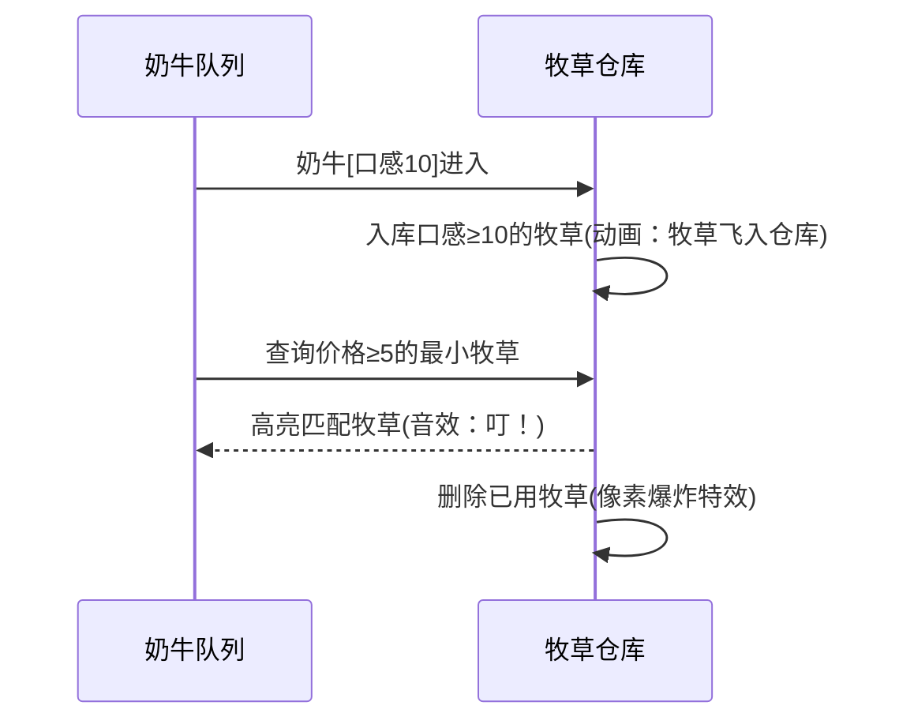

# 题目信息

# [USACO07DEC] Gourmet Grazers G

## 题目描述

约翰的奶牛对食物越来越挑剔了。现在，商店有 $m$ 份牧草可供出售，奶牛食量很大，每份牧草仅能供一头奶牛食用。第 $i$ 份牧草的价格为 $p_i$，口感为 $q_i$。

约翰一共有 $n$ 头奶牛，他要为每头奶牛订购一份牧草，第 $i$ 头奶牛要求 它的牧草价格不低于 $a_i$，口感不低于 $b_i$。请问，约翰应该如何为每头奶牛选择牧草，才能让他花的钱最少？

## 说明/提示

对于 $100\%$ 的数据，满足 $1\leqslant n\leqslant 10^5$，$1\leqslant a_i,b_i,c_i,d_i\leqslant 10^9$。

## 样例 #1

### 输入

```
4 7
1 1
2 3
1 4
4 2
3 2
2 1
4 3
5 2
5 4
2 6
4 4```

### 输出

```
12```

# AI分析结果


### 💡 Kay的C++算法解析：[USACO07DEC] Gourmet Grazers G 深入学习指南 💡

#### 1. 题目解读与核心算法识别
✨ **本题主要考察**：`贪心 + 数据结构应用`

🗣️ **初步分析**：
> 这道题要求我们为奶牛匹配满足价格和口感要求的牧草，并最小化总花费。核心思路是通过**贪心策略**，将问题转化为在有序数据中高效查询后继的操作：
> - 将所有奶牛和牧草按口感**从大到小排序**（高口感要求优先处理）
> - 遍历奶牛时，将满足当前口感要求的牧草加入**数据结构**
> - 为每头奶牛查找**价格≥要求的最小牧草**（避免浪费高价资源）
> 
> 可视化设计思路：
> - 用8位像素网格表示牧草（不同颜色区分价格）
> - 奶牛按口感从右向左移动，触发牧草入库动画
> - 查询时高亮目标牧草，伴随"叮"的音效
> - 复古UI设计：控制面板含单步/自动播放滑块，过关时播放FC胜利音效

---

#### 2. 精选优质题解参考
**题解一：zac2010**
* **点评**：思路清晰直白，巧妙利用`multiset`和排序削除口感维度。代码规范（结构体封装数据，合理使用迭代器），核心逻辑仅20行。亮点在于对STL的熟练应用，通过`lower_bound`高效查询后继，实践价值高（可直接用于竞赛）。

**题解二：斗神_君莫笑**
* **点评**：代码结构工整（分离数据读入/处理），变量命名明确（`a[i].v`价格/`a[i].w`口感）。亮点在于详细注释了`multiset`的API用法，对初学者友好。严格处理边界条件（`it==s.end()`判断无解），是学习STL应用的优秀范本。

**题解三：Nemonade**
* **点评**：创新性使用`FHQTreap`实现，展示平衡树在查询后继时的优势。亮点在于手写数据结构的高效性（最优解第一页），为理解底层原理提供窗口。代码模块化优秀（分离Treap操作），学习笔记中强调"后继包含本身"的细节。

---

#### 3. 核心难点辨析与解题策略
1. **难点：维度降维与处理顺序**
   * **分析**：二维约束（价格+口感）需转化为一维操作。优质解法通过口感降序排序，确保后续奶牛的口感要求一定≤已入库牧草，只需专注价格筛选。
   * 💡 **学习笔记**：排序是降维的关键，高要求优先处理！

2. **难点：高效查询价格后继**
   * **分析**：需快速找到≥奶牛要求的最小牧草。`multiset::lower_bound`时间复杂度O(log n)，平衡树/线段树也可实现。选择依据：STL更简洁，手写结构灵活性更高。
   * 💡 **学习笔记**：后继查询是贪心算法的核心加速器。

3. **难点：资源动态管理**
   * **分析**：匹配后需立即删除牧草避免重用。`multiset.erase(it)`或平衡树删除操作需严格同步数据结构状态。
   * 💡 **学习笔记**：及时更新数据结构是保证正确性的关键。

### ✨ 解题技巧总结
- **双关键字排序技巧**：主排序关键字（口感）降序，次关键字（价格）升序
- **STL高效组合**：`sort()` + `multiset` 解决90%的贪心问题
- **边界防御**：每次查询前检查`set.empty() || it==s.end()`
- **离散化优化**：权值线段树解法在值域大时仍保持高效（见limi_sanhua题解）

---

#### 4. C++核心代码实现赏析
**通用核心实现参考**
```cpp
#include <bits/stdc++.h>
using namespace std;
#define ll long long
const int N = 1e5+5;

struct Node { int price, taste; };
Node cow[N], grass[N];

int main() {
    int n, m; cin >> n >> m;
    for(int i=0; i<n; i++) cin >> cow[i].price >> cow[i].taste;
    for(int i=0; i<m; i++) cin >> grass[i].price >> grass[i].taste;
    
    // 口感降序排序
    sort(cow, cow+n, [](auto a, auto b){ return a.taste > b.taste; });
    sort(grass, grass+m, [](auto a, auto b){ return a.taste > b.taste; });
    
    multiset<int> s;
    ll ans = 0;
    int j = 0;
    
    for(int i=0; i<n; i++) {
        // 入库满足口感要求的牧草
        while(j < m && grass[j].taste >= cow[i].taste) 
            s.insert(grass[j++].price);
            
        // 查询价格后继
        auto it = s.lower_bound(cow[i].price);
        if(it == s.end()) { cout << -1; return 0; }
        
        ans += *it;
        s.erase(it);
    }
    cout << ans;
}
```

**题解一核心代码赏析**
```cpp
// 口感相同时优先处理牧草(c=1)
sort(a+1, a+n+1, [](A x, A y) {
    return x.b == y.b ? x.c > y.c : x.b > y.b;
});

while(i<=n) {
    if(a[i].c == 1) s.insert(a[i].a); // 牧草入库
    else {
        auto it = s.lower_bound(a[i].a); // 关键查询
        ans += *it; s.erase(it);        // 动态删除
    }
}
```
> **学习笔记**：通过`c`标志位统一处理奶牛和牧草，避免单独维护两个数组

**题解三平衡树实现亮点**
```cpp
// FHQTreap 后继查询（包含自身）
T nxt(T d) { 
    split(rt, x, y, d-1);    // 注意d-1的边界处理
    T res = t[data_(y,1)].data;
    rt = merge(x, y);
    return res;
}
```
> **学习笔记**：手写平衡树需特别注意边界条件，此处`d-1`确保查询包含相等值

---

### 5. 算法可视化：像素动画演示
**🎮 复古牧场物语：贪心匹配大作战**  
采用FC《牧场物语》像素风格，16色调色板，用三种元素构建场景：
- 🐄 奶牛：8x8像素，头顶显示价格要求
- 🌿 牧草：4x4色块，颜色深浅表示价格（深=高价）
- 📦 动态仓库：右侧多格子库存区，牧草按价格升序排列

**关键动画流程**：


**交互控制面板**：
```javascript
// 核心控制逻辑伪代码
function autoPlay() {
  while(cows.length) {
    let cow = cows.pop();
    highlight(cow); // 奶牛高亮
    // 入库所有满足口感的牧草
    while(grass[j].taste >= cow.taste) {
        addToStore(grass[j]); 
        playSound('add'); // 入库音效
        j++;
    }
    let hay = store.findMinAbove(cow.price); // 查询动画
    if(!hay) { playSound('error'); endGame(); } // 失败音效
    else {
        playSound('match'); // 匹配成功音效
        totalCost += hay.price;
        removeFromStore(hay); // 移除动画
    }
  }
  playSound('win'); // 胜利音效
}
```

**游戏化设计**：
- 每头奶牛匹配成功获得⭐，连续匹配触发COMBO奖励
- 仓库容量可视化（显示当前牧草数量/容量）
- 失误提示：无解时播放《魂斗罗》失败音效+闪烁警告

---

### 6. 拓展练习与相似问题
1. **洛谷 P1090** - 合并果子  
   **推荐理由**：同样使用贪心+数据结构（优先队列），巩固堆结构应用

2. **洛谷 P1801** - 黑匣子  
   **推荐理由**：动态查询第k小问题，强化平衡树/堆的应用场景理解

3. **洛谷 P4054** - 计数问题  
   **推荐理由**：二维约束下的统计问题，训练离散化+树状数组组合技

---

### 7. 学习心得与经验分享
> **来自题解的实战经验**：
> 1. *zac2010*：注意口感相同时的处理顺序（牧草优先入库）
> 2. *limi_sanhua*：值域较大时，离散化+树状数组是替代方案  
> 3. *phmaprostrate*：牢记总花费可能爆int，用long long！

> **Kay总结**：调试时重点检查三点：  
> ① 排序函数是否严格降序  
> ② 边界检查（空集合/end迭代器）  
> ③ 数据结构删除操作是否同步  

---
通过本次分析，我们掌握了贪心与数据结构配合解决二维约束问题的核心方法。记住：排序降维是破局关键，STL工具链能大幅提升编码效率！下次遇到类似问题，不妨先画图模拟排序后的匹配流程哦~ 🚀

---
处理用时：111.16秒