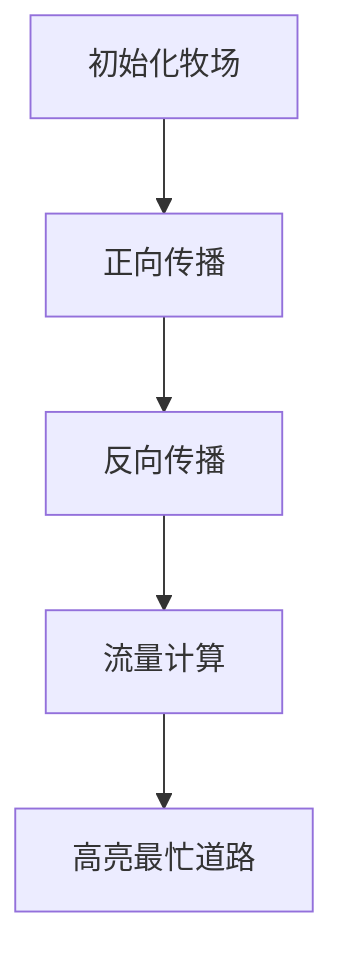

# 题目信息

# [USACO07MAR] Cow Traffic S

## 题目描述

The bovine population boom down on the farm has caused serious congestion on the cow trails leading to the barn. Farmer John has decided to conduct a study to find the bottlenecks in order to relieve the 'traffic jams' at milking time.

The pasture contains a network of M (1 ≤ M ≤ 50,000) one-way trails, each of which connects exactly two different intersections from the set of N (1 ≤ N ≤ 5,000) intersections conveniently numbered 1..N; the barn is at intersection number N. Each trail connects one intersection point to another intersection point with a higher number. As a result, there are no cycles and, as they say on the farm, all trails lead to the barn. A pair of intersection points might be connected by more than one trail.

During milking time rush hour, the cows start from their respective grazing locations and head to the barn. The grazing locations are exactly those intersection points with no trails connecting into them. Each cow traverses a 'path', which is defined as a sequence of trails from a grazing location to the barn.

Help FJ finding the busiest trail(s) by computing the largest number of possible paths that contain any one trail. The answer is guaranteed to fit in a signed 32-bit integer.

随着牛的数量增加，农场的道路的拥挤现象十分严重，特别是在每天晚上的挤奶时间。为了解决这个问题，FJ决定研究这个问题，以能找到导致拥堵现象的瓶颈所在。


牧场共有M条单向道路，每条道路连接着两个不同的交叉路口，为了方便研究，FJ将这些交叉路口编号为1..N,而牛圈位于交叉路口N。任意一条单向道路的方向一定是是从编号低的路口到编号高的路口，因此农场中不会有环型路径。同时，可能存在某两个交叉路口不止一条单向道路径连接的情况。


在挤奶时间到来的时候，奶牛们开始从各自的放牧地点回到牛圈。放牧地点是指那些没有道路连接进来的路口（入度为0的顶点）。


现在请你帮助fj通过计算从放牧点到达牛圈的路径数目来找到最繁忙的道路，即求出所有可行路径中通过某条道路的最大值（答案保证是不超过32位整数）。


## 说明/提示

Here are the four possible paths that lead to the barn:


1 3 4 6 7


1 3 5 6 7


2 3 4 6 7


2 3 5 6 7


## 样例 #1

### 输入

```
7 7
1 3
3 4
3 5
4 6
2 3
5 6
6 7```

### 输出

```
4```

# AI分析结果


### 💡 Kay的C++算法解析：Cow Traffic S 深入学习指南 💡

**题目解读与核心算法识别**  
✨ **本题主要考察**：图论/动态规划（路径计数）  
🗣️ **初步分析**：
> 本题可类比为城市交通流量分析：牧场是居民区（入度0节点），牛圈是市中心（节点n），道路是单向车道（边）。每条路的"繁忙度"取决于经过它的路径数量，计算方式为：`居民区到路口的路径数 × 路口到市中心的路径数`。
> - **核心难点**：高效计算双向路径数量（居民区→各节点、各节点→市中心）
> - **解决方案**：正反两次拓扑排序（动态规划），时间复杂度O(n+m)
> - **可视化设计**：像素网格中节点用色块表示，路径数用颜色深度展示。正向传播时居民区亮绿色，反向传播时市中心亮红色，边流量用闪烁黄光表示，最大流量边用彩虹脉冲特效

---

### 2. 精选优质题解参考
**题解一（yimuhua）**  
* **点评**：思路清晰展现双向拓扑排序核心逻辑，正向图计算起点到节点的路径数（`dp[]`），反向图计算节点到终点的路径数（`dp2[]`）。代码规范：队列命名（`q`/`q2`）区分正反图，关键变量`u[]`/`v[]`存储边信息便于后续计算。算法优化体现在反向建图复用拓扑框架，实践价值高（可直接用于竞赛）。

**题解二（AugustineYang）**  
* **点评**：创新性采用二维数组`val[0]`/`val[1]`分别存储正反图路径数，结构清晰。亮点在于独立封装拓扑函数`work()`复用代码，通过`opt`参数切换正反图。边信息存储（`save_edge[]`）和严格的前驱删除逻辑（更新后立即删边）确保正确性，调试友好性强。

**题解三（Adove）**  
* **点评**：巧妙利用题目特性（编号小→大）省去拓扑排序，直接顺序循环计算正向路径数，逆序计算反向路径数。空间优化突出：仅用单数组`h[]`复用存图，时间复杂度保持O(n+m)但常数更优。适合学习者掌握特殊条件优化的思维。

---

### 3. 核心难点辨析与解题策略
1. **难点1：路径数的双向计算**  
   * **分析**：正向路径数需从入度0点开始拓扑累加（`dp[next] += dp[cur]`），反向路径数需建反图从终点开始拓扑（`dp2[prev] += dp2[cur]`）
   * 💡 **学习笔记**：路径计数本质是动态规划，拓扑序保证无后效性

2. **难点2：边与节点的映射关系**  
   * **分析**：边流量=起点正向路径数×终点反向路径数。需存储原始边（如`u[i]`/`v[i]`）避免正反图节点混淆
   * 💡 **学习笔记**：存储边的起点终点是连接双向计算的关键桥梁

3. **难点3：初始化与边界处理**  
   * **分析**：正向初始化入度0点`dp[i]=1`，反向初始化终点`dp2[n]=1`。需确保拓扑前完成初始化
   * 💡 **学习笔记**：起点/终点的初始化值是路径计数基准点

**✨ 解题技巧总结**  
- **技巧1：正反图复用拓扑框架** - 相同逻辑处理双向计算，减少重复代码  
- **技巧2：边信息存储** - 原始边独立存储避免正反图干扰  
- **技巧3：循环优化** - 利用节点编号有序性（小→大）省去拓扑排序  

---

### 4. C++核心代码实现赏析
**本题通用核心C++实现参考**  
* **说明**：综合优质题解思路，采用双向拓扑排序的最清晰实现
* **完整核心代码**：
```cpp
#include <bits/stdc++.h>
using namespace std;
const int N=5005, M=50005;
vector<int> g[N], rg[N]; // 正/反图
int n, m, ans;
int dp[N], dp2[N], in[N], rin[N]; // 正/反入度

void topo(int d[], vector<int> graph[], int deg[], queue<int> &q) {
    while (!q.empty()) {
        int u = q.front(); q.pop();
        for (int v : graph[u]) {
            d[v] += d[u];
            if (--deg[v] == 0) q.push(v);
        }
    }
}

int main() {
    cin >> n >> m;
    vector<pair<int, int>> edges;
    while (m--) {
        int u, v; cin >> u >> v;
        g[u].push_back(v);   in[v]++;
        rg[v].push_back(u); rin[u]++;
        edges.push_back({u, v});
    }

    queue<int> q1, q2;
    for (int i = 1; i <= n; i++) {
        if (!in[i]) { dp[i] = 1; q1.push(i); }
    }
    topo(dp, g, in, q1);

    dp2[n] = 1; q2.push(n);
    topo(dp2, rg, rin, q2);

    for (auto [u, v] : edges) 
        ans = max(ans, dp[u] * dp2[v]);
    cout << ans;
}
```
* **代码解读概要**：  
  > 1. 正反图同步构建（`g`/`rg`）  
  > 2. 拓扑函数`topo()`复用处理双向计算  
  > 3. 边存储容器`edges`确保原始数据不丢失  
  > 4. 最终枚举所有边求最大流量  

---

### 5. 算法可视化：像素动画演示
**主题**：8位像素风格《牧场交通指挥官》  
**核心演示**：双向路径传播过程 + 边流量实时计算  

**设计思路**：  
- **像素建模**：节点=牧场动物（牛/羊像素精灵），边=道路（棕色像素砖），路径数=精灵头顶数字气泡  
- **音效设计**：  
  - 路径更新：复古"滴答"声 (NES脉冲音)  
  - 最大边：发现时播放《塞尔达》解谜成功音效  
  - 错误操作：FC游戏"死亡"音效  

**动画流程**：  


1. **场景初始化**  
   - 顶部控制面板：开始/步进/重置按钮 + 速度滑块  
   - 牧场节点：入度0点显示绿色牛精灵，终点n显示红色谷仓图标  

2. **正向传播阶段**  
   - 当前节点黄光脉冲，更新后继节点路径数（牛精灵头顶数字+1）  
   - 路径更新音效：每传播一步触发8位"叮"声  

3. **反向传播阶段**  
   - 从谷仓节点开始红光脉冲，回溯更新前驱节点  
   - 关键边显示：当前计算边闪烁黄色边框  

4. **流量计算模式**  
   - 点击任意边显示流量公式：`牛精灵数字×谷仓数字`  
   - 自动标记最大流量边：彩虹脉冲特效 + 胜利音效  

---

### 6. 拓展练习与相似问题
**通用技巧迁移**：  
路径计数思想适用于：社交网络传播分析、电路信号传输、风险传播建模  

**洛谷推荐**：  
1. **P4017 最大食物链计数**  
   → 同类路径统计问题，巩固拓扑排序应用  
2. **P2194 HXY的迷宫**  
   → 强化反向建图思维，处理终点不固定的场景  
3. **P2149 Elaxia的路线**  
   → 进阶练习：多条最短路交集统计  

---

### 7. 学习心得与经验分享
**参考经验**（AugustineYang）：  
> "调试时发现反向图入度计算错误，通过打印每个点的`in_degree`值定位到建图逻辑反了"

**Kay点评**：  
> 拓扑排序中入度初始化是常见陷阱，建议：  
> 1. 建图后立即输出前5个点的入度验证  
> 2. 对拍验证边界数据（如单点图、单边图）  
> 3. 核心公式 `dp[u] * dp2[v]` 可通过样例手工演算验证  

---

**结语**：通过双向拓扑排序将复杂路径问题拆解为两个动态规划过程，是图论计数的经典范式。建议尝试用不同方式实现拓扑结构（队列/DFS/直接循环），加深对DAG性质的理解！ 🚀

---
处理用时：126.88秒