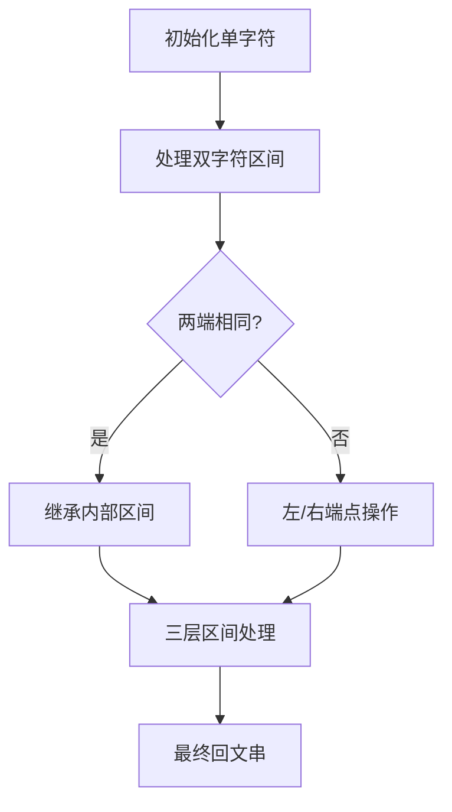

# 题目信息

# [USACO07OPEN] Cheapest Palindrome G

## 题目描述

给定一个由 $n$ 个不同的小写字母构成的长 $m$ 的字符串 $s$。可以通过**在 $\bm{s}$ 的任意位置**增减字母将 $s$ 改为回文串。增减字母的花费不同，求最小花费。

## 说明/提示

对于 $100\%$ 的数据，$1\le m\le2\times10^3,1\le n\le 26,0\le x,y\le 10^4$。

$\mathrm{by\ @}$[$\mathrm{Fish\_Know\_Forever}$](/user/663215)

## 样例 #1

### 输入

```
3 4
abcb
a 1000 1100
b 350 700
c 200 800
```

### 输出

```
900
```

# AI分析结果


# 💡 Kay的C++算法解析：低价回文 深入学习指南 💡

## 1. 题目解读与核心算法识别

✨ **本题主要考察**：`区间动态规划`

🗣️ **初步分析**：
> 解决"低价回文"这道题，关键在于理解并运用**区间DP**。想象你在玩一个"回文拼图游戏"，需要将字符串变成对称的回文串。每次操作就像在拼图边缘添加或移除一块积木（字母），每次操作都有不同成本。区间DP的核心思想是将大问题分解为小问题：先解决小区间的回文问题，再逐步合并成大区间的解。

在本题中，我们定义`dp[i][j]`为将子串`s[i..j]`变成回文的最小花费。算法流程如下：
- **初始化**：每个单字符区间成本为0（天然回文）
- **状态转移**：
  - 若`s[i] == s[j]`：直接继承`dp[i+1][j-1]`（两端匹配，无需操作）
  - 若`s[i] != s[j]`：取左端操作或右端操作的最小成本
- **关键优化**：添加/删除操作本质等价，只需记录每个字符的`min(添加成本, 删除成本)`

可视化设计思路：
- 在像素动画中，我们将用不同颜色方块表示字符
- 当两端字符匹配时，显示绿色闪光和"匹配"音效
- 当不匹配时，左/右方块会闪烁红色并消失，伴随操作音效
- 屏幕底部实时显示当前区间的最小花费

## 2. 精选优质题解参考

**题解一：zhenglier**
* **点评**：此解法思路清晰直白，完美呈现区间DP的核心逻辑。代码中：
  - 变量`f[i][j]`命名符合DP惯例，含义明确
  - 边界处理严谨（单独处理`j-i==1`的情况）
  - 亮点在于将添加/删除操作统一为最小代价，显著简化状态转移
  - 实践价值高，代码可直接用于竞赛

**题解二：BackSlashDelta**
* **点评**：题解亮点在于深入浅出的分析，将操作抽象为四种基础情况：
  - 代码结构规范，使用`cost`数组统一处理代价
  - 独创性的"拼图"类比帮助理解操作等价性
  - 特别包含调试技巧（打印DP表），对学习者极有帮助
  - 边界处理使用`0x7fffffff`避免未初始化干扰

**题解三：rui_er**
* **点评**：以最简洁的代码实现完整功能：
  - 双重循环结构干净利落（外层区间长度，内层起点）
  - 边界处理巧妙（`l<=1`时直接设0）
  - 状态转移仅用3行代码完成，体现算法精髓
  - 特别适合初学者理解区间DP的基本框架

## 3. 核心难点辨析与解题策略

1. **状态定义与理解**
   * **分析**：难点在于理解`dp[i][j]`代表子问题的解。优质题解普遍强调：定义`dp[i][j]`为将`s[i..j]`变为回文的最小花费，这个定义需要覆盖所有操作可能性
   * 💡 **学习笔记**：好的状态定义是DP成功的基石

2. **状态转移设计**
   * **分析**：当`i`和`j`字符不同时，需要决策处理哪一端：
     - 方案1：处理左端（添加/删除`s[i]`）→ 转移到`dp[i+1][j]`
     - 方案2：处理右端（添加/删除`s[j]`）→ 转移到`dp[i][j-1]`
   * 💡 **学习笔记**：状态转移方程体现了"当前操作+子问题解"的递归思想

3. **边界条件处理**
   * **分析**：区间长度=1时成本必为0；长度=2时若字符相同则成本为0，否则为两字符操作成本之和。优质题解通过初始化这些边界避免复杂判断
   * 💡 **学习笔记**：坚固的边界处理是DP正确性的保障

### ✨ 解题技巧总结
- **操作等价转化**：添加/删除本质都是使字符匹配，只需记录`min(添加,删除)`成本
- **分治思想**：将大区间分解为小区间解决，再合并结果
- **逆向思维**：从空区间开始逐步构建回文串，而非直接修改原串
- **可视化调试**：打印DP表验证状态转移正确性

## 4. C++核心代码实现赏析

**本题通用核心C++实现参考**
* **说明**：综合优质题解思路，采用标准区间DP框架，包含完整边界处理
* **完整核心代码**：
```cpp
#include <iostream>
#include <cstring>
#include <algorithm>
using namespace std;
const int MAXM = 2010;
int cost[256]; // 字符操作最小成本
int dp[MAXM][MAXM];

int main() {
    int n, m;
    char s[MAXM];
    cin >> n >> m >> (s + 1);
    
    // 读入字符操作成本
    for (int i = 0; i < n; i++) {
        char c;
        int add, del;
        cin >> c >> add >> del;
        cost[c] = min(add, del);
    }

    memset(dp, 0x3f, sizeof(dp));
    // 边界初始化
    for (int i = 1; i <= m; i++) {
        dp[i][i] = 0;
        if (i < m) 
            dp[i][i + 1] = (s[i] == s[i + 1]) ? 0 : cost[s[i]] + cost[s[i + 1]];
    }

    // 区间DP主循环
    for (int len = 3; len <= m; len++) {
        for (int i = 1; i + len - 1 <= m; i++) {
            int j = i + len - 1;
            if (s[i] == s[j]) 
                dp[i][j] = dp[i + 1][j - 1];
            dp[i][j] = min({dp[i][j], 
                           dp[i + 1][j] + cost[s[i]], 
                           dp[i][j - 1] + cost[s[j]]});
        }
    }
    cout << dp[1][m] << endl;
    return 0;
}
```
* **代码解读概要**：
  1. `cost`数组存储每个字符的最小操作成本
  2. 初始化：单字符成本0，双字符相同则0，否则为两字符成本之和
  3. 主循环按区间长度递增：
     - 两端相同：直接继承内部区间解
     - 两端不同：取左/右操作的最小成本
  4. 最终解在`dp[1][m]`中

---
**题解一：zhenglier**
* **亮点**：统一处理字符操作成本，边界条件清晰
* **核心代码片段**：
```cpp
for(int k=1; k<=n; k++) { // k为区间长度偏移量
    for(int i=1; k+i<=n; i++) {
        int j = k + i;
        dp[i][j] = min(dp[i+1][j] + min_cost[s[i]], 
                       dp[i][j-1] + min_cost[s[j]]);
        if(s[i]==s[j]) {
            if(j-i==1) dp[i][j] = 0; 
            else dp[i][j] = min(dp[i][j], dp[i+1][j-1]);
        }
    }
}
```
* **代码解读**：
  - 外层`k`控制区间长度（实际长度=k+1）
  - 当两端字符相同时，若长度为2则成本为0，否则继承内部区间解
  - 注意：当`j-i==1`时直接设0，避免数组越界

**题解二：BackSlashDelta**
* **亮点**：状态转移包含未初始化处理，代码健壮性强
* **核心代码片段**：
```cpp
if (s[begin] == s[end]) {
    dp[begin][end] = min(dp[begin+1][end-1], 
                         dp[begin][end]); 
} else {
    dp[begin][end] = min(min(dp[begin+1][end] + cost[s[begin]],
                            dp[begin][end-1] + cost[s[end]]),
                            dp[begin][end]);
}
```
* **代码解读**：
  - 使用三目`min`比较确保不覆盖已计算的更优解
  - 当两端相同时，直接取`dp[begin+1][end-1]`与当前值的较小者
  - 成本计算使用预处理的`cost`数组，简洁高效

**题解三：rui_er**
* **亮点**：最简洁的区间DP实现
* **核心代码片段**：
```cpp
for(int l=0; l<m; l++) {  // l为区间长度-1
    for(int i=0,j=l; j<m; i++,j++) {
        dp[i][j] = min(dp[i+1][j] + cost[s[i]], 
                       dp[i][j-1] + cost[s[j]]);
        if(s[i] == s[j]) 
            dp[i][j] = min(dp[i][j], (l<=1 ? 0 : dp[i+1][j-1]));
    }
}
```
* **代码解读**：
  - 循环变量`l`从0开始（区间长度=l+1）
  - 当`l<=1`（长度≤2）且字符匹配时直接设0
  - 状态转移仅用两行，体现算法本质

## 5. 算法可视化：像素动画演示

**动画主题**：像素回文工坊（8-bit风格）  
**核心演示内容**：区间DP如何从小回文串逐步构建大回文串  

**设计框架**：


**动画实现方案**：
1. **场景设计**：
   - 字符串显示为彩色像素方块（如：`a=红色, b=蓝色`）
   - 控制面板：开始/暂停、单步执行、速度滑块
   - 信息面板：显示当前区间`[i,j]`和`dp[i][j]`值

2. **关键动画序列**：
   - **初始化**：所有单字符方块闪烁绿色（成本0）
   - **区间扩展**：
     - 黄框高亮当前区间`[i,j]`
     - 若`s[i]==s[j]`：两端方块闪绿光，播放"匹配"音效
     - 若`s[i]!=s[j]`：左/右方块闪红光消失，播放"操作"音效
   - **状态更新**：当前区间显示新的成本值（金色数字）

3. **游戏化元素**：
   - 每完成一个区间，播放8-bit过关音效
   - 连续正确时出现"Combo!"特效
   - 最终回文串形成时，全屏烟花特效+胜利音乐

4. **技术要点**：
   - Canvas绘制网格和方块
   - 状态记录数组支持前进/后退
   - 音效使用Web Audio API：
     ```javascript
     function playSound(type) {
         const sfx = {
             match: [440, 523.25, 659.25], // 和弦音
             operation: [261.63, 0.3],     // 短促音
             victory: [784, 932, 1046]      // 上升音阶
         };
         // 音频生成代码...
     }
     ```

## 6. 拓展练习与相似问题思考

**通用技巧迁移**：
区间DP思想可广泛应用于：
1. 字符串编辑距离（增删改操作）
2. 序列分割问题（如矩阵链乘法）
3. 博弈类问题（区间最优决策）

**练习推荐（洛谷）**：
1. **P1435 回文字串**  
   🗣️ 只允许插入操作的回文串变形，巩固区间DP基础
2. **P1063 能量项链**  
   🗣️ 环形区间DP经典，学习循环数组处理技巧
3. **P1880 石子合并**  
   🗣️ 区间DP最优解问题，理解状态设计多样性
4. **P4170 染色**  
   🗣️ 结合区间DP和状态压缩，挑战高阶应用

## 7. 学习心得与经验分享

> **参考经验**：多位作者强调调试时打印DP表的重要性。如BackSlashDelta提到："通过打印完整的DP表，我直观地验证了状态转移的正确性，尤其边界值"

**点评**：这是极其宝贵的实践经验。在调试DP时：
1. 打印初始化的边界值
2. 按执行顺序输出DP表
3. 对照手工计算验证
这种方法能快速定位错误的状态转移逻辑，尤其适合树状或区间DP的调试

---

本次关于"低价回文"的解析就到这里。记住：理解算法最好的方式就是动手实现它，再通过可视化加深理解。下次挑战见！💪

---
处理用时：254.17秒