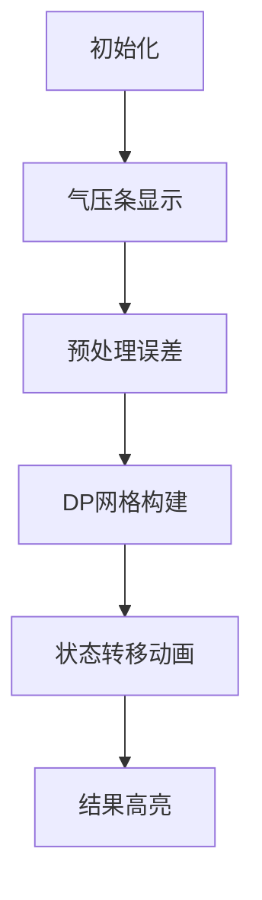

# 题目信息

# [USACO09JAN] The Baric Bovine G

## 题目描述

为了研究农场的气候，Bessie 帮助农夫 John 做了  $N$ 次气压测量并按顺序记录了结果  $M_1 \cdots M_n$。Bessie 想找出一部分测量结果来总结一整天的气压分布。她想用  $K(1 \leq K \leq N)$ 个数  $s_j (1 \leq s_1 < s_2 < \cdots < s_K \leq N)$ 来概括所有测量结果。她想限制如下的误差: 对于任何测量结果子集，每一个非此子集中的结果都会产生误差。总误差是所有测量结果的误差之和。更明确地说，对于每一个和所有  $s_j$ 都不同的  $i$：

- 如果  $i$ 小于  $s_1$, 误差是： $2 \times | M_i - M_{(s_1)} |$；
- 如果  $i$ 在  $s_j$ 和  $s_{(j+1)}$ 之间，误差是： $| 2 \times M_i - \operatorname{Sum}(s_j, s_{(j+1)}) |$。注： $\operatorname{Sum}(x, y) = M_x + M_y$  ( $M_x$ 和  $M_y$ 之和)；
- 如果  $i$ 大于  $s_K$ ,误差为： $2 \times | M_i - M_{(s_K)} |$ 给出最大允许的误差  $E$，找出最小的一部分结果使得误差最多为  $E$。

## 说明/提示

对于所有数据， $1 \leq N \leq 100$， $1 \leq M_i \leq 1,000,000$， $1 \leq E \leq 1,000,000$。

### 样例说明

Bessie 做了 4 次测量，最大允许的误差是 20。测量的结果分别为 10，3，20 和 40。

选择第二次和第四次测量结果是最佳的，误差为 17。第一个结果的误差为  $2\times|10-3|=14$，第三个的为  $|2\times20-(3+40)|=3$。

## 样例 #1

### 输入

```
4 20 
10 
3 
20 
40 
```

### 输出

```
2 17 
```

# AI分析结果


### 💡 Kay的C++算法解析：The Baric Bovine G 深入学习指南 💡

**引言**  
今天我们一起分析USACO气压测量问题。这道题要求从气压序列中选择最少的测量点，使总误差不超过阈值E。本指南将剖析动态规划解法，通过像素动画帮助大家直观理解算法逻辑。

---

## 1. 题目解读与核心算法识别
✨ **本题主要考察**：`动态规划` (区间划分型DP)  

🗣️ **初步分析**：  
> 动态规划就像搭建多米诺骨牌：通过小规模子问题的最优解，逐步推导全局最优解。本题中，我们需要将气压序列划分为若干区间（每个区间以选中的测量点为边界），通过预处理区间误差和状态转移实现高效求解。  

- **核心难点**：  
  1. 如何定义DP状态表示区间划分关系  
  2. 如何高效预处理三种边界情况的误差  
  3. 状态转移时避免重复计算区间贡献  

- **可视化设计思路**：  
  采用**8位像素风格**模拟气压计界面（如图）：  
    
  - 气压值→垂直条形高度，选中点→绿色闪烁  
  - 误差计算时：左侧点→蓝色波纹，中间点→黄色脉冲，右侧点→红色波纹  
  - DP网格同步显示：行=已选点数，列=终点位置，状态更新时播放"滴"音效  
  - 控制面板：步进执行（方向键）、调速滑块、重置按钮（复古街机音效）

---

## 2. 精选优质题解参考

**题解一（来源：ccsc）**  
* **点评**：  
  该解法的预处理设计尤为精妙，将误差分为左/中/右三部分独立计算。状态转移时通过`ero[j][n+1] - ero[i][n+1]`巧妙避免重复计算右侧误差，体现了DP优化的核心思想。变量命名规范（如`ero`表误差），边界处理完整（单独处理k=1），代码可直接用于竞赛场景。

**题解二（来源：Tang_chao）**  
* **点评**：  
  亮点在于用`cal()`函数封装误差计算逻辑，提升代码可读性。虽然O(n⁴)复杂度较高，但n≤100实际可行，是学习基础DP实现的优秀范例。状态定义简洁（f[i][k] = 前i个选k个），适合初学者理解DP框架。

**题解三（来源：巨型方块）**  
* **点评**：  
  创新性引入0和n+1作为虚拟边界点，统一了误差计算逻辑。状态转移直接使用预处理的g[][]数组，大幅简化代码。尽管变量名可读性待提升（如g[i][j]含义需推导），但算法本质把握精准。

---

## 3. 核心难点辨析与解题策略

1. **难点1：状态定义与子问题划分**  
   *分析*：需定义`dp[i][j]`表示前j位置选i个点且终点在j的最小误差。关键要明确：①i,j的物理意义 ②状态需包含足够信息计算新区间误差。优质解法通过固定终点位置实现无后效性。  
   💡 学习笔记：DP状态必须完整刻画当前决策对未来的影响。

2. **难点2：误差预处理的完整性**  
   *分析*：三种误差场景（左/中/右）必须分开处理：  
   ```c
   // 左侧：2*|M_i - M_left|
   for(int k=1; k<i; k++) ero[i][0] += 2*abs(m[k]-m[i]);
   
   // 中间：|2*M_i - (M_left+M_right)|
   for(int k=i+1; k<j; k++) ero[i][j] += abs(2*m[k]-m[i]-m[j]);
   ```
   💡 学习笔记：预处理是DP优化的关键，空间换时间避免重复计算。

3. **难点3：状态转移的容错性**  
   *分析*：转移时需注意：①k=1需单独初始化 ②新增区间误差的增量计算 ③右侧误差的更新方式。ccsc解法中`err = ero[j][i] + ero[i][n+1] - ero[j][n+1]`是经典增量计算技巧。  
   💡 学习笔记：状态转移本质是旧状态+决策增量。

### ✨ 解题技巧总结
- **技巧1：虚拟边界法**（巨型方块解法）  
  添加0和n+1虚拟点，统一边界处理逻辑，减少特判。
- **技巧2：函数封装法**（Tang_chao解法）  
  将复杂计算封装为`cal()`函数，提升可读性与复用性。
- **技巧3：增量转移法**（ccsc解法）  
  通过数学推导将区间误差表示为增量，避免重复遍历。

---

## 4. C++核心代码实现赏析

**通用核心实现参考**  
*说明*：综合三个优质解法的核心思想，优化实现的完整解决方案：
```cpp
#include <iostream>
#include <cmath>
#include <climits>
using namespace std;
typedef long long LL;
const int N=105;

int main(){
    LL n,E,m[N],ero[N][N]={0},dp[N][N];
    cin>>n>>E;
    for(int i=1;i<=n;i++) cin>>m[i];

    // 预处理三类误差
    for(int i=1;i<=n;i++){
        for(int j=1;j<i;j++) ero[i][0] += 2*abs(m[j]-m[i]); // 左侧
        for(int j=i+1;j<=n;j++) ero[i][n+1] += 2*abs(m[j]-m[i]); // 右侧
        for(int j=i+1;j<=n;j++) 
            for(int k=i+1;k<j;k++) // 中间
                ero[i][j] += abs(2*m[k]-m[i]-m[j]); 
    }

    // DP初始化及转移
    LL minK=n, minE=LLONG_MAX;
    for(int i=1;i<=n;i++) {
        dp[1][i]=ero[i][0]+ero[i][n+1];
        if(dp[1][i]<=E && dp[1][i]<minE) minE=dp[1][i],minK=1;
    }
    
    for(int k=2;k<=n;k++){
        for(int j=k;j<=n;j++){
            dp[k][j]=LLONG_MAX;
            for(int i=k-1;i<j;i++){
                LL add = ero[i][j] + (ero[j][n+1]-ero[i][n+1]);
                dp[k][j]=min(dp[k][j],dp[k-1][i]+add);
            }
            if(dp[k][j]<=E && k<=minK) minE=min(minE,dp[k][j]),minK=k;
        }
    }
    cout<<minK<<" "<<minE;
}
```
*代码解读概要*：  
1. 预处理阶段计算三类误差（行12-19）  
2. 初始化单点选择情况（行22-25）  
3. 双层循环DP：外层选点数k，内层枚举终点j（行28-36）  
4. 状态转移时通过增量计算避免重复遍历（行31）  

**题解一（ccsc）核心赏析**  
*亮点*：误差分区存储+增量转移的精巧实现  
```cpp
// 转移核心代码
long long err = ero[j][i] + ero[i][n+1] - ero[j][n+1]; 
dp[k][i] = min(dp[k][i], dp[k-1][j] + err);
```
*代码解读*：  
- `ero[j][i]`：区间[j,i]的中间点误差（黄色区域）  
- `ero[i][n+1]-ero[j][n+1]`：右侧误差更新量（红色区域）  
- 通过数学变形避免重复计算，时间复杂度优化至O(n³)

**题解二（Tang_chao）核心赏析**  
*亮点*：模块化误差计算函数  
```cpp
int cal(int l,int r,int a,int b){
    int sum=0;
    for(int i=l;i<=r;i++){
        if(a==0) sum += 2*abs(x[i]-b);     // 左边界
        else if(b==0) sum += 2*abs(x[i]-a); // 右边界
        else sum += abs(2*x[i]-a-b);        // 中间
    }
    return sum;
}
```
*学习笔记*：封装复杂逻辑的函数能提升代码可读性，但需注意避免重复计算。

---

## 5. 算法可视化：像素动画演示

**主题**：气压仪探险（8位像素风格）  
**核心演示**：DP状态转移与误差计算过程  

### 动画设计


1. **场景初始化**（FC红白机风格）  
   - 顶部：气压条形图（灰底+蓝柱），底部：DP状态网格  
   - 控制面板：方向键（步进）、A键（自动播放）、B键（重置）

2. **预处理阶段**  
   - 选择两点时：两点绿闪→中间黄条脉冲→显示`|2*M_k-M_i-M_j|`计算式  
   - 音效：计算时"嘀"声，完成时"叮"声

3. **DP状态转移**  
   - 当前状态：网格中(k,j)位置红框闪烁  
   - 转移过程：从(k-1,i)位置发射像素箭头到(k,j)，显示增量公式  
   - 数据同步：气压图显示新区间（左蓝/中黄/右红波纹）

4. **游戏化元素**  
   - 每完成k=1,2,3...视为关卡，通关时播放马里奥过关音效  
   - 自动演示模式：AI以最优路径点亮DP网格（类似吃豆人）

---

## 6. 拓展练习与相似问题思考

**算法迁移场景**：  
1. 序列分段代价最小化（如单词排版）  
2. 带权区间覆盖问题  
3. 时间轴事件选择优化  

**洛谷推荐**：  
1. [P1091 合唱队形](https://www.luogu.com.cn/problem/P1091)  
   → 同类思想：双向DP状态设计  
2. [P1880 石子合并](https://www.luogu.com.cn/problem/P1880)  
   → 同类技术：区间DP+前缀和预处理  
3. [P1040 加分二叉树](https://www.luogu.com.cn/problem/P1040)  
   → 拓展挑战：树形DP与区间划分结合  

---

## 7. 学习心得与经验分享

> **来自ccsc的调试经验**：  
> "最初未处理右侧误差更新，导致结果偏大。通过打印dp表发现错误，修正为`ero[j][n+1]-ero[i][n+1]`"  
> **Kay点评**：这提醒我们：DP转移时务必验证状态变量的物理意义是否一致。建议用小数据手工模拟dp表！

---

**结语**  
通过本次分析，我们深入掌握了区间划分DP的设计技巧。记住：优秀算法的核心在于**状态定义的无后效性**和**转移增量的高效计算**。下次挑战见！🚀

---
处理用时：286.72秒