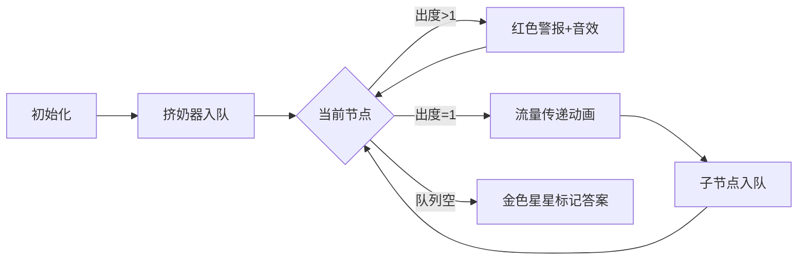

# 题目信息

# [USACO10NOV] Chocolate Milk S

## 题目描述

农民约翰的牛奶生产和运输是一个复杂的过程，他用挤奶器给他的那么多头奶牛挤奶，然后流入管道。

每一个管道把一台挤奶器和一个可能连有一台或多台挤奶器的接口连接起来（这样几个管道里的牛奶就汇合了）。然后牛奶流入附加管道（连在各个接口之间的管道）直到流到中央管道，通向储存室。 然后这些牛奶又经历一个逆向的过程通过管道分流到各个牛奶桶，最后被运至市场。

约翰发现对于牛奶来说，最多只有一种方式从一个接口流到另一个接口。并且由于约翰是一个高效率的人，他需要确保每一个管道都有牛奶经过，也就是说，没有多余的管道。

如果我们把每个挤奶机、接口和奶罐都看成一个节点，就共有 $N$ 个节点，输入有序的节点对 $A_{i}$ 和 $B_{i}$ ，代表牛奶从 $A_{i}$ 节点流到 $B_{i}$ 节点，如果没有相对应的父节点，那就说明这是一个挤奶器，同样的如果没有对应的尾节点，则这是一个奶罐。

这几个月巧克力牛奶的需求量激增，所以约翰想要在某一个接口处安装一个巧克力混合器以得到巧克力牛奶，为了节约，约翰只买了一个巧克力混合器。所以他想把这个东西放到一个所有牛奶都能经过的接口，事实上，有这种接口存在。

帮助约翰找到这样的节点（注意：不能把巧克力混合器放在挤奶机里）。
```

           1 ----+
                 |
                 v
           2 --> 4 --> 6 ------------------> 7 --> 8
                       ^                     |
                       |                     |
           3 --> 5 ----+                     + --> 9

```
所有的牛奶都会流经6号或7号节点，所以巧克力混合器可以放在这两个节点上。

## 样例 #1

### 输入

```
9 
1 4 
3 5 
2 4 
5 6 
6 7 
7 8 
4 6 
7 9 
```

### 输出

```
6 
7 
```

# AI分析结果


### 💡 Kay的C++算法解析：[USACO10NOV] Chocolate Milk S 深入学习指南 💡

**引言**  
今天我们一起分析这道关于牛奶流动路径的拓扑排序问题。本指南将帮助你理解如何用拓扑排序高效解决"必经节点"问题，并通过像素动画直观展示算法流程。

---

## 1. 题目解读与核心算法识别

✨ **本题主要考察**：`拓扑排序` + `流量统计`

🗣️ **初步分析**  
> 解决本题的关键在于运用**拓扑排序**处理有向无环图的流动顺序。想象牛奶从多个水龙头（挤奶器）流出，经过一系列水管（边）最终汇入水桶（奶罐）。我们需要找到所有水流必经的"枢纽节点"（接口）。  
> - **核心思路**：统计每个节点流经的挤奶器数量，当某节点的流量等于挤奶器总数时即为答案  
> - **关键难点**：处理分流节点（出度>1）时需跳过后续计算，避免无效遍历  
> - **可视化设计**：在像素动画中用颜色标记节点状态（绿=挤奶器/蓝=接口/红=分流节点），流动过程伴随音效（水流声/警告声），分流节点触发红色闪烁动画  

---

## 2. 精选优质题解参考

**题解一（作者：lolte）**  
* **点评**：思路清晰直击核心——用拓扑排序递推流量，巧妙处理出度>1的分流情况（直接跳过后续节点）。代码中`liu[]`数组记录流量，`od[u]>1`的判断简洁高效。变量命名规范（如`tot`统计挤奶器总数），边界处理严谨（排除挤奶器），竞赛实用性强。

**题解二（作者：我和鱼过不去）**  
* **点评**：采用vector存图提升可读性，明确分离拓扑排序模块。亮点在于用`ism[]`标记挤奶器，`G[u].size()>1`处理分流，逻辑推导流畅。特别注释"牛奶不会分流后聚集"点明题目隐含条件，对初学者友好。

**题解三（作者：pldzy）**  
* **点评**：代码最简练（仅40行），聚焦核心逻辑。亮点是双队列应用：`q[]`处理拓扑排序，`ans[]`存储结果。变量命名直观（如`rd`=入度），`cd[u]>1`的判断与题解一异曲同工，适合快速实现。

---

## 3. 核心难点辨析与解题策略

1. **难点一：流量统计的递推关系**  
   * **分析**：流量传递需满足拓扑序。初始挤奶器流量=1，普通节点流量=所有前驱流量之和（`liu[v] += liu[u]`）。关键变量是节点索引和流量数组。  
   * 💡 **学习笔记**：拓扑排序保证节点按流动顺序处理，是递推的前提。

2. **难点二：分流节点的处理**  
   * **分析**：当节点出度>1时（`od[u] > 1`），其子节点不可能被所有挤奶器流经（题目限制流动唯一性）。此时直接清零子节点流量并不再遍历。  
   * 💡 **学习笔记**：利用题目性质（无重汇聚）可大幅优化计算。

3. **难点三：数据结构的选择**  
   * **分析**：使用`to[u]`存储单后继（非链表存图）更高效，因为每个节点最多一个有效后继（分流后停止）。若需完整存图则用`vector<int> G[]`。  
   * 💡 **学习笔记**：根据问题特性选择数据结构（本题`to[]`数组优于邻接表）。

### ✨ 解题技巧总结
- **拓扑序递推**：按节点流动顺序更新流量，类似"水流模拟"  
- **边界剪枝**：分流节点（出度>1）立即终止后续计算  
- **状态标记**：用`isMilk[]`标记挤奶器避免非法输出  
- **精度规避**：优先用整数流量统计（避免浮点平均分配的精度问题）

---

## 4. C++核心代码实现赏析

### 本题通用核心C++实现参考
```cpp
#include <iostream>
#include <queue>
using namespace std;
const int MAXN = 1e5 + 5;

int n, to[MAXN], inDeg[MAXN], outDeg[MAXN];
int flow[MAXN], milkCnt = 0; // flow:节点流量, milkCnt:挤奶器总数
bool isMilk[MAXN];           // 标记挤奶器

void topoSort() {
    queue<int> q;
    for (int i = 1; i <= n; ++i) {
        if (inDeg[i] == 0) {      // 挤奶器入队
            q.push(i);
            flow[i] = 1;
            isMilk[i] = true;
            milkCnt++;
        }
    }
    while (!q.empty()) {
        int u = q.front(); q.pop();
        if (outDeg[u] > 1) continue; // 关键：分流节点跳过后续
        int v = to[u];             // 获取唯一后继
        flow[v] += flow[u];        // 流量传递
        if (--inDeg[v] == 0) q.push(v);
    }
}

int main() {
    cin >> n;
    for (int i = 1; i < n; ++i) {
        int u, v;
        cin >> u >> v;
        to[u] = v;                // 存储单后继
        outDeg[u]++; inDeg[v]++;
    }
    topoSort();
    for (int i = 1; i <= n; ++i) 
        if (!isMilk[i] && flow[i] == milkCnt) 
            cout << i << endl;
}
```
* **代码解读概要**：  
  1. 初始化：标记挤奶器（入度=0），流量设为1  
  2. 拓扑排序：队列处理节点，遇分流节点（出度>1）则跳过  
  3. 流量传递：当前节点流量累加到唯一后继  
  4. 结果输出：排除挤奶器后，输出流量=挤奶器总数的节点  

---

### 优质题解片段赏析
**题解一（lolte）核心代码**  
```cpp
while (l <= r) {
    int u = q[l];
    if (od[u] > 1) {        // 分流处理
        liu[to[u]] = 0;     // 子节点流量清零
        ++l; continue;
    }
    liu[to[u]] += liu[u];   // 流量传递
    --id[to[u]];
    if (!id[to[u]]) q[++r] = to[u];
    ++l;
}
```
* **代码解读**：  
  > 当节点`u`出度>1时，立即将其子节点流量清零（`liu[to[u]] = 0`）并跳过后续操作，因为分流导致子节点不可能成为答案。否则正常传递流量（`liu[to[u]] += liu[u]`），并在子节点入度归零时入队。  
* 💡 **学习笔记**：分流节点的实时剪枝大幅提升效率。

**题解二（我和鱼过不去）核心代码**  
```cpp
for (int i = 0; i < G[u].size(); i++) {
    int v = G[u][i];
    if (G[u].size() > 1) continue; // 分流跳过
    milk[v] += milk[u];           // 流量累加
}
```
* **代码解读**：  
  > 用`G[u].size()>1`判断分流，直接跳过后续遍历。此处用邻接表存图（`G[u]`），虽内存略高但代码更通用。`milk[v]`累加时隐含拓扑序，因为`u`已保证前驱处理完成。  
* 💡 **学习笔记**：邻接表存图适合需要完整图信息的场景。

**题解三（pldzy）核心代码**  
```cpp
if (cd[x] > 1) continue;     // 分流处理
liu[to[x]] += liu[x];        // 流量传递
rd[to[x]]--;
if (!rd[to[x]]) q.push(to[x]);
```
* **代码解读**：  
  > 与题解一逻辑一致，但用`cd[]`（出度）代替`od[]`。变量名`rd`（入度）、`cd`（出度）简洁易记，适合竞赛快速编码。  
* 💡 **学习笔记**：精简变量名提升编码速度，但需保持含义明确。

---

## 5. 算法可视化：像素动画演示

**主题**：牛奶工厂流水线（复古8-bit工厂管理游戏）  

### 设计思路
> 用像素风格还原牛奶流动过程：  
> - 挤奶器=绿色齿轮 🟩  
> - 分流节点=红色警报灯 🟥  
> - 答案节点=闪烁金色星星 ⭐  
> 通过声音反馈（流水声/警报声）强化理解分流逻辑  

### 动画帧步骤


1. **场景初始化**  
   - 像素网格显示节点（齿轮=挤奶器，管道=普通节点）  
   - 控制面板：开始/暂停/单步按钮，速度滑块（1x-5x）  
   - 背景：8-bit工厂BGM循环  

2. **拓扑排序流程**  
   - **步骤1**：挤奶器齿轮旋转（绿色），播放"启动"音效  
   - **步骤2**：当前节点高亮黄色，流量数值实时显示  
   - **关键判断**：若出度>1，节点变红闪烁，触发警报音效  
   - **流量传递**：蓝色液体动画沿管道流向唯一后继，伴随水流声  

3. **游戏化元素**  
   - **关卡进度**：每处理5个节点解锁新区域，得分+100  
   - **成就系统**：正确找到答案节点时，播放胜利音效+金色星星动画  
   - **AI演示**：自动模式模拟"工厂AI管理"，液体按拓扑序流动  

4. **技术实现**  
   - Canvas绘制节点/管道动画，`requestAnimationFrame`控制帧率  
   - 音效触发：Web Audio API在关键操作时播放8-bit音效  

---

## 6. 拓展练习与相似问题思考

### 通用思路迁移
拓扑排序+状态传递可解决：  
1. 关键路径计算（节点处理时长叠加）  
2. 食物链能量传递（节点能量累加）  
3. 课程安排合理性检测（环判断）  

### 洛谷推荐
1. **P4017 最大食物链计数**  
   🗣️ *推荐理由*：拓扑排序经典应用，统计终点能量总和，巩固流量统计思想  
2. **P1038 神经网络**  
   🗣️ *推荐理由*：带权拓扑排序，练习节点状态传递与阈值判断  
3. **P1983 车站分级**  
   🗣️ *推荐理由*：拓扑排序在区间约束问题中的巧妙应用  

---

## 7. 学习心得与经验分享
> **题解作者经验摘录**：  
> *"我在处理分流节点时最初忽略了出度>1的判断，导致答案错误。通过打印中间流量值才发现问题。这提醒我们：题目隐含条件（分流不重汇聚）必须严格转化为代码逻辑！"*  
>   
> **Kay点评**：调试拓扑排序时，建议：  
> 1. 可视化中间流量值（如打印`flow[]`数组）  
> 2. 对边界节点（挤奶器/奶罐）单独测试  
> 3. 小规模手工模拟（n=5）验证递推逻辑  

---

**结语**  
通过拓扑排序解决流动路径问题，核心在于**顺序处理+状态传递+分流剪枝**。希望本指南助你掌握算法精髓，在更多图论问题中举一反三！下次挑战再见！🚀

---
处理用时：159.82秒