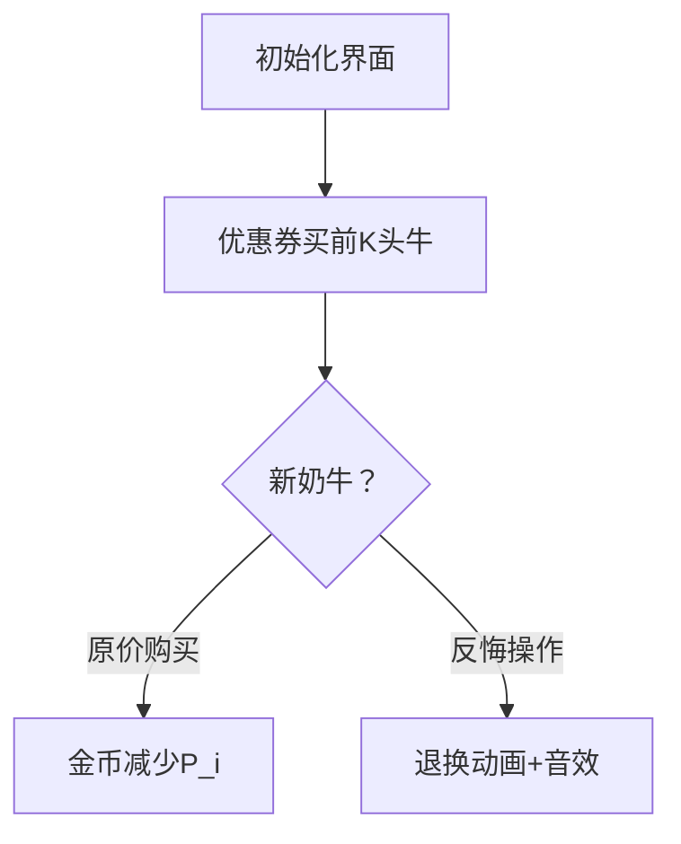

# 题目信息

# [USACO12FEB] Cow Coupons G

## 题目背景

Subtask 0 为原数据，Subtask 1,2 为 hack 数据。

## 题目描述

Farmer John needs new cows! There are N cows for sale (1 <= N <= 50,000), and FJ has to spend no more than his budget of M units of money (1 <= M <= 10^14).  Cow i costs P\_i money (1 <= P\_i <= 10^9), but FJ has K coupons (1 <= K <= N), and when he uses a coupon on cow i, the cow costs C\_i instead (1 <= C\_i <= P\_i). FJ can only use one coupon per cow, of course.

What is the maximum number of cows FJ can afford? 

FJ 准备买一些新奶牛。市场上有 $N$ 头奶牛，第 $i$ 头奶牛价格为 $P_i$。FJ 有 $K$ 张优惠券，使用优惠券购买第 $i$ 头奶牛时价格会降为 $C_i$，当然每头奶牛只能使用一次优惠券。FJ 想知道花不超过 $M$ 的钱最多可以买多少奶牛？

- $1 \le K \le N \le 5 \times 10^4$
- $1 \le C_i \le P_i \le 10^9$
- $1 \le M \le 10^{14}$

## 说明/提示

FJ has 4 cows, 1 coupon, and a budget of 7.


FJ uses the coupon on cow 3 and buys cows 1, 2, and 3, for a total cost of 3 + 2 + 1 = 6.


## 样例 #1

### 输入

```
4 1 7 
3 2 
2 2 
8 1 
4 3 
```

### 输出

```
3 
```

# AI分析结果


### 💡 Kay的C++算法解析：Cow Coupons G 深入学习指南 💡

**引言**  
今天我们一起分析USACO经典题目「Cow Coupons G」。这道题考察如何在预算限制下最大化购买奶牛数量，涉及**反悔贪心**的核心思想。本指南将带你深入理解算法原理，掌握解题技巧，并通过像素动画直观感受算法执行过程。

---

### 1. 题目解读与核心算法识别  
✨ **本题主要考察**：`反悔贪心`（贪心算法的进阶技巧）  

🗣️ **初步分析**：  
> 想象你在超市抢购打折商品：  
> - 优惠券就像"后悔药"，先用券买最便宜的商品（优惠价前K小的奶牛）  
> - 当想买新商品时，可以"退掉"之前省钱最少的商品（反悔Δ最小的奶牛），把券用在更划算的新商品上  
>  
> **核心流程**：  
> 1. 优先队列维护三种决策：原价购买/优惠券购买/反悔操作  
> 2. 每次选择最小花费的决策（原价 vs 反悔+优惠价）  
> 3. 动态更新奶牛状态和总花费  
>  
> **可视化设计**：  
> 采用**8位像素风格**模拟超市购物场景：  
> - 奶牛显示为不同颜色像素块（红色=已购，绿色=可用优惠，蓝色=原价）  
> - 反悔操作时显示"退换"动画 + "叮"音效  
> - 购买成功时播放胜利音效 + 金币减少动画

---

### 2. 精选优质题解参考  
**题解一（人间温柔）**  
* **点评**：  
  思路清晰直击反悔贪心本质，用不等式 `Δ_j < Δ_i` 精炼反悔条件。代码中三个优先队列分工明确：  
  - `delta` 堆维护反悔代价（Δ = P_i - C_i）  
  - `P/C` 堆快速获取最小原价/优惠价  
  亮点在于用 **数学推导简化反悔条件**，实践价值高（可直接用于竞赛），边界处理严谨。

**题解二（Cuxhin）**  
* **点评**：  
  独创**三阶段贪心教学法**：基础贪心→问题暴露→反悔优化，教学性极强。代码亮点：  
  - 类封装`Cow/Ticket`提升可读性  
  - 字典`buy[]`避免重复购买  
  - 双版本代码展示优化过程  
  特别适合学习者理解反悔贪心的演进思路。

**题解三（XLao）**  
* **点评**：  
  另辟蹊径的**wqs二分解法**，虽非最优但提供新视角。亮点：  
  - 证明花费函数是下凸函数  
  - 外层二分数量+内层wqs二分求最小花费  
  适合想拓展思维的学习者，时间复杂度O(nlog²n)稍高但具有理论价值。

---

### 3. 核心难点辨析与解题策略  
1. **难点一：优惠券的动态分配**  
   *分析*：优惠券用完时，需判断是否转移给新奶牛。通过维护Δ堆（P_i-C_i），快速找到反悔代价最小的奶牛。
   💡 学习笔记：反悔堆是动态分配的核心

2. **难点二：决策成本实时比较**  
   *分析*：每个新奶牛需比较两种方案：  
   ```math
   min(原价P_i, 反悔代价Δ_j + 优惠价C_i)
   ```
   通过并行维护原价堆和优惠价堆实现O(1)获取最小值
   💡 学习笔记：双堆维护实现高效决策

3. **难点三：状态同步与去重**  
   *分析*：已购奶牛需及时标记，否则会导致重复计算。所有堆操作前需检查`vis[]`状态
   💡 学习笔记：状态标记是贪心算法的安全带

#### ✨ 解题技巧总结
- **技巧A：堆的协同维护**  
  三个堆需同步更新（原价堆/优惠价堆/反悔堆），每次pop前检查有效性
- **技巧B：增量式计算**  
  总花费`sum`随每次决策增量更新，避免重复计算
- **技巧C：边界防御**  
  每次决策后立即检查`sum≤M`，及时终止

---

### 4. C++核心代码实现赏析  
**通用核心实现参考**  
*说明*：综合优质题解优化的反悔贪心框架  
```cpp
#include <bits/stdc++.h>
using namespace std;
typedef long long LL;
const int N = 50005;

int n, k;
LL m, sum;
bool vis[N];
priority_queue<pair<LL, int>, vector<pair<LL, int>>, greater<>> P, C;
priority_queue<LL, vector<LL>, greater<>> delta;

int main() {
    cin >> n >> k >> m;
    for (int i = 1; i <= n; i++) {
        LL p, c; cin >> p >> c;
        P.push({p, i}); 
        C.push({c, i});
    }
    for (int i = 0; i < k; i++) delta.push(0);

    int ans = 0;
    while (ans < n) {
        // 清理无效元素
        while (!P.empty() && vis[P.top().second]) P.pop();
        while (!C.empty() && vis[C.top().second]) C.pop();
        if (P.empty() || C.empty()) break;

        auto [p_val, p_id] = P.top();
        auto [c_val, c_id] = C.top();

        // 决策比较
        if (p_val < c_val + delta.top()) {
            if (sum + p_val > m) break;
            sum += p_val;
            vis[p_id] = true;
            P.pop();
        } else {
            if (sum + c_val + delta.top() > m) break;
            sum += c_val + delta.top();
            vis[c_id] = true;
            delta.pop();
            delta.push(p_val - c_val); // 更新反悔代价
            C.pop();
        }
        ans++;
    }
    cout << ans << endl;
}
```
*代码解读概要*：  
1. 三队列协同：`P`-原价堆，`C`-优惠价堆，`delta`-反悔代价堆  
2. 动态清理：每次决策前清理已购奶牛  
3. 双决策分支：实时比较原价购买 vs 反悔+优惠价购买  

**题解一代码片段赏析**  
```cpp
if (delta.top() > x1.first - x2.first) {
    m -= x1.first; // 原价购买
} else {
    m -= x2.first + delta.top(); // 反悔+优惠购买
    delta.pop();
    delta.push(p[x2.second] - c[x2.second]);
}
```
*亮点*：优雅的决策条件判断  
*学习笔记*：反悔条件`Δ_j < Δ_i`在代码中转化为差值比较，数学与代码的完美转化

---

### 5. 算法可视化：像素动画演示  
**主题**：8位像素风「超市大抢购」  

**核心演示**：  


**动画帧设计**：  
1. **场景初始化**  
   - 奶牛像素块排列（红/绿/蓝 = 已购/优惠/原价）  
   - 控制面板：开始/单步/重置按钮 + 速度滑块

2. **反悔操作演示**  
   ```plaintext
   帧1: 奶牛A闪烁（被选中反悔）
   帧2: 优惠券图标飞向奶牛B
   帧3: 奶牛A变蓝（改原价），奶牛B变绿（用优惠）
   音效: "叮"（反悔）+ "咔嚓"（新优惠）
   ```

3. **状态提示系统**  
   - 当前操作高亮：红色边框标记决策中的奶牛  
   - 实时数据显示：金币数/剩余优惠券  
   - 旁白提示：如“反悔奶牛A省下$Δ，转买奶牛B！”

**技术实现**：  
- Canvas绘制网格，每头牛占32x32像素  
- 反悔动画：采用精灵图位移算法  
- 音效触发：决策时播放8-bit音效（Web Audio API）

---

### 6. 拓展练习与相似问题  
**通用套路迁移**：  
反悔贪心适用场景特征：  
1. 资源有限（优惠券/时间等）  
2. 决策可撤销  
3. 增量式优化  

**洛谷推荐题目**：  
1. **P4053 [JSOI2007]建筑抢修**  
   🗣️ 练习反悔贪心在时间限制场景的应用  
2. **P2107 小Z的AK计划**  
   🗣️ 强化资源分配与反悔决策  
3. **CF730I 奖学金**  
   🗣️ 二维反悔贪心实战

---

### 7. 学习心得与经验分享  
> **Cuxhin的调试经验**：  
> “在贪心策略实现时，我通过构造特例`(5,1),(3,1),(6,2)`暴露了基础贪心的缺陷，从而引出反悔机制”  
>   
> **Kay点评**：  
> 这是**测试驱动开发**的典范！构造边界数据（如优惠券省差价小的组合）能快速验证算法正确性。建议学习者在实现贪心算法时：  
> 1. 设计极端测试数据  
> 2. 用`cout`输出中间状态  
> 3. 对比暴力求解结果

---

**结语**  
通过反悔贪心，我们学会在编程中"常思己过"——当发现更优解时，勇于调整先前决策。记住核心口诀：  
> “**排序堆维护，反悔Δ最小，原价优惠比，增量边界保**”  

希望本指南助你在算法路上走得更远！下次挑战再见！🚀

---
处理用时：132.75秒