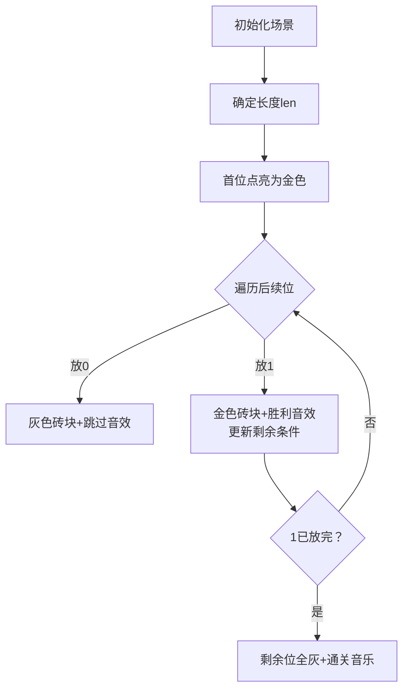

# 题目信息

# [USACO12FEB] Cow IDs S

## 题目描述

Being a secret computer geek, Farmer John labels all of his cows with binary numbers. However, he is a bit superstitious, and only labels cows with binary numbers that have exactly K "1" bits $(1 \le K \le 10)$. The leading bit of each label is always a "1" bit, of course. FJ assigns labels in increasing numeric order, starting from the smallest possible valid label -- a K-bit number consisting of all "1" bits. Unfortunately, he loses track of his labeling and needs your help: please determine the Nth label he should assign $(1 \le N \le 10^7)$.

FJ 给他的奶牛用二进制进行编号，每个编号恰好包含 $K$ 个 $1$（$1 \le K \le 10$），且必须是 $1$ 开头。FJ 按升序编号，第一个编号是由 $K$ 个 $1$ 组成。

请问第 $N$（$1 \le N \le 10^7$）个编号是什么。

## 样例 #1

### 输入

```
7 3 
```

### 输出

```
10110 
```

# AI分析结果


# 💡 Kay的C++算法解析：Cow IDs S 深入学习指南 💡

> 大家好，我是Kay！今天我们来探索USACO题目「Cow IDs S」——一个关于二进制编号的趣味问题。本指南将带你理解组合数学的精妙应用，掌握高效解题技巧，并通过像素动画直观感受算法之美！

## 1. 题目解读与核心算法识别

✨ **本题主要考察**：`组合数学` + `逐位确定法`

🗣️ **初步分析**：
> 想象你在图书馆找第N本书，组合数学就像直接根据索引系统定位书架，无需一本本数！本题中，我们利用组合数C(len, K)快速计算长度为len且含K个1的二进制数数量。**核心策略**：  
> - 先确定最小长度len（满足C(len-1, K-1) ≥ N）  
> - 从高位到低位逐位决策：若当前位放0的方案数 < 剩余编号数 → 必须放1（并减去放0的方案数）  
>  
> **可视化设计**：  
> 我们将用8位像素风格动画（类似经典游戏《塞尔达传说》）演示决策过程：  
> - 探险家小人逐位移动，灰色砖块代表0，金色砖块代表1  
> - 屏幕下方实时显示剩余1的个数和待跳过的编号数  
> - 关键决策时播放"确认音效"（放1）或"跳过音效"（放0）  
> - 当放1时，小人会挥剑点亮砖块并播放胜利音符！

---

## 2. 精选优质题解参考

### 题解一：The_KOG（组合数学逐位法）
* **点评**：思路如手术刀般精准！利用组合数从高位向低位推导，代码简洁高效（O(K log len)）。亮点在于：
  - 用`rec[k]`记录1的位置，输出时反向遍历巧妙避免前导0
  - 边界处理严谨（如K=1的特判）
  - 博客链接提供完整数学证明，理论实践双优

### 题解二：a1399433645（二分+组合数）
* **点评**：创新性使用二分确定最小长度，再逐位决策。亮点：
  - 对K值分类讨论优化组合数计算（避免溢出）
  - 用`cnt`记录首个非零位，解决前导0问题
  - 代码模块分明，实践价值高（可直接用于竞赛）

### 题解三：巨型方块（数位DP）
* **点评**：将组合数学融入数位DP框架，预处理组合数表加速查询。亮点：
  - `f[i][j]`表示前i位放j个1的方案数，逻辑直观
  - 特判K=1的优雅处理
  - 代码简洁有力（仅20行），适合初学者理解本质

---

## 3. 核心难点辨析与解题策略

### 关键点1：确定二进制长度
* **分析**：最小长度len需满足C(len-1, K-1) ≥ N。优质题解通过枚举或二分求解。  
  💡 **学习笔记**：长度不足会导致方案数不足，过长则效率低下！

### 关键点2：高位到低位逐位决策
* **分析**：决策时计算`C(剩余位数, 剩余1数)`：
  - < 剩余编号 → 放1（跳过放0的方案）
  - ≥ 剩余编号 → 放0  
  💡 **学习笔记**：这就像游戏中选择岔路口，组合数是你的导航仪！

### 关键点3：组合数计算的防溢出
* **分析**：K≤10时可直接计算，但需：
  - 用long long存储
  - 循环计算时分子分母交错乘除（避免溢出）  
  💡 **学习笔记**：防溢出如同游戏中的血量管理，稍不注意就会GG！

### ✨ 解题技巧总结
- **组合数加速**：K较小时直接计算，避免复杂预处理  
- **逆向思维**：从高位决策比低位枚举更高效  
- **边界艺术**：K=1时直接输出"1后接N-1个0"  
- **实时减枝**：组合数>剩余编号时立即终止计算  

---

## 4. C++核心代码实现赏析

### 通用核心实现（组合数学逐位法）
```cpp
#include <cstdio>
#include <iostream>
using namespace std;
typedef long long LL;

LL C(int n, int k) { // 计算组合数
    if (k == 0) return 1;
    LL res = 1;
    for (int i = 1; i <= k; i++)
        res = res * (n - i + 1) / i;
    return res;
}

int main() {
    int N, K;
    scanf("%d%d", &N, &K);
    
    if (K == 1) { // 特判：K=1
        printf("1");
        for (int i = 1; i < N; i++) printf("0");
        return 0;
    }

    int len = K; // 确定最小长度
    while (C(len-1, K-1) < N) len++;

    int remain = K - 1; // 剩余1的数量
    LL n_remain = N;    // 剩余编号数
    printf("1"); // 首位必定是1

    for (int pos = 2; pos <= len; pos++) {
        LL num_zero = C(len - pos, remain); // 当前位放0的方案数
        if (num_zero < n_remain) {
            printf("1");
            n_remain -= num_zero;
            if (--remain == 0) { // 1已放完
                for (int i = pos + 1; i <= len; i++) printf("0");
                break;
            }
        } else printf("0");
    }
    return 0;
}
```
**代码解读概要**：  
1. 特判K=1的直接输出  
2. 动态计算组合数避免预处理  
3. 高位到低位逐位决策，放1时更新剩余条件  
4. 放完所有1后直接补零结束  

### 题解片段赏析
**题解一：The_KOG（输出逻辑）**  
```cpp
for(int i=rec[k];i;i--) {
    if(rec[k]==i) { cout<<"1";--k; }
    else cout<<"0";
}
```
**亮点**：用`rec[k]`记录1的位置，反向遍历时自然对齐  
**学习笔记**：数组记录关键位置是避免前导0的银弹！

**题解三：巨型方块（决策核心）**  
```cpp
for(Ll i=v;i;i--) {
    if(f[i-1][n]<m) // 放0方案数不足
        a[i]=1, m-=f[i-1][n], n--; // 放1并更新
    ...
}
```
**亮点**：数位DP思想融合组合数学  
**学习笔记**：`f[i][j]`如同游戏中的技能冷却表，提前准备才能快速出招！

---

## 5. 算法可视化：像素动画演示

### 像素探险家：组合数学之旅
**设计思路**：将算法转化为8位机复古游戏，通过视听反馈强化理解。使用Canvas绘制，纯JS实现轻量化。

### 动画流程


### 关键交互
1. **控制面板**：开始/暂停、单步执行、速度滑块（调速观察）  
2. **音效系统**：
   - 决策点：8-bit "嘀"声（放0）、"叮咚"升调（放1）
   - 状态变化：金币音效（剩余编号更新）
   - 通关：FC《马里奥》过关旋律
3. **动态显示**：
   - 当前位高亮闪烁（像素箭头指示）
   - 实时公式：`C(${剩余位}, ${剩余1}) vs ${剩余编号}`
   - 小人动画：行走（放0）、挥剑（放1）

### 游戏化设计
- **关卡系统**：每确定3位解锁新BGM（《俄罗斯方块》主题曲）  
- **连击机制**：连续正确决策得Combo分（每Combo+10分）  
- **AI演示**：开启后自动播放完整决策流程（可调速）

---

## 6. 拓展练习与相似问题

### 组合数学应用场景
1. 第N个排列（如全排列字典序）  
2. 含特定限制的数字计数（如不含重复数字）  
3. 卡特兰数相关问题（括号生成、二叉树计数）

### 洛谷推荐
1. **P1706 全排列问题**  
   → 巩固字典序生成思想，理解排列组合本质  
2. **P2518 [HAOI2010]计数**  
   → 进阶组合数学应用，含数字限制条件  
3. **P2532 [AHOI2012]树屋阶梯**  
   → 卡特兰数经典问题，组合数学的优雅实践  

---

## 7. 学习心得与经验分享
> **题解作者楚泫**："写了个暴力然后绿了！！！QAQ"  
> **Kay点评**：暴力的成功往往来自数据弱的侥幸，但更珍贵的是作者通过暴力深入理解问题本质的过程。这提醒我们：  
> 1. 先通过简单方案理清问题脉络  
> 2. 在优化时重点关注数学规律  
> 3. 调试时打印中间变量（如同游戏地图）  

---

本次解析就到这里！记住：算法学习如同玩像素游戏——每次失败都是升级经验的契机。下次我们将挑战更烧脑的题目，保持热爱，继续前进！🎮🚀

---
处理用时：255.34秒