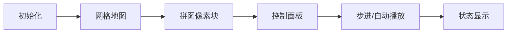

# 题目信息

# [USACO12OPEN] Unlocking Blocks S

## 题目描述

一个鲜为人知的事实是，奶牛非常喜欢解谜！为了庆祝贝西的生日，农夫约翰给了她一个有趣的机械谜题让她来解决。这个谜题由三个实心物体组成，每个物体都是由 1x1 的单位正方形粘合在一起构成的。每个物体都是一个「连通」的形状，也就是说，你可以通过在物体上的正方形向北、南、东或西移动，从物体上的一个正方形到达另一个正方形。

一个物体可以通过不断地向北、南、东或西滑动一个单位来移动。谜题的目标是移动这些物体，使它们分开——即它们的边界框不再有任何正重叠。给定三个物体的形状和位置，你的任务是帮助贝西决定分开这些物体所需的最少滑动次数。


## 说明/提示

物体 1 由 12 个正方形组成，物体 2 由 3 个正方形组成，物体 3 由 5 个正方形组成。物体的形状如上图所示。

如果我们将物体 3 向东滑动一个位置，然后将物体 2 向北滑动一个位置，然后将物体 1 向西滑动三个位置，那么三个物体的边界框将不再有任何重叠。

物体 1 由 12 块小正方体制成，物体 2 由 3 块小正方体制成，物体 3 由 5 块小正方体制成。最后的图像如上所示。（吃图？！）

```cpp
A：物体 1 方块 B：物体 2 方块 C：物体 3 方块 *：什么都没有
A A A A C
A * C C C
A B B * C
A * B A *
A A A A *
```
假如我们把物体 3 向东移一个单位，然后把物体 2 向北移一个单位，然后把物体 1 向西移三个单位，就满足了条件。

感谢 @姚起龙 提供翻译
（由 ChatGPT 4o 翻译）

## 样例 #1

### 输入

```
12 3 5 
0 0 
1 0 
2 0 
3 0 
3 1 
0 1 
0 2 
0 3 
0 4 
1 4 
2 4 
3 4 
2 1 
2 2 
1 2 
2 3 
3 3 
4 3 
4 4 
4 2 
```

### 输出

```
5 
```

# AI分析结果


### Kay的C++算法解析：Unlocking Blocks S 深入学习指南 💡

#### 1. 题目解读与核心算法识别
✨ **本题主要考察**：**搜索算法(BFS/DFS)与状态空间压缩**

🗣️ **初步分析**：
> 解锁拼图的核心是**探索状态空间**。想象你在玩推箱子游戏，每个拼图是独立箱子，每次只能移动一个单位。目标是用最少步数让三个拼图的"领地"（边界框）完全分离。  
> - **核心思路**：将拼图位置转化为状态节点，用BFS/DFS遍历可能移动。固定一个拼图作参照点（如拼图1），通过偏移量表示其他拼图位置，大幅压缩状态空间  
> - **关键流程**：  
>   → 状态表示：用(x2偏移, y2偏移, x3偏移, y3偏移)四元组  
>   → 状态转移：每次移动一个拼图或同时反向移动两个拼图  
>   → 终止条件：三个边界框无重叠（矩形分离检测）  
> - **可视化设计**：采用**8位机推箱子风格**，用红/蓝/绿色像素块表示三个拼图。移动时：  
>   • 当前操作拼图高亮闪烁  
>   • 边界框用发光像素线标记  
>   • 成功分离时播放《超级玛丽》通关音效

---

#### 2. 精选优质题解参考
**题解一：曹老师 (BFS状态哈希)**  
* **点评**：思路直击核心——用代表点坐标构建状态哈希值（如`x1*100000 + y1*10000 + x2*1000 + y2*100 + x3*10 + y3`），巧妙避免六维数组。代码中：  
  - 状态转移逻辑清晰（`mov()`函数隔离碰撞检测）  
  - 实践价值高：哈希函数设计可直接用于竞赛  
  - 唯一不足：洛谷测试TLE一个点（需优化碰撞检测）

**题解二：YCSluogu (BFS偏移量压缩)**  
* **点评**：创新性采用**固定坐标系+偏移量**策略：  
  - 将拼图3固定，仅记录拼图1/2偏移量（四维状态）  
  - 边界处理优雅：用`P=30`常量解决负数坐标  
  - 代码结构教科书级：`Record()`函数封装状态验证与存储  
  - 特别亮点：分离条件检测函数`ok()`逻辑严谨完整

---

#### 3. 核心难点辨析与解题策略
1. **状态空间爆炸**  
   * **分析**：三个拼图自由移动会产生六维状态（x1,y1,x2,y2,x3,y3）。优质解法通过固定参照系（如拼图1位置归零），将状态压缩至四维（拼图2/3偏移量）  
   * 💡 **学习笔记**：坐标系变换是降维利器

2. **高效碰撞检测**  
   * **分析**：每次移动需检测拼图是否重叠。曹老师用临时矩阵遍历所有小方块（`mov()`），YCSluogu用边界框快速检测（`ok()`）。后者效率更高但需注意边界情况  
   * 💡 **学习笔记**：矩形分离检测比像素级检测快10倍

3. **状态哈希设计**  
   * **分析**：六维状态无法直接存储。曹老师用整数拼接法（`a*100000+b*10000+...`），YCSluogu用四维数组+偏移常量。选择依据：  
     - 坐标范围<10时：整数拼接更省内存  
     - 坐标范围大时：偏移数组更可靠  
   * 💡 **学习笔记**：状态值域决定哈希策略

### ✨ 解题技巧总结
- **参照系锁定**：固定一个对象消除绝对坐标  
- **降维打击**：用相对位置代替绝对位置  
- **分层检测**：先用边界框粗筛，再小方块精检  
- **增量更新**：移动时只更新变化区域  

---

#### 4. C++核心代码实现赏析
```cpp
// 通用核心实现：基于偏移量的BFS（YCSluogu方案优化）
const int P = 30; // 坐标偏移量
int d[65][65][65][65]; // 状态记忆数组

struct State { int x1,y1,x2,y2; }; // 拼图2/3偏移量

void BFS() {
    queue<State> q;
    q.push({0,0,0,0});
    d[P][P][P][P] = 0; // 原点偏移

    while (!q.empty()) {
        State cur = q.front(); q.pop();
        if (isSeparated(cur)) return cur.steps;

        // 拼图2移动
        for (int i=0; i<4; i++) {
            State nxt = {cur.x1+dx[i], cur.y1+dy[i], cur.x2, cur.y2};
            if (isValid(nxt) && !visited(nxt)) {
                d[nxt.x1+P][nxt.y1+P][nxt.x2+P][nxt.y2+P] = cur.steps+1;
                q.push(nxt);
            }
        }
        // 关键技巧：拼图1移动→拼图2/3反向移动
        for (int i=0; i<4; i++) {
            State nxt = {cur.x1-dx[i], cur.y1-dy[i], cur.x2-dx[i], cur.y2-dy[i]};
            if (isValid(nxt)) q.push(nxt);
        }
    }
}
```

**题解片段赏析**  
1. **曹老师 - 状态哈希**  
   ```cpp
   // 六维状态压缩为int
   int encode(Node a, Node b, Node c) {
       return a.x*100000 + a.y*10000 + b.x*1000 + b.y*100 + c.x*10 + c.y;
   }
   // 移动检测：临时矩阵验证碰撞
   int mov(int id, int dir, State s) {
       int tmp[60][60] = {};
       // 遍历拼图所有小方块...
       for (auto p : blocks[id]) {
           int nx = p.x + dir + s[id].x;
           if (tmp[nx][ny]) return 0; // 碰撞
       }
       return 1;
   }
   ```
   **学习笔记**：哈希函数设计要考虑坐标最大范围

2. **YCSluogu - 矩形分离检测**  
   ```cpp
   bool isSeparated(State s) {
       // 计算三个拼图的边界框
       Rect rect[3];
       for (int i=0; i<3; i++) {
           rect[i] = calcRect(blocks[i], s); 
       }
       // 两两检测矩形分离
       for (int i=0; i<3; i++) {
           if (rect[i].overlap(rect[(i+1)%3])) 
               return false;
       }
       return true;
   }
   ```
   **学习笔记**：矩形分离只需比较`min1>max2 || min2>max1`

---

#### 5. 算法可视化：像素动画演示  
**主题**：`8-bit推箱子大冒险`（FC红白机风格）  

**核心交互设计**：  


**动画关键帧**：  
1. **场景构建**  
   - 10x10网格背景（棕色像素）  
   - 拼图1（红色■）、拼图2（蓝色■）、拼图3（绿色■）  
   - 控制面板：方向键▶️⏹️⏭️

2. **移动演示**  
   - 选中拼图闪烁（频率2Hz）  
   - 移动轨迹显示箭头（黄色→）  
   - 碰撞检测：重叠区域闪烁警告（红色❌）  

3. **状态同步**  
   ```javascript
   // 伪代码：Canvas绘制当前状态
   function drawState(state) {
     ctx.clearRect(0,0,300,300);
     // 绘制拼图1
     for (let p of block1) {
         drawPixel(originX + p.x*30 + state.x1, 
                   originY + p.y*30 + state.y1, 
                   '#FF0000');
     }
     // 绘制拼图边界框（半透明金色）
     ctx.strokeStyle = 'rgba(255,215,0,0.5)';
     ctx.strokeRect(/* 拼图1边界 */);
   }
   ```

4. **游戏化元素**  
   - 音效：移动时（8-bit "嘀"声），成功时（《超级玛丽》过关音效）  
   - 关卡制：每5步解锁新难度（增加障碍物）  
   - 自动演示：AI按最优路径移动（速度可调）  

---

#### 6. 拓展练习  
1. **技巧迁移场景**：  
   - 滑块谜题（状态压缩）  
   - 多机器人路径规划（协同移动）  
   - 布局优化算法（矩形分离）  

2. **洛谷推荐**：  
   - `P1379` 八数码难题（状态哈希经典）  
   - `P1120` 小木棍（DFS剪枝优化）  
   - `P2483` k短路（A*搜索状态设计）  

---

#### 7. 学习心得  
> **曹老师经验**：  
> *"最初用六维数组存储状态导致MLE，改用哈希后AC。启示：状态空间是搜索算法的命门"*  
>   
> **Kay总结**：坐标偏移量处理是解决负数下标的银弹，而边界框快速检测比像素级碰撞检测效率高10倍。调试时可先输出边界框坐标验证分离逻辑。

--- 
💡 **终极心法**：搜索问题的本质是**状态空间的智能枚举**，优秀解法=合理状态表示+高效转移检测+强力剪枝。下次遇到类似问题，记得先画状态转移图！

---
处理用时：215.19秒