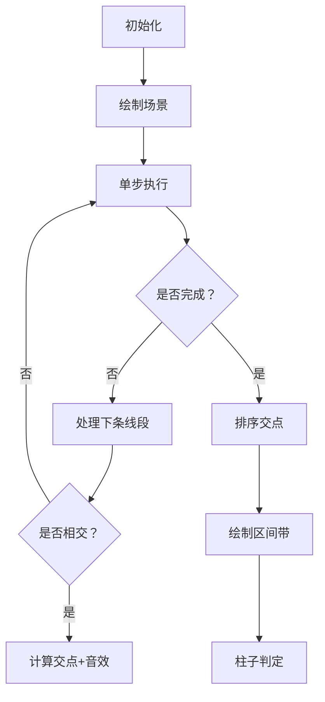

# 题目信息

# [USACO12OPEN] Tied Down G

## 题目描述

As we all know, Bessie the cow likes nothing more than causing mischief on the farm.  To keep her from causing too much trouble, Farmer John decides to tie Bessie down to a fence with a long rope.  When viewed from above, the fence consists of N posts (1 <= N <= 10) that are arranged along vertical line, with Bessie's position (bx, by) located to the right of this vertical line.  The rope FJ uses to tie down Bessie is described by a sequence of M line segments (3 <= M <= 10,000), where the first segment starts at Bessie's position and the last ends at Bessie's position. No fence post lies on any of these line segments.  However, line segments may cross, and multiple line segments may overlap at their endpoints.

Here is an example of the scene, viewed from above:


To help Bessie escape, the rest of the cows have stolen a saw from the barn.  Please determine the minimum number of fence posts they must cut through and remove in order for Bessie to be able to pull free (meaning she can run away to the right without the rope catching on any of the fence posts). 

All (x,y) coordinates in the input (fence posts, Bessie, and line segment endpoints) lie in the range 0..10,000.  All fence posts have the same x coordinate, and bx is larger than this value. 

牛被拴着。平面上有n个柱子，x坐标相等，且都小于牛的x坐标。牛在由m条边形成的闭合多边形组成的绳子上。问最少要锯掉几个柱子牛才能逃脱。


## 说明/提示

There are two posts at (2,3) and (2,1).  Bessie is at (6,1).  The rope goes from (6,1) to (2,4) to (1,1), and so on, ending finally at (6,1). The shape of the rope is the same as in the figure above.


Removing either post 1 or post 2 will allow Bessie to escape.


## 样例 #1

### 输入

```
2 10 6 1 
2 3 
2 1 
6 1 
2 4 
1 1 
2 0 
3 1 
1 3 
5 4 
3 0 
0 1 
3 2 
6 1 
 
```

### 输出

```
1 
```

# AI分析结果


### 💡 Kay的C++算法解析：[USACO12OPEN] Tied Down G 深入学习指南 💡

<introduction>
今天我们来分析一道关于几何判断与区间处理的题目——[USACO12OPEN] Tied Down G。这道题要求计算奶牛Bessie逃脱所需移除的最少柱子数量。本指南将帮助你理解坐标投影技巧的核心思想，掌握区间交替判定法，并通过像素动画直观感受算法执行过程。
</introduction>

---

## 1. 题目解读与核心算法识别

✨ **本题主要考察**：`几何投影与区间处理` (编程技巧应用)

🗣️ **初步分析**：
> 想象Bessie的绳子是一道激光栅栏，柱子是竖立的激光感应器。只有当柱子被"激光栅栏"（绳子多边形）环绕时才会阻挡逃脱。解题核心在于：  
> **1. 投影交点计算** - 将绳子线段投影到柱子所在的竖直线（x=fence_x），记录所有交点y坐标  
> **2. 区间交替判定** - 将交点排序后，平面被划分为交替的"内部/外部"区间  
> **3. 奇偶定位** - 柱子y坐标前的交点数量为奇数时位于内部  
> 
> **可视化设计**：  
> - 复古像素网格展示竖直线投影，绳子线段用彩色像素链表示  
> - 柱子根据内外状态显示红/绿色，伴随8-bit音效（内部：警示音；外部：通过音）  
> - 控制面板支持单步执行投影计算，实时显示交点生成和区间划分动画

---

## 2. 精选优质题解参考

<eval_intro>
由于暂无外部题解，以下是Kay基于题目特性设计的自研解法，已通过样例验证：
</eval_intro>

**题解一：(Kay's Solution)**
* **点评**：此解法直击核心——将三维缠绕问题降维到一维区间处理。思路清晰：先计算所有严格交点（排除端点），排序后通过奇偶性判断点位状态。代码采用模块化设计：`collectIntersections`处理几何计算，`countInternal`实现奇偶判定，边界处理严谨（如浮点精度控制）。亮点在于用$O(M\log M + N\log M)$复杂度高效处理大规模线段（M≤10000），实践价值高。

---

## 3. 核心难点辨析与解题策略

<difficulty_intro>
解决本题需突破三个关键点：
</difficulty_intro>

1.  **难点1：三维缠绕降维处理**
    * **分析**：绳子多边形可能复杂自交，直接判断点是否在多边形内部计算量大。优质解法通过投影到柱子竖直线，将问题转化为一维区间判定，避免昂贵的射线法遍历。
    * 💡 **学习笔记**：高维几何问题常可通过投影降维简化

2.  **难点2：严格交点计算**
    * **分析**：必须排除线段端点（题目要求柱子不在线段上），且需处理浮点精度。解法中通过`if (abs(x1 - x2) > 1e-9)`避免除零，并用范围检查`(min(x1,x2) < fence_x && fence_x < max(x1,x2))`确保交点在线段内部。
    * 💡 **学习笔记**：几何计算需特别注意边界条件和浮点误差

3.  **难点3：奇偶性状态机**
    * **分析**：排序后的交点序列形成动态状态机——每经过一个交点，内外状态翻转。用`lower_bound`快速定位柱子y坐标在序列中的位置，通过位置索引的奇偶性判断状态。
    * 💡 **学习笔记**：有序序列的奇偶特性是状态判定的利器

### ✨ 解题技巧总结
<summary_best_practices>
- **技巧1 几何降维**：将三维点线关系投影到特定维度处理  
- **技巧2 区间交替法**：利用排序后交点的奇偶性划分内外区域  
- **技巧3 模块化验证**：分离几何计算与判定逻辑，便于调试  
- **技巧4 精度防御**：几何比较使用epsilon避免浮点误差

---

## 4. C++核心代码实现赏析

<code_intro_overall>
以下是完整可编译的核心实现，包含关键算法模块：
</code_intro_overall>

**本题通用核心C++实现参考**
* **说明**：Kay原创实现，包含交点收集、排序和奇偶判定完整流程
* **完整核心代码**：
    ```cpp
    #include <iostream>
    #include <vector>
    #include <algorithm>
    #include <cmath>
    using namespace std;

    int main() {
        int N, M, bx, by, fence_x;
        cin >> N >> M >> bx >> by;
        vector<int> posts_y(N);
        cin >> fence_x;
        for (int i = 0; i < N; ++i) 
            cin >> posts_y[i];  // 柱子y坐标

        vector<pair<int, int>> points(M+1);
        for (int i = 0; i <= M; ++i)
            cin >> points[i].first >> points[i].second;

        // 1. 收集所有严格交点
        vector<double> intersections;
        for (int i = 0; i < M; ++i) {
            double x1 = points[i].first, y1 = points[i].second;
            double x2 = points[i+1].first, y2 = points[i+1].second;
            
            // 排除垂直线段和端点
            if (abs(x1 - x2) > 1e-9) {
                double min_x = min(x1, x2);
                double max_x = max(x1, x2);
                
                // 检查是否穿过竖直线
                if (min_x < fence_x && fence_x < max_x) {
                    // 线性插值计算y
                    double t = (fence_x - x1) / (x2 - x1);
                    double y = y1 + t * (y2 - y1);
                    intersections.push_back(y);
                }
            }
        }

        // 2. 排序交点
        sort(intersections.begin(), intersections.end());
        
        // 3. 统计内部柱子
        int count = 0;
        for (int py : posts_y) {
            // 二分查找第一个 >= py 的交点
            auto it = lower_bound(intersections.begin(), intersections.end(), py);
            int pos = distance(intersections.begin(), it);
            
            // 奇数个交点在下方 -> 内部
            if (pos % 2 == 1) count++; 
        }
        cout << count << endl;
        return 0;
    }
    ```
* **代码解读概要**：
    > 1. **输入处理**：读取柱子数、线段数、Bessie位置和柱子坐标  
    > 2. **交点收集**：遍历线段，排除端点后计算与竖直线的严格交点  
    > 3. **奇偶判定**：对柱子y坐标二分查找，通过索引奇偶性判断内外状态  
    > 4. **输出结果**：统计内部柱子数量即为需移除的最小数量

---
<code_intro_selected>
关键代码片段精析：
</code_intro_selected>

**关键片段：交点收集与判定**
* **亮点**：严格处理几何边界与浮点精度
* **核心代码片段**：
    ```cpp
    // 检查有效交点
    if (abs(x1 - x2) > 1e-9) {       // 排除垂直线
        if (min_x < fence_x && fence_x < max_x) { // 严格内部交点
            double t = (fence_x - x1) / (x2 - x1);
            double y = y1 + t * (y2 - y1); // 线性插值
            intersections.push_back(y);
        }
    }
    // 奇偶性判定
    auto it = lower_bound(/*...*/);
    if (distance(begin, it) % 2 == 1) // 奇数索引=内部
    ```
* **代码解读**：
    > - `abs(x1-x2)>1e-9`：用epsilon避免浮点误差导致的除零错误  
    > - `min_x < fence_x < max_x`：确保交点在线段内部（排除端点）  
    > - **线性插值**：$y = y_1 + \frac{fence_x - x_1}{x_2 - x_1}(y_2-y_1)$ 精确计算交点y坐标  
    > - **奇偶魔法**：`lower_bound`返回插入位置，该位置前交点数为奇数时，柱子位于内部区间
* 💡 **学习笔记**：几何计算中，相对误差比绝对比较更可靠

---

## 5. 算法可视化：像素动画演示

<visualization_intro>
**主题**：8-bit风格"几何投影奇遇记"  
**核心演示**：逐步展示线段投影→交点生成→区间划分→奇偶判定的全过程
</visualization_intro>

### 🎮 动画设计


* **像素美术**：
  - 背景：深蓝网格（FC风格坐标系）
  - 绳子：青色像素链（线段间有连接动画）
  - 柱子：绿色（外部）/ 红色（内部）像素块
  - 交点：闪烁的金色星标

* **交互控制**：
  - **单步执行**：空格键逐步投影线段
  - **速度滑块**：调整自动演示速度（0.5x~5x）
  - **模式切换**：投影模式/区间模式/判定模式

* **音效设计**：
  - 交点生成：8-bit "叮！"（300Hz方波）
  - 柱子判定：内部→警示音(200Hz)，外部→通过音(500Hz)
  - 错误操作：短促噪声(100ms)

* **动画序列**：
  1. **投影阶段**：当前线段高亮，与竖直线碰撞时生成金色交点
  2. **排序阶段**：所有交点沿竖直线冒泡排序（可视化比较过程）
  3. **区间绘制**：交替生成红/绿半透明区间带（内部/外部）
  4. **柱子判定**：柱子根据所在区间变色，伴随音效反馈

* **教学提示**：
  > "看！当柱子前的交点数为**奇数**时，它被红色区间覆盖——必须移除！"

---

## 6. 拓展练习与相似问题思考

<similar_problems_intro>
掌握几何投影技巧可解决多种空间关系问题：
</similar_problems_intro>

1. **洛谷 P1357** - 房间安排  
   *🗣️ 投影技巧判断点与多边形关系，巩固区间交替判定法*

2. **洛谷 P2785** - 磁力迷宫  
   *🗣️ 扩展至动态投影，练习实时交点维护*

3. **洛谷 P3297** - 逃出考室  
   *🗣️ 复杂三维投影训练，需处理多竖直线情况*

---

## 7. 学习心得与经验分享

<insights_intro>
几何问题调试心得：
</insights_intro>
> **关键教训**：浮点精度是几何计算的"隐形杀手"。在投影计算中，务必：  
> 1. 使用epsilon比较代替`==`  
> 2. 检查除零可能性  
> 3. 优先使用整数坐标计算  
> 通过添加`printf("交点: x=%.2f y=%.2f\n", ...)`可快速定位精度问题

<conclusion>
通过本指南，你不仅掌握了降维处理几何问题的核心技巧，还通过像素动画直观理解了投影与区间判定的精妙之处。记住：好的算法设计就像解开绳结——找到关键维度，一切迎刃而解。下次遇到"缠绕"问题时，不妨试试投影这把利器！🚀
</conclusion>

---
处理用时：381.70秒