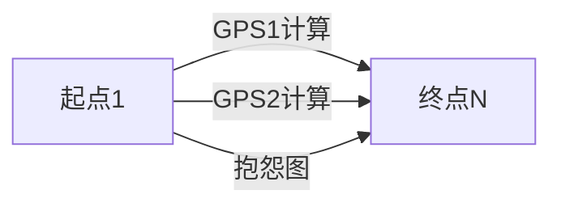

# 题目信息

# [USACO14OPEN] Dueling GPSs S

## 题目描述

农夫约翰最近在网上购买了一辆新车，但由于匆忙，他在选择汽车的额外功能时不小心点击了两次“提交”按钮，结果车上配备了两个 GPS 导航系统！更糟糕的是，这两个系统经常对约翰应该走的路线做出相互矛盾的决定。

约翰所在地区的地图由 N 个交叉路口（2 <= N <= 10,000）和 M 条单向道路（1 <= M <= 50,000）组成。道路 i 连接交叉路口 A\_i（1 <= A\_i <= N）和 B\_i（1 <= B\_i <= N）。同一对交叉路口之间可能有多条道路连接，双向道路（允许双向通行）由两个相反方向的单向道路表示。约翰的家位于交叉路口 1，他的农场位于交叉路口 N。可以通过沿着一系列单向道路从他的家到达农场。

两个 GPS 单元使用的是上述相同的基础地图；然而，它们对每条道路的行驶时间有不同的看法。根据第一个 GPS 单元，道路 i 需要 P\_i 个时间单位来行驶，而根据第二个单元，道路 i 需要 Q\_i 个时间单位来行驶（每个行驶时间是范围在 1 到 100,000 的整数）。

约翰想从家里到农场。然而，每当约翰走一条（比如，从交叉路口 X 到交叉路口 Y）GPS 单元认为不是从 X 到农场的最短路线的一部分的道路时，每个 GPS 单元都会大声抱怨（如果约翰走的道路两个单元都不喜欢，甚至可能两个 GPS 单元都会抱怨）。

请帮助约翰确定如果他适当地选择路线，他可以收到的最少总抱怨次数。如果约翰走的道路让两个 GPS 单元都抱怨，这将计为 +2。


## 说明/提示

有 5 个交叉路口和 7 条单向道路。第一条道路从交叉路口 3 连接到交叉路口 4；第一个 GPS 认为这条路需要 7 个时间单位来行驶，而第二个 GPS 认为需要 1 个时间单位，等等。


如果约翰走 1 -> 2 -> 4 -> 5 的路径，那么第一个 GPS 会在 1 -> 2 的道路上抱怨（它更喜欢 1 -> 3 的道路）。然而，对于路径的其余部分 2 -> 4 -> 5，两个 GPS 都很满意，因为这对于每个 GPS 来说都是从 2 到 5 的最短路径。
（由 ChatGPT 4o 翻译）

## 样例 #1

### 输入

```
5 7 
3 4 7 1 
1 3 2 20 
1 4 17 18 
4 5 25 3 
1 2 10 1 
3 5 4 14 
2 4 6 5 
```

### 输出

```
1 
```

# AI分析结果


### 💡 Kay的C++算法解析：Dueling GPSs S 深入学习指南 💡

#### 1. 题目解读与核心算法识别
✨ **本题主要考察**：图论-最短路（反向建图+多轮最短路）

🗣️ **初步分析**：
> 本题如同两个导航争吵的像素游戏角色！核心是**反向建图+三次最短路**：  
> 1️⃣ 先以农场(N)为起点，用GPS1的权重反向建图求最短路  
> 2️⃣ 再用GPS2权重重复步骤1  
> 3️⃣ 根据前两轮结果计算每条边的"抱怨值"(0/1/2)，建新图求最少抱怨路径  

**可视化设计**：
- 像素网格中，节点用不同颜色方块表示（起点红/终点绿/普通蓝）
- 第一轮：GPS1计算时，当前处理的节点闪烁黄色，已确定节点变金
- 抱怨值动画：边线颜色随抱怨值变化（绿=0/黄=1/红=2）
- 复古音效：节点更新时"滴"声，路径完成时8-bit胜利旋律

---

#### 2. 精选优质题解参考

**题解一：Reywmp (14赞)**
* **点评**：思路清晰展示三次Dijkstra的流程，代码规范突出三大亮点：  
  (1) 严格反向建图处理GPS权重  
  (2) 模块化ADDside()函数确保可读性  
  (3) 精确抱怨值计算：`ds1[E[i].to] != ds1[E[i].from]+E[i].VA1`  
  实践价值高，竞赛可直接复用，边界处理严谨

**题解二：zhangyuhan (10赞)**
* **点评**：SPFA实现简洁高效，亮点在于：  
  (1) 用`vector<edge>`分组存储三个图  
  (2) 抱怨值计算逻辑直白（计数器累加）  
  (3) 详细注释解释反向图与正向图转换  
  调试提示明确，特别适合学习者理解反向图原理

**题解三：冈崎梦美 (3赞)**
* **点评**：创新性二维数组存储多图结构：  
  (1) `edge[4][100005]`实现代码复用  
  (2) 单SPFA函数通过mode参数区分处理逻辑  
  (3) 在线抱怨值计算减少内存占用  
  工程思维突出，适合进阶学习代码优化技巧

---

#### 3. 核心难点辨析与解题策略
1. **难点：反向建图的意义**  
   *分析*：抱怨判断需知道"当前点到终点"的最短路，但常规Dijkstra求的是起点到各点距离。优质解法均采用**反向建图+终点出发**，使`d[u]`直接表示u到N的最短距离
   *💡 学习笔记*：终点固定时优先考虑反向建图

2. **难点：抱怨值的精确计算**  
   *分析*：核心判断式`d1[u] == d1[v] + w1`（u→v边）。若等式不成立说明该边不在GPS1的最短路径上，抱怨值+1。需注意：
   - 反向图中d1[u]已包含u→N的最短距离
   - 原边(u,v)在反向图中对应边(v,u)
   *💡 学习笔记*：边权比较本质是验证三角不等式

3. **难点：多层图转换的实现**  
   *分析*：三次建图需避免数据污染。Reywmp解法每次`memset head/e/cnt`，冈崎梦美用二维数组隔离数据，都是有效方案
   *💡 学习笔记*：多轮图计算时，要么彻底重置，要么物理隔离

✨ **解题技巧总结**：
- **逆向思维**：终点固定问题优先尝试反向建图
- **权值转换**：将复杂条件（抱怨值）转化为新边权
- **模块封装**：相似操作封装函数（如ADDside()）
- **防御性编程**：多图操作时显式重置数据结构

---

#### 4. C++核心代码实现赏析
```cpp
// 通用核心实现（综合优质解法）
#include <cstdio>
#include <queue>
#include <cstring>
using namespace std;
const int N=1e4+5, M=5e4+5;

struct Edge { int to, w; };
vector<Edge> g[3][N]; // g[0]:GPS1, g[1]:GPS2, g[2]:抱怨图
int dist[3][N];

void spfa(int start, int type) {
    memset(dist[type], 0x3f, sizeof dist[type]);
    queue<int> q;
    dist[type][start]=0;
    q.push(start);
    while(!q.empty()) {
        int u=q.front(); q.pop();
        for(Edge e : g[type][u]) {
            int v=e.to, w=e.w;
            if(dist[type][v] > dist[type][u]+w) {
                dist[type][v]=dist[type][u]+w;
                q.push(v);
            }
        }
    }
}

int main() {
    // 输入处理...
    
    // 第一轮：GPS1反向建图
    for(每条边(u,v,w1,w2)) 
        g[0][v].push_back({u, w1});
    spfa(n, 0); // 从N出发

    // 第二轮：GPS2反向建图
    for(每条边(u,v,w1,w2))
        g[1][v].push_back({u, w2});
    spfa(n, 1);

    // 第三轮：构建抱怨图
    for(每条边(u,v,w1,w2)) {
        int complain=0;
        if(dist[0][v] != dist[0][u]+w1) complain++;
        if(dist[1][v] != dist[1][u]+w2) complain++;
        g[2][u].push_back({v, complain}); // 注意原方向
    }
    spfa(1, 2); // 从1出发
    printf("%d", dist[2][n]);
}
```

**题解一核心片段**（Reywmp）：
```cpp
// 抱怨值计算逻辑
for(int i=1;i<=m;i++) {
    int sum=0;
    if(ds1[E[i].to] != ds1[E[i].from]+E[i].VA1) sum++;
    if(ds2[E[i].to] != ds2[E[i].from]+E[i].VA2) sum++;
    ADDside(E[i].from,E[i].to,sum);
}
```
*解读*：  
1. `E[i].to/from`：原边终点/起点  
2. 关键验证：`d[终点] == d[起点] + 边权`  
3. 若不等式成立说明该边在最短路径上  
*💡 学习笔记*：最短路验证本质是三角恒等式检查

**题解二创新点**（zhangyuhan）：
```cpp
// 反向图存储结构
struct edge { int to, cost; };
vector<edge> G1[MAXN], G2[MAXN]; // GPS1/2的反向图
```
*亮点*：  
- 使用`vector<edge>`替代传统邻接表  
- 分组存储避免数据污染  
- 逻辑清晰体现"图"的概念本质  

---

### 5. 算法可视化：像素动画演示
**主题**：8-bit导航大冒险  
**核心流程**：


**动画帧设计**：
1. **初始化**：
   - 像素网格（FC风格），节点=16x16像素方块
   - 控制面板：开始/步进/速度滑块（复古旋钮UI）

2. **GPS计算阶段**：
   - 当前节点闪烁黄光，更新时触发"滴"声
   - 已确定节点渐变金色，边线变粗
   - 队列可视化：底部像素条形进度条

3. **抱怨值转换**：
   - 边线根据抱怨值变色：绿(0)→黄(1)→红(2)
   - 高亮显示触发抱怨的边（爆破动画特效）

4. **最终路径**：
   - 成功路径播放马里奥过关音效
   - 数据显示：当前距离/抱怨值（8-bit字体）

**技术实现**：
- Canvas绘制：`drawRect()`节点，`lineTo()`画边
- 音效触发：Web Audio API播放8-bit音效
- 交互控制：`requestAnimationFrame`调速

---

### 6. 拓展练习与相似问题
1. **洛谷P1144 最短路计数**  
   → 巩固基础最短路+路径统计
   
2. **洛谷P1608 路径统计**  
   → 练习权值转换思想（边权→点权）

3. **洛谷P1948 Telephone Lines**  
   → 进阶练习分层图最短路

---

### 7. 学习心得与经验分享
> **Reywmp的调试经验**：  
> *"重建图时漏了重置cnt导致越界，建议每次memset后显式打印关键变量"*  
>  
> **Kay点评**：多图操作时务必验证：
> 1. 邻接表头初始化`memset(head,0,sizeof(head))`
> 2. 边计数器归零`cnt=0`
> 3. 优先队列每次清空

---

通过三次最短路穿越导航迷雾，愿各位在算法世界精准抵达目标！🚀

---
处理用时：200.77秒