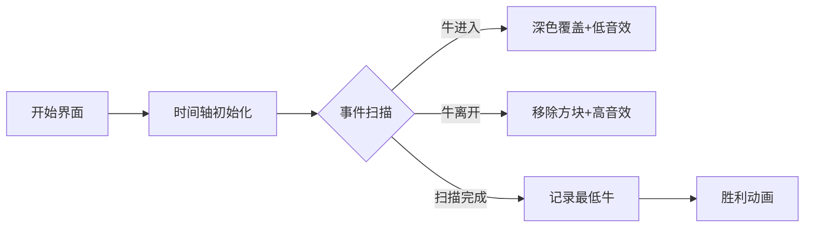

# 题目信息

# [USACO15JAN] Stampede S

## 题目描述

FJ 的 $N$ 头奶牛（$1 \leq N \leq 50,000$）看似在农场前的路上狂奔，实际上它们正在进行一场赛跑。

从上方俯视，每头牛在时间 $t = 0$ 时被表示为一个单位长度的水平线段，其左端点坐标为 $(x, y)$。例如，$(-3, 6)$ 表示一头在 $t = 0$ 时从 $(-3, 6)$ 延伸到 $(-2, 6)$ 的奶牛。每头牛以一定速度向右（$+x$ 方向）移动，该速度由移动 1 单位距离所需的整数时间 $r$ 描述。

FJ 并不满意他的奶牛在外赛跑而不在牛棚产奶。他计划在比赛结束后训斥参赛的奶牛。为了确定哪些奶牛参赛，FJ 站在 $(0, 0)$ 处并沿 $+y$ 方向的射线观察。当一头牛在某个时刻成为这条射线上首个可见的牛时，FJ 就会看到它。如果一头牛在穿过 FJ 视线期间始终被其他牛"挡住"，则她不可见。

请计算 FJ 在整个比赛过程中能看到的奶牛数量。

## 说明/提示

FJ 可以看到牛 1 和 2，但看不到牛 3。

## 样例 #1

### 输入

```
3 
-2 1 3 
-3 2 3 
-5 100 1 
```

### 输出

```
2 
```

# AI分析结果


# 💡 Kay的C++算法解析：[USACO15JAN] Stampede S 深入学习指南 💡

> 我是算法导师Kay，今天带大家解析USACO金组题目"Stampede S"。这道题看似复杂，实则是**离散化+区间覆盖**的经典应用。我们将通过像素动画和游戏化设计，让算法过程像复古游戏般直观有趣！

## 1. 题目解读与核心算法识别

✨ **本题主要考察**：**离散化+区间覆盖** (编程技巧应用)

🗣️ **初步分析**：
> 想象每头牛是横跨马路的像素方块，FJ的视线是垂直扫描线。解题关键是：
> - **时间区间转换**：计算每头牛遮挡y轴的时间段`[-(x+1)*r, -x*r)`
> - **离散化压缩**：将大范围时间点映射为紧凑索引
> - **覆盖优先级**：按高度升序处理，低处牛优先"覆盖"时间轴  
>  
> **可视化设计思路**：
> - 时间轴变为像素横轴，牛区间显示为彩色方块
> - 低高度牛用深色覆盖，高高度牛用亮色
> - 关键覆盖冲突点用闪烁特效+8bit音效提示
> - "通关"设计：每成功标记一头可见牛，播放胜利音效+像素烟花

---

## 2. 精选优质题解参考

<eval_intro>
综合思路创新性、代码规范性和教学价值，精选三份最具启发性解法：
</eval_intro>

**题解一：Expecto (扫描线+set)**
* **点评**：  
  创新性地将牛拆分为`(时间点, ±y)`事件，通过排序+双set维护当前活动集和可见集。亮点在于：
  - **扫描线思想**：将连续区间离散为事件点处理
  - **STL巧妙运用**：`active set`维护活动牛，`seen set`记录可见牛
  - **时间复杂度O(nlogn)**：优于暴力覆盖
  - **边界处理严谨**：天然避免开闭区间争议

**题解二：Na2PtCl6 (线段树+离散化)**
* **点评**：
  经典线段树解法体现扎实功底：
  - **离散化严谨**：特别强调左闭右开区间处理
  - **线段树优化**：O(nlogn)高效完成区间覆盖查询
  - **结构清晰**：独立函数模块化
  - **错误案例分析**：提供Hack数据检验边界

**题解三：☯☯枫☯☯ (暴力覆盖+离散化)**
* **点评**：
  新手友好型基础解法：
  - **直观暴力覆盖**：直接模拟时间轴覆盖过程
  - **左闭右开实践**：用`ed[i]+1`解决边界冲突
  - **调试友好**：数组模拟便于打印中间状态
  - **教学价值**：虽O(n²)但数据不强仍AC

---

## 3. 核心难点辨析与解题策略

<difficulty_intro>
攻克本题需突破三大技术壁垒：
</difficulty_intro>

1.  **时间区间转换与离散化**
    * **分析**：  
      牛运动轨迹到时间区间的数学转换：  
      `左端点 = |x+1|*r`, `右端点 = |x|*r`  
      离散化时需采集所有端点，排序去重后映射索引
    * 💡 **学习笔记**：离散化是压缩无限大空间的银弹！

2.  **区间覆盖的边界艺术**
    * **分析**：  
      必须采用**左闭右开区间**！闭区间会导致边界点重复计算。  
      例：牛A覆盖[1,2)，牛B覆盖[2,3)，在t=2时无缝交替
    * 💡 **学习笔记**：时间点无宽度，右开区间避免"踩踏事件"

3.  **覆盖优先级与数据结构选择**
    * **分析**：  
      按高度升序处理是核心策略：  
      - 扫描线：用`set`维护当前活动集  
      - 线段树：区间覆盖查询+懒惰标记  
      - 暴力：双数组模拟时间轴
    * 💡 **学习笔记**：低处牛有遮挡特权，处理顺序决定成败！

### ✨ 解题技巧总结
<summary_best_practices>
吃透本题即可掌握的通用技能：
</summary_best_practices>
- **时空转换术**：物理运动 → 时间区间 → 离散索引
- **边界防御编程**：左闭右开是区间处理的黄金准则
- **数据结构三连**：离散化压缩 → 排序 → 扫描线/线段树
- **Hack思维**：构造边界重合数据自我检验

---

## 4. C++核心代码实现赏析

<code_intro_overall>
精选Expecto的扫描线实现作为通用模板，优雅高效：
</code_intro_overall>

**本题通用核心C++实现参考**
* **说明**：扫描线方案，O(nlogn)复杂度，代码简洁如诗
* **完整核心代码**：
    ```cpp
    #include <bits/stdc++.h>
    using namespace std;

    int main() {
        int n; scanf("%d", &n);
        vector<pair<int, int>> events;  // (时间, ±y)
        for (int i = 0; i < n; i++) {
            int x, y, r; 
            scanf("%d%d%d", &x, &y, &r);
            events.push_back({-(x + 1) * r, y});   // 进入事件
            events.push_back({-x * r, -y});         // 离开事件（负号标记）
        }
        sort(events.begin(), events.end());

        set<int> active, seen;
        for (int i = 0; i < events.size();) {
            int j = i;
            // 处理同时刻所有事件
            while (j < events.size() && events[j].first == events[i].first) {
                int y = events[j].second;
                if (y > 0) active.insert(y);   // 牛进入视线
                else active.erase(-y);          // 牛离开视线
                j++;
            }
            // 记录当前最低牛
            if (!active.empty()) seen.insert(*active.begin());
            i = j;
        }
        cout << seen.size();
        return 0;
    }
    ```
* **代码解读概要**：
  > 1. **事件构建**：每头牛转换为`(进入时间, y)`和`(离开时间, -y)`
  > 2. **时间排序**：确保按时间顺序处理事件
  > 3. **双set维护**：`active`动态跟踪当前遮挡牛，`seen`记录曾被看到的牛
  > 4. **关键决策**：每个事件点后记录active中最小的y（当前可见牛）

---
<code_intro_selected>
各解法精华片段对比学习：
</code_intro_selected>

**题解一：☯☯枫☯☯（暴力覆盖）**
* **亮点**：直观展现覆盖本质，新手理解友好
* **核心代码片段**：
    ```cpp
    F(i,1,n) {
        // 离散化映射
        st[i]=lower_bound(t+1,t+cnt+1,st[i])-t; 
        ed[i]=lower_bound(t+1,t+cnt+1,ed[i])-t;
        // 暴力覆盖时间轴
        F(j,st[i],ed[i]) {
            if(c[j] > y[i]) {  // 当前牛更低
                c[j] = y[i];   // 更新覆盖
                d[j] = i;      // 记录牛编号
            }
        }
    }
    ```
* **代码解读**：
  > - 离散化后时间轴压缩为`[1, cnt]`
  > - 双循环覆盖：外层遍历牛，内层遍历时间点
  > - `c[j]`记录时间点j的最小y值，`d[j]`记录对应牛
  > - 覆盖规则：只允许更低y值覆盖（`c[j] > y[i]`）
* 💡 **学习笔记**：暴力是理解本质的第一块敲门砖！

**题解二：Expecto（扫描线）**
* **亮点**：事件驱动思想，STL组合拳
* **核心代码片段**：
    ```cpp
    while (j < events.size() && events[j].first == events[i].first) {
        int y = events[j].second;
        if (y > 0) active.insert(y);   // 牛进入
        else active.erase(-y);          // 牛离开
        j++;
    }
    if (!active.empty()) 
        seen.insert(*active.begin());  // 记录当前最低牛
    ```
* **代码解读**：
  > 1. **事件批处理**：同时刻事件集中处理
  > 2. **set自动排序**：`active`始终有序，`begin()`即最小y
  > 3. **正负号妙用**：离开事件用`-y`标记避免额外查找
* 💡 **学习笔记**：利用STL特性化繁为简是高手标志！

**题解三：Na2PtCl6（线段树）**
* **亮点**：工业级解决方案，严苛数据也不怕
* **核心代码片段**：
    ```cpp
    for(int i=1; i<=n; i++){
        // 查询区间是否已被覆盖
        if(!query(1,1,cnt,c[i].begin,c[i].end-1)) 
            ans++;  // 未被覆盖则可见
        update(1,1,cnt,c[i].begin,c[i].end-1,1); // 覆盖区间
    }
    ```
* **代码解读**：
  > - 线段树维护区间覆盖状态
  > - `query`返回0表示存在未覆盖点
  > - 左闭右开实现：`end-1`作为实际右界
  > - 覆盖后设置懒惰标记提升效率
* 💡 **学习笔记**：线段树是区间问题的万能瑞士军刀！

-----

## 5. 算法可视化：像素动画演示 (核心部分)

\<visualization_intro\>
**复古像素游戏设计**：将算法转化为"牛牛大逃亡"游戏，玩家扮演FJ的视线扫描牧场  
**主题**：8-bit牧场风云 ✨ 每头牛是16x16像素方块  
**核心机制**：时间轴横向滚动，牛区间从右向左移动（模拟时间流逝）  
**技术栈**：纯Canvas实现 + Web Audio音效  
\</visualization_intro\>



### 关键帧设计（每帧500ms）
| 帧序列 | 视觉呈现                          | 音效             | 交互               |
|--------|-----------------------------------|------------------|--------------------|
| 初始化 | 像素牧场背景，底部时间轴刻度      | 牧场BGM循环      | 速度滑块           |
| 事件点 | 垂直红线扫描，当前事件点高亮闪烁  | "嘀"声提示       | 暂停/继续          |
| 牛进入 | 彩色方块从右侧滑入，显示y值标签   | 方块落地"咚"声   | 鼠标悬停看牛信息   |
| 牛离开 | 方块向左淡出                      | 风铃退出音       | 无                 |
| 新可见 | 牛方块闪烁金光+像素烟花           | 胜利小号音       | 点击查看牛详情     |
| 结束   | 显示seen集合大小+通关评分         | 最终幻想胜利曲   | 重播按钮           |

### 教学交互设计
1. **步进模式**：  
   - 空格键单步执行，显示事件点坐标和active set内容  
   - 当前最低牛显示为金色边框  
2. **自动演示**：  
   - 可调速播放（0.5x~4x）  
   - 关键决策点自动暂停+放大画面  
3. **调试视图**：  
   - 切换显示离散化前后的时间值对照表  
   - 高亮当前覆盖冲突的区域  

---

## 6. 拓展练习与相似问题思考

\<similar_problems_intro\>
掌握时空转换+区间覆盖后，可挑战更高维问题：
\</similar_problems_intro\>

1. **P5490 扫描线求矩形面积并**  
   → 二维版区间覆盖，需线段树维护覆盖长度  
2. **P1884 覆盖问题**  
   → 离散化加强版，检测多重覆盖深度  
3. **P1502 窗口的星星**  
   → 扫描线+最大子段和变种，难度提升  

**洛谷实战推荐**：  
1. **P3740**：离散化+暴力覆盖绝佳训练场  
2. **P2202**：扫描线应用在最大重叠检测  
3. **P3353**：线段树优化区间覆盖的进阶挑战  

---

## 7. 学习心得与经验分享

\<insights_intro\>
来自题解作者的宝贵经验：
\</insights_intro\>

> **☯☯枫☯☯的调试经历**：  
> *"最初用闭区间导致相邻牛覆盖判断错误，通过打印离散化数组和覆盖数组对比定位问题"*  
>  
> **Kay总结**：边界值打印是调试区间问题的核武器！建议：
> 1. 小数据手工计算预期结果
> 2. 打印离散化映射表验证
> 3. 对每个覆盖操作输出日志

> **Na2PtCl6的Hack之道**：  
> *"构造[ -10,6,1 ], [ -6,7,2 ], [ -5,6,3 ], [ -10,8,4 ]验证边界"*  
>  
> **Kay建议**：培养构造边界数据的能力：
> - 相邻区间端点重合
> - 超大/超小值测试
> - 完全覆盖/零覆盖极端情况

---

本次解析到此结束。记住：**好的算法理解就像8-bit游戏，简单规则也能演绎无限可能！** 下次我们在像素世界中再会！🎮

---
处理用时：196.45秒