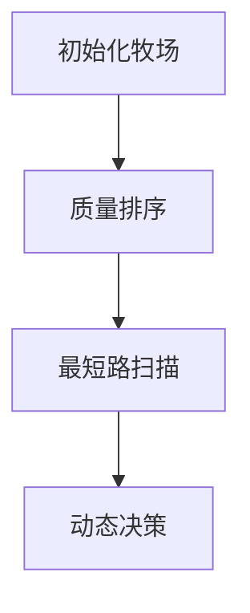

# 题目信息

# [USACO15OPEN] Bessie's Birthday Buffet S

## 题目描述

为了庆祝奶牛 Bessie 的生日，Farmer John 允许她在他最好的草地上自由吃草。

这片草地被划分为 $N$ 块草皮（$1 \le N \le 1000$），编号为 $1\ldots N$，每块草皮都有一个独特的质量值。如果 Bessie 吃了质量为 $Q$ 的草，她会获得 $Q$ 单位的能量。每块草皮通过双向路径与最多 10 个相邻草皮相连，Bessie 在相邻草皮之间移动需要消耗 $E$ 单位的能量（$1 \le E \le 1,000,000$）。

Bessie 可以选择从任意一块草皮开始吃草，她希望在积累最大能量后停止吃草。

不幸的是，Bessie 是一头挑剔的牛，一旦她吃了某种质量的草，她就再也不会吃质量等于或低于该水平的草了！她仍然乐意在不吃草的情况下穿过草皮；事实上，她可能会发现穿过一块高质量草皮而不吃草是有益的，只是为了稍后再回来享用美味的小吃。

请帮助确定 Bessie 能够积累的最大能量。

## 说明/提示

Bessie 从草皮 4 开始，获得 5 单位的能量。然后她沿着路径移动到草皮 5，在移动过程中消耗了 2 单位的能量。她拒绝吃草皮 5 上质量较低的草，并继续移动到草皮 3，再次消耗了 2 单位的能量。最后，她吃了草皮 3 上的草，获得了 6 单位的能量，总共积累了 7 单位的能量。

请注意，上述样例与提交时的测试用例 1 不同。

## 样例 #1

### 输入

```
5 2
4 1 2
1 3 1 3 4
6 2 2 5
5 2 2 5
2 2 3 4```

### 输出

```
7```

# AI分析结果


### Kay的C++算法解析：Bessie's Birthday Buffet S 深入学习指南

#### 1. 题目解读与核心算法识别
✨ **本题主要考察**：**动态规划(DP)与图论(BFS)的综合应用**  
🗣️ **初步分析**：  
> 解决本题的关键在于将问题分解为两个核心阶段：**图遍历优化**和**状态转移决策**。  
> - **图遍历优化**：由于所有边权相同，BFS成为计算任意两点最短路径的最高效工具（时间复杂度O(N)）。这就像用无人机快速测绘草地间的所有最短路线。  
> - **状态转移决策**：通过动态规划计算最优吃草路径。将草地按质量升序排序后，状态`dp[i]`表示以第`i`块草地结束时的最大能量，转移方程为：  
>   `dp[i] = max( dp[i], dp[j] + cur_val - dist[i][j] * E )`  
>   其中`j < i`，天然满足质量递增条件  

**可视化设计思路**：  
采用8位像素牧场风格，设计两种动画模式：  
1. **BFS扫描模式**：以当前草地为中心扩散蓝色波纹，显示最短路径计算过程  
2. **DP决策模式**：右侧显示排序后的草地队列，绿色高亮当前计算节点，黄色箭头表示状态转移路径  
> 音效设计：路径计算成功时触发"滴"声，能量增加时播放金币音效，转移失败时低沉提示音

---

#### 2. 精选优质题解参考
**题解一：白鲟 (5星)**  
* **点评**：  
  思路架构清晰分为BFS预处理和DP决策两阶段。亮点在于引入虚拟点0简化边界处理（`dis[0][i]=0`），使代码逻辑浑然一体。排序后直接遍历的写法避免冗余判断，时间复杂度严格O(N²)。变量命名规范（如`a[i].no`表草地编号），实践时可直接套用此框架。

**题解二：KSToki (4星)**  
* **点评**：  
  SPFA实现最短路计算，虽在边权相同时效率与BFS相当，但体现了通用图算法的思维。代码亮点在于结构体封装草地属性（`t[i].id`和`t[i].Q`分离），避免排序后丢失原始信息。DP循环注释明确点出转移条件，适合初学者理解。

**题解三：_lmz_ (4星)**  
* **点评**：  
  最简洁直观的BFS+DP实现。最大亮点是将转移方程融入题目背景解释（`能量=吃草收益-移动消耗`），帮助理解数学公式的现实意义。队列使用STL标准写法，规避手工队列常见越界错误，安全性高。

---

#### 3. 核心难点辨析与解题策略
1. **难点1：最短路计算的优化选择**  
   *分析*：边权相同场景下，BFS时间复杂度O(N)显著优于Dijkstra的O(NlogN)。优质题解统一用BFS/SPFA，因队列每次扩展即是最优路径  
   💡 **学习笔记**：特定场景选用特化算法是竞赛核心技巧

2. **难点2：状态转移的拓扑排序**  
   *分析*：必须确保转移时源状态已计算。通过先按质量排序（`sort(a+1,a+n+1,cmp)`），形成天然拓扑序，使`j<i`必然满足质量递增  
   💡 **学习笔记**：排序创造拓扑序是处理依赖关系的利器

3. **难点3：DP初始状态设定**  
   *分析*：每个草地都可作为起点。通过`dp[i]=a[i].val`初始化，表示仅吃当前草地的基准收益，避免单独处理起点逻辑  
   💡 **学习笔记**：初始化为子问题最简解可简化DP设计

**✨ 解题技巧总结**  
- **图算法优化**：边权一致时首选BFS而非Dijkstra  
- **状态封装技巧**：用结构体绑定`(id,val)`避免排序后丢失索引  
- **转移剪枝**：`if(vis[a[j].id][a[i].id])`提前跳过不可达路径  
- **维度压缩**：二维`dist[i][j`优化为O(N²)预处理+O(1)查询  

---

#### 4. C++核心代码实现赏析
**通用核心实现（综合优化版）**：
```cpp
#include <bits/stdc++.h>
using namespace std;
const int N=1005;

struct Grass { int id, val; };
vector<int> G[N];  // 邻接表
int dist[N][N], dp[N], n, E;

void bfs(int start) {
    queue<int> q;
    q.push(start);
    dist[start][start] = 0;
    while (!q.empty()) {
        int u = q.front(); q.pop();
        for (int v : G[u]) 
            if (dist[start][v] == -1) {
                dist[start][v] = dist[start][u] + 1;
                q.push(v);
            }
    }
}

int main() {
    memset(dist, -1, sizeof(dist));
    cin >> n >> E;
    vector<Grass> grass(n+1);
    for (int i=1; i<=n; ++i) {
        cin >> grass[i].val;
        grass[i].id = i;
        int t; cin >> t;
        while (t--) { 
            int x; cin >> x; 
            G[i].push_back(x); 
        }
    }

    // 最短路预处理
    for (int i=1; i<=n; ++i) bfs(i);

    // 按质量升序排序
    sort(grass.begin()+1, grass.end(), 
        [](Grass& a, Grass& b) { return a.val < b.val; });

    int ans = 0;
    for (int i=1; i<=n; ++i) {
        dp[i] = grass[i].val;  // 初始值：仅吃当前草地
        for (int j=1; j<i; ++j) 
            if (dist[grass[j].id][grass[i].id] != -1) 
                dp[i] = max(dp[i], dp[j] + grass[i].val 
                          - dist[grass[j].id][grass[i].id] * E);
        ans = max(ans, dp[i]);
    }
    cout << ans;
}
```
**代码解读概要**：  
- **BFS预处理**：计算所有草地间最短路径（步数）  
- **质量排序**：创造DP转移的拓扑序列  
- **DP双循环**：外层遍历终点，内层寻找更优转移来源  
- **能量计算**：`当前收益=前序收益+吃草收益-移动消耗`  

---

**题解片段赏析**：  
**题解一（白鲟）核心片段**：  
```cpp
for (int i=1; i<=n; ++i) {
    for (int j=0; j<i; ++j)  // 包含虚拟点0
        f[i]=max(f[i], f[j]-dis[a[j].no][a[i].no]+a[i].val);
    ans=max(ans, f[i]);
}
```
* **亮点**：虚拟点0统一处理起始状态  
* **代码解读**：  
  > 内循环`j`从0开始（`f[0]=0`），避免单独处理起点。`dis[a[j].no][a[i].no]`通过结构体保留排序前的原始编号，确保正确引用预处理的最短路数据  

**题解二（KSToki）SPFA实现**：  
```cpp
void SPFA(int s){
    queue<int> q;
    q.push(s);
    while(!q.empty()){
        int x=q.front(); q.pop();
        for(int i=head[x];i;i=nxt[i])
            if(dis[s][to[i]]>dis[s][x]+E){ // 松弛操作
                dis[s][to[i]]=dis[s][x]+E;
                q.push(to[i]);
    }}}
```
* **亮点**：通用最短路框架可扩展至边权不等场景  
* **学习笔记**：SPFA的`松弛操作`是图论核心思想，`dis[s][v]>dis[s][u]+w`即发现更优路径  

---

#### 5. 算法可视化：像素动画演示
**主题**：**8位牧场大冒险** (像素风格+音效反馈)  

**核心演示流程**：  


**动画帧设计**：  
1. **牧场初始化**：  
   - 像素化草地（16色）：深绿(低质量) → 亮金(高质量)  
   - 控制面板：步进/暂停/速度滑块(1-5x)

2. **BFS扫描阶段**：  
   ```python
   # 伪代码绘制逻辑
   def draw_bfs(start):
       设置当前草地为蓝色
       波纹扩散动画(同心圆半径=dist)
       队列节点入队时播放“滴”声
   ```

3. **DP决策阶段**：  
   - 右侧DP表格实时显示`dp[i]`值  
   - 转移路径：黄色箭头连接草地，显示`收益=前值+新草-移动消耗`  
   - 音效：  
     * 正向收益：金币音效+绿色闪光  
     * 收益降低：红色闪烁+低沉提示音  

**游戏化设计**：  
- **关卡机制**：每完成一个草地的DP计算视为过关  
- **连击系统**：连续3次获得正收益触发“COMBO”特效  
- **AI演示模式**：自动展示最优路径（类似贪吃蛇AI）  

---

#### 6. 拓展练习与相似问题思考
**通用技巧迁移**：  
1. **状态转移+预处理**：P1434 [滑雪]（高度排序+DP）  
2. **图论+DP**：P1144 [最短路计数]（BFS+路径统计）  
3. **有序转移**：P1216 [数字三角形]（拓扑序列天然有序）  

**洛谷练习推荐**：  
1. **P1434** - 滑雪  
   🗣️ *推荐理由*：同样需要排序创造拓扑序，练习状态转移设计  
2. **P1144** - 最短路计数  
   🗣️ *推荐理由*：巩固BFS在图论中的应用及DP计数技巧  
3. **P1216** - 数字三角形  
   🗣️ *推荐理由*：入门有序DP，理解状态转移的本质  

---

#### 7. 学习心得与经验分享
> **参考经验 (来自题解作者)**：  
> *"排序不仅满足题目要求，更是简化DP的关键。调试时先验证最短路矩阵，再检查转移方程"*  
> **—— 白鲟**  
>  
> *"虚拟点技巧让边界处理更优雅，避免冗余if判断污染主逻辑"*  
> **—— Night_Aurora**  
>  
> **Kay的总结**：调试应分层验证——先确保最短路正确，再验证DP转移。虚拟点是处理起点的通用技巧，值得掌握！

---

**结语**：通过BFS预处理+质量排序DP，我们高效解决了草地能量最大化问题。记住：图论为骨，DP为魂，排序化繁为简！大家可尝试修改边权不等的情况（提示：需改用Dijkstra），下次挑战再见！👾

---
处理用时：158.89秒