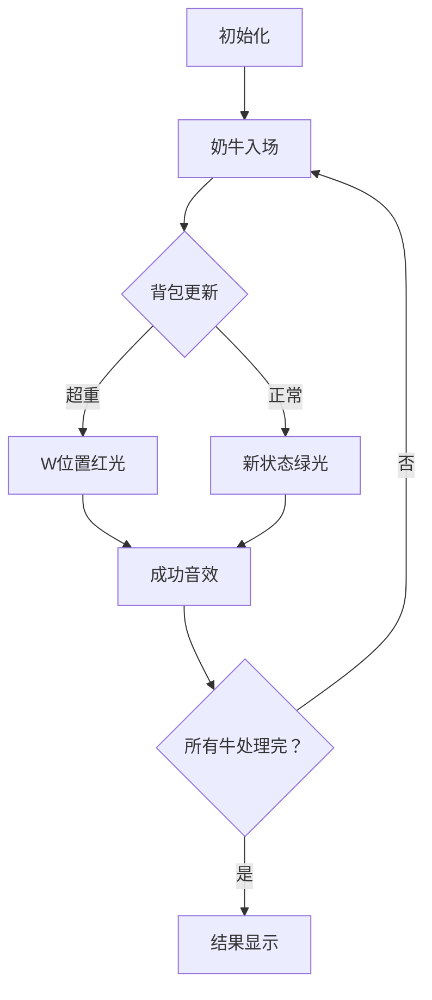

# 题目信息

# [USACO18OPEN] Talent Show G

## 题目描述

Farmer John 要带着他的 $n$ 头奶牛，方便起见编号为 $1\ldots n$，到农业展览会上去，参加每年的达牛秀！他的第 $i$ 头奶牛重量为 $w_i$，才艺水平为 $t_i$，两者都是整数。

在到达时，Farmer John 就被今年达牛秀的新规则吓到了：

（一）参加比赛的一组奶牛必须总重量至少为 $W$（这是为了确保是强大的队伍在比赛，而不仅是强大的某头奶牛），并且。

（二）总才艺值与总重量的比值最大的一组获得胜利。

FJ 注意到他的所有奶牛的总重量不小于 $W$，所以他能够派出符合规则（一）的队伍。帮助他确定这样的队伍中能够达到的最佳的才艺与重量的比值。

## 说明/提示

#### 样例解释

在这个例子中，总体来看最佳的才艺与重量的比值应该是仅用一头才艺值为 $11$、重量为 $10$ 的奶牛，但是由于我们需要至少 $15$ 单位的重量，最优解最终为使用这头奶牛加上才艺值为 $21$、重量为 $20$ 的奶牛。这样的话才艺与重量的比值为 $\frac{11+21}{10+20}=\frac{32}{30} = 1.0666\dots$，乘以 $1000$ 向下取整之后得到 $1066$。

#### 数据规模与约定

对于全部的测试点，保证 $1 \leq n \leq 250$，$1 \leq W \leq 1000$，$1 \leq w_i \leq 10^6$，$1 \leq t_i \leq 10^3$。

## 样例 #1

### 输入

```
3 15
20 21
10 11
30 31```

### 输出

```
1066
```

# AI分析结果


### 💡 Kay的C++算法解析：Talent Show G 深入学习指南 💡

#### 1. 题目解读与核心算法识别
✨ **本题主要考察**：01分数规划 + 背包DP

🗣️ **初步分析**：
> 这道题要求选择奶牛使总重量≥W时，总才艺/总重量的比值最大。01分数规划就像"性价比测试器"：我们猜测一个比值x，验证是否存在方案满足Σ(tᵢ - wᵢx)≥0。通过二分x，我们将比值问题转化为可计算的判定问题。背包DP则处理重量限制：f[j]表示总重为j时的最大贡献，更新时巧妙地将超重状态压缩到W位置。

- **核心难点**：处理"至少W重量"的限制和避免浮点精度问题
- **可视化设计**：将用像素网格表示背包状态（0-W），奶牛作为像素道具加入背包时高亮当前状态格子，状态更新时显示数值变化，超重时W位置闪烁红光
- **游戏化元素**：8-bit音效（加入奶牛"哞"，更新成功"叮"），闯关模式（每头牛是一关），自动演示模式展示最优解寻找过程

---

#### 2. 精选优质题解参考
**题解一（瞬闪影）**
* **点评**：思路清晰解释了01分数规划原理（将比值问题转化为独立贡献），代码简洁高效（背包状态压缩处理超重），变量命名合理（w/t直观看懂），实践价值高（可直接用于竞赛）。亮点：贡献值计算t[i]-(long long)w[i]*z避免浮点误差。

**题解二（zhmshitiancai）**
* **点评**：推导严谨（分步展示公式变形），代码规范（注释完整），算法标准（二分+背包）。亮点：显式分支处理超重状态（if(j+w[i]≥W)），增强可读性。

**题解三（Parabola）**
* **点评**：理论深入（给出01分数规划严格证明），代码健壮（精度控制eps=1e-5）。亮点：强调浮点问题调试经验，对理解算法本质很有帮助。

---

#### 3. 核心难点辨析与解题策略
1. **难点：比值问题转化为可计算形式**
   * **分析**：通过设答案x，原问题转化为判定Σ(tᵢ - wᵢx)≥0。关键变量x通过二分逼近，贡献值独立化使贪心/DP可行
   * 💡 **学习笔记**：二分答案是将优化问题转化为判定问题的通用技巧

2. **难点：动态规划处理重量限制**
   * **分析**：背包状态f[j]表示总重j时的最大贡献。更新时用min(j+w[i],W)压缩超重状态，确保复杂度O(nW)
   * 💡 **学习笔记**：状态压缩是处理背包容量上限的有效手段

3. **难点：精度控制与整数优化**
   * **分析**：将t[i]乘以1000转化为整数运算避免浮点误差（t[i]*1000 - w[i]*x），二分在整数域进行
   * 💡 **学习笔记**：扩大数值+整数运算是保证精度的实用技巧

### ✨ 解题技巧总结
- **技巧1：问题转化** - 识别比值最大化特征→01分数规划模型
- **技巧2：状态压缩** - 用min(W,j+w[i])处理"至少W"条件
- **技巧3：精度防护** - 关键计算使用整数运算(t[i]*1000)
- **技巧4：调试验证** - 打印中间贡献值验证二分正确性

---

#### 4. C++核心代码实现赏析
**通用核心实现参考**
```cpp
#include <cstdio>
#include <cstring>
#include <algorithm>
using namespace std;
typedef long long ll;
const int MAXN=255, MAXW=1005;

int n, W, w[MAXN], t[MAXN];
ll f[MAXW]; // f[j]：总重j时的最大贡献值

bool check(ll x) {
    memset(f, 0x80, sizeof(f)); // 初始化为极小值
    f[0] = 0;
    for(int i=1; i<=n; i++) {
        for(int j=W; j>=0; j--) {
            if(f[j] == 0x8080808080808080) continue; // 跳过未更新状态
            int nxt = min(W, j + w[i]); // 关键：超重状态压缩
            f[nxt] = max(f[nxt], f[j] + (ll)t[i]*1000 - w[i]*x);
        }
    }
    return f[W] >= 0; // 验证解
}

int main() {
    scanf("%d%d", &n, &W);
    for(int i=1; i<=n; i++) scanf("%d%d", &w[i], &t[i]);
    
    ll L=0, R=250000000LL; // 二分边界
    while(L < R) {
        ll mid = (L+R+1)>>1;
        if(check(mid)) L = mid;
        else R = mid-1;
    }
    printf("%lld\n", L);
    return 0;
}
```
**代码解读概要**：通过二分猜测比值x，check函数用背包DP验证。关键点：贡献值计算(t[i]*1000 - w[i]*x)避免浮点，状态压缩(min(W,j+w[i]))处理超重。

**题解片段赏析**：
1. **瞬闪影（状态压缩）**
   ```cpp
   int jj = j + w[i]; 
   jj = min(jj, W);  // 超重状态压缩到W
   f[jj] = max(f[jj], f[j] + t[i] - (long long)w[i]*mid);
   ```
   * **亮点**：简洁处理超重状态
   * **学习笔记**：min操作将复杂约束转化为标准背包

2. **zhmshitiancai（显式分支）**
   ```cpp
   if(j + w[i] >= W) 
       dp[W] = max(dp[W], dp[j] + c[i]);  // 超重分支
   else 
       dp[j+w[i]] = max(...);             // 正常更新
   ```
   * **亮点**：条件分支增强可读性
   * **学习笔记**：显式处理边界条件使逻辑更清晰

3. **Parabola（精度控制）**
   ```cpp
   const double eps = 1e-5;
   while(r - l > eps) {  // 浮点二分精度控制
       if(check(mid)) l = mid;
       else r = mid - eps;
   }
   ```
   * **亮点**：eps防止浮点死循环
   * **学习笔记**：设置合理精度确保算法终止

---

#### 5. 算法可视化：像素动画演示
**主题**：奶牛牧场大冒险（8-bit像素风格）

**核心演示**：背包DP状态更新过程

**动画设计**：


**关键帧实现**：
1. **像素场景**：16色FC风格网格，x轴（0-W背包容量），y轴（奶牛序号）
2. **奶牛加入**：像素奶牛图标从左侧入场，播放"哞"声
3. **状态更新**：
   - 当前状态格子闪烁黄光
   - 新状态格子：若更新成功变绿+显示贡献值，失败变灰
   - 超重时W位置闪烁红光，播放"警告"音效
4. **控制面板**：
   - 步进/自动模式（速度滑块）
   - 实时显示当前二分区间和贡献值
5. **游戏化元素**：
   - 每头牛是1关，过关得星（基于贡献值）
   - 最终评级：S（>0.9x最优）、A、B、C
   - 胜利动画：牧场放烟花+8-bit胜利音乐

---

#### 6. 拓展练习
1. **通用技巧迁移**：01分数规划适用于
   - 最优比率生成树（P4952 八纵八横）
   - 最优比率环（P3199 [HNOI2009]最小圈）
   - 最大密度子图

2. **洛谷推荐**：
   - **P1577 切绳子**：分数规划基础应用
   - **P1730 最小密度路径**：分数规划+最短路
   - **P4952 八纵八横**：分数规划+生成树进阶

---

#### 7. 学习心得
> **瞬闪影的经验**："贪心看似可行实则陷阱，必须用分数规划转化"
> 
> **Kay点评**：验证了"没有银弹"原则——不同问题需要匹配特定算法范式。遇到比值问题要优先考虑分数规划转化

---

掌握01分数规划+背包DP的组合拳，你就能优雅解决这类比值优化问题！下次遇到类似挑战时，记得：二分转化找答案，背包压缩破限制。加油！🚀

---
处理用时：157.49秒