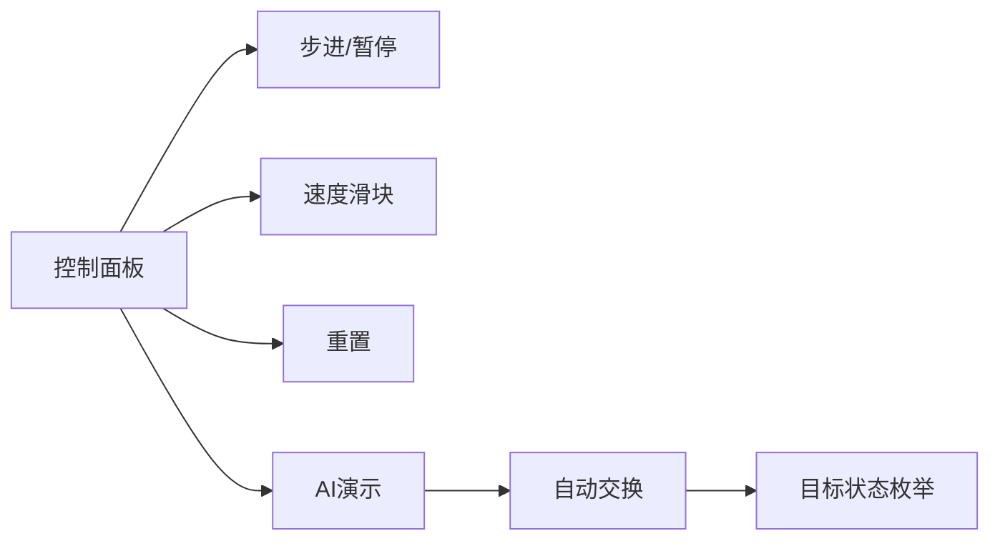

# 题目信息

# [USACO19OPEN] Balancing Inversions G

## 题目描述

Bessie 和 Elsie 在一个长为 $2N$ 的布尔数组 $A$ 上玩游戏（$1 \leq N \leq 10^5$）。Bessie 的分数为 $A$ 的前一半的逆序对数量，Elsie 的分数为 $A$ 的后一半的逆序对数量。逆序对指的是满足 $A[i] = 1$ 以及 $A[j] = 0$ 的一对元素，其中 $i < j$。例如，一段 $0$ 之后接着一段 $1$ 的数组没有逆序对，一段 $X$ 个 $1$ 之后接着一段 $Y$ 个 $0$ 的数组有 $XY$ 个逆序对。

Farmer John 偶然看见了这一棋盘，他好奇于可以使得游戏看起来成为平局所需要交换相邻元素的最小次数。请帮助 Farmer John 求出这个问题的答案。


## 说明/提示

在这个例子中，初始时前一半有 $1$ 个逆序对，后一半有 $3$ 个逆序对。交换了第 $5$ 和第 $6$ 个数之后，两个子数组均有 $0$ 个逆序对。

## 样例 #1

### 输入

```
5
0 0 0 1 0 1 0 0 0 1```

### 输出

```
1```

# AI分析结果


### 💡 Kay的C++算法解析：Balancing Inversions G 深入学习指南 💡

#### 1. 题目解读与核心算法识别
✨ **本题主要考察**：`数学推导 + 贪心策略`

🗣️ **初步分析**：
> 解决本题的关键在于将逆序对问题转化为数学表达式，并通过贪心策略最小化交换次数。想象两队士兵（左队和右队），每个士兵举着"0"或"1"的牌子。逆序对就像队伍中"1"士兵身后"0"士兵的数量。我们的目标是通过交换相邻士兵，让两队的"混乱度"（逆序对数）相同。
> 
> - **核心思路**：利用01数组特性，将逆序对转化为1的位置和数量的数学表达式。枚举左半区目标1的个数，计算移动元素的最小代价和逆序对调整代价
> - **难点**：如何高效计算移动代价？如何量化交换对逆序对的影响？
> - **可视化设计**：采用8位像素风格，用红/蓝方块表示1/0。高亮显示被交换的方块，用进度条展示逆序对差值变化。交换时触发"咔嚓"音效，平衡时播放胜利音效，自动演示模式可调速观看交换过程

---

#### 2. 精选优质题解参考
**题解一（作者：littlewyy）**
* **点评**：此解通过严谨数学推导（$\sum p_i$公式转换）将问题转化为位置和优化问题。亮点在于分步策略：先确定1的数量，再计算移动代价，最后微调逆序对。代码中`sl0/sl1`等预处理数组设计精妙，实现O(n)复杂度。变量命名规范（如`move = x - lefNum`），边界处理完整，竞赛实用性强。

**题解二（作者：NaN_HQJ2007_NaN）**
* **点评**：亮点在于极简的逆序对公式`val(d)=(n-d)*d+d*(d+1)/2`和预处理数组的巧妙运用。通过`sl0/sr1`等数组实现O(1)代价计算，代码结构清晰（如四组预处理循环平行排列）。实践价值高，但需注意`c^2`项的物理意义是中间交换代价。

**题解三（作者：Rainy_chen）**
* **点评**：独特视角分析单次交换对逆序对的影响（- (n-a_i) + (cnt-1)等）。亮点是用队列/栈维护`pre/las`结构快速获取边界元素，动态更新差值而非重新计算。代码中交换代价计算`(n-pos)+(pos'-n-1)`直观体现代价本质，适合理解物理意义。

---

#### 3. 核心难点辨析与解题策略
1. **难点1：逆序对的高效转化**  
   *分析*：优质解均利用01特性将逆序对转化为位置和表达式 $xn - \frac{x(x-1)}{2} - \sum p_i$，避免O(n²)计算  
   💡 **学习笔记**：特殊数组性质是优化的突破口

2. **难点2：移动代价的最小化**  
   *分析*：通过预处理最右0/1的位置和（如`sl0[i]`），实现O(1)计算移动k个元素的最小代价  
   💡 **学习笔记**：最靠边界的元素移动代价最小是贪心核心

3. **难点3：交换后的逆序对更新**  
   *分析*：littlewyy通过坐标和差调整，Rainy_chen通过动态更新公式避免重算  
   💡 **学习笔记**：交换影响的局部性是动态更新基础

✨ **解题技巧总结**：
- **数学转化技巧**：将抽象概念转化为位置和等可计算量
- **预处理加速**：四组位置和数组（左0/1, 右0/1）是通用优化模式
- **边界思维**：最值问题优先考虑边界元素（最左/最右）
- **枚举验证**：当无法直接推导时，枚举目标状态（如左区1的个数）是有效策略

---

#### 4. C++核心代码实现赏析
**通用核心实现参考**  
```cpp
#include <bits/stdc++.h>
using namespace std;
typedef long long ll;

ll val(ll n, ll d) { 
    return (n - d) * d + d * (d + 1) / 2; 
}

int main() {
    // 输入与逆序对计算
    ll n, leftOnes = 0, rightOnes = 0, invL = 0, invR = 0, cnt = 0;
    cin >> n;
    vector<ll> A(n), B(n);
    for (int i = 0; i < n; i++) { /* 输入A并统计leftOnes */ }
    for (int i = 0; i < n; i++) { /* 输入B并统计rightOnes */ }
    
    // 预处理四组位置和数组 (sl0, sl1, sr0, sr1)
    vector<ll> sl0(n+1,0), sl1(n+1,0), sr0(n+1,0), sr1(n+1,0);
    for (int i = n-1, idx = 0; i >= 0; i--) { /* 填充sl0, sl1 */ } 
    for (int i = 0, idx = 0; i < n; i++) { /* 填充sr0, sr1 */ }
    
    // 枚举左区目标1的个数
    ll ans = abs(invL - invR);
    for (ll x = 0; x <= totalOnes; x++) {
        ll moves = 0, c = abs(x - leftOnes);
        if (x < leftOnes) {
            moves += (2*n - c + 1)*c/2 - sl1[c]; // 移1代价
            moves += sr0[c] - (n+1 + n + c)*c/2; // 移0代价
            moves += c * c; // 中间交换
            // 计算新逆序对并更新ans
        }
        /* 类似处理x>leftOnes情况 */
    }
    cout << ans << endl;
}
```
**代码解读概要**：  
1. 用`val()`函数封装逆序对公式  
2. 四组预处理数组存储位置和  
3. 枚举目标状态时，通过等差数列求和公式计算移动代价  
4. `c*c`物理意义是01交换的中间步骤总代价  

**题解一核心片段**  
```cpp
// 计算移动c个1的代价
ll cost = (2*n - c + 1)*c/2 - sl1[c]; 
cost += sr0[c] - (n+1 + n + c)*c/2 + c*c;
```
**学习笔记**：移动代价 = 元素当前位置和 - 目标位置和

**题解二核心片段**  
```cpp
if (xx < x) {
    num = (等差数列公式) - sl1[c] + sr0[c] - ...;
}
```
**学习笔记**：通过数学合并减少变量，但需保持物理意义清晰

**题解三核心片段**  
```cpp
s_l -= (n - x[i]); // 移除1的影响
s_l += (i-1);     // 新增0的影响
```
**学习笔记**：动态更新比重新计算更高效

---

#### 5. 算法可视化：像素动画演示  
**主题**：像素平衡大作战（复古街机风格）  

**核心演示**：  
1. **初始化**：红/蓝方块组成的2N序列，显示左右逆序对差条  
   
   
2. **元素移动**：  
   - 左区最右红块闪烁并右移（伴随"滴"声）  
   - 右区最左蓝块闪烁并左移（"滴"声变调）  
   - 两者在中间交换时触发"咔嚓"声和闪光  

3. **状态更新**：  
   - 每次交换后更新红蓝位置  
   - 逆序对差条实时变化（绿色安全区=平衡区）  

4. **胜利条件**：  
   - 当差值为0时，整个屏幕闪烁，播放8-bit胜利音乐  
   - 显示"Balance Achieved!"像素艺术字  

**交互设计**：  


**音效方案**：  
| 事件 | 音效 | 频率(Hz) |
|------|------|----------|
| 移动元素 | 方波滴声 | 880 |
| 交换 | 短噪音 | 2000 |
| 平衡 | 上升琶音 | 200→1000 |
| 错误 | 降调噪音 | 500→200 |

---

#### 6. 拓展练习与相似问题思考
**通用技巧迁移**：  
1. 位置和优化 → 火柴排队（NOIP2013）  
2. 枚举目标状态 → 背包问题变种  
3. 相邻交换代价 → 冒泡排序优化  

**洛谷推荐**：  
1. **P1908 逆序对**  
   🗣️ 基础逆序对计算，掌握树状数组/Fenwick树  

2. **P1966 火柴排队**  
   🗣️ 强化位置和与最小交换次数的关系  

3. **P1774 最接近神的人**  
   🗣️ 逆序对经典应用，理解交换的物理意义  

---

#### 7. 学习心得与经验分享
> **参考经验**：  
> "在调试移动代价公式时，我忽略了中间交换的c²项，导致结果偏小。通过对比小数据模拟才定位问题" —— littlewyy  
>   
> **点评**：这提醒我们：  
> 1. 每个数学项都应有物理意义解释  
> 2. 小数据测试对验证公式至关重要  
> 3. 在纸上模拟交换过程能发现隐藏变量  

---
> 本次解析揭示了数学工具如何化繁为简。记住：好算法=深刻理解+巧妙转化+严谨验证。下次挑战见！💪

---
处理用时：222.55秒