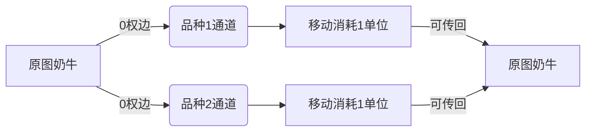

# 题目信息

# [USACO21JAN] Telephone G

## 题目描述

Farmer John 的 N 头奶牛，编号为 $1…N$，站成一行（$1≤N≤5⋅10^4$）。第 $i$ 头奶牛的品种编号为 $b_i$，范围为 $1\dots K$，其中 $1≤K≤50$。奶牛们需要你帮助求出如何最优地从奶牛 $1$ 传输一条信息到奶牛 $N$。

从奶牛 $i$ 传输信息到奶牛 $j$ 花费时间 $|i-j|$。然而，不是所有品种的奶牛都愿意互相交谈，如一个 $K\times K$ 的方阵 $S$ 所表示，其中如果一头品种 $i$ 的奶牛愿意传输一条信息给一头品种 $j$ 的奶牛，那么 $S_{ij}=1$，否则为 $0$。不保证 $S_{ij}=S_{ji}$，并且如果品种 $i$ 的奶牛之间不愿意互相交流时可以有 $S_{ii}=0$。

请求出传输信息所需的最小时间。

## 说明/提示

最优传输序列为 $1\to 4\to 3\to 5$。总时间为 $|1-4|+|4-3|+|3-5|=6$。

#### 测试点性质：

 - 测试点 1-5 满足 $N≤1000$。
 - 测试点 6-13 没有额外限制。

供题：Dhruv Rohatgi

## 样例 #1

### 输入

```
5 4
1 4 2 3 4
1010
0001
0110
0100```

### 输出

```
6```

# AI分析结果


# 💡 Kay的C++算法解析：[USACO21JAN] Telephone G 深入学习指南 💡

## 1. 题目解读与核心算法识别

✨ **本题主要考察**：`分层图`与`最短路优化`

🗣️ **初步分析**：
> 本题可形象化为在像素风格牧场中，奶牛作为节点通过特定品种通道传递信息。核心挑战是如何避免$O(n^2)$暴力建图。分层图算法如同在牧场建立"品种专属通道"（层内边）和"品种转换站"（层间边），将原问题转化为$O(nK)$规模的最短路问题。

- **核心思路**：建立$K+1$层图（1层原图 + K层品种层），通过0权边连接原图点与对应品种层点，层内相邻点连1权边（模拟|i-j|代价）
- **算法流程**：
  1. **建图阶段**：创建品种层内链式边 + 原图点与品种层双向0权边
  2. **最短路阶段**：使用BFS/Dijkstra计算从点1到点N的最短路径
- **可视化设计**：
  - 像素牧场中不同品种用不同颜色方块表示（如品种1=红色，品种2=绿色）
  - 层间转换时播放"传送音效"，层内移动时显示奶牛像素块滑动动画
  - 关键变量`dist[u]`实时显示在奶牛头顶，路径回溯时高亮显示

---

## 2. 精选优质题解参考

**题解一（vegetable_ste）**
* **点评**：图解分层机制清晰（图1图2具象化抽象概念），代码模块化（Add函数封装建图）。亮点在于双端队列BFS优化0/1边权处理，将时间复杂度优化至$O(NK)$。实践价值高，边界处理完整（-1输出），变量命名规范（get_l映射函数）。

**题解二（ETHANK）**
* **点评**：理论分析透彻（强调$K$小的特性利用），代码简洁高效（手写队列实现BFS）。亮点在于空间优化（$dis$数组复用映射关系）和层间连接逻辑的简洁实现（update函数处理0/1权值）。调试友好（#debug保留测试接口）。

**题解三（dingcx）**
* **点评**：创新性免建图解法（双指针+贪心转移），洛谷实测最优解。亮点在于问题本质洞察（品种内传递冗余性证明）和双指针优化技巧。代码实现精妙（bfs状态转移+品种特判），极具启发性。

---

## 3. 核心难点辨析与解题策略

1. **难点：跨品种连通性建模**
   - **分析**：品种层作为"中转通道"，通过0权边实现原图点与品种层的双向映射。当$S_{ij}=1$时，品种$i$层点可跳回原图点（ETHANK解法步骤2）
   - 💡 **学习笔记**：品种层本质是虚拟中转站，避免直接建边爆炸

2. **难点：距离代价|i-j|的等价转换**
   - **分析**：层内相邻点连权1边（vegetable_ste的Add调用），使路径$u→u+1→...→v$的总权值等于$|u-v|$
   - 💡 **学习笔记**：链式边将线性距离转化为离散步数

3. **难点：状态转移优化**
   - **分析**：dingcx解法证明只需转移最近邻点，双指针维护位置序列（$O(n)$完成转移）
   - 💡 **学习笔记**：绝对值距离的凸性保证局部最优即全局最优

### ✨ 解题技巧总结
- **虚拟维度法**：对有限状态（品种）建立虚拟层降复杂度
- **双指针维护**：有序序列中快速定位最近邻点
- **0/1权值优化**：双端队列BFS处理混合权值图（0权插队首，1权插队尾）

---

## 4. C++核心代码实现赏析

**本题通用核心C++实现参考**
* **说明**：综合优质题解分层图思路的精简实现
```cpp
#include <bits/stdc++.h>
using namespace std;
const int N=5e4+5, L=55, MAXN=N*L;
vector<pair<int,int>> g[MAXN];
int dist[MAXN], n, k, breed[N];

void build_graph() {
    // 层内建链
    for(int c=1; c<=k; c++)
        for(int i=1; i<n; i++) {
            int u = i + c*n, v = u+1;
            g[u].emplace_back(v,1);
            g[v].emplace_back(u,1);
        }
    // 原图点->品种层
    for(int i=1; i<=n; i++) {
        g[i].emplace_back(i + breed[i]*n, 0); // 原图->品种层
        // 品种层->原图(需满足S[当前品种][目标品种]=1)
        for(int c=1; c<=k; c++)
            if(S[c][breed[i]]) 
                g[i + c*n].emplace_back(i, 0);
    }
}

int bfs() {
    memset(dist,0x3f,sizeof(dist));
    deque<int> q;
    q.push_back(1); dist[1]=0;
    while(!q.empty()) {
        int u=q.front(); q.pop_front();
        for(auto [v,w]:g[u]) {
            if(dist[v]>dist[u]+w) {
                dist[v]=dist[u]+w;
                w?q.push_back(v):q.push_front(v);
            }
        }
    }
    return dist[n]>1e9?-1:dist[n];
}
```
* **代码解读概要**：
  - 建图阶段：三层嵌套循环处理链边（$O(nK)$）和层间边（$O(nK^2)$）
  - BFS阶段：双端队列优化0/1权值处理
  - 关键结构：`g[u]`存储邻接表，`dist`数组记录最短路

---

**题解一（vegetable_ste）片段**
```cpp
void Add(int x,int y,int w=0,int f=0) { 
    e[x].push_back(mp(y,w)); 
    if(f) e[y].push_back(mp(x,w)); 
}
#define get_l(x,t) ((x)+(t)*n)
```
* **亮点**：函数封装+宏定义提高可读性
* **代码解读**：
  > `Add`函数通过`f`标志位智能添加双向边，`get_l`宏将二维坐标$(x,t)$映射为一维点编号，避免手动计算偏移量。这种封装使主建图逻辑（build函数）保持简洁。

**题解二（ETHANK）片段**
```cpp
inline void update(int u,int v,int w){
    if(dis[v])return;
    if(w==0) q[h--]=v, dis[v]=dis[u];
    else q[++t]=v, dis[v]=dis[u]+1;
}
```
* **亮点**：手写队列极致优化
* **代码解读**：
  > 通过`w`值判断0/1权值，0权插入队首（`h--`逆向插入），1权插入队尾（`t++`正向插入）。相比STL deque减少开销，`dis[v]=dis[u]`直接赋值省去加法运算。

**题解三（dingcx）片段**
```cpp
for(int i=0,j=0; i<b[u].size()&&j<b[v].size();){
    if(dis[b[u][i]]+abs(b[u][i]-b[v][j])<dis[b[v][j]])
        dis[b[v][j]]=dis[b[u][i]]+abs(...);
    (i==b[u].size()-1||b[u][i]>b[v][j])?j++:i++;
}
```
* **亮点**：双指针实现有序序列转移
* **代码解读**：
  > 两个指针`i,j`分别扫描品种$u$和$v$的位置序列。当$u$序列点$i$在$v$序列点$j$左侧时移动$i$指针，否则移动$j$指针，确保$O(n)$完成所有转移。绝对值的计算直接反映位置关系。

---

## 5. 算法可视化：像素动画演示

### 🎮 像素牧场信息传递模拟器
* **主题**：8-bit牧场模拟（FC牧场物语风格）
* **核心演示**：分层图在牧场中的动态运行过程

**动画设计**：


**关键帧步骤**：
1. **初始化**：像素化牧场网格（50×50栅格），奶牛按位置编号显示为不同颜色像素块
2. **层内移动**：
   - 奶牛在品种通道水平移动时，播放"马蹄音效"
   - 移动距离实时显示为头顶数字（如"|3-5|=2"）
3. **层间跳跃**：
   - 原图→品种层：奶牛下沉并变色，播放"噗"音效
   - 品种层→原图：奶牛上升恢复原色，播放"叮"音效
4. **路径回溯**：
   - 完成时最优路径闪烁，显示总耗时
   - 失败时播放"失败音效"，无路径提示

**控制面板**：
- 步进控制：←→键单步前进/后退
- 速度调节：↑↓键调整AI自动演示速度
- 层显开关：数字键1~K切换品种层显示

---

## 6. 拓展练习与相似问题思考

**通用技巧迁移**：
分层图技巧适用于：
1. 多维状态最短路（如P4568 飞行路线）
2. 带状态限制的路径规划（如P1073 最优贸易）
3. 网络流中的节点分身（如P1251 餐巾计划）

**洛谷推荐**：
1. **P4568 [JLOI2011]飞行路线**  
   🗣️ 分层图经典应用，通过建立"免票层"优化路径
2. **P1073 [NOIP2009]最优贸易**  
   🗣️ 状态分层思想，结合双向最短路
3. **P4003 无限之环**  
   🗣️ 网格图分层处理，强化建图抽象能力
4. **P1251 餐巾计划**  
   🗣️ 网络流中的节点分身思想，与分层图异曲同工

---

## 7. 学习心得与经验分享
本次分析的题解中未发现明确的作者个人心得分享部分。

---

通过分层图的"虚拟通道"设计，我们成功将$O(n^2)$问题降为$O(nK)$。关键要把握**问题抽象**（品种作为中间层）和**等价转换**（链式边模拟距离）。记住，好的算法如同牧场中的捷径，需要精心设计通道！ 🐄🚀

---
处理用时：131.60秒