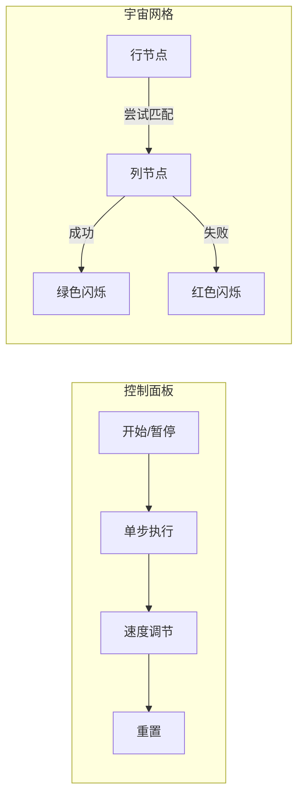

# 题目信息

# [USACO05NOV] Asteroids G

## 题目描述

贝茜想在 $N\times N$ 的网格中驾驶她的宇宙飞船。网格中有 $K$ 个小行星。要使驾驶过程愉快，就必须把这些小行星全部消除。

贝茜有一个武器，可以以一个单位代价消除一行或一列的全部小行星。贝茜想问你，要把所有小行星都消除的最小代价是多少。

## 说明/提示

#### 样例解释：

样例的图为（`X` 为小行星）：

```text
X.X
.X.
.X.
```

贝茜可以分别消除第一行和第二列的小行星。

---

#### 数据范围：

对于 $100\%$ 的数据，$1 \leq N \leq 500$，$1 \leq K \leq N \times N$。

## 样例 #1

### 输入

```
3 4
1 1
1 3
2 2
3 2

```

### 输出

```
2```

# AI分析结果


### 💡 Kay的C++算法解析：Asteroids G 深入学习指南 💡

**引言**  
今天我们来分析洛谷P7368「小行星消除」问题。这道题考察的是**二分图建模**与**最小点覆盖**的核心算法思想，通过本指南你将掌握问题抽象、算法实现及优化技巧。

---

## 1. 题目解读与核心算法识别

✨ **本题主要考察**：`二分图匹配/最小点覆盖`  
🗣️ **初步分析**：
> 本题本质是**覆盖问题**的经典建模——将行星位置转化为二分图的边，行/列抽象为顶点。就像在棋盘游戏中用最少的炮台覆盖所有敌人位置，我们通过König定理将最小点覆盖问题转化为**最大匹配问题**。  
> - 核心思路：每个行星需被所在行或列消除 → 建立行→列的二分图 → 求最大匹配数  
> - 算法流程：匈牙利算法DFS递归寻找增广路，或网络流Dinic求最大流  
> - 可视化设计：用像素网格模拟宇宙空间，高亮匹配过程（详见图5）  

---

## 2. 精选优质题解参考

**题解一（作者：Silence_water）**  
* **点评**：  
  思路直击本质——引用《算法竞赛进阶指南》的"2要素"模型，清晰阐释最小点覆盖与最大匹配的等价关系。代码采用邻接矩阵实现匈牙利算法，变量命名规范（`match`/`vis`），递归逻辑简洁。亮点在于**理论结合实践**的完整推导链，是理解二分图匹配的典范教材。

**题解二（作者：RuSun）**  
* **点评**：  
  提供**网络流解法**的创新视角，通过源点→行→列→汇点的分层建图，将问题转化为最小割。代码实现完整的Dinic算法，包含当前弧优化和BFS分层机制。亮点在于**拓展性强**的架构设计（支持代价差异化场景），并分享作者从初一坚持OI的初心故事。

**题解三（作者：Mr_HY43205）**  
* **点评**：  
  教学性极强的题解：通过手绘二分图转换示意图，直观展示增广路径寻找过程。代码使用邻接表存储提高稀疏图效率，DFS中巧妙处理**非匹配点回溯**逻辑。亮点在于**分步调试思维**的引导，帮助学习者建立算法直觉。

---

## 3. 核心难点辨析与解题策略

1. **难点：问题抽象与建模**  
   *分析*：如何将行星消除转化为图论模型？优质题解均抓住"行/列覆盖"的二元性——以行星为边连接行/列顶点，形成二分图结构。  
   💡 **学习笔记**：识别"覆盖关系"是图论建模的关键切入点。

2. **难点：理解König定理**  
   *分析*：为何最小点覆盖=最大匹配？可通过反证法理解：若存在更小覆盖，则存在未被覆盖的边，与匹配最大化矛盾。题解用通俗类比（炮台与行星的覆盖关系）降低理解门槛。  
   💡 **学习笔记**：定理应用重于证明，掌握等价转换思想即可。

3. **难点：算法选择与优化**  
   *分析*：匈牙利算法（O(nm)）适合n≤500的本题；网络流可扩展更大规模。邻接表相比邻接矩阵节省空间，DFS中`vis`数组的及时重置避免重复访问。  
   💡 **学习笔记**：根据数据规模选择实现方式，稀疏图优先邻接表。

### ✨ 解题技巧总结
- **建模降维**：将二维网格抽象为二分图（行/列→顶点，行星→边）  
- **定理转化**：利用König定理将NP难问题转化为多项式可解问题  
- **状态重置**：匈牙利DFS中每轮重置`vis`数组保证正确性  
- **读入优化**：行星坐标从1开始存储，匹配数组初始化下标对齐  

---

## 4. C++核心代码实现赏析

**通用核心实现（综合优质题解）**  
```cpp
#include <iostream>
#include <vector>
#include <cstring>
using namespace std;
const int N = 505;

vector<int> G[N]; // G[i]: 行i连接的列
int match[N];     // match[j]: 列j匹配的行
bool vis[N];      // DFS访问标记

bool dfs(int u) {
    for (int v : G[u]) {
        if (vis[v]) continue;
        vis[v] = true;
        if (!match[v] || dfs(match[v])) {
            match[v] = u; // 更新匹配
            return true;
        }
    }
    return false;
}

int main() {
    int n, k, ans = 0;
    cin >> n >> k;
    while (k--) {
        int x, y; 
        cin >> x >> y;
        G[x].push_back(y); // 建边：行x→列y
    }
    for (int i = 1; i <= n; ++i) {
        memset(vis, 0, sizeof(vis)); // 关键：每轮重置
        if (dfs(i)) ans++;
    }
    cout << ans << endl;
}
```
* **代码解读概要**：  
  - 邻接表`G`存储二分图（避免邻接矩阵的空间浪费）  
  - DFS核心：尝试为当前行`u`寻找增广路径，回溯更新匹配关系  
  - 主循环对每行执行匹配，累加成功次数即最大匹配数  

**题解一片段赏析（匈牙利DFS）**  
```cpp
bool dfs(int u) {
    for(int v=1; v<=n; ++v) {
        if(!e[u][v] || vis[v]) continue;
        vis[v] = true;
        if(!match[v] || dfs(match[v])) { 
            match[v] = u;  // 更新列v的匹配行
            return true;
        }
    }
    return false;
}
```
* **亮点**：**递归回溯**机制完美实现增广路径搜索  
* **代码解读**：  
  > 当列`v`未被访问且与行`u`相连时：  
  > 1. 标记`vis[v]=true`防止重复访问  
  > 2. 若列`v`无匹配行，或原匹配行`match[v]`能找到新匹配  
  > 3. 则更新`match[v]=u`并返回成功  
  > *类比*：如同玩"层层套娃"游戏，只有内层套娃找到新位置，外层才能移动  

**题解二片段赏析（Dinic建图）**  
```cpp
// 建图框架（源点0, 汇点2n+1）
add(st, i, 1);      // 源点→行i (容量1)
add(i+n, ed, 1);    // 列i→汇点 (容量1)
add(a, b+n, INF);   // 行a→列b (容量INF)
```
* **亮点**：**网络流统一建模**支持扩展代价  
* **代码解读**：  
  > - 容量1表示选择行/列的代价  
  > - INF保证行星对应的边不会被割断  
  > - 最小割=最大流=最小点覆盖数  

---

## 5. 算法可视化：像素动画演示

**主题**：8位像素风《小行星消除战》  
**核心演示**：匈牙利算法在二分图上的增广路径寻找过程  

### 动画设计（复古FC风格）


**关键交互流程**：  
1. **初始化**：  
   - 像素网格显示小行星位置（★符号），左右分列行/列节点（□方块）  
   - 播放8-bit背景音乐（循环芯片音乐）  

2. **单步匹配演示**：  
   - **高亮当前行**：蓝色闪烁（如行3）  
   - **尝试连接列**：黄色连线延伸到目标列（如列2）  
     - *成功*：播放“叮！”音效，列节点变绿，显示★爆炸动画  
     - *失败*：播放“嘟”音效，列节点变红，回溯到前驱节点  

3. **增广路径回溯**：  
   - 递归过程用不同颜色层级标记（类似递归栈可视化）  
   - 路径更新时播放齿轮转动音效  

4. **游戏化元素**：  
   - 每成功匹配一行：+100分，播放《超级玛丽》过关音效  
   - 最终通关：显示总分数和使用的炮台数（最小覆盖数）  

**技术实现**：  
- Canvas绘制网格/节点，requestAnimationFrame驱动动画  
- 音效使用Web Audio API，关键操作触发不同频率方波  

---

## 6. 拓展练习与相似问题思考

**通用技巧迁移**：  
二分图最小点覆盖模型适用于：  
1. 任务分配系统（工人-任务匹配）  
2. 关键字覆盖问题（广告-关键词投放）  
3. 社交网络去重（用户-兴趣组覆盖）  

**洛谷推荐**：  
1. [P3386 【模板】二分图最大匹配](https://www.luogu.com.cn/problem/P3386)  
   → **推荐理由**：匈牙利算法标准模板，巩固增广路查找机制  
2. [P2764 最小路径覆盖问题](https://www.luogu.com.cn/problem/P2764)  
   → **推荐理由**：将路径覆盖转化为二分图匹配，拓展建模思维  
3. [P3254 圆桌问题](https://www.luogu.com.cn/problem/P3254)  
   → **推荐理由**：网络流解法实战，理解容量限制的应用场景  

---

## 7. 学习心得与经验分享

> **来自RuSun的调试经验**：  
> *"Dinic实现中忘记当前弧优化导致TLE，通过逐层打印流量才发现性能瓶颈"*  
> **Kay点评**：  
> 网络流实现需特别注意**当前弧优化**！这提醒我们：  
> 1. 在深层递归前保存`cur`数组状态  
> 2. 使用`while(flow=find(...))`避免漏增广  
> 3. 大数据时用队列打印中间流量辅助调试  

---

**结语**  
通过本次分析，我们不仅掌握了小行星问题的二分图解法，更学会了将复杂问题抽象为图模型的思维方法。记住：优秀的算法工程师既是问题转化大师，也是代码细节的打磨者。下次遇到矩阵覆盖问题时，不妨回想这份指南！💪

---
处理用时：213.32秒