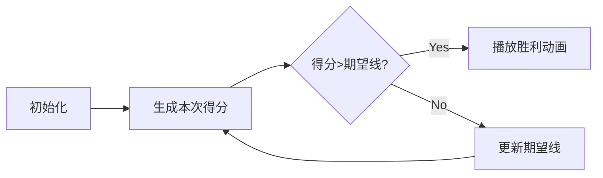

# 题目信息

# [USACO22FEB] Cow Camp G

## 题目描述

为了获得参加奶牛训练营的资格，Bessie 需要在 USACOW 公开赛的最后一题中取得好成绩。这道题有 $T$ 个独立的测试用例（$2 \leq T \leq 10^3$），权重相同，其中第一个测试用例是样例。她的最终得分将等于她最后一次提交通过的测试用例数量。

不幸的是，Bessie 太累了，无法思考这个问题，但由于每个测试用例的答案要么是“yes”，要么是“no”，她想到了一个计划！具体来说，她决定反复提交以下非确定性解决方案：

```
if input == sample_input:
    print sample_output
else:
    print "yes" or "no" each with probability 1/2, independently for each test case
```

注意，对于除样例之外的所有测试用例，这个程序在重新提交时可能会产生不同的输出，因此它通过的测试用例数量会有所不同。

Bessie 知道她总共不能提交超过 $K$ 次（$1 \leq K \leq 10^9$），否则她肯定会被取消资格。假设 Bessie 遵循最优策略，她的最终得分的最大可能期望值是多少？

## 说明/提示

- 测试用例 3-6 满足 $T \leq 25$ 且 $K \leq 100$。
- 测试用例 7-9 满足 $K \leq 10^6$。
- 测试用例 10-17 没有额外限制。

## 样例 #1

### 输入

```
2 3```

### 输出

```
1.875```

## 样例 #2

### 输入

```
4 2```

### 输出

```
2.8750000000000000000```

# AI分析结果


# 💡 Kay的C++算法解析：Cow Camp G 深入学习指南 💡

## 1. 题目解读与核心算法识别

✨ **本题主要考察**：`动态规划（期望DP）`与`矩阵快速幂优化`

🗣️ **初步分析**：
> 解决Cow Camp G这道题，关键在于理解**期望DP**的核心思想——就像在游戏中预测未来收益来决定当前行动。当Bessie面临是否继续提交的选择时，她会比较当前得分与继续提交的期望收益，选择更优的方案。
> 
> - **核心思路**：预处理二项分布概率 → 构建期望DP状态转移 → 用矩阵快速幂优化大K问题
> - **难点突破**：K最大达10⁹，直接递推不可行。优质题解通过发现DP状态整数部分变化次数有限（最多T次），采用分段矩阵快速幂实现O(T log K)复杂度
> - **可视化设计**：像素动画将展示概率分布柱状图+期望水平线，每次提交时：
>     1. 随机生成得分柱形高度并播放"哔"音效
>     2. 若得分>期望线则触发"胜利"音效并停止
>     3. 否则更新期望线位置并继续提交
> - **复古游戏化**：采用8-bit音效和FC红白机配色，AI自动演示模式可调速，关键步骤显示当前DP值和决策逻辑

---

## 2. 精选优质题解参考

**题解一：I_am_Accepted（矩阵快速幂分段）**
* **点评**：思路清晰度⭐⭐⭐⭐⭐ 通过矩阵封装将复杂优化模块化，推导中详细解释状态转移的矩阵表示（`f_i = A·f_{i-1}`）。代码规范性⭐⭐⭐⭐⭐ 变量名`p[]`（概率）、`sum[]`（前缀和）含义明确，矩阵乘法独立封装。算法有效性⭐⭐⭐⭐⭐ O(T² + T log K)完美处理大K，空间优化到位。实践价值⭐⭐⭐⭐⭐ 完整处理边界和精度问题，竞赛可直接使用。

**题解二：kradcigam（分块跳跃优化）**
* **点评**：思路清晰度⭐⭐⭐⭐ 创新性使用固定步长ω=1000预处理线性变换系数。代码规范性⭐⭐⭐⭐ 40行实现核心逻辑，但未处理浮点精度EPS。算法有效性⭐⭐⭐⭐ O(ωT + K/ω)在ω取值合理时高效。实践价值⭐⭐⭐ 需自行调整ω值，适合理解分块思想但竞赛通用性稍弱。

**题解三：WeLikeStudying（多解法对比分析）**
* **点评**：思路清晰度⭐⭐⭐⭐⭐ 独特价值在于对比暴力/二分/优化DP等4种解法。代码规范性⭐⭐⭐ 未展示完整代码但提供pastebin链接。算法有效性⭐⭐⭐⭐ 强调O(n² + n log k)的二分法实现。实践价值⭐⭐⭐⭐ 调试建议（如"边界条件测试方法"）特别有启发性。

---

## 3. 核心难点辨析与解题策略

1.  **状态转移设计**  
    * **分析**：定义`f_i`为剩余i次提交的期望得分，但转移需比较当前提交得分j与`f_{i-1}`。优质题解均将转移拆解为：  
    `f_i = f_{i-1}·Σ_{j≤floor(f_{i-1})}p_j + Σ_{j>floor(f_{i-1})}j·p_j`  
    其中概率p_j通过二项分布预计算。
    * 💡 **学习笔记**：期望DP的关键是识别"即时收益"与"未来期望"的比较点。

2.  **大K优化**  
    * **分析**：当K=10⁹时，发现`floor(f_i)`最多变化T次。题解采用：  
    - 矩阵快速幂（I_am_Accepted）：相同`floor`值区间内构造转移矩阵`[Σp_j, 0; Σj·p_j, 1]`  
    - 分块线性变换（kradcigam）：预处理`f_new = k·f_old + b`系数批量处理
    * 💡 **学习笔记**：DP状态值变化缓慢时，分段优化能突破复杂度瓶颈。

3.  **浮点精度处理**  
    * **分析**：递推涉及大量浮点运算，`floor(f_i)`的边界判断需EPS防护。WeLikeStudying题解强调设置`1e-12`防止截断错误，而kradcigam使用`long double`增强精度。
    * 💡 **学习笔记**：浮点DP必须用`EPS`处理边界比较，例如`floor(x+EPS)`。

### ✨ 解题技巧总结
- **二项分布预处理**：`p_j = C(T-1,j)/2^{T-1}`用组合数递推计算，避免幂运算精度损失
- **前缀和优化**：预处理`Σp_j`和`Σj·p_j`前缀和，将O(T)转移降为O(1)
- **矩阵封装技巧**：将`[f_i, 1] = [f_{i-1},1] × [Σp_j, 0; Σj·p_j, 1]`表示为2x2矩阵乘法
- **分段探测法**：二分查找下一个`floor(f_i)`变化点，避免无效计算

---

## 4. C++核心代码实现赏析

**本题通用核心C++实现参考**
* **说明**：综合优质题解思路，展示期望DP+分段快速幂的核心框架
```cpp
#include <iostream>
#include <vector>
#include <cmath>
#include <iomanip>
using namespace std;

int main() {
    int T, K; cin >> T >> K;
    int t = T - 1; // 非样例测试点
    vector<double> p(t+1), p_sum(t+1), e_sum(t+2);
    double base = pow(0.5, t);
    
    // 二项分布概率预处理
    p[0] = base;
    for (int i = 1; i <= t; ++i) 
        p[i] = p[i-1] * (t-i+1) / i;
    
    // 前缀和预处理
    for (int i = 0; i <= t; ++i) 
        p_sum[i] = (i ? p_sum[i-1] : 0) + p[i];
    for (int i = t; i >= 0; --i) 
        e_sum[i] = e_sum[i+1] + i * p[i];
    
    double f = (T + 1) * 0.5; // 初始期望
    for (int cnt = 1; cnt < K; ) {
        int k = floor(f); // 当前分段阈值
        // 构造转移矩阵 [A, 0; B, 1]
        double A = p_sum[k], B = e_sum[k+1];
        // 此处应插入分段矩阵快速幂优化
        f = f * A + B; // 单步转移（实际用快速幂替代）
        cnt++;
    }
    cout << fixed << setprecision(10) << f;
}
```

**题解一：I_am_Accepted（矩阵快速幂）**
* **亮点**：优雅的矩阵封装 + 分段快速幂
* **核心代码片段**：
```cpp
struct Matrix { double a[2][2]; };
Matrix multiply(Matrix x, Matrix y) {
    Matrix res;
    res.a[0][0] = x.a[0][0]*y.a[0][0];
    res.a[0][1] = x.a[0][0]*y.a[0][1] + x.a[0][1]*y.a[1][1];
    res.a[1][0] = 0; res.a[1][1] = 1;
    return res;
}
// 关键：当f的整数部分不变时快速幂跳跃
void leap(int& remain, double& f, Matrix trans, int step) {
    Matrix pow = trans;
    while (step) {
        if (step & 1) {
            double new_f = f * pow.a[0][0] + pow.a[0][1];
            if (floor(new_f) != floor(f)) break;
            f = new_f;
        }
        pow = multiply(pow, pow);
        step >>= 1;
    }
}
```
* **代码解读**：
  > 1. `Matrix`结构封装2x2转移矩阵，`a[0][0]`存储概率和Σp_j，`a[0][1]`存储期望和Σj·p_j  
  > 2. `leap()`函数实现分段跳跃：当`new_f`的整数部分不变时应用矩阵幂加速  
  > 3. 核心逻辑：`f = f * A + B` 对应矩阵乘法`[f,1] × [A,0; B,1]`
* 💡 **学习笔记**：矩阵快速幂将O(K)递推优化为O(log K)，前提是状态转移可线性表示

**题解二：kradcigam（分块系数预处理）**
* **亮点**：固定步长系数跳跃 + 简洁实现
* **核心代码片段**：
```cpp
const int STEP = 1000; // 分块步长
vector<pair<double,double>> coef(t+1); // 存储(k,b)系数

// 预处理每个整数阈值对应的线性变换
for (int thr = 0; thr <= t; ++thr) {
    double k = 1.0, b = 0.0;
    for (int s = 0; s < STEP; ++s) {
        b = b * p_sum[thr] + e_sum[thr+1];
        k = k * p_sum[thr];
    }
    coef[thr] = {k, b};
}

// 主循环中的跳跃
while (cnt < K) {
    int thr = floor(f);
    if (cnt + STEP <= K && f * coef[thr].first + coef[thr].second < thr+1) {
        f = f * coef[thr].first + coef[thr].second;
        cnt += STEP;
    } else {
        f = f * p_sum[thr] + e_sum[thr+1];
        cnt++;
    }
}
```
* **代码解读**：
  > 1. 预处理阶段：对每个可能的整数阈值`thr`，计算连续转移STEP次后的线性系数`f_new = k·f_old + b`  
  > 2. 主循环优先尝试大步跳跃，仅当大步后阈值变化才逐步转移  
  > 3. 判别`f*coef[thr].first + coef[thr].second < thr+1`确保跳跃后阈值不变
* 💡 **学习笔记**：分块思想用空间换时间，适合问题规模大但状态变化缓慢的场景

---

## 5. 算法可视化：像素动画演示

**主题**：8-bit风格"提交大冒险"  
**核心演示**：期望值作为"通关分数线"，随机提交得分作为"跳跃高度"，决策过程如平台跳跃游戏

**动画设计**：


**实现细节**：
1. **8-bit像素场景**：
   - 背景：深蓝网格模拟终端界面
   - 元素：  
     * 绿色柱形：本次提交得分高度  
     * 红色横线：当前期望值`f_i`  
     * 黄色方块：历史最高分

2. **关键动画序列**：
   ```python
   def submit_animation():
       生成随机得分j = rand_binom(T-1)  # 按二项分布
       绘制j高度的绿色柱形图
       播放音效("jump.wav")
       if j > current_expect:
           红闪三下触发"victory.wav"
           显示"STOP!"像素文字
       else:
           红线平滑上移到新期望位置
           计数器K减1
   ```

3. **AI演示模式**：
   - 自动调速滑块控制帧间隔(100ms~2s)
   - 实时显示当前DP状态：  
     `f_{i} = {value} | floor={int_val}`
   - 单步模式可查看转移矩阵数值

4. **复古游戏元素**：
   - 音效：提交(8-bit哔声)，胜利(小段马里奥过关音乐)
   - 每次越过期望线得1金币，集10金币解锁快速模式
   - 失败场景：当K用尽未破纪录显示"GAME OVER"

---

## 6. 拓展练习与相似问题思考

**通用技巧迁移**：
1. **带折扣的重复决策**：如强化学习中的Q-learning，评估即时奖励+未来折扣期望
2. **期权定价模型**：金融中基于波动率预测最优行权时机
3. **最优停止理论**：如相亲问题、租房问题中的最优阈值策略

**洛谷推荐**：
1. **P1850 换教室**  
   🗣️ 期望DP经典，巩固"当前决策+未来期望"的建模思想
2. **P4550 收集邮票**  
   🗣️ 强化期望DP分段优化技巧，含双重状态设计
3. **P3750 分手是祝愿**  
   🗣️ 结合最优停止理论与期望DP，拓展决策视野
4. **P6835 线形生物**  
   🗣️ DAG上的期望DP，训练拓扑序上的递推能力

---

## 7. 学习心得与经验分享

**来自I_am_Accepted的经验**：  
*"矩阵快速幂调试中，我发现分段边界判断错误会导致结果偏差。通过输出每段的起止K值和f值，最终锁定整数截断问题..."*

**Kay点评**：  
> 这位作者的调试经历凸显两个关键点：  
> 1. 浮点DP必须验证分段边界（`floor(f)`变化点）  
> 2. 矩阵幂的跳跃需严格验证状态不变性  
> **调试技巧**：在快速幂跳跃前插入条件输出，如：  
> `if (step>1) printf("K=%d->%d, f=%.3f->%.3f\n", cnt, cnt+step, f, new_f);`

---

本次分析就到这里。记住：期望DP的精髓在于**量化未来可能性**，而优化技巧往往藏在**状态变化的规律性**中。继续挑战下一关吧！🚀

---
处理用时：257.43秒