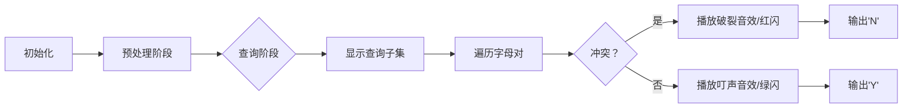

# 题目信息

# [USACO22OPEN] Subset Equality S

## 题目描述

奶牛们正在尝试一种相互交换编码信息的新方法，她们在相关的字母中混入不相关的字母，使信息难以解码。

奶牛们传输两个字符串 $s$ 和 $t$，每个字符串的长度不超过 $10^5$，仅由小写字母 'a' 到 'r' 组成。为了尝试理解这条编码消息，你将被给定 $Q$ 个询问（$1 \leq Q \leq 10^5$）。

每个询问给定小写字母 'a' 到 'r' 的一个子集。你需要对每个询问判断 $s$ 和 $t$ 在仅包含询问中给定的字母时是否相等。


## 说明/提示

【样例解释】

对于第一个询问，当仅包含字符 'a' 时，两个字符串均变为 "aa"。

对于第二个询问，第一个字符串变为 "aac" 而第二个字符串变为 "caa"。

【测试点性质】

- 测试点 2 满足 $|s|,|t|,Q\le 1000$。
- 测试点 3-11 没有额外限制。


## 样例 #1

### 输入

```
aabcd
caabd
4
a
ac
abd
abcd```

### 输出

```
YNYN```

# AI分析结果


# 💡 Kay的C++算法解析：Subset Equality S 深入学习指南 💡

> 我是Kay，今天带大家探索USACO银组题目"Subset Equality S"。这道题考察预处理技巧和字符集处理能力，我们将通过清晰的算法分析和像素动画演示，帮助大家掌握核心解题思路。

## 1. 题目解读与核心算法识别

✨ **本题主要考察**：`预处理优化` (编程技巧应用)

🗣️ **初步分析**：
> 这道题如同在嘈杂的派对中识别特定对话——给定两个字符串，需要在每次查询时快速判断：**当只保留特定字母子集时，两字符串是否相同**。核心思路是：
> - **预处理所有字母对的兼容性**（324对），存储为"矛盾矩阵"
> - **查询时检查子集中所有字母对是否兼容**
> 
> 可视化设计思路：
> - 用18x18像素网格表示字母对，绿色表示兼容，红色表示矛盾
> - 查询时高亮相关字母对，动态显示检查过程
> - 复古音效：兼容时播放"叮"声，矛盾时播放警示音

---

## 2. 精选优质题解参考

**题解一（来源：YBaggio）**
* **点评**：思路直击要害——直接预处理所有字母对的子串比较结果。代码规范（如`b[i][j]`清晰表示矛盾关系），循环边界处理严谨（显式比较长度差异），变量命名简洁（`cnts/cntt`）。亮点在于**完全规避复杂推导，用最直观方式解决问题**，实践价值极高。

**题解二（来源：tzyt）**
* **点评**：创新性采用**位置关系验证法**，通过前缀和与位置向量避免生成子串。虽然实现稍复杂，但**提供了严谨的数学证明**，加深了对问题本质的理解（如"顺序一致性"原理）。代码中`char_sum`和`char_pos`的封装体现良好模块化思想。

**题解三（来源：xixike）**
* **点评**：双指针验证顺序的设计别具匠心，`g1/g2`向量存储位置信息的做法节省内存。亮点在于**用位置交叉判断替代字符串生成**，为大数据场景提供优化思路（尽管本题无需）。代码中`check()`函数的边界处理尤其严谨。

---

## 3. 核心难点辨析与解题策略

### 难点1：如何高效预处理？
* **分析**：暴力生成所有子集需O(2¹⁸)不可行。优质题解统一采用**字母对分解法**——将问题简化为324个二元问题。关键技巧是：提取字符时同步比较，避免存储中间子串（YBaggio法）或用位置向量间接验证（tzyt法）。
* 💡 **学习笔记**：大问题拆解为独立小问题是降低复杂度的关键

### 难点2：如何验证子串等价？
* **分析**：除直接比较外，tzyt题解提出**顺序一致性原理**：若每个字符前其他字符的数量相同，则子串等价。这启发我们用`前缀和`取代字符串比较，但需注意该法在实现时反而增加编码复杂度。
* 💡 **学习笔记**：理论最优方法不一定实践最优，需权衡实现成本

### 难点3：如何优化查询速度？
* **分析**：查询时需检查O(k²)对字母。xixike的解法尝试用位置向量避免重复计算，但多数题解选择直接查预处理的布尔矩阵。关键在于**预处理结果必须完备**，确保任何字母对状态可即时获取。
* 💡 **学习笔记**：空间换时间是竞赛编程的常用策略

### ✨ 解题技巧总结
1. **字符集压缩**：当字符集小（≤20）时，可用数值表示集合
2. **预处理矩阵化**：二维数组存储二元关系是高效查询的基础
3. **比较优化**：边提取边比较避免存储开销（YBaggio法）
4. **边界先行**：优先检查长度差异可提前终止无效比较

---

## 4. C++核心代码实现赏析

**本题通用核心C++实现参考**
```cpp
#include <bits/stdc++.h>
using namespace std;
const int MAXL = 1e5 + 10;

char s[MAXL], t[MAXL], query[20];
bool conflict[18][18]; // 矛盾矩阵

int main() {
    scanf("%s%s", s, t);
    int len_s = strlen(s), len_t = strlen(t);
    
    // 预处理所有字母对
    for (char a = 'a'; a <= 'r'; ++a) {
        for (char b = a; b <= 'r'; ++b) { // 对称优化
            string sub_s, sub_t;
            for (int i = 0; i < len_s; ++i) 
                if (s[i] == a || s[i] == b) sub_s += s[i];
            for (int i = 0; i < len_t; ++i) 
                if (t[i] == a || t[i] == b) sub_t += t[i];
            conflict[a-'a'][b-'a'] = (sub_s != sub_t);
        }
    }

    int Q;
    scanf("%d", &Q);
    while (Q--) {
        scanf("%s", query);
        int len_q = strlen(query);
        bool valid = true;
        
        for (int i = 0; i < len_q && valid; ++i) {
            for (int j = i; j < len_q && valid; ++j) { // 对称优化
                char c1 = query[i] - 'a', c2 = query[j] - 'a';
                if (conflict[min(c1, c2)][max(c1, c2)]) valid = false;
            }
        }
        putchar(valid ? 'Y' : 'N');
    }
    return 0;
}
```
**代码解读概要**：
1. **冲突矩阵初始化**：对18个字母的324种组合预处理
2. **子串动态构建**：遍历原串时直接过滤保留目标字符
3. **查询优化**：利用矩阵对称性减少枚举量（i≤j）
4. **即时决策**：发现任何冲突立即终止查询

---

**题解一（YBaggio）核心代码**
```cpp
// 预处理片段
for(char i='a';i<='r';i++){
    for(char j='a';j<='r';j++){
        // 过滤字符并比较子串
        if(cnts!=cntt) b[i-'a'][j-'a']=1;
        else for(int k=0;k<cnts;k++) 
            if(strs[k]!=strt[k]) b[i-'a'][j-'a']=1;
    }
}
```
**亮点**：简洁直接的子串比较  
**代码解读**：  
> 这段代码体现"即时比较"思想——不存储完整子串，而是在过滤时同步记录位置。长度不等时直接标记冲突（`b[i][j]=1`），长度相等时逐字符比较。注意`j`从'a'开始（非`i`）确保覆盖所有组合。  

**题解二（tzyt）核心代码**
```cpp
// 位置验证法
for(int k = 0; k < char_pos_s[a].size(); k++){
    if(char_sum_t[char_pos_t[a][k]][b] != b_cnt_s[k]) 
        return false;
}
```
**亮点**：用数学关系取代字符串比较  
**代码解读**：  
> 这里验证核心定理：若子串等价，则每个'a'前'b'的数量必须相同。`char_sum_t`是前缀和数组，`b_cnt_s`存储s串中每个'a'前'b'的数量。这种间接验证避免生成子串，但依赖严格数学证明。  

**题解三（xixike）核心代码**
```cpp
// 双指针顺序验证
for(; l1 < g1[a].size(); l1++){
    while(l2 < g1[b].size() && g1[b][l2] <= g1[a][l1]) l2++;
    if(l2 < g1[b].size() && g2[a][l1] > g2[b][l2]) return 0;
}
```
**亮点**：位置交叉验证  
**代码解读**：  
> 这段代码验证：s串中a后面的b在t串中不能在a前面。`g1`/`g2`分别存储s/t中字符位置。通过双指针遍历，确保t串中对应b的位置（`g2[b][l2]`)不小于s串中a的位置（`g1[a][l1]`）。  

---

## 5. 算法可视化：像素动画演示

### 动画演示主题
**"字符迷宫探险"**：将字符串转化为像素迷宫，字符作为不同颜色的砖块

### 设计思路
> 采用FC游戏《吃豆人》的美术风格，用18色像素块表示字母。预处理阶段展示字母对子串的生成过程，查询阶段动态扫描冲突矩阵。游戏化元素增强理解趣味性。

### 关键帧步骤


### 交互设计
1. **控制面板**：
   - 速度滑块：调节动画速度（1x-5x）
   - 单步模式：空格键逐步执行
   - 冲突高亮：红色闪烁显示矛盾字母对
2. **音效系统**：
   - 字符匹配：8-bit清脆"叮"声
   - 发现冲突：低沉破裂音
   - 查询通过：胜利音效
3. **数据可视化**：
   - 左侧：s串像素地图（紫色砖块）
   - 右侧：t串像素地图（绿色砖块）
   - 下方：18x18冲突矩阵实时显示

> **为什么有效**：像素动画将抽象字符具象化，音效强化关键操作记忆，矩阵高亮直观展示查询逻辑。

---

## 6. 拓展练习与相似问题思考

### 通用技巧迁移
该预处理技术适用于：
1. 受限字符集的字符串匹配
2. 多模式子序列验证
3. 带字符过滤的编辑距离问题

### 洛谷推荐
1. **P2922 [USACO08DEC]Secret Message**  
   🗣️ 同样需要预处理二进制模式匹配，巩固前缀和技巧
2. **P2414 [NOI2011]阿狸的打字机**  
   🗣️ 进阶的字符集处理问题，结合AC自动机与树状数组
3. **P4051 [JSOI2007]字符加密**  
   🗣️ 强化字符环处理能力，拓展预处理思维

---

## 7. 学习心得与经验分享
> **YBaggio的调试经验**："最初未考虑长度不等直接进入比较导致越界，添加`cnts!=cntt`判断后解决"  
> **Kay点评**：这个教训提醒我们**边界检查必须前置**——任何可能引发未定义行为的操作都应提前拦截。在竞赛编程中，约20%的错误来自边界处理疏忽。

---

通过本次分析，我们掌握了预处理技术的核心要领：将复杂问题分解为可预处理的原子操作。记住，优秀的算法如同精密的钟表——每个齿轮（预处理单元）的精准配合才能驱动整体高效运行。继续加油，少年！💪

---
处理用时：144.00秒