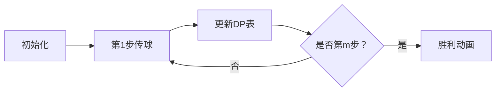

# 题目信息

# [NOIP 2008 普及组] 传球游戏

## 题目描述

上体育课的时候，小蛮的老师经常带着同学们一起做游戏。这次，老师带着同学们一起做传球游戏。

游戏规则是这样的：$n$ 个同学站成一个圆圈，其中的一个同学手里拿着一个球，当老师吹哨子时开始传球，每个同学可以把球传给自己左右的两个同学中的一个（左右任意），当老师再次吹哨子时，传球停止，此时，拿着球没有传出去的那个同学就是败者，要给大家表演一个节目。

聪明的小蛮提出一个有趣的问题：有多少种不同的传球方法可以使得从小蛮手里开始传的球，传了 $m$ 次以后，又回到小蛮手里。两种传球方法被视作不同的方法，当且仅当这两种方法中，接到球的同学按接球顺序组成的序列是不同的。比如有三个同学 $1$ 号、$2$ 号、$3$ 号，并假设小蛮为 $1$ 号，球传了 $3$ 次回到小蛮手里的方式有 $1 \rightarrow 2 \rightarrow 3 \rightarrow 1$ 和 $1 \rightarrow 3 \rightarrow 2 \rightarrow 1$，共 $2$ 种。


## 说明/提示

### 数据范围及约定

- 对于 $40\%$ 的数据，满足：$3 \le n \le 30,1 \le m \le 20$；
- 对于 $100\%$ 的数据，满足：$3 \le n \le 30,1 \le m \le 30$。

2008普及组第三题


## 样例 #1

### 输入

```
3 3```

### 输出

```
2```

# AI分析结果


### 💡 Kay的C++算法解析：传球游戏 深入学习指南 💡

**引言**  
今天我们一起分析NOIP2008普及组的"传球游戏"。这道环形计数问题看似简单，却蕴含着动态规划的精妙思想。本指南将带大家拆解核心算法，并通过像素动画直观理解传球过程。

---

## 1. 题目解读与核心算法识别

✨ **本题主要考察**：`动态规划(DP)`  
🗣️ **初步分析**：  
> 传球游戏本质是**环形路径计数问题**，可比喻为在圆形迷宫中寻找回到起点的路径。DP如同绘制路径地图：用`dp[i][j]`记录传`i`次球到`j`位置的方案数，每个位置的值由其左右邻居的上一步值相加得到。  
> - **核心难点**：环形边界的特殊处理（1号左侧是n号，n号右侧是1号）  
> - **可视化设计**：将用像素圆环展示传球路径，高亮当前传球位置和来源方向（左/右箭头），每步更新DP表格数值  
> - **游戏化元素**：采用8位像素风格，传球时触发"滴"音效，完成m步回起点时播放胜利音效，控制面板支持单步/自动模式  

---

## 2. 精选优质题解参考

**题解一：HighPerformanceRobot (DP解法)**  
* **点评**：思路清晰展示了从BFS到DP的优化历程，状态转移解释透彻。代码中`f[i][j]`命名简洁，边界处理（1和n号特判）严谨规范，完整呈现了DP的思维链条，是初学者理解基础DP的优质范本。

**题解二：Vct14 (取模优化)**  
* **点评**：创新性使用取模运算`(j-1+n)%n`处理环形边界，避免冗余特判。额外提供滚动数组优化方案，将空间复杂度降至O(n)，体现了对DP空间优化的深刻理解，代码简洁如数学公式般优雅。

**题解三：Idoyt (维度分析法)**  
* **点评**：独到地从"维度"视角剖析DP本质，将抽象的状态设计理念转化为具象的二维表格模型。通过"阶段(传球次数)+状态(位置)"的双维度框架，帮助学习者建立系统性DP思维，代码实现与理论阐释高度统一。

---

## 3. 核心难点辨析与解题策略

1. **状态设计的思维突破**  
   * **分析**：需意识到方案数取决于传球次数和当前位置两个变量。优质解法均定义`dp[i][j]`为传i次后球在j的方案数，状态转移本质是路径叠加
   * 💡 **学习笔记**：DP状态应完整描述问题关键维度

2. **环形边界的数学处理**  
   * **分析**：当j=1时左侧应为n，j=n时右侧应为1。HighPerformanceRobot采用显式特判，Vct14用取模实现环形映射，两者本质都是建立位置循环关系
   * 💡 **学习笔记**：环形问题=线性问题+边界衔接

3. **初始化与递推基础**  
   * **分析**：`dp[0][1]=1`表示初始状态（0次传球时球在1号）。若错误初始化为`dp[1][2]=1`等，会导致后续递推偏离
   * 💡 **学习笔记**：DP初始化是递推的锚点，需严格对应问题起点

### ✨ 解题技巧总结
- **环形转线性**：用取模或特判消除环形特殊性  
- **维度分析法**：从变量维度切入设计DP状态  
- **可视化调试**：手工绘制前3步DP表格验证转移逻辑  

---

## 4. C++核心代码实现赏析

**本题通用核心C++实现**  
```cpp
#include <iostream>
using namespace std;
int dp[35][35]; // dp[i][j]: 传i次到j的方案数

int main() {
    int n, m;
    cin >> n >> m;
    dp[0][1] = 1; // 初始状态：0次传球在1号
    
    for(int i = 1; i <= m; i++)
    for(int j = 1; j <= n; j++) {
        int left = (j == 1) ? n : j-1;  // 环形左邻居
        int right = (j == n) ? 1 : j+1; // 环形右邻居
        dp[i][j] = dp[i-1][left] + dp[i-1][right];
    }
    
    cout << dp[m][1]; // 传m次回到1号的方案数
    return 0;
}
```
**代码解读概要**：  
> 1. 初始化锚点：0次传球时只有1号有球  
> 2. 双重循环：外层遍历传球次数，内层遍历当前位置  
> 3. 环形邻居：通过三目运算符动态确定左右邻居位置  
> 4. 状态转移：当前方案数=左邻居上一步方案+右邻居上一步方案  

**优质题解片段赏析**  

**题解一：HighPerformanceRobot**  
```cpp
if(j==1) 
    f[i][j] = f[i-1][n] + f[i-1][2];
else if(j==n) 
    f[i][j] = f[i-1][1] + f[i-1][n-1];
else 
    f[i][j] = f[i-1][j-1] + f[i-1][j+1];
```
> **亮点**：显式边界处理提升可读性  
> **代码解读**：  
> 当j=1时（首位置），左邻居是n；当j=n时（末位置），右邻居是1；中间位置直接取j-1/j+1。这种写法如同在圆环上开两个"窗口"，直观展示边界衔接逻辑。  
> 💡 **学习笔记**：显式特判虽增加代码行数，但大幅提升可调试性  

**题解二：Vct14**  
```cpp
dp[i][j] = dp[i-1][(j-1+n)%n] + dp[i-1][(j+1)%n];
```
> **亮点**：取模运算实现环形自动化  
> **代码解读**：  
> `(j-1+n)%n`确保左邻居索引始终在[0,n-1]范围。例如j=0（即1号）时：(0-1+3)%3=2→3号，完美闭环。数学技巧将环形结构转化为统一计算模型。  
> 💡 **学习笔记**：取模是处理循环结构的利器  

**题解三：Idoyt**  
```cpp
// 状态转移框架
for(int i=1; i<=m; i++)
for(int j=1; j<=n; j++)
    dp[i][j] = dp[i-1][left] + dp[i-1][right];
```
> **亮点**：聚焦维度本质忽略实现细节  
> **代码解读**：  
> 此片段剥离边界处理细节，突出"当前状态=左邻居历史状态+右邻居历史状态"的核心思想。这种抽象帮助理解DP本质——状态是维度的组合，转移是维度间的映射。  
> 💡 **学习笔记**：理解框架比记忆代码更重要  

---

## 5. 算法可视化：像素动画演示

**主题**：8位机风格的环形传球模拟  
**核心演示**：动态呈现DP状态转移与环形路径生成  

### 动画设计  


1. **像素场景搭建**  
   - 8-bit风格圆环：30个色块表示同学位置，1号用红色标记  
   - 控制面板：步进/暂停/重置按钮 + 速度滑块  
   - DP表格：右侧同步显示dp[i][j]数值矩阵  

2. **关键帧流程**  
   - **帧0**：1号位闪烁，显示`dp[0][1]=1`（初始音效：叮~）  
   - **帧i**：  
     * 高亮当前传球位置j（黄色脉冲）  
     * 从left/right位置向j发射像素箭头（蓝色/绿色）  
     * 实时计算`dp[i][j] = dp[i-1][left] + dp[i-1][right]`  
     * 播放传球音效（滴嘟声）  
   - **帧m**：若球在1号位，触发胜利动画（烟花特效+胜利音效）  

3. **游戏化交互**  
   - **AI演示模式**：自动步进展示最优路径（速度可调）  
   - **音效系统**：  
     * 传球：8-bit短促"滴"声  
     * 错误：低沉嗡鸣（当尝试越界传球时）  
     * 胜利：经典FC过关音乐  
   - **关卡进度**：每10步解锁新BGM，完成m步回起点得"传球大师"奖杯  

---

## 6. 拓展练习与相似问题思考

**通用技巧迁移**  
> 本题的环形DP思想可延伸至：  
> 1. 环形路径计数（如环形迷宫路径）  
> 2. 循环队列操作优化  
> 3. 周期性问题建模（如钟表指针重合问题）  

**洛谷练习推荐**  
1. **P1216 数字三角形** - 基础线性DP，训练状态转移思维  
2. **P2196 挖地雷** - 带路径记录的DP，提升状态设计能力  
3. **P1434 滑雪** - 记忆化搜索与DP的结合应用  

---

## 7. 学习心得与经验分享

> **参考经验 (来自 HighPerformanceRobot)**：  
> "DP是毒瘤，谁打谁知道。要想不被毒，暴力少不了。"  
>   
> **点评**：幽默道出DP学习痛点。建议初学者：  
> 1. 先用暴力搜索理清问题脉络  
> 2. 手工模拟小规模案例（如n=3,m=3）  
> 3. 再转化为DP状态转移方程  
> 调试时打印DP表格比盲目改代码更有效！

---

**结语**  
通过本次分析，我们不仅掌握了环形DP的解法，更学会了用"维度思维"拆解复杂问题。记住：编程如传球，进步来自不断练习与迭代。下次挑战再见！🚀

---
处理用时：158.15秒