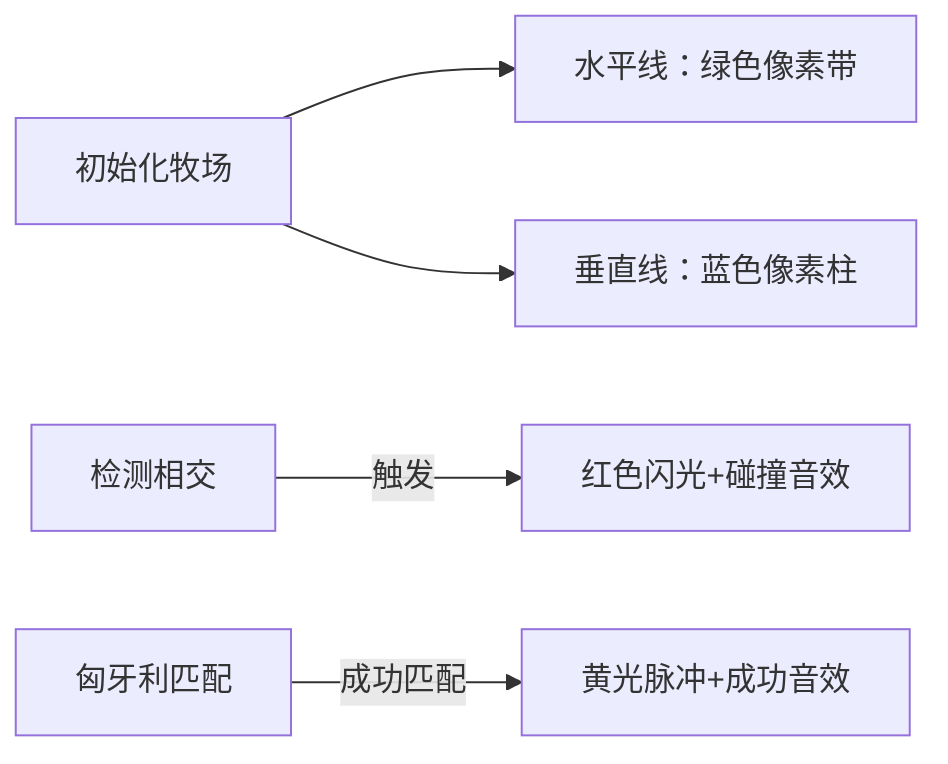

# 题目信息

# [USACO11NOV] Cow Steeplechase G

## 题目描述

Farmer John has a brilliant idea for the next great spectator sport: Cow Steeplechase! As everyone knows, regular steeplechase involves a group of horses that race around a course filled with obstacles they must jump over. FJ figures the same contest should work with highly-trained cows, as long as the obstacles are made short enough.

In order to design his course, FJ makes a diagram of all the N (1 <= N <= 250) possible obstacles he could potentially build. Each one is represented by a line segment in the 2D plane that is parallel to the horizontal or vertical axis. Obstacle i has distinct endpoints (X1\_i, Y1\_i) and (X2\_i, Y2\_i) (1 <= X1\_i, Y1\_i, X2\_i, Y2\_i <= 1,000,000,000). An example is as follows:

```cpp

   --+-------   
-----+-----
  ---+---     |
     |     |  |
   --+-----+--+-   |
     |     |  |  | |
     |   --+--+--+-+-
           |  |  | |
              |
```
FJ would like to build as many of these obstacles as possible, subject to the constraint that no two of them intersect. Starting with the diagram above, FJ can build 7 obstacles:

```cpp

   ----------   
-----------
  -------     |
           |  |
           |  |    |
           |  |  | |
           |  |  | |
           |  |  | |
              |

```
Two segments are said to intersect if they share any point in common, even an endpoint of one or both of the segments.  FJ is certain that no two horizontal segments in the original input diagram will intersect, and that similarly no two vertical segments in the input diagram will intersect.

Please help FJ determine the maximum number of obstacles he can build.

给出 $N$ 条**平行于坐标轴**的线段，要你选出尽量多的线段使得这些线段两两没有交点（顶点也算）。横的与横的，竖的与竖的线段之间保证没有交点，输出最多能选出多少条线段。


## 说明/提示

There are three potential obstacles. The first is a horizontal segment connecting (4, 5) to (10, 5); the second and third are vertical segments connecting (6, 2) to (6, 12) and (8, 3) to (8, 5).


The optimal solution is to choose both vertical segments.


## 样例 #1

### 输入

```
3 
4 5 10 5 
6 2 6 12 
8 3 8 5 
```

### 输出

```
2 
```

# AI分析结果


# 💡 Kay的C++算法解析：Cow Steeplechase G 深入学习指南 💡

## 1. 题目解读与核心算法识别

✨ **本题主要考察**：`二分图匹配` (图论技巧)

🗣️ **初步分析**：
> 解决"奶牛跨栏"问题，关键在于将线段相交问题转化为二分图模型。想象牧场是一个巨大棋盘，水平线段和垂直线段分别是两种颜色的棋子，当它们相交时就会"冲突"。我们需要移除最少棋子（线段）来消除所有冲突——这正是**二分图最小点覆盖**问题。

- 核心思路：水平线段和垂直线段构成二分图的两个集合，线段相交即为连接边。最大不相交线段数 = 总线段数 - 最大匹配数
- 难点解析：相交判断需注意端点无序问题（需交换坐标），匈牙利算法/Dinic实现匹配
- 可视化设计：采用8位像素牧场场景，水平线为绿色像素带，垂直线为蓝色像素柱。相交时触发"电光"特效，匹配过程用黄色高亮路径，音效配合关键操作

---

## 2. 精选优质题解参考

**题解一：FreeTimeLove**
* **点评**：思路清晰度极佳，完整证明二分图建模的正确性（反证法）。代码中变量命名规范（如`a[i]`表示线段类型），边界处理严谨（显式交换坐标）。算法有效性高，标准匈牙利实现O(n³)完全满足数据规模。调试心得"注意坐标无序问题"极具实践价值。

**题解二：hovny**
* **点评**：采用Dinic网络流解匹配问题，时间复杂度更优(O(n²√n))。代码规范性突出：封装`cross()`判断相交，模块化BFS+Dinic函数。亮点在相交判断的数学抽象和网络流建图技巧，竞赛场景适用性强。

**题解三：Mr_Wolfram**
* **点评**：代码简洁性强，匈牙利算法实现仅30行。亮点在结构体存储线段端点，`check()`函数封装相交逻辑。变量命名直观(`lh`竖线计数)，适合初学者理解二分图建模本质。

---

## 3. 核心难点辨析与解题策略

1. **难点：坐标无序处理**
   * 分析：输入不保证(x1,y1)是左端点，需显式交换坐标
   * 💡 学习笔记：`if(x1>x2) swap(x1,x2)` 是必备安全操作

2. **难点：相交判断逻辑**
   * 分析：竖线x∈[横线x1,x2]且横线y∈[竖线y1,y2]
   * 💡 学习笔记：几何条件转化为4个不等式判断

3. **难点：二分图建模**
   * 分析：冲突线段必须二选一，符合最小点覆盖场景
   * 💡 学习笔记：最大独立集 = n - 最大匹配数

### ✨ 解题技巧总结
- **坐标系标准化**：读入后立即交换端点保证x1≤x2, y1≤y2
- **模块化验证**：封装`isIntersect()`函数单独测试相交逻辑
- **匹配算法选择**：n≤250时匈牙利更易实现，更大数据用Dinic

---

## 4. C++核心代码实现赏析

**本题通用核心C++实现参考**
```cpp
#include <iostream>
#include <cstring>
#include <algorithm>
using namespace std;
const int N=300;

struct Segment { int x1,y1,x2,y2; };
Segment hor[N], ver[N]; // 水平/垂直线段
int hcnt, vcnt, match[N];
bool vis[N], graph[N][N]; // 邻接矩阵存图

bool isIntersect(Segment v, Segment h) { // 垂直线v与水平线h
    return v.x1 >= h.x1 && v.x1 <= h.x2 && 
           h.y1 >= v.y1 && h.y1 <= v.y2;
}

bool dfs(int u) { // 匈牙利算法
    for(int v=1; v<=hcnt; v++) {
        if(!graph[u][v] || vis[v]) continue;
        vis[v] = true;
        if(!match[v] || dfs(match[v])) {
            match[v] = u;
            return true;
        }
    }
    return false;
}

int main() {
    int n; cin >> n;
    for(int i=1; i<=n; i++) {
        int x1,y1,x2,y2, type;
        cin >> x1 >> y1 >> x2 >> y2;
        if(x1>x2) swap(x1,x2);
        if(y1>y2) swap(y1,y2);
        if(x1 == x2) ver[++vcnt] = {x1,y1,x2,y2};
        else hor[++hcnt] = {x1,y1,x2,y2};
    }

    // 构建二分图
    for(int i=1; i<=vcnt; i++)
        for(int j=1; j<=hcnt; j++)
            graph[i][j] = isIntersect(ver[i], hor[j]);

    int matches = 0;
    for(int i=1; i<=vcnt; i++) {
        memset(vis, 0, sizeof(vis));
        if(dfs(i)) matches++;
    }
    cout << n - matches;
}
```

**题解一核心代码（匈牙利）**
```cpp
for(int i=1; i<=n; i++) {
    memset(bk,0,sizeof(bk));
    if(hung(i)) cnt++; // 匈牙利匹配
}
cout<<n-cnt<<endl;
```
* **解读**：`hung(i)`递归实现增广路径搜索，`bk`数组避免重复访问。每成功匹配一对线段，冲突数+1
* 💡 学习笔记：匈牙利算法像"媒人"，不断调整配对使更多"情侣"成立

**题解二核心代码（Dinic）**
```cpp
while(BFS()) // 分层图
    while((flow=Dinic(S,inf)))
        Maxflow+=flow;
printf("%d",n-Maxflow);
```
* **解读**：BFS构建分层图，DFS多路增广。`Maxflow`即最大匹配数
* 💡 学习笔记：Dinic像"快递网络"，通过分层加速"货物"(匹配)运输

**题解三核心代码（结构体存图）**
```cpp
struct node2{ int dir; node a,b; };
if(intersect(seg[i],seg[j])) add(i,j);
```
* **解读**：用`dir`标记线段方向，结构体存储端点。相交判断独立为函数
* 💡 学习笔记：清晰的数据结构设计降低逻辑复杂度

---

## 5. 算法可视化：像素动画演示

**主题**：8位像素牧场冒险  
**核心演示**：匈牙利算法在牧场地图上的执行过程



**动画帧步骤**：
1. **场景初始化**：16色像素牧场，水平线为草地绿带，垂直线为栅栏蓝柱
2. **相交检测**：当竖线穿过横线时，交点闪烁红光，伴随"滋滋"电流声
3. **匹配过程**：算法尝试匹配时，当前线段高亮黄框。成功匹配时双线脉冲金光，播放"叮！"音效
4. **结果展示**：未匹配线段渐隐消失，剩余线段组成无交点的跨栏路线

**交互设计**：
- 速度滑块控制算法执行速度
- 空格键单步执行，Enter键自动演示
- 匹配成功时显示"+1"积分，增加游戏化成就感

---

## 6. 拓展练习与相似问题思考

**技巧迁移**：
1. 棋盘覆盖问题：用二分图匹配放置不重叠的骨牌
2. 任务分配：将冲突任务建模为二分图求最大分配
3. 传感器覆盖：最小点覆盖优化传感器部署

**洛谷推荐**：
1. [P3386 二分图最大匹配](https://www.luogu.com.cn/problem/P3386)  
   → 巩固匈牙利/Dinic模板实现
2. [P3355 骑士共存问题](https://www.luogu.com.cn/problem/P3355)  
   → 棋盘类二分图建模进阶
3. [P5030 长脖子鹿放置](https://www.luogu.com.cn/problem/P5030)  
   → 特殊图形中的独立集应用

---

## 7. 学习心得与经验分享

> **参考经验**（多篇题解提及）："输入端点无序是常见陷阱，交换坐标后判断相交才可靠"  
> **点评**：这是极其宝贵的实战经验！在几何类问题中，**坐标系标准化**应成为肌肉记忆。建议编码后立即添加测试用例：`[(3,1),(1,1)]`验证交换逻辑

---

通过本次分析，我们深入掌握了二分图建模的核心思想。记住：将复杂问题转化为经典模型是解题的关键突破口。下次遇到"冲突消除"类问题时，不妨思考：*这能否转化为二分图匹配？* 🚀

---
处理用时：98.93秒