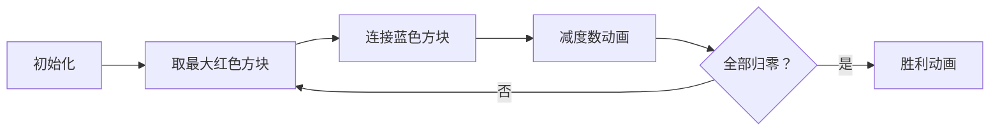

# 题目信息

# [USACO14MAR] Counting Friends G

## 题目描述

Farmer John's N cows (2 <= N <= 500) have joined the social network "MooBook".

Each cow has one or more friends with whom they interact on MooBook.  Just for fun, Farmer John makes a list of the number of friends for each of his cows, but during the process of writing the list he becomes distracted, and he includes one extra number by mistake (so his list contains N+1 numbers, instead of N numbers as he intended).

Please help Farmer John figure out which numbers on his list could have been the erroneous extra number.

FJ又有n(1<=n<=500)头奶牛都有一个或一个以上的朋友。FJ记录每头牛的朋友数，但他傻不小心混入了一个错的数字，请找出。


## 说明/提示

Farmer John has 4 cows.  Two cows have only 1 friend each, two cows have 2 friends each, and 1 cow has 3 friends (of course, one of these numbers is extra and does not belong on the list).


Removal of the first number in FJ's list (the number 1) gives a remaining list of 2,2,1,3, which does lead to a feasible friendship pairing -- for example, if we name the cows A..D, then the pairings (A,B), (A,C), (A,D), and (B,C) suffice, since A has 3 friends, B and C have 2 friends, and D has 1 friend.  Similarly, removing the other "1" from FJ's list also works, and so does removing the "3" from FJ's list.  Removal of either "2" from FJ's list does not work -- we can see this by the fact that the sum of the remaining numbers is odd, which clearly prohibits us from finding a feasible pairing.


## 样例 #1

### 输入

```
4 
1 
2 
2 
1 
3 
```

### 输出

```
3 
1 
4 
5 
```

# AI分析结果


# 💡 Kay的C++算法解析：Counting Friends G 深入学习指南 💡

**引言**  
今天我们一起分析USACO题目"Counting Friends G"。这道题考察图论中度数序列的合法性判断，核心是掌握Havel-Hakimi算法及其优化技巧。本指南将帮助你理解算法本质，掌握高效实现方法，并通过像素动画直观感受算法执行过程。

## 1. 题目解读与核心算法识别

✨ **本题主要考察**：`图论·度数序列验证` + `贪心模拟优化`  

🗣️ **初步分析**：  
> 就像拼积木时每块积木的凹槽数量必须匹配才能完成拼接一样，验证度数序列就是检查能否用给定的"凹槽数"（度数）构建完整的友谊网络。核心算法是Havel-Hakimi算法：  
> 1. 每次取度数最大的"积木"（节点）
> 2. 将其与后续多个"积木"连接（度数减1）
> 3. 重复直到所有度数为0或出现负数  
> 
> **优化关键**：每次操作后序列保持部分有序，可用归并排序（O(n)）代替全排序（O(n log n)）  
> 
> **像素动画设计**：  
> - 用不同颜色方块表示度数（红=当前最大值，蓝=待连接节点）  
> - 连接时显示"闪电"动画并播放8-bit音效  
> - 成功归零时方块爆炸+胜利音效  
> - 控制面板支持单步/自动模式，速度可调

---

## 2. 精选优质题解参考

**题解一：小手冰凉（归并排序优化）**  
* **亮点**：将朴素算法的O(n³ log n)优化至O(n³)，核心在于操作后序列天然分块有序，用归并代替全排序。代码中`while(l1<=r1&&l2<=r2)`的归并逻辑清晰体现"双指针吃豆人"思想，边界处理严谨，可直接用于竞赛。

**题解二：denominator（Erdős-Gallai定理）**  
* **亮点**：运用图论定理将复杂度降至O(n²)，数学思维惊艳。前缀和`pre[]`与后缀处理`suf[]`的配合如同"精密的齿轮传动系统"，展示数学优化程序的典范。虽实现较复杂，但拓展思维视野极佳。

**题解三：yzxoi（桶排序优化）**  
* **亮点**：用桶排序`stk[]`替代比较排序，针对度数范围小特性优化。`while(stk[j]--)`的批量操作如同"批发减度"大幅减少操作次数，`f[]`数组暂存变更的设计避免状态冲突，实践性超强。

---

## 3. 核心难点辨析与解题策略

1.  **难点：操作后序列部分有序性的利用**  
    * **分析**：Havel-Hakimi操作后序列分成归零段（无序）和非零段（有序），优质解法通过归并排序（题解一）或桶排序（题解三）利用此特性避免重复排序
    * 💡 **学习笔记**：发现数据隐含的有序性是优化的金钥匙

2.  **难点：度数减操作的批量处理**  
    * **分析**：当存在多个相同度数时，题解三用`stk[j]--`批量处理，减少循环次数。如同"团购优惠"比"单次购买"更高效
    * 💡 **学习笔记**：批量处理相同状态是突破O(n²)的关键

3.  **难点：负度数的及时检测**  
    * **分析**：题解一在`b[1]>0`时检测剩余节点是否可连接，避免无效操作。如同"及时止损"策略提升效率
    * 💡 **学习笔记**：失败条件前置检测可节省大量计算资源

### ✨ 解题技巧总结
- **技巧1：状态复用** - 归并排序利用操作后的天然有序性（题解一）
- **技巧2：数学转化** - 将图论问题转化为不等式验证（题解二）
- **技巧3：桶分治** - 用桶存储并按度数分组处理（题解三）
- **技巧4：边界守卫** - 在循环入口处预判`if(b[1]==0)break`（题解五）

---

## 4. C++核心代码实现赏析

**通用核心实现（归并优化版）**  
```cpp
#include <bits/stdc++.h>
using namespace std;
const int N=505;
int a[N], b[N], t[N], ans[N], tot, n;

bool solve(int del) {
    int k = 0;
    for(int i=1; i<=n+1; i++) 
        if(i != del) b[++k] = a[i];
    
    sort(b+1, b+n+1, greater<int>());
    while(b[1] > 0) {
        for(int j=2; j<=min(n, b[1]+1); j++) b[j]--;
        b[1] = 0;
        
        // 归并有序部分 [2, b[1]+1] 和 [b[1]+2, n]
        int l1=2, l2=b[1]+2, r1=b[1]+1, r2=n, k=0;
        while(l1<=r1 && l2<=r2) 
            t[++k] = (b[l1]>=b[l2]) ? b[l1++] : b[l2++];
        while(l1<=r1) t[++k]=b[l1++];
        while(l2<=r2) t[++k]=b[l2++];
        for(int i=1; i<=n-1; i++) b[i]=t[i];
    }
    return b[n]==0;
}

int main() {
    cin >> n;
    for(int i=1; i<=n+1; i++) cin >> a[i];
    for(int i=1; i<=n+1; i++) 
        if(solve(i)) ans[++tot]=i;
    cout<<tot<<endl;
    for(int i=1; i<=tot; i++) cout<<ans[i]<<endl;
}
```

**代码解读概要**：  
> 1. `solve(del)`：验证删除第`del`个元素后的序列
> 2. 归并部分：将操作后的序列分为已减区域（无序）和未动区域（有序），双指针合并
> 3. 边界处理：`min(n, b[1]+1)`防止越界，体现鲁棒性

---

**题解一：小手冰凉（归并排序优化）**  
* **亮点**：归并操作避免重复排序  
* **核心代码**：
```cpp
while(b[1]>0){
    for(int j=2;j<=b[1]+1;j++) b[j]--;
    int l1=2,l2=b[1]+2, r1=b[1]+1,r2=n, k=0;
    b[1]=0;
    while(l1<=r1&&l2<=r2)  // 归并核心
        t[++k]=(b[l1]>=b[l2])?b[l1++]:b[l2++];
    ... // 合并剩余部分
}
```
* **解读**：  
  > 1. 先对最大值`b[1]`的后续元素减1  
  > 2. 序列天然分块：`[2, b[1]+1]`（无序减后）和`[b[1]+2, n]`（保持有序）  
  > 3. 归并如同合并两条有序流水线，复杂度O(n)而非O(n log n)  

* 💡 **学习笔记**：利用数据特性优化比硬优化更有效

**题解二：denominator（Erdős-Gallai定理）**  
* **亮点**：数学定理降维打击  
* **核心代码**：
```cpp
for(int k=1;k<=n;k++){
    int kt=k-(d<k);
    int s1=pre[k]-(d<k)*a[p[d]]; 
    int s2=kt*(kt-1)+suf[kt]-min(a[p[d]],kt); 
    if(s1>s2) return false; // 定理核心不等式
}
```
* **解读**：  
  > 1. `pre[k]`：前k大度数和  
  > 2. `suf[kt]`：后n-kt个度数的min(k,·)和  
  > 3. 验证∑dᵢ≤k(k-1)+∑min(dⱼ,k)（j>k）  

* 💡 **学习笔记**：深厚的数学功底能开辟新解法

**题解三：yzxoi（桶排序优化）**  
* **亮点**：桶存储 + 批量减度  
* **核心代码**：
```cpp
while(stk[j]--){
    for(int k=j,t=j; k&&t; k--){
        int cut=min(stk[k],t);
        stk[k]-=cut; t-=cut; // 批量操作
    }
    ...
}
```
* **解读**：  
  > 1. `stk[j]`存储度数为j的节点数  
  > 2. 处理度数j时，批量扣除后续度数  
  > 3. 如处理度数3时，一次性扣除3个度数1，而非3次单独操作  

* 💡 **学习笔记**：针对数据分布选择数据结构事半功倍

---

## 5. 算法可视化：像素动画演示

**主题**：8-bit风格"度数消消乐"  
**核心演示**：Havel-Hakimi算法的动态执行过程  

### 动画设计细节：


1. **像素艺术设计**：
   - 奶牛：16x16像素方块（棕底白斑）
   - 度数：头顶数字标签（8-bit字体）
   - 当前最大值：闪烁红色边框
   - 待连接节点：蓝色脉动效果

2. **关键动画序列**：
   - **连接阶段**：红色方块发射闪电链击中蓝色方块，伴随"滋滋"音效
   - **度数更新**：被击中方块数字-1，播放"滴"声
   - **归零庆祝**：度数为0时方块爆炸成星星，播放胜利音效
   - **非法状态**：出现负数时屏幕抖动+警告音

3. **交互控制面板**：
   ```plaintext
   [开始] [暂停] [单步] [重置] 
   速度：|=====|======| 快
   [AI演示模式]：贪吃蛇自动寻路
   ```

4. **教学提示系统**：
   - 底部同步显示伪代码：
   ```python
   while max_degree > 0:
       reduce(next max_degree nodes)
       sort_remaining()
   ```
   - 当前执行行高亮黄底
   - 画外音提示："正在连接最大值的朋友..."

5. **游戏化元素**：
   - 每成功消除一个最大值获得10分
   - 连续无错误操作触发连击奖励
   - 通关条件：所有方块归零解锁成就徽章

**设计价值**：将抽象的度数减操作转化为直观的视觉反馈，闪电连接动画强化"节点交互"概念，游戏积分机制激励学习者观察完整流程。

---

## 6. 拓展练习与相似问题

**通用技巧迁移**：  
度数序列验证思想还可用于：
1. 网络拓扑验证（P1341 无序字母对）
2. 社交关系图重构（P2810 Catch the Penguins）
3. 锦标赛排名判定（P1650 田忌赛马）

**洛谷推荐**：  
1. **P1341 无序字母对**  
   🗣️ 巩固度数奇偶性判断，学习欧拉路径应用  
2. **P2810 Catch the Penguins**  
   🗣️ 练习图论建模，强化度数序列验证技巧  
3. **P1650 田忌赛马**  
   🗣️ 迁移贪心排序思想，理解最优匹配策略  

---

## 7. 学习心得与经验分享

> **来自小手冰凉的调试经验**：  
> *"最初用sort暴力排序TLE，后观察发现操作后序列部分有序，改用归并排序优化"*  
>   
> **Kay的总结**：  
> 性能瓶颈常源于重复操作，要培养复杂度敏感性。调试时先定位最耗时代码块（本题的sort调用），再分析数据特性寻找优化空间。归并替代全排序的优化思路可推广至其他增量更新场景。

---

**结语**  
通过本次分析，我们掌握了度数序列验证的核心算法和优化技巧。记住：优秀的程序=正确算法+精细优化+数据特性利用。继续用"像素动画"可视化工具深化理解，挑战推荐题目吧！下次我们将探索图论新领域，保持热情！🚀

---
处理用时：156.46秒