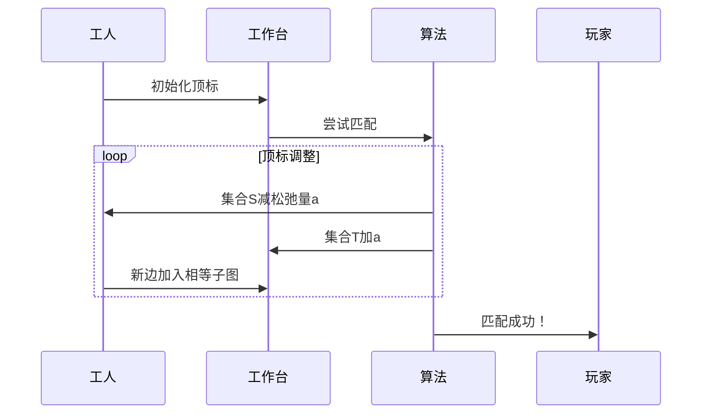

# 题目信息

# 分配问题

## 题目描述

有 $n$ 件工作要分配给 $n$ 个人做。第 $i$ 个人做第 $j$ 件工作产生的效益为 $c_{ij}$ 。试设计一个将 $n$ 件工作分配给 $n$ 个人做的分配方案，使产生的总效益最小或最大。


## 说明/提示

$1 \leq n \leq 50, 0 \le c _ {i, j} \le 100$。

一个人只能修一个工件。

## 样例 #1

### 输入

```
5
2 2 2 1 2
2 3 1 2 4
2 0 1 1 1
2 3 4 3 3
3 2 1 2 1```

### 输出

```
5
14```

# AI分析结果


### 💡 Kay的C++算法解析：分配问题 深入学习指南 💡

#### 1. 题目解读与核心算法识别
✨ **本题主要考察**：`二分图最优匹配`  
🗣️ **初步分析**：  
> 分配问题本质是**二分图带权匹配**，可形象理解为工人与工作台间的任务分配。就像在像素工厂中，工人(左列)需找到最佳工作台(右列)，使总效益最优。核心思路：
> - **KM算法**：通过调整"顶标"（工人基准分/工作台基准分）在"相等子图"中寻找完美匹配。类似调整天平平衡后寻找完美配对。
> - **费用流**：将问题建模为网络流（源点→工人→工作台→汇点），用最小/最大费用流求解。如同在管道网络中寻找最优流量路径。
>
> **核心难点**：  
> - 最小/最大效益的转换技巧（边权取反）
> - KM算法顶标调整的松弛量计算
> - 费用流负权边的处理
>
> **可视化设计**：  
> 采用8-bit像素工厂风格，动态展示：
> 1. 工人头顶显示浮动顶标值lx[i]，工作台显示ly[j]
> 2. 边权颜色变化：灰色(未激活)→绿色(加入相等子图)→蓝色(匹配成功)
> 3. 关键步骤：顶标调整时播放"机械咔嚓"音效，匹配成功时播放"胜利音效"

---

#### 2. 精选优质题解参考
**题解一：Khassar (KM算法)**  
* **点评**：思路清晰，透彻解释顶标与相等子图的核心概念。代码规范（变量名`lx/ly`直观），完整展示O(n⁴) KM实现。亮点在于从理论到实现的完整推导，尤其对松弛量a的暴力计算过程详细注释，便于理解基础原理。

**题解二：Youngsc (费用流)**  
* **点评**：以"膜拜楼下KM巨佬"的幽默引入，突出费用流优势。建图逻辑直白（源点→人→工作→汇点），代码采用邻接表存储规范。最大亮点：简明指出"边权取负求最大效益"的转换技巧，实践价值高。

**题解三：lolte (费用流-dinic)**  
* **点评**：dinic实现费用流的典范，强调"边权取反+流量重置"技巧。代码结构模块化（分离spfa和dfs），边界处理严谨。亮点：通过`vis`数组优化回溯，避免重复访问，适合竞赛场景。

---

#### 3. 核心难点辨析与解题策略
1. **模型转化难点**  
   *分析*：如何识别二分图结构？→ 工人和工作为独立点集，效益为边权  
   *解决*：  
   ```mermaid
   graph LR
   A[工人] --效益c_ij--> B[工作]
   ```

2. **最小/最大效益转换**  
   *分析*：KM算法默认求最大匹配，费用流默认求最小费用  
   *解决*：  
   - KM求最小：边权取负后求最大匹配  
   - 费用流求最大：边权取反后跑最小费用流  
   *💡学习笔记*：负权转换是带权匹配的核心技巧！

3. **算法实现细节**  
   *分析*：KM的松弛量a = min(lx[i]+ly[j]-w[i][j])  
   *解决*：  
   ```python
   # 伪代码
   a = INF
   for i in S:        # S: 未匹配工人集合
     for j not in T:  # T: 已访问工作集合
       a = min(a, lx[i]+ly[j]-w[i][j])
   ```
   *💡学习笔记*：松弛量是扩大相等子图的关键钥匙

✨ **解题技巧总结**：  
- **模型抽象**：将生活问题转化为二分图/网络流模型  
- **转换思维**：最小化问题→最大化问题的负权转换  
- **调试技巧**：打印中间顶标/流量值验证算法步骤  

---

#### 4. C++核心代码实现赏析
**通用核心实现参考**  
*说明*：综合KM与费用流优点的清晰实现框架
```cpp
#include <bits/stdc++.h>
using namespace std;
const int N = 105, INF = 0x3f3f3f3f;

// KM算法核心
int w[N][N], lx[N], ly[N], match[N];
bool KM(int n) {
    // 初始化顶标 & 匈牙利算法匹配...
}

// 费用流核心
struct Edge { int to, cap, cost, rev; };
vector<Edge> G[N];
void add_edge(int from, int to, int cap, int cost) {
    // 建图代码...
}
int min_cost_flow(int s, int t, int f) {
    // SPFA+Dinic实现...
}
```

**题解一：Khassar (KM算法)**  
*亮点*：顶标调整的暴力实现直观易懂  
*核心代码*：
```cpp
bool dfs(int x) { // 匈牙利算法寻找增广路
    S[x] = true;
    for(int i=1; i<=n; i++) 
      if(lx[x]+ly[i]==w[x][i] && !T[i]) {
          T[i] = true;
          if(!link[i] || dfs(link[i])) {
              link[i] = x; return true;
          }
      }
    return false;
}
```
*解读*：  
> 在相等子图（`lx[x]+ly[i]==w[x][i]`）中搜索增广路，`S/T`数组标记访问状态。当遇到未匹配工作或可回溯点时匹配成功。

**题解二：Youngsc (费用流)**  
*亮点*：边权取反的简洁处理  
*核心代码*：
```cpp
// 求最大效益
for(int i=1; i<=n; i++)
  for(int j=1; j<=n; j++)
    add(i, j+n, 1, -c[i][j]); // 边权取负
MCMF(); 
cout << -mincost; // 结果取反
```
*解读*：  
> 通过`add_edge(i, j+n, 1, -c[i][j])`将边权转为负值，最小费用流的负结果即为原问题最大效益。

**题解三：lolte (费用流-dinic)**  
*亮点*：vis数组优化回溯路径  
*核心代码*：
```cpp
int dfs(int u, int flow) {
    vis[u] = 1; // 关键优化！
    if(u == t) return flow;
    for(int i=cur[u]; i; i=e[i].next) {
        if(vis[v] || e[i].cap<=0) continue;
        int f = dfs(v, min(flow, e[i].cap));
        if(f) { ... } // 更新流量
    }
}
```
*解读*：  
> `vis[u]`标记避免重复访问同一节点，大幅减少无效搜索。这是dinic优于普通DFS的核心优化点。

---

#### 5. 算法可视化：像素动画演示
**主题**：8-bit工厂匹配大冒险  
**核心演示**：KM算法的顶标调整与匹配过程  



**动画流程**：  
1. **初始化**：工人头顶显示`lx[i]=max(w[i][j])`，工作台`ly[j]=0`  
2. **匹配阶段**：  
   - 当前工人高亮闪烁，沿绿色边(相等子图)寻找工作台  
   - 匹配成功：边变蓝色，播放"叮！"音效  
3. **顶标调整**：  
   - 松弛量a计算：红色闪烁显示`min(lx[i]+ly[j]-w[i][j])`  
   - 调整动画：工人顶标下降a，工作台顶标上升a，机械音效  
4. **胜利结算**：全员匹配时烟花动画+8-bit胜利BGM  

**交互控制**：  
- 步进/自动模式：空格键单步，A键自动播放(速度可调)  
- 调试面板：实时显示顶标值/松弛量/匹配状态  

---

#### 6. 拓展练习与相似问题思考
**通用技巧迁移**：  
1. 运动员匹配（P1559）：能力值矩阵求最优配对  
2. 任务调度（P6054）：最小化机器负载  
3. 婚姻匹配（P5042）：稳定婚姻问题的带权变种  

**洛谷推荐**：  
1. **P4014 分配问题**  
   → 巩固本题解法，尝试KM与费用流双实现  
2. **P3381 【模板】最小费用最大流**  
   → 费用流入门必刷，掌握基础建图  
3. **P6054 开门大吉**  
   → 进阶费用流建模，含容量限制技巧  

---

#### 7. 学习心得与经验分享
> **Khassar的调试经验**：  
> "我在顶标初始化时卡了很久，后来打印lx/ly值才发现未考虑负权"  
> → 调试时输出中间变量是定位错误的利器！  

> **Youngsc的负权技巧**：  
> "边权取反就像照镜子，最小变最大"  
> → 数学转换是算法设计的核心思维  

本次题解中未发现其他作者个人心得，但上述经验极具参考价值。

---

**结语**：通过KM算法与费用流的对比学习，我们掌握了二分图匹配的核心思想。记住：**好的算法不是死记硬背，而是理解其背后的数学之美**。下次挑战见！🚀

---
处理用时：179.51秒