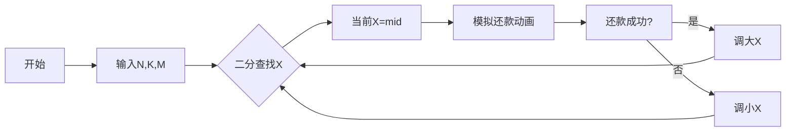

# 题目信息

# [USACO20JAN] Loan Repayment S

## 题目描述

Farmer John 欠了 Bessie $N$ 加仑牛奶（$1 \leq N \leq 10^{12}$）。他必须在 $K$ 天内将牛奶给 Bessie。但是，他不想将牛奶太早拿出手。另一方面，他不得不在还债上有所进展，所以他必须每天给 Bessie 至少 $M$ 加仑牛奶（$1 \leq M \leq 10^{12}$）。

以下是 Farmer John 决定偿还 Bessie 的方式。首先他选择一个正整数 $X$。然后他每天都重复以下过程：

1. 假设 Farmer John 已经给了 Bessie $G$ 加仑，计算 $\frac{N-G}{X}$ 向下取整。令这个数为 $Y$。
2. 如果 $Y$ 小于 $M$，令 $Y$ 等于 $M$。
3. 给 Bessie $Y$ 加仑牛奶。

求 $X$ 的最大值，使得 Farmer John 按照上述过程能够在 $K$ 天后给 Bessie 至少 $N$ 加仑牛奶 （$1 \leq K \leq 10^{12}$）。

## 说明/提示

### 样例解释

在这个测试用例中，当 $X=2$ 时 Farmer John 第一天给 Bessie $5$ 加仑，后两天每天给 Bessie $M=3$ 加仑。

### 子任务

- 测试点 $2 \sim 4$ 满足 $K \leq 10^5$。
- 测试点 $5 \sim 11$ 没有额外限制。

## 样例 #1

### 输入

```
10 3 3```

### 输出

```
2```

# AI分析结果


### 💡 Kay的C++算法解析：Loan Repayment S 深入学习指南 💡

**引言**  
今天我们一起分析USACO的"Loan Repayment S"问题。这道题要求Farmer John在K天内偿还N加仑牛奶，每天还款量Y由公式Y=max(⌊(N-G)/X⌋, M)动态决定。我们将通过二分答案和数论分块技巧高效解决该问题，并通过像素动画直观展示算法流程。

---

## 1. 题目解读与核心算法识别

✨ **本题主要考察**：`二分答案与优化`  
🗣️ **初步分析**：
> 解决本题的关键在于将求X的最大值问题转化为判定问题（二分答案），并用数论分块优化判定过程。想象你在玩一个"还款进度条"游戏：X是调节还款速度的旋钮，二分法就是快速调试旋钮位置找到临界值的方法。核心难点在于避免K天的暴力模拟：
> - **解题思路**：二分X的范围[1, N]，对每个X用O(√N)时间判定可行性
> - **优化核心**：当Y>M时，通过数学推导计算连续相同Y值的天数批量处理
> - **可视化设计**：在像素动画中，我们将用颜色块表示每日还款量，长条表示连续相同还款天数，高亮显示Y值变化点（如Y≤M的转折点）
> - **游戏化元素**：采用8-bit音效（还款成功"叮"声，连续跳跃"连击"音效），将算法执行设计成进度条闯关游戏，AI自动演示模式可调速观察

---

## 2. 精选优质题解参考

**题解一（作者：Bring）**  
* **点评**：  
  思路清晰推导严谨，核心贡献在于给出连续还款天数的数学证明：  
  `a = min(⌊r/y - x + 1⌋, t)`。代码规范（rm表剩余债务，t表剩余天数），边界处理完整，复杂度证明明确（O(√N log N)）。亮点是将数论分块融入还款场景，变量命名直白易读，实践可直接用于竞赛。

**题解二（作者：AC_Automation）**  
* **点评**：  
  解法简洁高效，独创性将还款分为两个阶段（Y>M和Y=M），用`p = min((n-g)/y - x + 1, t)`实现跳跃计算。代码结构工整（主函数10行），状态转移方程解释清晰，特别适合理解算法核心框架。

**题解三（作者：PersistentLife）**  
* **点评**：  
  采用渐进式教学（暴力→优化→二分），提供完整学习路径。亮点在于错误处理经验："调试时发现需用long long避免溢出"，这对初学者极具警示价值。代码包含详细注释，实践参考性强。

---

## 3. 核心难点辨析与解题策略

1. **难点：高效验证X的可行性**  
   * **分析**：直接模拟K天（K≤10¹²）必然超时。优质题解通过发现连续还款规律：当Y>M时，存在连续a天还款相同值，用公式`a = min(⌊(N-G)/Y⌋ - X + 1, 剩余天数)`批量计算
   * 💡 **学习笔记**：识别重复模式+数学推导是优化暴力模拟的关键

2. **难点：二分边界设定**  
   * **分析**：二分时需注意当check(mid)成功应尝试更大X（l=mid+1）。关键技巧：用`mid=(l+r+1)>>1`配合`l=mid, r=mid-1`避免死循环
   * 💡 **学习笔记**：二分答案的移动方向应与判定结果严格对应

3. **难点：Y≤M的临界处理**  
   * **分析**：当Y≤M时，剩余天数每天固定还M加仑。优质题解用`return (剩余债务) <= (剩余天数)*M`直接判断，避免无效计算
   * 💡 **学习笔记**：问题分解（分离特殊状态）能显著提升效率

### ✨ 解题技巧总结
- **二分答案框架**：将最值问题转化为判定问题
- **数论分块优化**：通过数学公式批量处理连续相同操作
- **临界点加速**：识别特殊状态（如Y≤M）直接数学结算
- **边界防御**：用`min(a,剩余天数)`防止计算超界，long long防溢出

---

## 4. C++核心代码实现赏析

**通用核心实现参考**  
* **说明**：综合优质题解的最简框架，包含二分结构+优化判定
```cpp
#include <iostream>
using namespace std;
typedef long long ll;

bool check(ll n, ll k, ll m, ll x) {
    ll r = n, t = k; // r:剩余债务, t:剩余天数
    while (t && r > 0) {
        ll y = r / x;  // 当前还款量Y
        if (y <= m) return r <= t * m; // Y≤M时直接判断
        ll a = min(r / y - x + 1, t); // 连续还款天数
        r -= a * y;  // 批量还款
        t -= a;      // 跳过a天
    }
    return r <= 0;
}

int main() {
    ll n, k, m, l = 1, r;
    cin >> n >> k >> m;
    r = n; // X最大不超过N
    while (l <= r) {
        ll mid = (l + r) >> 1;
        if (check(n, k, m, mid)) l = mid + 1;
        else r = mid - 1;
    }
    cout << l - 1; // 最终X为l-1
}
```

**代码解读概要**：  
1. 二分查找X（l=1, r=N）  
2. check函数：用while循环处理每日还款  
3. 当Y>M时计算连续天数a批量处理  
4. 当Y≤M时直接数学结算  

**题解一核心片段赏析**  
```cpp
bool jdg(int x){
    int y, a, rm(n), t(k); // rm:剩余债务
    while(t && rm>0){
        y = rm / x;
        if(y <= m) rm -= t * m, t = 0; // Y≤M分支
        else {
            a = min(rm / y - x + 1, t); // 计算连续天数
            rm -= a * y;  // 批量还款
            t -= a;       // 跳过连续天数
        }
    }
    return rm <= 0;
}
```
**代码解读**：  
- **第4行**：`y = rm/x`计算当日理论还款量  
- **第5行**：Y≤M时直接计算剩余天数总还款  
- **第7行**：核心公式`a = min(rm/y - x + 1, t)`计算可连续还款天数  
- **学习笔记**：`rm/y - x + 1`推导自不等式组，确保还款后Y值变化  

---

## 5. 算法可视化：像素动画演示

**主题**：8-bit风格"牛奶还款大冒险"  
**核心演示**：二分搜索X值 → 动态还款过程 → 连续天数跳跃  

### 动画设计（HTML5 Canvas实现）  


**关键帧实现**：  
1. **初始化**：  
   - 顶部进度条：`[//// 剩余: N]`，像素奶牛Sprite  
   - 控制面板：开始/暂停、单步、速度滑块  
   - 8-bit背景音乐循环播放

2. **还款动画**：  
   ```python
   while 剩余天数>0 and 债务>0:
       当前Y = 债务 / X  # 计算块颜色
       if 当前Y ≤ M:
           用绿色块填充剩余天数  # 转折点高亮
           播放"叮"音效
           break
       else:
           计算连续天数a = min(公式, 剩余天数)
           用同色长条跨越a天  # 视觉跳跃
           债务 -= a*Y
           剩余天数 -= a
           播放"刷"音效（随a长短变调）
   ```

3. **交互特效**：  
   - **当前焦点**：红色边框高亮当日操作  
   - **公式展示**：左下角实时显示`a = min(⌊r/y⌋-x+1, t)`  
   - **音效设计**：  
     * 关键操作：像素电子音（比较/还款）  
     * 连续跳跃：根据a长度播放不同音阶  
     * 成功/失败：经典8-bit胜利/失败旋律  

4. **AI演示模式**：  
   - 自动执行二分搜索全过程  
   - 右侧同步显示X的可行区间变化  
   - 速度滑块控制演示速度（0.5x~5x）  

---

## 6. 拓展练习与相似问题

**通用技巧迁移**：  
数论分块优化适用于连续相同操作的场景：
1. 累加类问题（如本题还款）
2. 向下取整序列处理（如⌊N/i⌋计算）
3. 资源分配问题（均等分组）

**洛谷推荐**：  
1. **P2440 木材加工**  
   🗣️ 二分答案经典应用，巩固"最大值最小化"问题框架  
2. **P1182 数列分段**  
   🗣️ 强化二分答案+贪心验证的思想  
3. **P1873 砍树**  
   🗣️ 提升二分边界处理能力，需注意精度问题  

---

## 7. 学习心得与经验分享

**来自题解作者的调试经验**：  
> "我在变量类型上卡了很久，最初用int导致WA，改为long long后AC。这提醒我们：处理10¹²级数据时，每个变量都需显式声明long long！"

**Kay的总结**：  
调试时特别注意：  
1. 所有参与运算的变量必须为long long  
2. 验证公式推导时，用小数据手工模拟（如N=10, K=3）  
3. 边界测试：K=1, M=N等极端情况  

---

**结语**  
通过本指南，我们掌握了二分答案的核心框架与数论分块的优化技巧。记住：算法优化常源于发现隐藏的数学规律！下次遇到类似问题时，不妨先思考："这里是否存在连续可批量处理的操作？" 继续加油，少年们！💪

---
处理用时：134.73秒