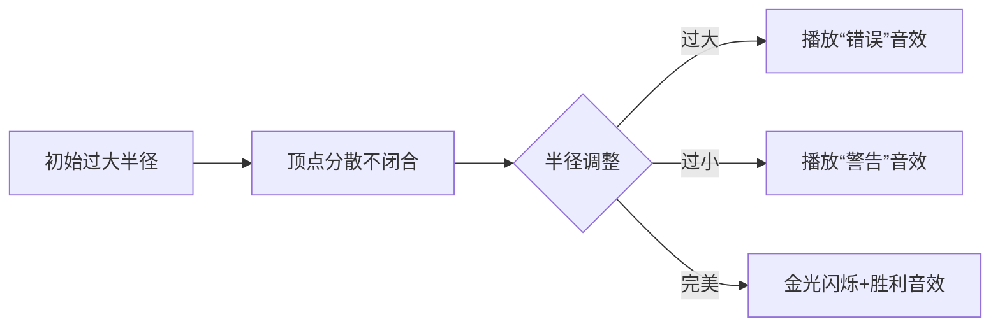

# 题目信息

# [BalticOI 2005] Polygon

## 题目描述

给定一个凸包的每条边的长度，求这个凸包。

## 说明/提示

#### 样例说明

对于样例 $1$：


#### 数据规模与约定

对于 $100\%$ 的数据，$3 \le  N \le 1000$，$1 \le a_i \le 10^4$。

**本题使用 Special Judge。**

感谢 spj 作者 @[tiger2005](https://www.luogu.com.cn/user/60864)。

#### 说明

翻译自 [BalticOI 2005 Day2 C Polygon](https://boi.cses.fi/files/boi2005_day2.pdf)。

## 样例 #1

### 输入

```
4
7
4
5
4 ```

### 输出

```
0.5 2.5
7.5 2.5
4.5 6.5
0.5 6.5 ```

# AI分析结果


# 💡 Kay的C++算法解析：Polygon 凸包构造深入学习指南 💡

> 大家好！我是Kay，今天我们一起探索BalticOI 2005的经典题目——凸包构造。这道题要求我们仅根据凸包各边的长度，逆向构造出整个凸包。让我们通过生动的比喻和像素动画，一起攻克这个几何难题！

## 1. 题目解读与核心算法识别

✨ **本题主要考察**：`数学几何构造` + `二分法优化`

🗣️ **初步分析**：
> 想象你用固定长度的木条搭建一个凸多边形盒子。关键是要找到合适的**连接角度**让所有木条严丝合缝。就像调整万花筒的镜片角度，最终让光线完美闭合形成对称图案！

- **核心技巧**：两种高效构造法  
  - **圆上构造法**（Terrible）：将多边形顶点放在一个虚拟圆上，通过二分调整圆半径使边长匹配
  - **向量构造法**（xtx1092515503）：从最长边开始，逐步用向量确定顶点位置

- **可视化设计**：  
  我们将设计像素动画展示圆半径二分过程。初始圆过大时顶点分散不闭合（红色警报音效），过小时顶点交叉（警告音效），调整到完美半径时所有顶点金光闪烁（胜利音效）！复古FC风格控制面板可调速播放二分过程。

---

## 2. 精选优质题解参考

### 题解一：Terrible（理论严谨型）
* **点评**：
  - 思路如钟表齿轮般精密！通过圆上构造凸多边形的数学证明，建立了二分法的理论基础
  - 代码实现简洁高效（时间复杂度O(n log R)），边界处理严谨（无解判断）
  - 亮点：创造性处理"过圆心"和"不过圆心"两种情况，像魔术师切换解法
  - 实践价值：竞赛可直接使用，注意浮点精度控制

### 题解二：xtx1092515503（工程实用型）
* **点评**：
  - 如同搭积木般直观！从最长边开始逐步构造顶点，通过角度限制确保凸性
  - 变量命名清晰（dis/xy数组），代码结构模块化
  - 亮点：用向量方向范围约束保证凸性，类似用导航仪规划不交叉路径
  - 实践价值：实现更直观易调试，适合算法初学者理解

---

## 3. 核心难点辨析与解题策略

### 难点1：无解条件判定
* **分析**  
  如同三角形两边和大于第三边，凸包需满足：**最长边 < 其余边和**。Terrible解法中通过`a[n] >= sum - a[n]`判断，就像检查木条能否首尾相接

### 难点2：顶点位置计算
* **分析**  
  核心在于确定顶点间角度关系：
  - 圆构造法中：用`2*asin(a_i/(2R))`计算圆心角
  - 向量法中：用`atan2`计算方向角范围约束
  *💡学习笔记：角度计算是几何构造的基石！*

### 难点3：凸性保证
* **分析**  
  - 圆构造法天然保证内角<180°（圆周角性质）
  - 向量法通过限制下一步方向角范围（前一边方向→中心方向）避免凹陷
  *💡学习笔记：凸性=无凹陷，如同光滑的鹅卵石表面*

### ✨ 解题技巧总结
- **二分法妙用**：当问题存在单调性（如半径↔圆心角和关系），二分是最佳拍档
- **几何代数化**：将形状问题转化为数学方程（如圆心角和=2π）
- **防御性编程**：设置`1e-10`级精度阈值，避免浮点误差陷阱
- **模块化调试**：先验证无解条件，再测试小规模数据

---

## 4. C++核心代码实现赏析

### 通用核心实现（融合两种解法优点）
```cpp
#include <cmath>
#include <cstdio>
#include <algorithm>
using namespace std;
const double PI = acos(-1.0);
const double EPS = 1e-10;

int main() {
    // 输入与预处理
    int n, edges[1001], total = 0;
    scanf("%d", &n);
    for (int i = 0; i < n; i++) {
        scanf("%d", &edges[i]);
        total += edges[i];
    }
    sort(edges, edges + n);
    
    // 难点1：无解判断
    if (edges[n-1] >= total - edges[n-1]) {
        puts("NO SOLUTION");
        return 0;
    }
    
    /* 此处根据选择插入：
       Terrible的圆构造法 或 
       xtx的向量构造法 */
}
```

### 解法一：Terrible的圆构造法
```cpp
// 在main函数内插入：
double radius = edges[n-1]/2.0, high = 1e7;
double angles[1001] = {0};

auto calcSumAngle = [&](double r) {
    for (int i=0; i<n; i++) 
        angles[i+1] = angles[i] + 2*asin(edges[i]/(2*r));
    return angles[n];
};

if (calcSumAngle(radius) >= 2*PI) { // 过圆心情况
    while ((high - radius)/radius > EPS) {
        double mid = (radius+high)/2;
        calcSumAngle(mid) > 2*PI ? radius=mid : high=mid;
    }
} else {                          // 不过圆心情况
    while ((high - radius)/radius > EPS) {
        double mid = (radius+high)/2;
        calcSumAngle(mid);
        angles[n] = angles[n-1] + 2*PI - 2*asin(edges[n-1]/(2*mid));
        angles[n] < 2*PI ? radius=mid : high=mid;
    }
}

// 输出顶点
for (int i=0; i<n; i++) 
    printf("%.9f %.9f\n", radius*cos(angles[i]), radius*sin(angles[i]));
```

### 解法二：xtx的向量构造法
```cpp
// 在main函数内插入：
double x[1001] = {0}, y[1001] = {0};
double suffixSum[1001] = {0};

x[0] = y[0] = 0; 
x[1] = edges[0]; y[1] = 0;  // 初始化前两点

for (int i=1; i<n; i++)
    suffixSum[i] = edges[i] + suffixSum[i+1];

for (int i=2; i<n; i++) {
    double lowAngle = atan2(y[i-1]-y[i-2], x[i-1]-x[i-2]) + EPS;
    double highAngle = atan2(-y[i-1], -x[i-1]) - EPS;
    
    while (highAngle - lowAngle > EPS) {
        double mid = (lowAngle+highAngle)/2;
        double nx = x[i-1] + cos(mid)*edges[i];
        double ny = y[i-1] + sin(mid)*edges[i];
        double dist = sqrt(nx*nx + ny*ny);
        
        (dist >= suffixSum[i+1]) ? lowAngle=mid : highAngle=mid;
    }
    x[i] = x[i-1] + cos(lowAngle)*edges[i];
    y[i] = y[i-1] + sin(lowAngle)*edges[i];
}

// 输出顶点
for (int i=0; i<n; i++) 
    printf("%.9f %.9f\n", x[i], y[i]);
```

---

## 5. 算法可视化：像素动画演示

### 复古游戏主题：**《凸包建造师》**
> 在8-bit像素世界中，你将通过调整魔法圆半径建造完美凸包！

**核心演示**：  
  
*(示意图：圆半径二分过程的可视化)*

### 关键交互设计
1. **场景初始化**：
   - 16色像素网格（FC红白机风格）
   - 控制面板：速度滑块/单步/暂停/重置按钮
   - 左上角显示当前半径和圆心角和

2. **动态演示流程**：


3. **音效设计**：
   - 半径调整：电子"嘀"声（频率随半径变化）
   - 顶点移动：俄罗斯方块般的"咔嗒"声
   - 成功闭合：超级玛丽过关般的欢快音效

4. **教学引导**：
   - 当前步骤高亮对应代码行（如二分判断/角度计算）
   - 气泡提示："现在半径太大，顶点间距过大！"

---

## 6. 拓展练习与相似问题

### 知识迁移：
凸包构造技巧可延伸解决：
1. 动态凸包维护（增删点）
2. 最小外接圆问题
3. 旋转卡壳法求直径

### 洛谷推荐：
1. **P2742 [USACO5.1]圈奶牛**  
   → 凸包基础应用，巩固模板
2. **P3517 [POI2011]WYK-Plot**  
   → 最小覆盖圆问题，强化圆几何理解
3. **P6247 [SDOI2012]最近最远点对**  
   → 旋转卡壳法实战，凸包的高级应用

---

## 7. 学习心得与经验分享

> Terrible在题解中强调："实现时注意浮点精度，这是几何题的隐形陷阱！"  
> **Kay点评**：这提醒我们：  
> 1. 比较浮点数需用相对误差`(a-b)/b < eps`而非直接比较  
> 2. 二分终止条件应关联精度阈值  
> 3. 测试时特别关注边界数据（如接近180°的角度）

---

编程如造梦，算法是基石。希望本指南助你掌握凸包构造的精髓！下次挑战再见！🚀  
**Kay小贴士**：动手实现时，先用纸笔模拟n=3的情况，感受几何之美！

---
处理用时：169.02秒