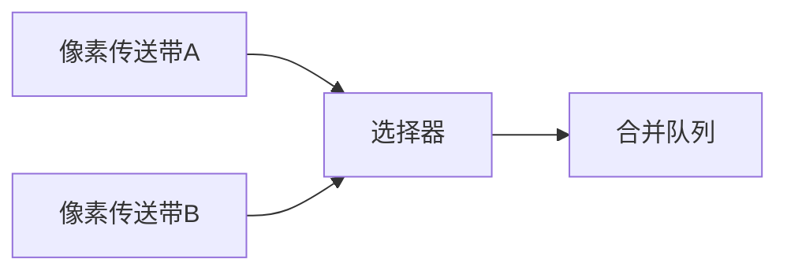

# 题目信息

# [ONTAK2015] Tasowanie

## 题目描述

给定两个数字串 $A$ 和 $B$，通过将 $A$ 和 $B$ 进行二路归并得到一个新的数字串 $T$，请找到字典序最小的 $T$。

## 说明/提示

对于 $100\%$ 的数据，$1 \leq n, m \leq 2 \times 10^5$，组成 $A, B$ 的每个数字为不超过 $10^3$ 的正整数。

- 2023.9.10 添加两组 hack 数据。

## 样例 #1

### 输入

```
6
1 2 3 1 2 4
7
1 2 2 1 3 4 3```

### 输出

```
1 1 2 2 1 2 3 1 2 3 4 3 4```

# AI分析结果


### 💡 Kay的C++算法解析：[ONTAK2015] Tasowanie 深入学习指南 💡

#### 1. 题目解读与核心算法识别
✨ **本题主要考察**：`贪心+字符串比较优化`  
🗣️ **初步分析**：
> 这道题就像**两条传送带合并成一条生产线**，每次需要选择当前最小的零件组装。核心贪心策略是：当两个队列头部元素不同时选最小值；当相同时，需预判后续元素以保证最终序列字典序最小。  
> - **核心难点**在于相等元素的处理：需高效比较后续子串（二分+哈希或后缀数组）
> - **可视化设计**：用像素传送带展示队列合并过程。相等时启动扫描仪（跳跃式二分查找），高亮比较位置，音效区分选择/扫描/完成操作
> - **复古游戏化**：FC风格像素传送带，扫描仪移动时有"滴"声，选择元素时触发8-bit音效，每合并10个零件奖励星星动画

---

#### 2. 精选优质题解参考
**题解一：yukimianyan（5星）**  
* **点评**：  
  思路清晰运用二分+哈希，将O(n²)暴力优化到O(n log n)。哈希模板封装规范（`hasher`结构体），边界处理严谨（末尾添加INF）。代码模块化强，`binary()`函数职责单一，实践可直接用于竞赛。

**题解二：Engulf（5星）**  
* **点评**：  
  与题解一思路一致但实现更简洁。亮点在边界处理技巧（`a.push_back(INF)`）避免复杂判断。哈希使用自然溢出，省去取模运算。变量命名规范（`x,y`作指针），适合初学者学习。

**题解三：Augen_stern（4星）**  
* **点评**：  
  提供后缀数组(SA)新视角，预处理后O(1)比较后缀。代码结构完整（SA模板封装），但拼接串时特殊字符处理较复杂。学习价值在于展示不同优化思路，适合想挑战高级数据结构的同学。

---

#### 3. 核心难点辨析与解题策略
1. **相等元素的处理策略**  
   *分析*：当`a[i]=b[j]`时，需比较`a[i..]`与`b[j..]`字典序。优质题解用二分+哈希加速比较：二分查找第一个不同位置，哈希值相等时扩大范围，不等时缩小范围  
   💡 **学习笔记**：字典序比较本质是找首个相异点

2. **高效比较实现方案**  
   *分析*：双重循环比较需O(n²)。解决方案：  
   - 预处理哈希（`hash[i] = hash[i-1]*BASE + s[i]`）  
   - 二分将比较次数降为O(log n)  
   💡 **学习笔记**：`get_hash(l,r)=hash[r]-hash[l-1]*BASE^(r-l+1)`

3. **边界条件处理技巧**  
   *分析*：当比较位置接近末尾时易越界。通用技巧：在序列尾添加极大值(INF)，使二分安全终止  
   💡 **学习笔记**：哨兵值(INF)可简化边界判断

✨ **解题技巧总结**  
- **问题分解**：将合并过程拆解为单步选择+相等特判  
- **算法优化**：用空间换时间（哈希预处理）  
- **调试技巧**：构造全相同数据测试边界情况

---

#### 4. C++核心代码实现赏析
```cpp
// 通用核心实现（综合题解1/2优化）
#include <vector>
using namespace std;
const int INF = 0x3f3f3f3f, BASE = 233;

struct Hasher {
    vector<long long> h, p;
    void init(const vector<int>& s) {
        int n = s.size();
        h.resize(n+1); p.resize(n+1);
        h[0]=0; p[0]=1;
        for(int i=0; i<n; i++) {
            h[i+1] = h[i]*BASE + s[i];
            p[i+1] = p[i]*BASE;
        }
    }
    long long get(int l, int r) { // [l,r]
        return h[r+1] - h[l] * p[r-l+1];
    }
};

vector<int> mergeSeq(vector<int> a, vector<int> b) {
    a.push_back(INF); b.push_back(INF); // 哨兵
    Hasher ha, hb; 
    ha.init(a); hb.init(b);
    
    vector<int> res;
    int i = 0, j = 0, n = a.size(), m = b.size();
    while(i < n-1 || j < m-1) { // 忽略哨兵
        if(a[i] != b[j]) 
            res.push_back(a[i] < b[j] ? a[i++] : b[j++]);
        else {
            int L = 1, R = min(n-i, m-j);
            while(L <= R) { // 二分找首个不同位置
                int mid = (L+R)/2;
                (ha.get(i, i+mid-1) == hb.get(j, j+mid-1)) ? L=mid+1 : R=mid-1;
            }
            (a[i+R] <= b[j+R]) ? res.push_back(a[i++]) : res.push_back(b[j++]);
        }
    }
    return res;
}
```

**题解一：yukimianyan 片段**  
```cpp
// 二分比较函数
int binary(int L,int R,int i[2]){
    while(L<=R){
        int mid=(L+R)>>1;
        if(ha.get(i[0],i[0]+mid-1)==hb.get(i[1],i[1]+mid-1))
            L=mid+1;
        else R=mid-1;
    }
    return R; // 返回首个不同位置
}
```
> 💡 **学习笔记**：二分终止时，R指向首个不同位置的前一位

**题解三：Augen_stern 片段**  
```cpp
// 后缀数组比较
if(rk[p][now1]<rk[p][now2]) 
    cout<<a[now1++]<<' ';
```
> 💡 **学习笔记**：后缀数组rk值越小，字典序越小

---

### 5. 算法可视化：像素动画演示  
**主题**：8-bit工厂传送带合并系统  
**核心流程**：  


**关键动画设计**：  
1. **初始化**  
   - 两条FC风格传送带（红/蓝像素块），合并队列（绿色网格）  
   - 控制面板：步进/暂停/调速滑块（复古旋钮UI）

2. **元素比较**  
   - 不相同时：较小方块闪光并滑入合并队列，触发"叮"声  
   - 相同时：激活扫描仪（黄色像素框），按二分逻辑跳跃：
     ```python
     def scan_animation():
         l, r = 0, min(len_a, len_b)
         while l <= r:
             mid = (l+r)//2
             highlight(mid) # 高亮当前位置
             play_sound('bleep')
             if hash_eq(mid): l=mid+1 
             else: r=mid-1
     ```

3. **游戏化元素**  
   - 每合并10个元素触发"连击"：像素烟花+得分上升  
   - 背景音乐：FC芯片音乐（合并时节奏加快）  
   - 错误处理：选择错误路径时播放"碎裂"音效

**技术实现**：  
- 用Canvas绘制动态网格（每个数字=16x16像素块）  
- 音效系统：Web Audio API生成8-bit音效  
- 状态同步：动画帧绑定代码高亮（如图二时黄色边框）

---

#### 6. 拓展练习与相似问题思考
**技巧迁移场景**：  
1. 多路归并的字典序优化  
2. 循环字符串的最小表示法  
3. 后缀数组的字典序应用  

**洛谷推荐**：  
1. [P2870] Best Cow Line  
   → **推荐理由**：同需比较后缀字典序，强化贪心决策  
2. [P1368] 最小表示法  
   → **推荐理由**：单串循环移位比较，复用二分+哈希技巧  
3. [P4051] 字符加密  
   → **推荐理由**：后缀数组经典应用场景  

---

#### 7. 学习心得与经验分享
> **题解一作者调试经验**：  
> *"在nxt数组路径压缩时，未处理连续相同元素导致死循环"*  
> → **Kay总结**：递归函数必须设置终止条件，可通过添加`nxt[i]=i+1`避免循环  

> **后缀数组题解共性**：  
> *"SA需在串尾添加特殊字符（如3001）"*  
> → **Kay建议**：特殊值应大于所有数据（设INF=0x3f3f3f3f）  

---

通过本次分析，我们掌握了合并序列的贪心策略与字符串比较优化技巧。记住：遇到相等元素时，**预判后续走势**是解题关键！大家可尝试用像素动画工具复现归并过程，直观感受算法之美。下次见！🚀

---
处理用时：190.23秒