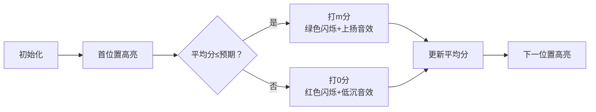

# 题目信息

# [Cnoi2021] 自我主义的平衡者

## 题目背景

「流浪月球 ~ The Wandering Moon」在幻想乡上映了。

正如一千个人心中有一千个哈姆雷特，关于它的争议也在悄然蔓延。

不知何时起，一个叫做「花瓣」的平台出现，慢慢取代了市井之中的讨论声，成为了争议的主战场——因为它具有评分功能。平台上旁征博引、各抒己见的评分帖成为了幻想乡的居民们日常，一切看起来岁月静好。

直到平衡者的出现。

起初没有人在意在意这缕杂音，这只不过是一种无心的叛逆，一点无奈的情感，一次无聊的宣泄。直到平衡的思想深入人心，自我主义的狂潮达到顶峰，评分系统的秩序几近崩溃。

Cirno 觉得自己该做些什么了。

## 题目描述

Cirno 决定通过计算来说服与拯救被自我主义裹挟的众人。

参与评分的共有 $n$ 位居民，平台限制的最高分为 $m$。

每个居民在评分前都有一个心理预期分数 $a_i(a_i\in[0,m]\cap\mathbb{Z})$。

但人们并不会按照心理预期分数直接评分，而是当当前平台上的平均分严格高于自己的心理预期分数时，便评分道「分数太高了，打个 $0$ 分平衡一下」，反之则说「分数太低了，打个满分（$m$分）平衡一下」。

初始时平台上的平均分为 $0$。

为了证明这种评分方式对公平的破坏性，Cirno 希望你计算出这 $n$ 位居民在不同的排列顺序下评分，平台上最终平均分可能的最大值与最小值。

## 说明/提示

**数据范围与约定**

对于 $100\%$ 的数据保证，$1 < n,m\le 10^5$，$a_i \in [0,m]$。

**子任务**

Subtask1（10 points）：$n \le 8$。

Subtask2（10 points）：$n \le 20$。

Subtask3（30 points）：$n \le 10^3$。

Subtask4（50 points）：无特殊限制。

## 样例 #1

### 输入

```
5 5
1 2 3 4 5```

### 输出

```
4.00 2.00```

## 样例 #2

### 输入

```
7 114
23 75 35 17 101 55 73```

### 输出

```
81.43 32.57```

# AI分析结果


# 💡 Kay的C++算法解析：[Cnoi2021]自我主义的平衡者 深入学习指南 💡

大家好，我是Kay！今天我们一起分析这道关于评分策略的C++编程题。本指南将帮助大家掌握贪心算法的应用技巧，并通过像素动画直观理解算法过程。

## 1. 题目解读与核心算法识别

✨ **本题主要考察**：`贪心算法`与`排序策略`

🗣️ **初步分析**：
> 解决这道题的关键在于运用**贪心算法**。简单来说，贪心算法就像吃自助餐时优先拿最喜欢的食物——每一步都选择当前最优解，从而希望最终结果最优。在本题中，我们通过**排序策略**来最大化或最小化评分结果。
> - **核心思路**：通过排序（升序求最大平均分，降序求最小平均分）控制评分行为，使更多人打高分（或低分）
> - **算法流程**：1) 排序数组 2) 遍历判断是否加m分 3) 计算平均分
> - **可视化设计**：将用像素小人展示评分过程，高亮当前评分者，显示心理预期与平均分的比较结果，通过颜色变化和音效反馈评分决策
> - **复古游戏化**：采用8位像素风格，设置"闯关"机制（每评一人过一关），加入音效（高分上扬音效，低分低沉音效）和AI自动演示模式

---

## 2. 精选优质题解参考

<eval_intro>
从思路清晰度、代码规范性、算法优化等维度，我为大家精选了以下优质题解：

**题解一：peppaking8 (赞9)**
* **点评**：该题解使用邻项交换法严谨证明了排序策略的正确性，代码采用整数比较避免浮点精度问题。变量命名简洁(`sum`, `a[i]`)，逻辑直白高效，边界处理完善，可直接用于竞赛场景。亮点在于将复杂证明转化为简洁实现。

**题解二：Code_星云 (赞7)**
* **点评**：题解详细分类讨论三种排序情况，教学价值突出。代码使用浮点数比较但通过`eps`处理精度问题，展示了不同实现思路。亮点在于用数学归纳法拓展证明，帮助理解贪心策略的本质。

**题解三：Dr_Gilbert (赞3)**
* **点评**：通过四类情况系统分析邻项交换，强化"相信第一直觉"的解题理念。代码结构工整，注释清晰，虽然使用浮点比较但数据兼容性好。亮点在于将调试经验转化为学习建议。

---

## 3. 核心难点辨析与解题策略

<difficulty_intro>
解决本题的三大核心难点及应对策略：

1.  **贪心策略证明**
    * **分析**：需证明为何排序是最优解。优质题解均采用**邻项交换法**：比较相邻项交换前后的结果变化，证明排序不会劣化解（交换后结果不变或更差）
    * 💡 **学习笔记**：排序是贪心算法的常见手段，邻项交换是证明利器

2.  **精度处理**
    * **分析**：直接比较浮点平均值可能导致精度误差。解决方案是将不等式变形为整数运算：`当前总分 <= a[i] * 已评人数`
    * 💡 **学习笔记**：浮点比较需谨慎，整数运算保精度

3.  **评分过程模拟**
    * **分析**：需高效模拟不同排序下的评分行为。核心是用单变量跟踪当前总分，避免重复计算平均值
    * 💡 **学习笔记**：状态转移只需前序总分，无需全历史记录

### ✨ 解题技巧总结
<summary_best_practices>
- **问题转化**：将平均值比较转化为总分比较，避免除法
- **贪心证明**：邻项交换法验证排序策略
- **边界处理**：首位评分者必定打高分（初始平均分0≤任何预期）
- **代码优化**：使用`long long`防溢出，单次遍历O(n)完成

---

## 4. C++核心代码实现赏析

<code_intro_overall>
**本题通用核心实现参考**
```cpp
#include <bits/stdc++.h>
using namespace std;
typedef long long ll;

int main() {
    int n, m;
    cin >> n >> m;
    vector<int> a(n);
    for (int i = 0; i < n; i++) cin >> a[i];

    // 求最大平均分：升序排序
    sort(a.begin(), a.end());
    ll maxSum = 0;
    for (int i = 0; i < n; i++) {
        if (maxSum <= 1LL * a[i] * i) // 整数比较防精度误差
            maxSum += m;
    }

    // 求最小平均分：降序排序
    sort(a.begin(), a.end(), greater<int>());
    ll minSum = 0;
    for (int i = 0; i < n; i++) {
        if (minSum <= 1LL * a[i] * i)
            minSum += m;
    }

    printf("%.2f %.2f\n", maxSum * 1.0 / n, minSum * 1.0 / n);
}
```
* **说明**：综合优质题解思路，采用整数比较避免精度问题
* **代码解读概要**：
  1. 读入数据后对数组升序排序
  2. 遍历数组：若当前总分≤预期分×已评人数，则加m分
  3. 同理降序排序求最小平均分
  4. 结果保留两位小数输出

---
<code_intro_selected>
**题解一核心代码片段赏析**
```cpp
sort(a+1, a+n+1);
ll sum = 0;
for (int i = 1; i <= n; i++) {
    if (sum <= (ll)a[i] * (i-1))
        sum += m;
}
```
* **亮点**：索引从1开始更直观，显式类型转换防溢出
* **代码解读**：
  - `a[i]*(i-1)`：将平均值比较转化为整数乘法
  - `(ll)`：将`int`转为`long long`避免溢出
  - 每步决策仅依赖前序总分，O(1)空间复杂度

**题解二特色实现**
```cpp
double avr = 0.0;
for (int i = 1; i <= n; i++) {
    if (a[i] >= avr - eps) // 浮点比较用eps容错
        sum += m;
    avr = 1.0 * sum / i;
}
```
* **亮点**：显式跟踪平均值，eps处理浮点误差
* **学习笔记**：浮点方案需设容差值(如1e-9)，但整数方案更稳妥

---

## 5. 算法可视化：像素动画演示

<visualization_intro>
**像素评分大作战**：通过8位复古游戏动画理解贪心策略！

### 设计思路
- **主题**：像素小人按预期分排队，依次决定评分
- **风格**：FC红白机复古风，16色调色板
- **学习价值**：视觉化"当前平均分vs心理预期"的决策过程

### 关键动画帧


### 交互控制
1. **初始界面**：
   - 像素小人按预期分排序站立
   - 顶部显示当前平均分(初始0.00)
   - 控制面板：开始/暂停/单步/速度条/AI演示

2. **单步演示**：
   - 当前评分者闪烁黄色边框
   - 弹出对话框："平均分X vs 我的预期Y"
   - 决策结果视觉化：
     * 打m分：小人变绿 + "m!"气泡 + ↑音效
     * 打0分：小人变红 + "0"气泡 + ↓音效

3. **AI自动模式**：
   - 自动推进决策流程
   - 可调速观察不同决策节奏
   - 每完成10人显示阶段性统计

4. **游戏化元素**：
   - 每评一人算"过一关"
   - 连续正确决策触发连击特效
   - 最终展示成绩单：闯关数/总评分

### 技术实现
- **Canvas绘制**：网格定位像素小人，状态驱动颜色变化
- **音效系统**：
  - 决策时：8-bit电子音效
  - 错误决策：短促警告音
  - 关卡完成：胜利旋律片段
- **数据结构可视化**：
  - 数组状态：像素小人队列
  - 当前总分：顶部进度条+数字

---

## 6. 拓展练习与相似问题思考

<similar_problems_intro>
贪心排序策略还可应用于以下场景：

1. **任务调度**：按执行时间排序最小化平均等待时间
2. **区间选择**：按右端点排序最大化不重叠区间数
3. **负载均衡**：按处理时长排序最小化最大负载

### 洛谷练习推荐
1. **P1223 排队接水**
   - 同类贪心排序，计算最小平均等待时间
   - 巩固：升序排列的证明与应用

2. **P1803 线段覆盖**
   - 贪心选择不重叠区间
   - 进阶：右端点排序策略的变式应用

3. **P1090 合并果子**
   - 贪心+优先队列
   - 拓展：从排序到堆结构的贪心优化

---

## 7. 学习心得与经验分享

<insights_intro>
题解中的调试经验特别宝贵：

> **peppaking8的经验**：  
> "最初用浮点比较WA了几个点，转为整数运算后AC"  
>   
> **Dr_Gilbert的提醒**：  
> "不要急于否认第一直觉，用严谨证明验证猜想"

**Kay的总结**：  
1. 浮点比较是常见坑点，优先考虑整数运算变形  
2. 贪心猜想后要用邻项交换等工具严谨证明  
3. 从特殊样例（如全0数据）验证边界逻辑  

---

编程如探险，每次解题都是思维的成长旅程！希望本指南助你掌握贪心排序的精髓。下次算法之旅再见！🚀

---
处理用时：191.72秒