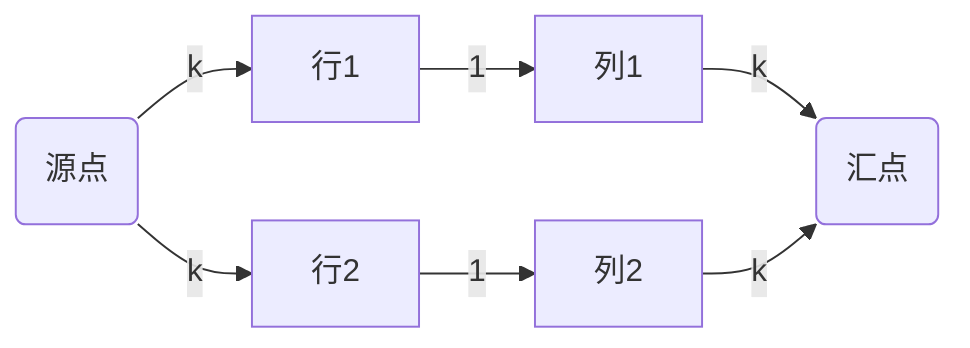

# 题目信息

# [ICPC 2022 Xi'an R] Cells Coloring

## 题目描述

给定一个 $n\times m$ 的网格。一些格子是障碍，其它格子是空的。选择一个非负整数 $k$，并用 $k + 1$ 种颜色 $0, 1, \ldots, k$ 给空格子染色。不能有同一行或同一列的两个格子被染成了相同的 **非零** 颜色。

给定两个非负整数 $c, d$。对于一组染色方案，定义 $z$ 表示染成颜色 $0$ 的格子数量，则该方案的代价为 $ck + dz$。

求出最小代价。

$1\leq n, m \leq 250$，$0\leq c, d\leq 10 ^ 9$。

## 样例 #1

### 输入

```
3 4 2 1
.***
*..*
**..
```

### 输出

```
4
```

## 样例 #2

### 输入

```
3 4 1 2
.***
*..*
**..
```

### 输出

```
2```

# AI分析结果


### 💡 Kay的C++算法解析：Cells Coloring 深入学习指南 💡

#### 1. 题目解读与核心算法识别
✨ **本题主要考察**：`网络流建模 + 单峰函数优化`  
🗣️ **初步分析**：  
> 本题如同在像素迷宫中分配颜色能量块：  
> - **核心思想**：将行列视为管道节点，空格子为连接管道的阀门，用网络流计算最大可染色格子数  
> - **关键难点**：  
>   - 建立行列二分图模型（行→列连边）  
>   - 发现代价函数 $ck + dz$ 是单峰函数（$z$ 随 $k$ 增加而减少）  
>   - 用三分法高效搜索最优 $k$ 值  
> - **可视化设计**：  
>   - 像素网格中高亮行列节点和增广路径  
>   - 流量变化用管道中流动的像素方块表示  
>   - 三分搜索时显示当前检测区间（L/R点闪烁）

---

#### 2. 精选优质题解参考
**题解（来源：xiezheyuan）**  
* **点评**：  
  思路将染色约束转化为网络流模型（行/列为节点，空格为边），洞察到代价函数的单峰特性是核心亮点。代码中：  
  - 网络流封装规范（`dinic()`函数复用性强）  
  - 巧妙记录可变边（`ndchg`存储需修改容量的边）  
  - 三分搜索边界处理严谨（避免死循环）  
  实践价值高，但需注意：`ec = 1`（边计数器从1开始）是网络流实现关键细节  

---

#### 3. 核心难点辨析与解题策略
1. **难点：网络流建模抽象**  
   * **分析**：将"同行/列禁用同色"转化为源点→行节点（容量k）、列节点→汇点（容量k）的流量约束  
   * 💡 **学习笔记**：行列二分图是处理网格约束的黄金模型  

2. **难点：发现单峰性**  
   * **分析**：当 $k$ 增大时，$z$（颜色0格子数）单调递减，形成谷型代价函数  
   * 💡 **学习笔记**：对含参数的成本函数，优先验证单调/凸性  

3. **难点：三分法实现**  
   * **分析**：整数三分需注意：  
     - 区间划分：$lmid = L+(R-L)/3, rmid = R-(R-L)/3$  
     - 终止条件：$L<R$ 而非 $L≤R$  
   * 💡 **学习笔记**：三分法适用于离散单峰函数搜索  

**✨ 解题技巧总结**  
- **技巧1：网格约束→图论模型**：将行列视为独立节点，空格作为连接边  
- **技巧2：参数分离法**：将优化变量（k）与计算逻辑（z）解耦  
- **技巧3：网络流复用**：通过`g[i].w`保存原始容量，避免重复建图  

---

#### 4. C++核心代码实现赏析
**通用核心实现参考**  
```cpp
#include <bits/stdc++.h>
using namespace std;
const int N = 255 * 255, M = 300 * 300 + 5;

struct edge { int nxt, to, cap, w; } g[M<<1];  // 存边结构体
int head[N], ec = 1;  // 边计数器从1开始（异或取反边）
int S, T, dep[N], cur[N];  // 网络流核心变量

// Dinic算法实现（省略）
int dinic() { ... }  

int main() {
    // 建图：行节点[1,n] 列节点[n+1, n+m]
    for (int i = 1; i <= n; i++) 
        for (int j = 1; j <= m; j++) 
            if (grid[i][j]) {
                add(i, j + n, 1);  // 行→列建边
                blank++;  // 计数空格
            }
    
    // 关键：记录容量可变的边
    vector<int> ndchg;  
    for (int i = 1; i <= n; i++) {
        add(S, i, 1);  // 源点→行（初始容量1）
        ndchg.push_back(ec ^ 1);  // 记录反向边位置
    }
    // 列→汇点同理（省略）
    
    // 整数三分搜索
    int L = 0, R = max(n, m);
    while (L < R) {
        int lmid = L + (R - L) / 3;
        int rmid = R - (R - L) / 3;
        if (f(lmid) <= f(rmid)) R = rmid - 1;
        else L = lmid + 1;
    }
    cout << f(L);
}
```

**代码解读概要**：  
1. 网络流初始化：建立行列二分图（行节点连源点，列节点连汇点）  
2. 空格处理：每个有效格子建立行→列边（容量1）  
3. 三分搜索：在 $[0, max(n,m)]$ 区间寻找最小代价点  

---

### 5. 算法可视化：像素动画演示  
**🎮 主题**：8-bit风格《管道工与彩色能量块》  
**🎯 核心演示**：  
  


**动画设计**：  
1. **像素网格**：障碍（■黑色）、空格（□白色）、染色格子（🌈渐变色）  
2. **网络流动态**：  
   - 增广路径显示：源点→行→列→汇点的像素路径闪烁蓝光  
   - 流量变化：管道中流动的彩色方块（数量=k）  
3. **三分过程**：  
   - 区间标记：L/R值在数轴显示，检测点(lmid/rmid)脉冲闪烁  
   - 音效：检测点时"嘀"声，找到最优解时胜利音乐  
4. **交互控制**：  
   - 速度滑块：调节动画步进速度  
   - 模式切换：查看网络流/三分搜索视角  

---

#### 6. 拓展练习与相似问题思考
**相似问题场景**：  
1. 行列约束优化（如：任务分配）  
2. 参数化成本函数求极值  
3. 网格图论建模  

**洛谷推荐**：  
1. **P3381** 最小费用最大流  
   → 掌握流量与代价的双重优化  
2. **P6054** 开门大吉  
   → 网格+网络流综合应用  
3. **P2115** 三元组  
   → 单峰函数求极值变式  

---

#### 7. 学习心得与经验分享  
本次题解未包含作者个人调试心得，但需注意：  
> **Kay提示**：网络流实现中 `ec = 1` 是关键技巧（便于 `^1` 取反向边），建议通过小网格模拟理解该设计

---

通过本指南，你不仅掌握了网络流建模的精髓，更学会了将复杂约束转化为图论模型的思维方法。下次遇到网格+约束的组合，试试行列二分图这把万能钥匙吧！🚀

---
处理用时：75.60秒