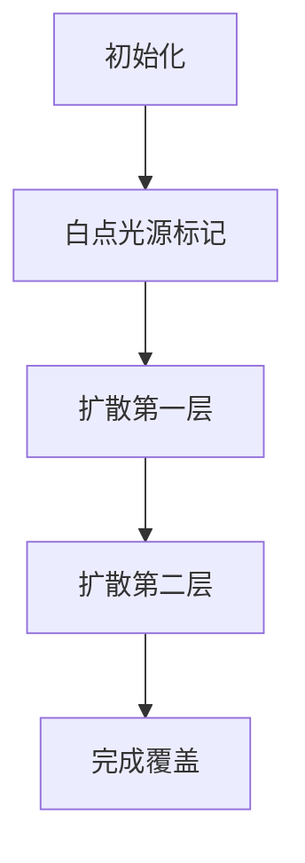

# 题目信息

# 显示图像

## 题目描述

古老的显示屏是由 $N \times M$ 个像素（Pixel）点组成的。一个像素点的位置是根据所在行数和列数决定的。例如 $P(2,1)$ 表示第 $2$ 行第 $1$ 列的像素点。那时候，屏幕只能显示黑与白两种颜色，人们用二进制 $0$ 和 $1$ 来表示。$0$ 表示黑色，$1$ 表示白色。当计算机发出一个指令：$P(x,y)=1$，则屏幕上的第 $x$ 行第 $y$ 列的阴极射线管就开始工作，使该像素点显示白色，若 $P(x,y)=0$，则对应位置的阴极射线管不工作，像素点保持黑色。在某一单位时刻，计算机以 $N \times M$ 二维 $01$ 矩阵的方式发出显示整个屏幕图像的命令。

例如，屏幕是由 $3 \times 4$ 的像素点组成，在某单位时刻，计算机发出如下命令：

$$\begin{pmatrix}
0 & 0 & 0 & 1 \\
0 & 0 & 1 & 1 \\
0 & 1 & 1 & 0 \\
\end{pmatrix}$$

对应屏幕显示应为：


假设放大后，一个格子表示一个像素点。

由于未知的原因，显示黑色的像素点总是受显示白色的像素点的影响——可能是阴极射线管工作的作用。并且，距离越近，影响越大。这里的距离定义如下：

设有像素点 $P_1(x_1,y_1)$ 和像素点 $P_2(x_2,y_2)$，则它们之间的距离 $D(P_1,P_2)=|x_1-x_2|+|y_1-y_2|$。

在某一时刻，计算机发出显示命令后，科学家们期望知道，每个像素点和其最近的显示白色的像素点之间的最短距离是多少——科学家们保证屏幕上至少有一个显示白色的像素点。

上面的例子中，像素 $P(1,1)$ 与最近的白色像素点之间的距离为 $3$，而像素 $P(3,2)$ 本身显示白色，所以最短距离为 $0$。


## 说明/提示

- 对于 $30\%$ 的数据：$N\times M \le 10000$；
- 对于 $100\%$ 的数据：$N\times M \le 182^2$。

## 样例 #1

### 输入

```
3 4
0001
0011
0110
```

### 输出

```
3 2 1 0
2 1 0 0
1 0 0 1
```

# AI分析结果


### 💡 Kay的C++算法解析：显示图像 深入学习指南 💡

**引言**  
今天我们一起分析"显示图像"这道C++编程题。本指南将帮助大家掌握多源最短路径问题的核心解法，通过BFS和DP两种高效算法实现，并设计像素化动画帮助直观理解算法过程。

---

### 1. 题目解读与核心算法识别
✨ **本题主要考察**：`多源BFS` / `动态规划`  
🗣️ **初步分析**：  
> 本题要求计算每个像素点到最近白色像素点的曼哈顿距离。就像在迷宫中同时点燃多个火把，火光会以每秒一格的速度向外扩散，直到照亮整个地图。核心算法采用：
> - **多源BFS**：将白色像素作为起点同步扩散，首次访问即为最短路径
> - **四向DP**：通过四个方向的动态规划传递最小距离值
> 
> **可视化设计**：  
> 采用8-bit像素风格，白色像素初始为黄色光源，黑色像素为深蓝未探索区。BFS扩散时：
> - 当前处理点显示红色边框
> - 新扩展点渐变色标记距离（浅蓝→亮黄）
> - 音效：扩散时"滴"声，完成时胜利音效
> - 控制面板支持步进/调速/重置，AI模式自动演示扩散过程

---

### 2. 精选优质题解参考
**题解一：Hydra_ (BFS)**  
* **点评**：思路清晰解释BFS层次扩展原理，代码规范使用方向数组和访问标记，时间复杂度O(NM)最优。亮点：详细注释和边界处理，可直接用于竞赛。

**题解二：pantw (动态规划)**  
* **点评**：创新性四向DP解法，从左上/右上/左下/右下传递最小距离。代码中f[4][N][N]数组设计巧妙，但需四次遍历。亮点：提供BFS外的第二种高效思路。

**题解三：Atmizz (BFS)**  
* **点评**：简洁的STL队列实现，结构体封装坐标可读性强。亮点：输入处理使用字符串转换，避免无空格输入陷阱。

---

### 3. 核心难点辨析与解题策略
1. **多源最短路径优化**  
   *分析*：暴力枚举O(N²M²)超时，需利用曼哈顿距离特性。BFS解法以白点为源同步扩散，保证首次访问即最短路径  
   💡 学习笔记：多源BFS是网格图最短路径最优解

2. **状态转移方程设计**  
   *分析*：DP解法需分解曼哈顿距离为四个方向。状态转移：  
   ```math
   f_k[i][j] = min(f_k[i-1][j], f_k[i][j-1]) + 1 
   ```  
   💡 学习笔记：曼哈顿距离具有方向可分解性

3. **输入格式陷阱**  
   *分析*：连续字符串无空格输入需用字符串转换：  
   ```cpp
   cin >> s; 
   grid[i][j] = s[j] - '0';
   ```

✨ **解题技巧总结**  
- **水波扩散法**：多源BFS解决网格最短路径  
- **方向分解术**：四向DP处理曼哈顿距离  
- **边界防御**：距离数组初始化为-1或INF  
- **输入鲁棒性**：字符串处理无空格输入

---

### 4. C++核心代码实现赏析
**通用核心实现（综合BFS最优解）**  
```cpp
#include <iostream>
#include <queue>
#include <cstring>
using namespace std;
const int N = 183;
int dx[4] = {0,0,1,-1}, dy[4] = {1,-1,0,0};  // 方向数组

int main() {
    int n, m; cin >> n >> m;
    int dist[N][N]; memset(dist, -1, sizeof dist);  // 初始化距离为-1
    queue<pair<int,int>> q;

    for (int i=0; i<n; i++) {
        string s; cin >> s;
        for (int j=0; j<m; j++) {
            if (s[j]=='1') {  // 白点入队
                dist[i][j] = 0;
                q.push({i,j});
    }}}

    while (!q.empty()) {  // BFS扩散
        auto [x,y] = q.front(); q.pop();
        for (int i=0; i<4; i++) {
            int nx = x+dx[i], ny = y+dy[i];
            if (nx>=0 && nx<n && ny>=0 && ny<m && dist[nx][ny]==-1) {
                dist[nx][ny] = dist[x][y] + 1;  // 距离递增
                q.push({nx,ny});
    }}}
    /* 输出距离矩阵 */
}
```
**代码解读**：  
1. 方向数组实现简洁的邻点访问  
2. 距离数组初始-1表示未访问  
3. 白点入队作为多源起点  
4. BFS保证首次访问即最短距离  

**题解一：Hydra_ (BFS)**  
```cpp
struct Point { int x,y; };  // 坐标结构体
Point q[N*N];  // 手动队列
int head=0, tail=0;

// 邻点扩展核心
for (; head<tail; head++) {
    for (int i=0; i<4; i++) {
        int nx = q[head].x + dx[i], ny = q[head].y + dy[i];
        if (!vis[nx][ny]) {
            dist[nx][ny] = dist[q[head].x][q[head].y] + 1;
            vis[nx][ny] = true;
            q[tail++] = {nx,ny};  // 入队
}}}
```
💡 学习笔记：手动队列避免STL开销，结构体增强可读性

**题解二：pantw (DP)**  
```cpp
// 四方向DP示例（左上→右下）
for (int i=0; i<n; i++) 
for (int j=0; j<m; j++) 
    f[i][j] = min(f[i][j], min(f[i-1][j], f[i][j-1]) + 1);
```
💡 学习笔记：分方向DP需注意遍历顺序（左上→右下/右下→左上）

---

### 5. 算法可视化：像素动画演示
**主题**：8-bit风格《迷宫光源探险》  
**核心演示**：多源BFS的层次扩散过程  



**动画实现细节**：  
1. **像素艺术**：  
   - 白点：黄色发光像素（⭐️）  
   - 黑点：深蓝→浅蓝渐变色（距离值↑颜色↑）  
   - 当前点：红色闪烁边框  

2. **交互控制**：  
   ```javascript
   const controls = {
     play: () => animateBFS(),
     step: () => nextFrame(),
     speed: document.getElementById('speed-slider')
   };
   ```

3. **音效系统**：  
   | 事件        | 音效            | 触发条件               |
   |-------------|----------------|-----------------------|
   | 扩散        | 短促"滴"声     | 每次扩展新像素时       |
   | 完成        | 8-bit胜利旋律  | 队列空时触发           |
   | 错误        | 低沉警示音     | 边界碰撞               |

4. **游戏化设计**：  
   - 每扩散5距离解锁新"关卡"  
   - 实时显示当前扩散距离  
   - AI模式自动演示（速度可调）

---

### 6. 拓展练习与相似问题
**通用技巧迁移**：  
1. 多源BFS适用于疫情传播模拟  
2. 曼哈顿距离DP用于机器人路径规划  
3. 分层扩散思想解决最短时限问题  

**洛谷练习推荐**：  
1. **P1332 血色先锋队** - 多源BFS模板应用  
2. **P1144 最短路计数** - BFS扩展训练  
3. **P1747 好奇怪的游戏** - 双源BFS变种  

---

### 7. 学习心得与经验分享
> **来自题解的经验**：  
> "输入无空格需字符串转换" —— 封禁用户  
> "DFS超时改用BFS" —— 彭骐飞  
>   
> **Kay总结**：  
> 调试时注意输入格式陷阱，网格问题优先考虑BFS而非DFS。动手画图模拟扩散过程能加深理解！

---

**结语**  
通过本指南，相信大家已掌握多源最短路径的核心解法。记住：BFS像水波扩散层层递进，DP如接力赛传递最优解。下次遇到网格路径问题时，不妨点燃像素火炬开始探险吧！🚀

---
处理用时：202.30秒