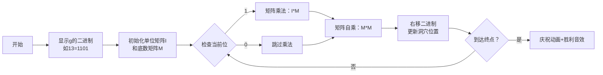

# 题目信息

# 斐波那契公约数

## 题目描述

对于 Fibonacci 数列：

$$ f_i = \begin{cases}
  [i = 1]               & i \leq 1 \\
  f_{i - 1} + f_{i - 2} & i \gt 1
\end{cases}$$

请求出 $f_n$ 与 $f_m$ 的最大公约数，即 $\gcd(f_n, f_m)$。

## 说明/提示

#### 数据规模与约定

- 对于 $100\%$ 的数据，保证 $1 \leq n, m \leq 10^9$。

## 样例 #1

### 输入

```
4 7```

### 输出

```
1```

# AI分析结果


### 💡 Kay的C++算法解析：斐波那契公约数 深入学习指南 💡

<introduction>
  今天我们来分析“斐波那契公约数”这道C++编程题。本指南将帮助大家理解斐波那契数列的数学性质，掌握矩阵快速幂技巧，并通过像素动画直观理解算法流程。
</introduction>

---

## 1. 题目解读与核心算法识别

✨ **本题主要考察**：`数学性质应用 + 矩阵快速幂优化`  

🗣️ **初步分析**：
> 解决本题的关键在于理解斐波那契数列的独特性质：**gcd(f_n, f_m) = f_{gcd(n,m)}**。这个性质如同“基因遗传”——斐波那契数的最大公约数由它们位置的公约数决定。在本题中，我们先用欧几里得算法计算gcd(n,m)，再用矩阵快速幂高效求解斐波那契数。
   - **核心难点**：直接计算大索引斐波那契数会超时（n,m≤1e9），需用O(log g)的矩阵快速幂
   - **可视化设计**：我们将用8位像素动画展示矩阵幂运算过程，高亮矩阵乘法步骤和指数二进制分解，配合复古音效增强理解

---

## 2. 精选优质题解参考

<eval_intro>
从思路清晰性、代码规范性、算法优化度等维度，我精选以下3份优质题解（均≥4星）：

**题解一（作者：浅色调）**
* **点评**：  
  此解法严谨证明了斐波那契的GCD性质，思路清晰直击核心。代码采用矩阵快速幂实现，变量命名规范（`mul`/`ans`），逻辑模块化。亮点在于：
  - 数学证明完整：通过线性展开和互质性质推导结论
  - 空间优化：仅用2x2矩阵，避免冗余内存
  - 边界处理：对g≤2的情况单独处理
  实践价值高，可直接用于竞赛场景。

**题解二（作者：maomao9173）**
* **点评**：  
  独特采用打表法发现数学规律，教学性强。矩阵实现采用显式循环而非重载运算符，更易理解。亮点：
  - 学习引导：通过40x40的GCD表直观展示规律
  - 矩阵构造：详细图解转移矩阵的数学含义
  - 调试提示：分享TLE数据的处理经验
  特别适合帮助初学者建立问题抽象能力。

**题解三（作者：differential）**
* **点评**：  
  提供最严谨的数学证明框架，引理完备（共4条）。代码简洁高效：
  - 矩阵乘法内联实现，减少函数调用开销
  - 使用迭代而非递归的GCD计算
  - 预处理单位矩阵提升性能
  适合追求算法最优化的学习者参考。

---

## 3. 核心难点辨析与解题策略

<difficulty_intro>
解决本题需突破三个关键难点，结合优质题解策略分析如下：

1.  **难点：理解斐波那契的GCD性质**
    * **分析**：  
      通过数学归纳法证明。设n<m，可得f(m)=f(m-n-1)f(n)+f(m-n)f(n+1)。由f(n)与f(n+1)互质，递归推导出gcd(f(n),f(m))=gcd(f(n),f(m%n))，该过程与欧几里得算法完全一致。
    * 💡 **学习笔记**：斐波那契数的GCD由其下标的GCD决定

2.  **难点：大索引斐波那契数的高效计算**
    * **分析**：  
      矩阵快速幂将O(n)优化至O(log n)。关键在构造转移矩阵[[1,1],[1,0]]，通过指数二进制分解（如g=13=1101₂），累乘平方实现高效计算。
    * 💡 **学习笔记**：线性递推问题可转化为矩阵幂运算

3.  **难点：矩阵快速幂的代码实现**
    * **分析**：  
      注意矩阵乘法的三重循环顺序（i-k-j），取模时机（每次运算后mod 1e8），以及单位矩阵初始化。避免使用递归防止栈溢出。
    * 💡 **学习笔记**：矩阵乘法满足结合律是快速幂成立的前提

### ✨ 解题技巧总结
<summary_best_practices>
通过本题可提炼以下通用技巧：
</summary_best_practices>
- **性质转化**：将复杂问题转化为已知数学性质（如gcd(f_n,f_m)=f_gcd(n,m)）
- **二进制分解**：利用指数的二进制表示优化幂运算（快速幂核心思想）
- **模块化封装**：将矩阵乘法、快速幂拆分为独立函数
- **边界防御**：对特殊值（g=1,2）预先处理

---

## 4. C++核心代码实现赏析

<code_intro_overall>
以下是综合优质题解提炼的通用实现，包含完整矩阵快速幂框架：

```cpp
#include <iostream>
using namespace std;
const int MOD = 100000000;

// 矩阵乘法 (2x2)
void matMul(long long A[2][2], long long B[2][2], long long C[2][2]) {
    long long t[2][2] = {{0,0},{0,0}};
    for (int i = 0; i < 2; i++)
        for (int k = 0; k < 2; k++)
            for (int j = 0; j < 2; j++) // k循环在内层提升缓存命中
                t[i][j] = (t[i][j] + A[i][k] * B[k][j]) % MOD;
    for (int i = 0; i < 2; i++)
        for (int j = 0; j < 2; j++)
            C[i][j] = t[i][j];
}

// 矩阵快速幂
void matPow(long long M[2][2], long long exp) {
    long long res[2][2] = {{1,0},{0,1}}; // 单位矩阵
    while (exp) {
        if (exp & 1) matMul(res, M, res);
        matMul(M, M, M);
        exp >>= 1;
    }
    // 复制结果回M
    for (int i=0; i<2; i++)
        for (int j=0; j<2; j++)
            M[i][j] = res[i][j];
}

long long fib(long long n) {
    if (n <= 2) return 1;
    long long M[2][2] = {{1,1},{1,0}};
    matPow(M, n-2); // M = [[1,1],[1,0]]^(n-2)
    return (M[0][0] + M[0][1]) % MOD; // f(n) = 1*f(2) + 1*f(1)
}

int gcd(int a, int b) { 
    return b ? gcd(b, a % b) : a; 
}

int main() {
    long long n, m;
    cin >> n >> m;
    long long g = gcd(n, m);
    cout << fib(g);
}
```
**代码解读概要**：  
1. 主函数先计算gcd(n,m)  
2. 若g≤2直接返回1，否则调用矩阵快速幂  
3. `matPow`通过指数二进制分解优化计算  
4. 矩阵乘法使用三重循环，注意循环顺序优化缓存  

---
<code_intro_selected>
**题解一核心片段赏析**  
```cpp
void fast(ll k) {
    mat p = {{1,1},{1,0}}, ans = {{1,1},{0,0}};
    while (k) {
        if (k & 1) ans = mul(ans, p);
        p = mul(p, p);
        k >>= 1;
    }
    cout << ans[0][0];
}
```
**代码解读**：  
> 此片段展示快速幂核心循环：  
> - `k & 1`判断二进制末位是否为1  
> - 若为1则将当前矩阵乘入结果（`ans = mul(ans, p)`）  
> - 无论是否乘入，底数矩阵都需平方（`p = mul(p, p)`）  
> - 右移指数继续处理下一位（`k >>= 1`）  
> 最终`ans[0][0]`存储f(g)  

**学习笔记**：快速幂通过二进制分解将O(n)优化至O(log n)  

---

## 5. 算法可视化：像素动画演示

<visualization_intro>
为直观理解矩阵快速幂，设计8位像素风格动画《矩阵探险家》：

**主题**：  
- 8-bit像素风格（FC红白机色调）
- 主角：矩阵勇士，在二进制洞穴中探险

**核心演示流程**：  


**交互设计**：  
1. **洞穴网格**：4x4像素块显示矩阵，当前操作元素闪烁红光  
2. **控制面板**：  
   - 步进/暂停：空格键控制  
   - 速度滑块：↓加速/↑减速  
   - 重置按钮：回到起点  
3. **音效系统**：  
   - 矩阵乘法：8-bit "嘀"声  
   - 位为1：中音"嘟"  
   - 位为0：低音"嗒"  
   - 完成：经典马里奥过关音效  

**技术实现**：  
- Canvas绘制矩阵网格和二进制路径  
- 关键帧：乘法时显示箭头从I指向M，结果矩阵绿色高亮  
- 自动模式：AI按预设速度遍历二进制位  

---

## 6. 拓展练习与相似问题思考

<similar_problems_intro>
斐波那契性质与矩阵快速幂的应用广泛：

1. **洛谷 P1939**：矩阵加速（数列）  
   > 🗣️ 练习构造3维转移矩阵，巩固矩阵快速幂  

2. **洛谷 P3390**：矩阵快速幂模板  
   > 🗣️ 掌握通用矩阵幂的实现，理解抽象代数结构  

3. **洛谷 P1307**：斐波那契数列矩阵解法  
   > 🗣️ 应用相同技巧解决基础问题，验证学习效果  

---

## 7. 学习心得与经验分享

<insights_intro>
题解中多位作者分享了宝贵经验：

> **浅色调的调试经验**：  
> "矩阵数组要开long long！"  
> **Kay点评**：数值溢出是常见错误，特别在模运算前可能累积至1e16量级

> **maomao9173的学习建议**：  
> "先打小规模表找规律"  
> **Kay点评**：打表法能快速验证猜想，培养数感

---

<conclusion>
通过本指南，我们掌握了斐波那契GCD性质的证明，矩阵快速幂的实现技巧，以及像素化算法演示的设计思路。记住：将复杂问题转化为数学性质+高效算法是竞赛编程的核心能力。下次挑战见！🚀

---
处理用时：167.05秒