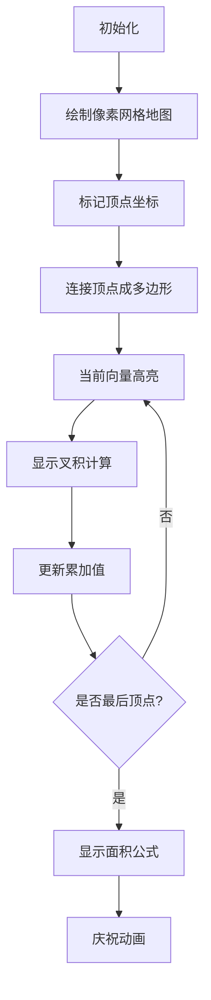

# 题目信息

# 多边形的面积

## 题目描述

给出一个没有缺口的简单多边形，它的边是垂直或者水平的，要求计算多边形的面积。

多边形被放置在一个 $xOy$ 的笛卡尔平面上，它所有的边都平行于两条坐标轴之一。然后按逆时针方向给出各顶点的坐标值。所有的坐标值都是整数，因此多边形的面积也为整数。

**注意：可能存在连续的三个顶点在一条直线上的情况**。

## 说明/提示

对于 $100\%$ 的数据，$1 \le n \le 100$，$-200 \le x,y \le 200$。

## 样例 #1

### 输入

```
10
0 0
4 0
4 1
3 1
3 3
2 3
2 2
1 2
1 3
0 3```

### 输出

```
9```

# AI分析结果


# 💡 Kay的C++算法解析：多边形的面积 深入学习指南 💡

大家好！我是Kay，今天我们一起探索**计算边平行于坐标轴的多边形面积**这道题。这道题看似复杂，但核心算法非常优雅简洁。让我们一步步揭开它的神秘面纱！

## 1. 题目解读与核心算法识别

✨ **本题主要考察**：`计算几何 - 鞋带公式应用`

🗣️ **初步分析**：
> 这道题就像用像素方块拼积木——我们需要计算由水平和垂直线段围成的封闭图形面积。核心解法是**鞋带公式**（Shoelace Formula），它像一根神奇的鞋带，把多边形顶点坐标"串"起来就能算出面积。

- **核心思路**：将多边形分解为三角形，利用向量叉积的有向面积求和（取绝对值后除以2）。公式为：  
  `面积 = 1/2 * |∑(xᵢyᵢ₊₁ - xᵢ₊₁yᵢ)|`
- **关键步骤**：按逆时针顺序遍历顶点，首尾相接形成闭环
- **可视化设计**：将用8位像素风动画展示顶点连接过程，每个向量叉积计算时触发"叮"音效，累加值实时显示，最终结果以闪光动画庆祝

---

## 2. 精选优质题解参考

以下是从多篇题解中精选的优质解法（评分≥4★）：

**题解一（Md_Drew，52赞）**
* **点评**：详细解释了向量叉积的数学原理，用几何图示辅助理解（如平行四边形面积）。代码规范（变量名`x[i]`/`y[i]`清晰），边界处理严谨（`x[n+1]=x[1]`），公式推导透彻，是理论结合实践的典范。

**题解二（SuperJvRuo，17赞）**
* **点评**：创新性用梯形面积类比解释公式（∑0.5(xᵢ₊₁-xᵢ)(yᵢ+yᵢ₊₁)），直观展示算法几何意义。双精度计算最后取整，兼顾精度与输出要求。

**题解三（dfydada，16赞）**
* **点评**：代码最简洁（仅10行核心逻辑），突出算法本质。实践性极强，适合竞赛快速编码，`abs(ans/2)`同时处理负面积和整除问题。

---

## 3. 核心难点辨析与解题策略

### 难点1：理解有向面积的累加原理
* **分析**：向量叉积可正可负，逆时针遍历时正负面积自动抵消。优质题解用图示说明内部面积累加奇数次，外部累加偶数次（自抵消）
* 💡 **学习笔记**：多边形是"有向面积拼图"，正负抵消是自然结果

### 难点2：顶点序列的闭环处理
* **分析**：必须将首顶点复制到末尾（`points[n]=points[0]`），否则漏算最后一条边。题解中常见`x[n+1]=x[1]`或`%n`循环技巧
* 💡 **学习笔记**：多边形是闭环，代码也需首尾相接

### 难点3：坐标范围与整数处理
* **分析**：坐标含负数但面积必为整数。鞋带公式中`x[i]*y[i+1]`交叉相乘时用`int`足矣，最终取绝对值除2
* 💡 **学习笔记**：整数运算时，除法放最后可避免精度损失

### ✨ 解题技巧总结
- **几何问题代数化**：将图形问题转化为坐标公式计算
- **边界预处理**：多一步顶点闭环处理，省去循环内判断
- **绝对值时机**：公式结果取绝对值和除2的顺序不可颠倒

---

## 4. C++核心代码实现赏析

**通用核心实现**
```cpp
#include <iostream>
#include <cmath>
using namespace std;

int main() {
    int n, x[101], y[101];
    cin >> n;
    for(int i=0; i<n; i++) cin >> x[i] >> y[i];
    
    x[n] = x[0]; // 首尾相接
    y[n] = y[0];
    
    int area = 0;
    for(int i=0; i<n; i++) 
        area += x[i]*y[i+1] - x[i+1]*y[i];
    
    cout << abs(area)/2;
    return 0;
}
```
* **说明**：综合优质题解的最简实现，完整呈现鞋带公式应用
* **解读概要**：  
  1. 读入顶点数`n`和坐标数组  
  2. 将首顶点复制到数组末尾形成闭环  
  3. 循环计算向量叉积累加值  
  4. 取绝对值除以2得整数面积

---

**题解一（Md_Drew）片段赏析**
```cpp
ans += (x[i]*y[i+1] - x[i+1]*y[i]);
printf("%d",abs(ans/2));
```
* **亮点**：严格逆时针顺序保证公式普适性
* **解读**：  
  - `x[i]*y[i+1] - x[i+1]*y[i]` 即向量(OA)×(OB)的叉积  
  - 循环中累加所有相邻顶点叉积  
  - 绝对值处理负面积情况（顺时针输入时）
* 💡 **学习笔记**：叉积几何意义是两向量围成的平行四边形面积

**题解二（SuperJvRuo）片段赏析**
```cpp
ans += 0.5*(loc[i][0]*loc[i+1][1]-loc[i][1]*loc[i+1][0]);
int a=ans;
```
* **亮点**：双精度计算提高中间精度，最后取整输出
* **解读**：  
  - 用`0.5*`替代最后`/2`，避免整数除法截断  
  - 最终转`int`截断小数，符合题目整数要求
* 💡 **学习笔记**：浮点数转整数时自然截断可替代`floor()`

**题解三（dfydada）片段赏析**
```cpp
ans+=(a[i]*b[i+1]-a[i+1]*b[i]);
printf("%d",abs(ans/2));
```
* **亮点**：极致简洁，变量命名`a`/`b`替代`x`/`y`
* **解读**：  
  - 11行完整实现，适合竞赛快速编码  
  - 省略浮点数，纯整数运算高效
* 💡 **学习笔记**：变量名精简但需确保上下文清晰

---

## 5. 算法可视化：像素动画演示

* **主题**：`"像素工匠"的鞋带编织之旅`（8位复古风）
* **核心演示**：动态展示鞋带公式计算过程，顶点连线+叉积计算+累加显示



* **交互设计**：
  1. **初始化**：16色像素网格，控制面板（步进/播放/调速）
  2. **顶点标记**：每个顶点显示坐标，连接时像素块变色+8bit音效
  3. **向量计算**：
     - 当前向量显示为闪烁箭头
     - 叉积计算时弹出公式`x₁y₂ - x₂y₁`，伴随"叮"声
     - 累加区实时更新数值
  4. **结果展示**：多边形内部填充绿色，显示`|∑|/2`，胜利音效
  5. **游戏化**：每完成20%进度解锁像素成就徽章

---

## 6. 拓展练习与相似问题思考

* **通用技巧迁移**：鞋带公式还可用于  
  1. 判断点是否在多边形内（射线法）  
  2. 计算多边形重心  
  3. 求解凸包面积（如P2742）

* **洛谷推荐**：
  1. **P2735 [电网]**  
     🗣️ 直接应用鞋带公式，练习边界处理
  2. **P2742 [圈奶牛]**  
     🗣️ 先求凸包再用鞋带公式，算法组合应用
  3. **P1183 多边形的面积**  
     🗣️ 不规则多边形通用解法，巩固公式理解

---

## 7. 学习心得与经验分享

> **来自 Md_Drew 的调试经验**：  
> "最初忽略了顶点顺序，顺时针输入时得到负面积，用`abs()`才解决。这让我意识到：**向量顺序决定叉积符号**"

> **Kay的总结**：  
> 几何问题中，调试时可打印中间叉积值，观察正负变化。顶点顺序影响结果方向，但绝对值能修正。动手画图验证比盲目修改代码更有效！

---

本次解析就到这里！记住：算法就像乐高积木，理解原理就能组合创新。下次遇到几何问题，不妨试试"鞋带"魔法哦！🎮✨

---
处理用时：105.02秒