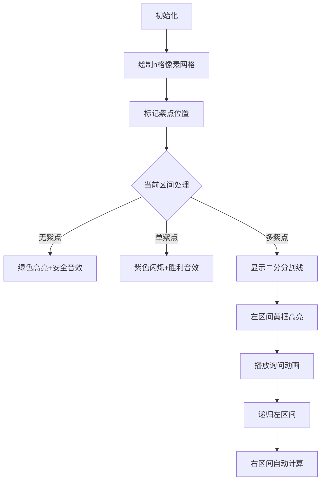

# 题目信息

# 「Wdoi-3」夜雀 cooking

## 题目背景

**本题为交互题。**

作为幻想乡的大厨，米斯蒂娅当然能用准备的食材制作出各色各样的饭菜。晚上，就是夜雀餐厅营业的时间，凭着这些料理，餐厅总是生意兴隆——甚至一些「特殊顾客」也会前来！

特殊顾客就是一些幻想乡里大家再熟悉不过的角色啦，顾名思义，她们会提出特殊要求，不过如果满足了她们的要求，她们也会好好地奖励小夜雀。

不幸的是，紫决定做一个恶作剧，她悄悄使用能力清除了米斯蒂娅的部分记忆，现在她分不清哪些顾客是特殊顾客，哪些顾客是普通顾客了！看着米斯蒂娅快要哭了，于心不忍的紫决定和米斯蒂娅做一个数学游戏，她将特殊顾客的编号隐藏在了数字之中。米斯蒂娅对数学一窍不通，于是她只能向你求助了......

## 题目描述

紫给出了一个长度为 $n$ 的数列，其第 $i$ 项就对应了编号为 $i$ 的顾客。她将所有普通顾客对应的位置染上蓝色，把特殊顾客对应的位置染上紫色。紫告诉了米斯蒂娅特殊顾客一共有 $m$ 位。并且，由于特殊顾客非常的特殊，所以紫色位置数量很少，而且**基本均匀随机**。

接下来，她给数列的每一项赋上了值。第 $i$ 项的值 $a_i$ 可以用如下的式子推出：（$s$ 和 $k$ 紫都会给出）
  $$a_i=\begin{cases} s & i=1\cr a_{i-1}+k & i>1\end{cases}$$

米斯蒂娅可以向紫提出形如 `l r` 的问题，然后紫就会迅速算出区间 $[l,r]$ 内所有被染成蓝色位置的 $a_i$ 的和。当然啦，你需要输出 `l r` 来告诉米斯蒂娅她该如何提问，如果你成功找出了所有特殊顾客的编号（即所有紫色点的位置），那么你需要输出 `-1 p1 p2 ... pm` 来告诉米斯蒂娅所有特殊顾客的编号，注意要保证 $p_i\le p_{i+1}(1\le i<m)$。

**注意：在进行这两种操作后，需要刷新缓存区，下面是一些常见语言的刷新缓存区方式：**

- C++：`fflush(stdout)` 或 `cout.flush()`。
- C: `fflush(stdout)`。
- Java: `System.out.flush()`。
- Python: `stdout.flush()`。
- Pascal: `flush(output)`。
- 其他语言：请参考对应语言的帮助文档。

## 说明/提示

#### 样例解释

神秘顾客的编号为 $\{4,7,10,11\}$ 。这个样例象征性地抽取了 $3$ 个询问，以便选手理解交互的过程。

- 对于第一次询问 $[10,12]$ ，结果为 $13=13$。
- 对于第二次询问 $[2,7]$ ，结果为 $3+4+6+7=20$。
- 对于第三次询问 $[4,8]$ ，结果为 $6+7+9=22$。

---

#### 数据范围及约定

$$\def\arraystretch{1.8}
\begin{array}{|c|c|c|}\hline
\textbf{Subtask} & \textbf{特殊性质} & \textbf{分值} \cr\hline
1 & m=1 & 5 \cr\hline
2 & - & 95 \cr\hline
\end{array}$$

- 对于所有数据，满足 $1\le T\le 500$，$1 \leq \sum n_i \leq 10^5$，$1 \leq \sum m_i \leq \min\{ n,100\}$，$1\le s,k\le 10^9$。

每一个 Subtask 的得分为当前 Subtask 所有测试点的最低分。

#### 判分方式

令 $q_i$ 为对于第 $i$ 组数据你所用的询问次数，你需要满足 $\sum q_i \leq 200 \times T$ ，并且每组询问的结果都是正确的，你才能获得该测试点的满分。

- 如果询问次数满足 $1000 \times T<\sum q_i \leq 2000 \times T$，可以拿到 $20\%$ 的分数。
- 如果询问次数满足 $600 \times T<\sum q_i \leq 1000 \times T$，可以拿到 $40\%$ 的分数。  
- 如果询问次数满足 $400 \times T<\sum q_i \leq 600 \times T$，可以拿到 $50\%$ 的分数。
- 如果询问次数满足 $300 \times T<\sum q_i \leq 400 \times T$，可以拿到 $60\%$ 的分数。
- 如果询问次数满足 $200 \times T<\sum q_i \leq 300 \times T$，可以拿到 $80\%$ 的分数。

#### 说明

选择 $m$ 个点染为紫色的生成方式是对一个 $1 \sim n$ 的排列调用 `random_shuffle`，然后取前 $m$ 项的数值作为特殊顾客的编号。一个可被参考的代码如下：

```cpp
namespace Gen{
	typedef unsigned int       u32;
	typedef unsigned long long u64;
	u32 MT[624],idx;
	void iit(u32 seed){
    	MT[0]=seed; idx=0; for(u32 i = 1;i < 624;++ i)
    	MT[i]=(0x6c078965U * (MT[i - 1] ^ ((MT[i - 1]) >> 30)) + i);
	}
	void gen(){
		u32 x; for(u32 i = 0;i < 624; ++ i){
			x = (MT[i] & 0x80000000U) +
				(MT[(i + 1) % 624] & 0x7fffffffU );
			MT[i] = MT[(i + 397) % 624] ^ (x >> 1);
			if(x & 1) MT[i] ^= 0x9908b0dfU;
		}
	}
	u32  clc(){
		if(!idx) gen(); u32 x = MT[idx];
		x ^= x >> 11, x ^= (x << 7) & 0x9d2c5680U;
		x ^= (x << 15) & 0xefc60000U,x ^= x >> 18;
		idx = (idx + 1) % 624; return x;
	}
	u32  clc(u32 n){	//均匀随机地返回 [0,n) 内的整数
		return 1ull * n * clc() >> 32;
	}
	void sfl(int n, int *A) {
		for(int i = n;i >= 1; --i) swap(A[clc(i) + 1], A[i]);
	}
	void gen(u32 seed,int n, int *A) {
		iit(seed); for(int i = 1;i <= n; ++i) A[i] = i; sfl(n, A);
	}
}
```

**注**：该代码片段会使用符合标准的梅森旋转算法生成随机数。其生成随机数的周期为 $2^{19937}-1$ ，生成的随机数是均匀随机的。因此你大可不必担心我们在里面做了任何手脚。

调用 `gen(seed,n,A)` 可以生成一个长度为 $n$ 的**基本均匀随机**序列，我们将会取其前 $m$ 项作为特殊顾客的编号。例如，对于样例，我们调用了 `gen(9961U,12,A)` ，并选取了 $A$ 的前 $4$ 项 $\{4,7,10,11\}$ 作为神秘顾客的编号。

## 样例 #1

### 输入

```
1
12 4 2 1

13

20

22```

### 输出

```


10 12

2 7

4 8

-1 4 7 10 11```

# AI分析结果


### Kay的C++算法解析：夜雀cooking 深入学习指南

---

#### 1. 题目解读与核心算法识别  
✨ **本题主要考察**：`分治与二分搜索`  

🗣️ **初步分析**：  
> 解决本题的关键在于**利用等差数列特性进行分治搜索**。想象你在玩扫雷游戏：每次点击（询问区间）会返回周围地雷数（蓝色位置的和），而你需要找出所有地雷位置（紫色点）。  
> - **核心思路**：预处理等差数列前缀和，通过递归将区间二分。若区间内紫色点之和小于最小两个数的和（说明只有1个紫点），直接定位；否则继续二分。  
> - **可视化设计**：采用**8位像素风扫雷游戏**风格。网格代表数列，蓝色格子为普通顾客，紫色格子为特殊顾客。每次递归时：  
>   - 高亮当前区间（黄色边框）  
>   - 单点命中时播放"叮"音效+紫色闪光  
>   - 二分时显示分割线（像素箭头动画）  
> - **复古元素**：  
>   - 背景：FC红白机风格BGM  
>   - 音效：分治时"咔哒"声，找到紫点时"胜利"音阶  
>   - 交互：控制面板支持单步/自动播放（调速滑块）

---

#### 2. 精选优质题解参考  
**题解一（幽云蓝）**  
* **点评**：分块策略巧妙结合均匀随机特性，将序列分为m块。证明"有趣块"性质（第2块起满足aₗ+aₗ₊₁>aᵣ）极具启发性，通过判断紫点数量减少递归深度。代码边界处理严谨（如第一块特判），复杂度O(m log n)，但实现稍复杂。  

**题解二（xie_lzh）**  
* **点评**：直接分治更简洁高效。亮点在于：  
  1. **递归优化**：利用差值diff=区间和-蓝点和判断紫点数量  
  2. **免询问技巧**：右子区间蓝点和=父区间蓝点和-左子区间蓝点和  
  3. **临界判断**：diff < aₗ+aₗ₊₁时直接遍历定位  
  代码规范（变量名sum/ns含义明确），实战性强，适合竞赛。  

---

#### 3. 核心难点辨析与解题策略  
1. **难点1：如何减少询问次数？**  
   * **分析**：利用等差数列特性避免无效递归。若区间紫点值之和diff < 最小两数和（aₗ+aₗ₊₁），说明仅1个紫点（因两紫点最小和≥aₗ+aₗ₊₁）。  
   * 💡 **学习笔记**：等差数列的单调性是优化基础。  

2. **难点2：非均匀数据如何处理？**  
   * **分析**：当数据不满足"有趣块"条件（如第一块），需暴力递归。但m≤100时递归深度有限，仍可接受。  
   * 💡 **学习笔记**：随机数据下期望复杂度O(m log n)，但需考虑最坏情况。  

3. **难点3：如何高效传递区间信息？**  
   * **分析**：递归时传递父区间蓝点和ns，右子区间无需重复询问（ns_right = ns_parent - ns_left）。  
   * 💡 **学习笔记**：信息复用是交互题核心技巧。  

✨ **解题技巧总结**  
- **技巧1：前缀和预计算**  
  预处理sum[i]=Σaᵢ，快速获取区间和。  
- **技巧2：递归终止条件分层处理**  
  无紫点（sum[r]-sum[l-1]==ns）→ 返回；单点（l==r）→ 记录答案。  
- **技巧3：边界值优先判断**  
  先处理小规模区间（长度≤2），避免过度递归。  

---

#### 4. C++核心代码实现赏析  
**通用核心实现参考**  
```cpp
#include <bits/stdc++.h>
using namespace std;
typedef long long ll;
const int N = 1e5 + 5;

ll sum[N], s, k;
vector<int> ans;

ll ask(int l, int r) {
    cout << l << ' ' << r << endl;
    ll res; cin >> res;
    if (res == -1) exit(0);
    return res;
}

void solve(int l, int r, ll ns) {
    ll total = sum[r] - sum[l-1];
    if (total == ns) return;       // 无紫点
    if (l == r) {                  // 单点紫点
        ans.push_back(l);
        return;
    }
    ll diff = total - ns;          // 紫点值和
    ll minTwoSum = sum[l+1] - sum[l-1]; // aₗ + aₗ₊₁
    
    if (diff < minTwoSum) {        // 仅1个紫点
        for (int i = l; i <= r; i++) {
            ll ai = s + (i-1)*k;
            if (ai == diff) {
                ans.push_back(i);
                break;
            }
        }
        return;
    }
    
    int mid = (l + r) >> 1;
    ll leftSum = ask(l, mid);      // 询问左区间
    solve(l, mid, leftSum);        // 递归左区间
    solve(mid+1, r, ns - leftSum); // 右区间不询问！
}

int main() {
    int T, n, m; cin >> T;
    while (T--) {
        cin >> n >> m >> s >> k;
        for (int i = 1; i <= n; i++) 
            sum[i] = sum[i-1] + s + (ll)(i-1)*k;
        
        ans.clear();
        ll whole = ask(1, n);
        solve(1, n, whole);
        
        sort(ans.begin(), ans.end());
        cout << "-1 ";
        for (int x : ans) cout << x << ' ';
        cout << endl;
        cout.flush();
    }
    return 0;
}
```

**代码解读概要**：  
1. **预处理**：计算等差数列前缀和`sum[]`  
2. **主逻辑**：  
   - 询问全区间蓝点和 → 调用`solve()`  
   - 递归中优先判断无紫点/单紫点情况  
   - 关键优化：`diff < minTwoSum`时直接定位紫点  
3. **复杂度**：O(n log n) 但实际效率依赖数据分布  

---

#### 5. 算法可视化：像素动画演示  
**主题**：8位像素风扫雷游戏  

**动画设计**：  


**关键交互**：  
1. **Canvas绘制**：  
   - 网格布局：每格显示索引i和值aᵢ  
   - 状态颜色：蓝点（#3498db），紫点（#9b59b6），当前区间（#f1c40f）  
2. **动画逻辑**：  
   - 递归时绘制分割线（像素箭头从mid向下）  
   - 单步执行：按空格键逐步显示分治过程  
3. **音效系统**：  
   - 分治时：8-bit "咔哒"声（Web Audio API）  
   - 找到紫点：上升音阶（模拟《超级玛丽》吃金币）  
   - 错误操作：短促"嘟嘟"声  

---

#### 6. 拓展练习与相似问题思考  
**技巧迁移场景**：  
1. 区间信息检索（如区间第K大）  
2. 隐藏目标的交互式搜索（如猜数字）  
3. 单调序列中的快速定位  

**洛谷推荐**：  
1. **P1047** 校门外的树  
   - 理由：区间覆盖问题，巩固分治思想  
2. **P2678** 跳石头  
   - 理由：二分答案经典题，强化临界判断  
3. **P1182** 数列分段  
   - 理由：结合贪心的二分应用，提升思维  

---

#### 7. 学习心得与经验分享  
> **来自xie_lzh的调试经验**：  
> "递归时忘记刷新缓冲区导致TLE，改用cout.flush()后通过。边界检查需用极端数据测试（如m=1, n=10⁵）"  
>   
> **Kay点评**：  
> 交互题需特别注意I/O同步。建议：  
> 1. 模块化测试：先验证小规模数据  
> 2. 边界测试：m=0/m=n等特殊情况  
> 3. 输出日志：在本地记录询问序列  

---

通过本次分析，我们深入掌握了分治思想在交互题中的应用。记住：**好的算法是数学之美与工程智慧的结晶**。下次挑战见！💪

---
处理用时：259.04秒