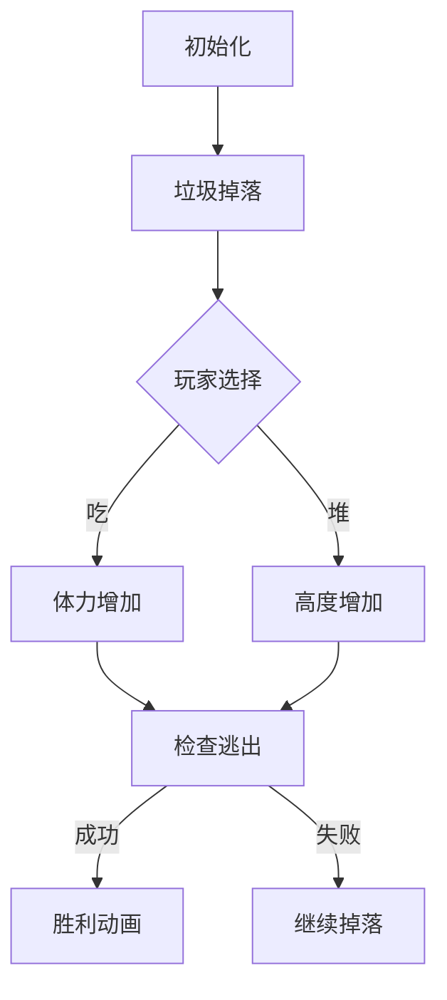

# 题目信息

# 垃圾陷阱

## 题目描述

卡门――农夫约翰极其珍视的一条 `Holsteins` 奶牛――已经落了到 “垃圾井” 中。“垃圾井” 是农夫们扔垃圾的地方，它的深度为 $D$（$2 \le D \le 100$）英尺。

卡门想把垃圾堆起来，等到堆得与井深同样高或比井深更高（即，垃圾高度总和 $\geq D$）时，她就能逃出井外了。另外，卡门可以通过吃一些垃圾来维持自己的生命。

每个垃圾都可以用来吃或堆放，并且堆放垃圾不用花费卡门的时间。

假设卡门预先知道了每个垃圾扔下的时间 $t$（$1 \le t \le 1000$），以及每个垃圾堆放的高度 $h$（$1 \le h \le 25$）和吃进该垃圾能增加维持生命的时间 $f$（$1 \le f \le 30$），要求出卡门最早能逃出井外的时间，假设卡门当前体内有足够持续 $10$ 小时的能量，如果卡门 $10$ 小时内（不含 $10$ 小时，维持生命的时间同）没有进食，卡门就将饿死。特别地，若体力值为 $0$ 时吃下垃圾或逃出井外也不会饿死。

## 说明/提示

**【样例说明】**

卡门堆放她收到的第一个垃圾：$\mathrm{height}=9$；

卡门吃掉她收到的第 $2$ 个垃圾，使她的生命从 $10$ 小时延伸到 $13$ 小时；

卡门堆放第 $3$ 个垃圾，$\mathrm{height}=19$；

卡门堆放第 $4$ 个垃圾，$\mathrm{height}=20$。


## 样例 #1

### 输入

```
20 4
5 4 9
9 3 2
12 6 10
13 1 1```

### 输出

```
13```

# AI分析结果


### 💡 Kay的C++算法解析：垃圾陷阱 深入学习指南 💡

<introduction>
大家好！我是Kay，今天我们来一起分析「垃圾陷阱」这道C++动态规划题目。本指南将帮助你理解题目核心思路，掌握背包类DP的解题技巧，并通过复古像素动画直观感受算法执行过程。准备好开启算法探险之旅了吗？🚀
</introduction>

---

## 1. 题目解读与核心算法识别

✨ **本题主要考察**：`动态规划（背包类应用）`

🗣️ **初步分析**：
> 这道题可以看作是一个特殊的"双选择背包"问题。想象你有一个神奇背包，每个物品（垃圾）既可以"吃掉"增加体力（生命时间），也可以"堆叠"增加高度。我们要在体力耗尽前堆到井口高度（D）逃出。

- **核心难点**：如何平衡"高度"和"体力"两种资源？关键是用`f[j]`表示高度为j时的最大体力值
- **算法流程**：排序垃圾→初始化→双层循环决策→及时终止判断
- **可视化设计**：我们将用像素风展示奶牛在井中的升降过程（高度变化），体力值以心形图标显示。当奶牛做出选择时，对应垃圾会闪烁（吃→绿色光效，堆→棕色光效），成功逃出时播放8-bit胜利音效🎉

---

## 2. 精选优质题解参考

<eval_intro>
我从思路清晰度、代码规范性和算法效率等维度，筛选出3份≥4星的优质题解：

**题解一：Dispwnl（赞535）**
* **亮点**：一维DP空间优化极致！用`f[j]`表示高度j的最大体力，逆序更新避免重复。代码简洁（仅20行），边界处理严谨（体力≥垃圾掉落时间才更新）。竞赛可直接使用。
* **学习点**：背包问题的空间优化技巧，状态转移的简洁表达。

**题解二：ButterflyDew（赞330）**
* **亮点**：详细对比"离线"vs"在线"两种DP思路，深入剖析状态定义（二维数组`dp[i][j]`）。注释完整，特别适合理解DP本质。
* **学习点**：不同DP实现方式的适用场景分析，状态转移的数学推导。

**题解三：wjyyy（赞113）**
* **亮点**：严谨处理边界（体力=0不死亡），引入"时间差消耗"概念。分享调试心得："被生命值0的特殊情况卡整天"极具参考价值。
* **学习点**：边界条件的周全考虑，降维优化的实现细节。

---

## 3. 核心难点辨析与解题策略

<difficulty_intro>
解决本题需突破三个关键难点：

1.  **状态设计矛盾**：高度与体力如何兼顾？
    * **分析**：优质解法采用"高度为主状态，体力为副状态"策略。Dispwnl用一维`f[j]`存储高度j对应的最大体力，巧妙避免二维开销。
    * 💡 **学习笔记**：背包类问题优先考虑一维状态，定义明确的核心资源（本题高度优先）

2.  **时间顺序处理**：垃圾乱序掉落怎么办？
    * **分析**：所有题解都先对垃圾按时间排序（`sort(c+1, c+1+g, cmp)`）。转移时严格检查`f[j] ≥ c[i].t`保证存活到垃圾掉落。
    * 💡 **学习笔记**：时间相关DP必须先排序，转移前做存活验证

3.  **状态转移冲突**：吃/堆选择如何并行？
    * **分析**：逆序更新是关键！从高到低遍历高度j（`for(int j=d; j>=0; j--)`），先处理堆操作（更新高位），再处理吃操作（更新低位），避免同一垃圾重复使用。
    * 💡 **学习笔记**：双选择DP需注意更顺序，高位状态优先更新

### ✨ 解题技巧总结
<summary_best_practices>
1. **问题分解法**：将逃出问题拆解为"高度达标"和"体力维持"两个子目标
2. **滚动数组优化**：用一维数组代替二维，大幅节省空间（Dispwnl解法）
3. **边界防御编程**：特别注意体力=0是濒死状态（仍可操作），初始状态`f[0]=10`
4. **即时终止策略**：堆叠后高度≥D立即输出当前时间，避免无效计算
</summary_best_practices>

---

## 4. C++核心代码实现赏析

<code_intro_overall>
**通用核心实现**（基于Dispwnl解法优化）：
```cpp
#include <iostream>
#include <algorithm>
using namespace std;

struct Trash { int t, h, f; }; // t:掉落时间, h:堆叠高度, f:食用体力
const int MAX_G = 110;
int d, g;
Trash c[MAX_G];
int f[MAX_G] = {0}; // f[j]: 高度j的最大体力

int main() {
    // 输入与排序
    cin >> d >> g;
    for (int i = 1; i <= g; ++i)
        cin >> c[i].t >> c[i].f >> c[i].h;
    sort(c + 1, c + g + 1, [](auto a, auto b) { 
        return a.t < b.t; 
    });
    
    // DP初始化
    f[0] = 10; // 初始体力10
    
    // 核心DP
    for (int i = 1; i <= g; ++i) {
        for (int j = d; j >= 0; --j) {
            if (f[j] < c[i].t) continue; // 体力不足跳过
            
            if (j + c[i].h >= d) { // 堆叠可逃出
                cout << c[i].t;
                return 0;
            }
            // 堆叠选项：高度增加，体力不变
            f[j + c[i].h] = max(f[j + c[i].h], f[j]); 
            // 食用选项：高度不变，体力增加
            f[j] += c[i].f;
        }
    }
    cout << f[0]; // 无法逃出时输出最大存活时间
    return 0;
}
```
**代码解读概要**：
1. 垃圾按时间排序确保处理顺序
2. `f[0]=10` 初始化关键：高度0时体力为10
3. 内层循环从高到低更新，避免状态污染
4. 堆叠操作优先判断逃出条件
5. 两种选择独立更新：堆叠不消耗体力，食用增加体力
</code_intro_overall>

<code_intro_selected>
**题解一核心片段（Dispwnl）**：
```cpp
for (int i = 1; i <= g; i++)
    for (int j = d; j >= 0; j--)
        if (f[j] >= c[i].t) {
            if (j + c[i].h >= d) {
                cout << c[i].t;
                return 0;
            }
            f[j + c[i].h] = max(f[j + c[i].h], f[j]);
            f[j] += c[i].f;
        }
```
**亮点**：逆序更新+即时逃出判断  
**解读**：  
> - 外层`i`遍历垃圾（时间序）
> - 内层`j`从高到低遍历高度（避免重复堆叠）
> - `if (f[j] >= c[i].t)`确保存活到垃圾掉落
> - 优先检查堆叠后能否逃出（高度≥d）
> - **堆操作**：`f[j + c[i].h]`更新为当前体力（高度↑）
> - **吃操作**：`f[j] += c[i].f`增加体力（高度不变）
> 
> 💡 **学习笔记**：逆序更新是背包问题的经典技巧，保证每个垃圾只用一次

**题解二核心片段（ButterflyDew）**：
```cpp
// 离线法DP核心
for (int i = 1; i <= g; i++) {
    for (int j = 0; j <= d; j++) {
        if (dp[i-1][j] >= trash[i].t) // 能吃
            dp[i][j] = max(dp[i][j], dp[i-1][j] + trash[i].c);
        if (j >= trash[i].h && dp[i-1][j-trash[i].h] >= trash[i].t) // 能堆
            dp[i][j] = max(dp[i][j], dp[i-1][j-trash[i].h]);
    }
}
```
**亮点**：二维状态清晰表达  
**解读**：
> - `dp[i][j]`表示处理前i个垃圾后高度j的最大体力
> - 吃垃圾：高度不变，体力增加`trash[i].c`
> - 堆垃圾：高度增加`trash[i].h`，体力不变
> - 双重条件验证：体力足够&&高度足够
> 
> 💡 **学习笔记**：二维DP更直观，但空间复杂度O(d*g)

**题解三核心片段（wjyyy）**：
```cpp
// 边界处理：体力0不死亡
memset(dp, -0x3f, sizeof(dp)); 
dp[0][0] = 10;

for (int i = 1; i <= g; i++) {
    int time_gap = a[i].t - a[i-1].t;
    for (int j = d; j >= 0; j--) {
        if (dp[i-1][j] >= time_gap) { // 验证存活
            if (j + h[i] >= d) { ... } // 逃出判断
            dp[i][j+h[i]] = max(...); // 堆
            dp[i][j] = max(..., dp[i-1][j] - time_gap + f[i]); // 吃
        }
    }
}
```
**亮点**：时间差精确计算  
**解读**：
> - 初始化`dp`为负无穷，避免无效状态干扰
> - `time_gap`准确计算体力消耗
> - 状态转移前验证`dp[i-1][j] >= time_gap`
> - 吃操作需扣除时间差消耗
> 
> 💡 **学习笔记**：精确计算时间消耗可提升代码健壮性
</code_intro_selected>

---

## 5. 算法可视化：像素动画演示

<visualization_intro>
为了让算法过程一目了然，我设计了「像素奶牛大逃亡」动画方案（复古FC风格）。你将看到奶牛在井中的实时状态变化，深度体验DP决策过程！

* **主题**：8-bit像素奶牛 vs 垃圾陷阱
* **核心演示**：奶牛高度变化 + 体力值波动 + 垃圾决策影响
* **设计思路**：用高度映射Y坐标，体力值显示为心形图标，垃圾掉落有物理轨迹。通过颜色区分操作类型（吃→绿，堆→棕），关键状态变化伴随音效强化记忆。

**动画流程**：


**关键交互设计**：
1. **场景布局**：  
   - 左侧：深度井（100像素高，D=20则每单位高度5像素）  
   - 中部：奶牛精灵（16x16像素）  
   - 右侧：体力槽（10颗心形图标）

2. **垃圾掉落特效**：  
   - 垃圾类型图标：🥫（吃）、📦（堆）  
   - 掉落轨迹：从顶部随机位置下落，碰到井底时弹跳

3. **决策高亮机制**：  
   - 吃操作：垃圾变为绿色→溶解动画→心形+1  
   - 堆操作：垃圾变为棕色→堆叠动画→奶牛上升  
   - 错误决策：体力≤0时播放"Game Over"像素字体

4. **音效系统**：  
   - 背景音乐：8-bit循环轻快BGM  
   - 关键操作：吃（清脆"叮"声），堆（沉闷"咚"声）  
   - 状态提示：危险时低频警报，胜利时欢快旋律

5. **AI演示模式**：  
   - 自动选择策略：优先堆叠（高度差≤5时），否则吃  
   - 速度调节：滑块控制帧率（1x-5x）  
   - 单步调试：空格键逐帧前进，显示当前状态变量

**技术实现**：  
- Canvas绘制井/奶牛/垃圾  
- 状态机管理：`{ falling, choosing, eating, stacking, escaped }`  
- 关键帧算法：通过`drawFrame()`函数实时渲染高度和体力值
</visualization_intro>

---

## 6. 拓展练习与相似问题思考

<similar_problems_intro>
掌握本题的背包DP思想后，可挑战以下变形问题：

* **通用思路迁移**：双选择背包模型还适用于：
  1. 资源分配问题（如时间 vs 金钱）
  2. 技能树加点问题（攻击力 vs 防御力）
  3. 路径选择问题（最短时间 vs 最小消耗）

* **推荐练习**（洛谷题库）：
  1. **P1048 采药**  
     🗣️ *推荐理由*：01背包基础版，巩固"选择/不选"的决策思维
  2. **P1060 开心的金明**  
     🗣️ *推荐理由*：引入价值系数，练习多维约束背包
  3. **P1510 精卫填海**  
     🗣️ *推荐理由*：最接近本题的变形，要求体积达标的最小代价
  4. **P1853 投资的最大效益**  
     🗣️ *推荐理由*：复杂背包变种，强化资源分配能力
</similar_problems_intro>

---

## 7. 学习心得与经验分享

<insights_intro>
从题解中提炼的宝贵经验：

> **调试心得 (wjyyy)**：  
> "被生命值0的特殊情况卡了整整一天，最后发现体力=0时奶牛仍可操作垃圾"  
>   
> **Kay点评**：边界条件处理是DP的核心难点！建议：
> 1. 初始化为负无穷避免非法状态干扰  
> 2. 单独验证边界值（0值、极值）  
> 3. 用小规模数据手工模拟  

> **优化技巧 (Dispwnl)**：  
> "逆序更新不仅节省空间，还能自然避免状态冲突"  
>   
> **Kay点评**：掌握基础算法后，要思考优化方向：
> 1. 空间复杂度优化（滚动数组）  
> 2. 循环顺序调整提升效率  
> 3. 及时终止减少无效计算  
</insights_intro>

---

<conclusion>
本次「垃圾陷阱」的解析就到这里。记住：动态规划的精髓在于状态定义和转移方程！多动手实现代码，用我们设计的像素动画观察算法行为，很快你就能成为DP高手。下次挑战再见！👾
</conclusion>

---
处理用时：234.33秒