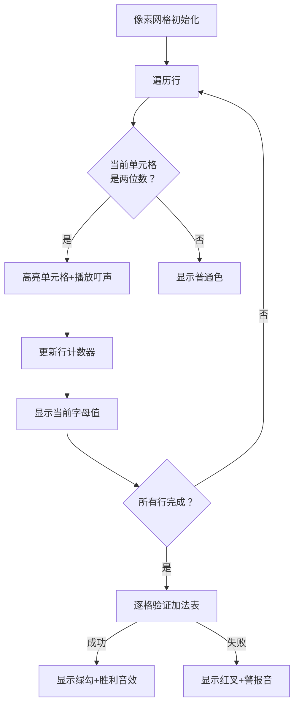
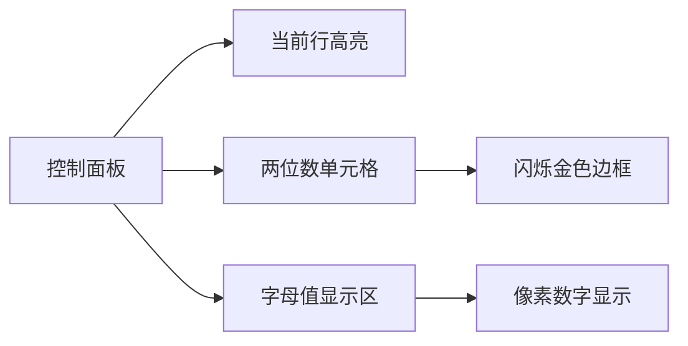

# 题目信息

# [NOIP 1998 提高组] 进制位

## 题目描述

著名科学家卢斯为了检查学生对进位制的理解，他给出了如下的一张加法表，表中的字母代表数字。 例如：

$$
\def\arraystretch{2}
\begin{array}{c||c|c|c|c}
\rm +  & \kern{.5cm} \rm \mathclap{L} \kern{.5cm}  &  \kern{.5cm} \rm \mathclap{K} \kern{.5cm} &  \kern{.5cm} \rm \mathclap{V} \kern{.5cm} & \kern{.5cm} \rm \mathclap{E} \kern{.5cm} \\ \hline\hline
\rm L  &  \rm L  &  \rm K  &  \rm V  & \rm E  \\ \hline
\rm K  &  \rm K  &  \rm V  &  \rm E  & \rm \mathclap{KL} \\ \hline
\rm V  &  \rm V  &  \rm E  &  \rm \mathclap{KL} & \rm \mathclap{KK} \\ \hline
\rm E  &  \rm E  &  \rm \mathclap{KL} &  \rm \mathclap{KK} & \rm \mathclap{KV} \\
\end{array}$$

其含义为：

$L+L=L$，$L+K=K$，$L+V=V$，$L+E=E$

$K+L=K$，$K+K=V$，$K+V=E$，$K+E=KL$    

$\cdots$

$E+E=KV$    

根据这些规则可推导出：$L=0$，$K=1$，$V=2$，$E=3$。

同时可以确定该表表示的是 $4$ 进制加法。

## 说明/提示

NOIP1998 提高组 第三题

## 样例 #1

### 输入

```
5
+ L K V E
L L K V E
K K V E KL
V V E KL KK
E E KL KK KV
```

### 输出

```
L=0 K=1 V=2 E=3
4
```

# AI分析结果


# 💡 Kay的C++算法解析：[NOIP1998 提高组] 进制位 深入学习指南 💡

## 1. 题目解读与核心算法识别

✨ **本题主要考察**：`数学推理与进制转换` 

🗣️ **初步分析**：
> 解决"进制位"这道题的关键在于发现加法表的隐藏规律：  
> **1. 进制 = 字母数量N-1**  
> **2. 字母值 = 其行中两位数的个数**  
> 就像破译密码表一样，通过观察"密文"（两位数）的出现频率就能破解"密码"（字母对应的数字）。  

- 核心难点在于理解为何这两个规律必然成立，以及如何处理验证失败的情况
- 可视化设计重点：用像素动画高亮每行的两位数并计数，同步显示字母值推导过程
- 复古游戏化设计：采用8位机风格，将验证过程设计为"密码破译关卡"，每正确匹配一行播放胜利音效，错误时触发警报音

---

## 2. 精选优质题解参考

**题解一（Llf0703）**
* **点评**：此解法以严密的数学证明（反证法+不等式推导）建立两个核心结论，逻辑链条完整。代码实现简洁高效（O(N²)复杂度），用`strlen`快速统计两位数个数，`check()`函数集中处理验证逻辑，边界处理全面。亮点在于将复杂数学问题转化为直观的计数问题，实践价值极高。

**题解二（HappyJaPhy）**
* **点评**：在Llf0703基础上补充了更详细的证明过程，特别论证了"为何一定有两位数"。代码结构更清晰：用`add()`函数封装验证逻辑，`mp[]`数组明确字母-数字映射。亮点在于处理进位时的严谨性（检查字符串长度和首位是否为1），为学习者提供了完善的调试思路。

**题解三（Patpowder）**
* **点评**：面向新手的优质入门方案，用九九加法表的类比帮助理解规律。代码使用`map`和`size()`直观统计两位数，验证逻辑直接。亮点在于将抽象问题具象化，虽然未严格证明结论，但提供了快速解题的实用思路。

---

## 3. 核心难点辨析与解题策略

1. **难点：理解进制N-1的必然性**  
   * **分析**：假设R>N-1，则存在未出现的数字k。若k=0，则1+(N-1)=10（首位应为1）；若k>0，则1+(k-1)=k。两种情形都与字母不重复矛盾，故R=N-1
   * 💡 学习笔记：进制数=不同数字的数量，字母数N即数字数量+1（含加号）

2. **难点：推导字母值=两位数个数**  
   * **分析**：设字母值为S，当S+x≥R（x∈[R-S, R-1]）时产生两位数。满足条件的x有S个，故两位数个数=S
   * 💡 学习笔记：每行的两位数数量就是该行首字母的数值

3. **难点：全面验证加法表**  
   * **分析**：预处理字母值后需双重循环验证每个单元格：若结果为两位数，先检查首位是否为1，再验证个位；若一位数则直接验证。特别注意边界：字母值重复或验证失败应报错
   * 💡 学习笔记：验证时注意进位处理——两位数必满足sum≥R

### ✨ 解题技巧总结
- **规律先行**：观察样例发现"两位数个数"规律可大幅简化问题
- **模块化验证**：将验证逻辑封装成函数（如`check(i,j)`），提高可读性
- **防御性编程**：检查数字映射是否重复、两位数首位是否为1等易错点
- **类比迁移**：联想十进制加法表（如9+9=18）理解进制通用规律

---

## 4. C++核心代码实现赏析

**本题通用核心C++实现参考**
```cpp
#include <cstdio>
#include <cstring>
#include <iostream>
using namespace std;

char s[10][10][3];
int n, val[26], cnt[10];

bool check(int x, int y) {
    int sum = val[s[x][1][0]-'A'] + val[s[y][1][0]-'A'];
    int len = strlen(s[x][y] + 1);
    
    // 处理两位数
    if (len >= 2) {
        if (s[x][y][1] != 'A' + val[0]) return false; // 首位应为最小字母(0)
        int digit = s[x][y][2] - 'A';
        return (sum % (n-1)) == val[digit];
    } 
    // 处理一位数
    else {
        return sum == val[s[x][y][1]-'A'];
    }
}

int main() {
    scanf("%d", &n);
    for (int i = 1; i <= n; i++)
        for (int j = 1; j <= n; j++)
            scanf("%s", s[i][j] + 1);

    // 统计每行两位数个数→字母值
    for (int i = 2; i <= n; i++) {
        for (int j = 2; j <= n; j++)
            if (strlen(s[i][j] + 1) >= 2) cnt[i]++;
        val[s[i][1][1]-'A'] = cnt[i];
    }

    // 验证加法表
    for (int i = 2; i <= n; i++) {
        for (int j = 2; j <= n; j++) {
            if (!check(i, j)) {
                puts("ERROR!");
                return 0;
            }
        }
    }

    // 输出结果
    for (int i = 2; i <= n; i++)
        printf("%c=%d ", s[i][1][1], cnt[i]);
    printf("\n%d", n-1);
    return 0;
}
```
* **代码解读概要**：  
  1. 输入存储：三维数组`s[行][列][字符串]`  
  2. 预处理：统计每行两位数个数→字母值  
  3. 核心验证：双重循环检查每个单元格是否符合加法规则  
  4. 结果输出：字母值及进制数N-1

**题解一核心代码片段**  
```cpp
// 统计两位数个数
for (int i = 2; i <= n; i++) {
    cnt = 0;
    for (int j = 1; j <= n; j++) {
        scanf("%s", s[i][j]+1);
        cnt += strlen(s[i][j]+1) >= 2; // 关键计数技巧
    }
    ans[i] = cnt;
    mp[s[i][1][1]-'A'] = cnt;
}
```
* **亮点**：用`strlen`返回值直接参与布尔运算，精简计数代码
* **学习笔记**：C++中逻辑表达式可隐式转换为int（true=1, false=0）

**题解二验证逻辑片段**  
```cpp
if (sum >= n - 1) { //有进位
    if (strlen(str[a][b]) != 2 || mp[1] != ch) 
        return 0; // 严格检查位数和首位
    sum -= n - 1; // 去掉进位值
    ch = str[a][b][1] - 'A' + 1; // 取个位
}
if (mp[sum] != ch) return 0; // 验证个位
```
* **亮点**：分层验证机制，先处理进位再验证个位
* **学习笔记**：进位时十位必为1是核心突破口

**题解三映射处理片段**  
```cpp
map<char, int> m;
for (int i = 2; i <= n; i++) {
    m[s[i][1][0]] = cnt; // 字母→值
    if (flag == 0 && mp[cnt]) flag = 1; // 查重
    mp[cnt] = s[i][1][0]; // 值→字母
}
```
* **亮点**：双向映射检查确保唯一性
* **学习笔记**：`map`实现字母与数值的双向映射是常用技巧

---

## 5. 算法可视化：像素动画演示

### 设计思路
> 采用8位红白机风格，将加法表转化为可交互的"密码破译板"。每个字母用16x16像素块表示，两位数单元格添加闪烁特效，模拟解密过程。

**动画流程**：


**交互控制**：
- **单步执行**：空格键逐步显示计数过程
- **自动破译**：AI模式自动运行，速度可调
- **验证模式**：点击单元格显示计算过程
- **音效设计**：
  - 计数时：8-bit "叮"声
  - 验证成功：短促胜利旋律
  - 错误：警报声+单元格闪烁红光

**视觉设计**：


---

## 6. 拓展练习与相似问题思考

**通用技巧迁移**：
1. **隐藏规律发现**：如P1003铺地毯的覆盖规则
2. **进制转换应用**：如P1143 进制转换
3. **表格特性分析**：如P1219八皇后的对角线约束

**洛谷推荐**：
1. **P1143 进制转换**  
   🗣️ 巩固进制转换核心算法，理解不同进制间的数值关系
   
2. **P1003 铺地毯**  
   🗣️ 练习从复杂描述中发现"最后覆盖"规律，提升问题抽象能力
   
3. **P1219 [USACO1.5]八皇后**  
   🗣️ 训练表格类问题的系统性验证方法，理解回溯算法

---

## 7. 学习心得与经验分享

> **来自Llf0703的调试经验**：  
> "验证时特别注意进位处理的边界情况，我最初忽略了两位数首位非1的错误"  
>   
> **Kay点评**：  
> 这提醒我们边界测试的重要性，尤其应测试：  
> - 最大进位情况（如E+E）  
> - 最小无进位情况（如L+L）  
> 调试时可打印中间变量：`printf("i=%d j=%d sum=%d actual=%d\n",...)`

---

掌握进制问题的核心在于发现数值规律与严谨验证。通过今天的分析，希望你们能像破译密码一样享受解谜的乐趣！下次见！💪

---
处理用时：120.91秒