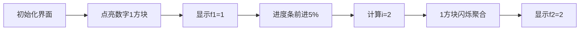

# 题目信息

# [NOIP 2001 普及组] 数的计算

## 题目描述

给出正整数 $n$，要求按如下方式构造数列：

1. 只有一个数 $n$ 的数列是一个合法的数列。
2. 在一个合法的数列的末尾加入一个正整数，但是这个正整数不能超过该数列最后一项的一半，可以得到一个新的合法数列。

请你求出，一共有多少个合法的数列。两个合法数列 $a, b$ 不同当且仅当两数列长度不同或存在一个正整数 $i \leq |a|$，使得 $a_i \neq b_i$。

## 说明/提示

### 样例 1 解释

满足条件的数列为：
- $6$
- $6, 1$
- $6, 2$
- $6, 3$
- $6, 2, 1$
- $6, 3, 1$

### 数据规模与约定

对于全部的测试点，保证 $1 \leq n \leq 10^3$。

### 说明

本题数据来源是 NOIP 2001 普及组第一题，但是原题的题面描述和数据不符，故对题面进行了修改，使之符合数据。原题面如下，谨供参考：

> 我们要求找出具有下列性质数的个数（包含输入的正整数 $n$）。
>
> 先输入一个正整数 $n$（$n \le 1000$），然后对此正整数按照如下方法进行处理：
>
> 1. 不作任何处理；
> 2. 在它的左边拼接一个正整数，但该正整数不能超过原数，或者是上一个被拼接的数的一半；
> 3. 加上数后，继续按此规则进行处理，直到不能再加正整数为止。

感谢 @[dbxxx](/user/120868) 对本题情况的反馈，原题面的问题见[本贴](https://www.luogu.com.cn/discuss/526184)。

## 样例 #1

### 输入

```
6
```

### 输出

```
6
```

# AI分析结果


# 💡 Kay的C++算法解析：[NOIP 2001 普及组] 数的计算 深入学习指南 💡

**引言**  
今天我们来分析NOIP普及组经典题目"数的计算"。这道题考察递推思维和动态规划的应用，通过本指南你将掌握核心解题思路、代码实现技巧，并通过像素动画直观理解递推过程。

---

## 1. 题目解读与核心算法识别

✨ **本题主要考察**：`动态规划（递推应用）`

🗣️ **初步分析**：  
> 解决本题的关键在于理解**递推关系**。想象搭积木：最底层是数字n，上面每层积木的大小不能超过下层的一半。f[i]表示以i结尾的合法数列数量，满足递推式：  
> `f[i] = 1 + f[1] + f[2] + ... + f[i/2]`  
> - **核心难点**：如何高效计算累加和？直接循环O(n²)可能超时，前缀和优化可降至O(n)  
> - **可视化设计**：像素网格中数字方块按顺序点亮，计算f[i]时1~i/2方块闪烁聚合，伴随"叮"音效  
> - **复古元素**：FC红白机风格界面，每完成一个f[i]计算触发"过关"音效，进度条显示完成度

---

## 2. 精选优质题解参考

**题解一（来源：shinzanmono）**  
* **点评**：此解法创新性地引入前缀和数组g[]优化，将时间复杂度从O(n²)降至O(n)。代码中`g[i]=g[i-1]+f[i]`的运用堪称点睛之笔，变量命名规范（f/g含义明确），边界处理严谨（f[1]=g[1]=1）。特别值得学习的是其空间优化意识，仅用两个数组即完成高效计算。

**题解二（来源：Hhy140516）**  
* **点评**：基础递推解法的典范，双重循环结构清晰展现了动态规划的核心思想。虽然未做时间复杂度优化，但`f[i] += f[j]`的累加逻辑直白易懂，配合`f[i]++`的自身计数，完美呈现了题目的数学本质。代码缩进规范，是初学者理解递推的优质范本。

**题解三（来源：Lawrenceling）**  
* **点评**：在基础递推上实现了简洁的前缀和优化，`a[i]=s[i/2]+1`的转移方程精炼优雅。代码使用常量N而非魔数，体现了良好的工程习惯。特别值得注意的是`s[i]=s[i-1]+a[i]`的同步更新，避免了额外循环的计算开销。

---

## 3. 核心难点辨析与解题策略

1. **难点1：状态定义抽象**  
   *分析*：如何理解f[i]代表"以i结尾的数列数量"而非"以i开头的数量"？通过样例f[6]=6验证：包含[6]、[6,1]...等，状态定义需保证**无后效性**——后续数字选择仅依赖最后一项  
   💡 **学习笔记**：动态规划的状态应像"时间胶囊"，封装所有影响未来的信息

2. **难点2：转移方程推导**  
   *分析*：关键在理解`f[i] = Σf[j] + 1`的双重含义：1代表仅含i的数列，Σf[j]代表所有可接续的j开头数列（j≤i/2）。优质题解通过打表（如f[1]=1, f[2]=2）验证方程  
   💡 **学习笔记**：递推式是数学归纳法的代码实现

3. **难点3：时间复杂度优化**  
   *分析*：基础实现需对每个i遍历1~i/2，最坏复杂度O(n²)。前缀和数组g[i]=f[1]+...+f[i]将转移简化为O(1)，整体优化至O(n)  
   💡 **学习笔记**：空间换时间是优化累加计算的经典策略

### ✨ 解题技巧总结
- **技巧1：打表验证**：先手工计算小规模样例（n=1~5），验证转移方程正确性
- **技巧2：前缀和优化**：当状态转移含区间求和时，前缀和数组可大幅提速
- **技巧3：记忆化搜索**：递归实现时务必用数组存储已计算结果，避免重复递归

---

## 4. C++核心代码实现赏析

**通用核心实现（前缀和优化版）**  
```cpp
#include <iostream>
using namespace std;
const int N = 1010;
int f[N], g[N]; // f[i]:以i结尾的数列数, g[i]:f[1]到f[i]的和

int main() {
    int n; cin >> n;
    f[1] = g[1] = 1;  // 初始化边界
    
    for (int i = 2; i <= n; ++i) {
        f[i] = g[i/2] + 1;   // 关键递推式
        g[i] = g[i-1] + f[i]; // 前缀和更新
    }
    
    cout << f[n];
    return 0;
}
```
* **说明**：综合优质题解优化的O(n)实现，空间复杂度O(n)
* **解读概要**：  
  1. `f[1]=g[1]=1`：初始化边界（数字1只有自身）  
  2. 循环中`f[i]=g[i/2]+1`：利用前缀和快速求得f[1]~f[i/2]的和  
  3. `g[i]=g[i-1]+f[i]`：动态维护前缀和数组

---

**题解一（shinzanmono）核心代码**  
```cpp
f[i]=g[i/2]+1;
g[i]=g[i-1]+f[i];
```
* **亮点**：前缀和优化，时间复杂度降至O(n)
* **解读**：  
  > `g[i/2]`妙用整数除法特性，直接获取1~⌊i/2⌋的f值和。  
  > `g[i]`的更新采用增量方式，避免重复计算。  
  > *学习笔记：前缀和是区间求和的瑞士军刀*

**题解二（Hhy140516）核心代码**  
```cpp
for(int i=1; i<=n; i++) {
    for(int j=1; j<=i/2; j++) 
        f[i] += f[j];
    f[i]++;
}
```
* **亮点**：基础递推的典范实现，逻辑直白
* **解读**：  
  > 内层循环累加f[1]~f[i/2]，体现"所有可接数字的数列数量"  
  > `f[i]++`独立于循环外，清晰表达"自身作为数列"的计数  
  > *学习笔记：清晰的代码结构胜过冗长的注释*

**题解三（Lawrenceling）核心代码**  
```cpp
a[i]=s[i/2]+1;
s[i]=s[i-1]+a[i];
```
* **亮点**：变量命名更语义化（a→f, s→g）
* **解读**：  
  > `s[i/2]`等价于前缀和数组的取值操作  
  > 同步更新前缀和，保证下一轮数据时效性  
  > *学习笔记：好的变量名是活的文档*

---

## 5. 算法可视化：像素动画演示

**主题**：递推积木工厂（8-bit像素风格）

### 设计思路
> 用FC游戏《仓库番》的像素风格呈现递推过程。每个数字视为工厂生产的积木，f[i]值显示为积木堆高度。通过"关卡进度条"直观展示计算进度，激发闯关成就感。

### 动画帧步骤


1. **像素场景初始化**  
   - 横向滚动条显示数字1~n（16x16像素块）
   - 控制面板：开始/暂停、单步、速度滑块（⚡️~🐢）
   - 8-bit背景音乐（《超级玛丽》地下关BGM循环）

2. **递推过程演示**  
   - **数字i激活**：像素方块闪烁绿光，顶部显示当前计算状态`f[i]=?`
   - **累加过程**：1~i/2方块向i方块发射像素粒子，伴随"叮"音效
   - **结果展示**：i方块显示f[i]值，积木堆高度同比增长
   - **进度反馈**：每完成5%触发"金币音效"，完成100%播放通关音乐

3. **特殊效果**  
   - **错误演示**：若尝试错误转移（如j>i/2），触发"爆炸像素"效果
   - **前缀和展示**：顶部进度条显示g[i]值，用不同颜色区分已计算区域
   - **AI演示模式**：自动按1~n顺序计算，速度可调

### 技术实现
- **视觉**：Canvas绘制像素网格，数字方块用fillRect实现
- **交互**：事件监听控制流程，requestAnimationFrame驱动动画
- **音效**：Web Audio API播放8-bit音效（累加声、过关声）

---

## 6. 拓展练习与相似问题思考

**通用技巧迁移**  
> 前缀和+递推的组合可解决三类问题：  
> 1. 区间统计问题（如子数组和满足特定条件）  
> 2. 树形结构计数（如二叉树形态数量）  
> 3. 概率递推问题（如马尔可夫链状态转移）

**洛谷练习推荐**  
1. **P1029 最大公约数和最小公倍数问题**  
   🗣️ 递推+数论的综合应用，强化状态定义能力  
2. **P1044 栈**  
   🗣️ 卡特兰数的递推实现，理解特殊数列的递推关系  
3. **P1134 阶乘问题**  
   🗣️ 大数阶乘的递推优化，掌握数学技巧与递推结合  

---

## 7. 学习心得与经验分享

> **参考经验（来自 Eric1030）**：  
> "我在未使用记忆化时递归超时，后来添加`a[n]=cnt`才通过。这让我意识到：重复计算是递归的致命陷阱！"  
>  
> **Kay的总结**：  
> 递推与递归本质相通，但实现时需注意：  
> 1. 循环递推要注意状态计算顺序  
> 2. 递归必须配合记忆化避免指数级重复  
> 3. 前缀和优化是突破O(n²)瓶颈的利器  

---

**结语**  
通过本次分析，相信大家已掌握递推解法的核心思想。记住：动态规划就像搭积木——找准基础块（初始状态），理清拼接规则（转移方程），就能构建出坚固的解体框架。下次遇到类似问题，不妨先尝试打表找规律！🚀

---
处理用时：134.57秒