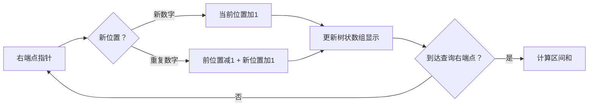

# 题目信息

# [SDOI2009] HH的项链

## 题目描述

HH 有一串由各种漂亮的贝壳组成的项链。HH 相信不同的贝壳会带来好运，所以每次散步完后，他都会随意取出一段贝壳，思考它们所表达的含义。HH 不断地收集新的贝壳，因此，他的项链变得越来越长。  

有一天，他突然提出了一个问题：某一段贝壳中，包含了多少种不同的贝壳？这个问题很难回答…… 因为项链实在是太长了。于是，他只好求助睿智的你，来解决这个问题。


## 说明/提示

【数据范围】  

对于 $20\%$ 的数据，$1\le n,m\leq 5000$；   
对于 $40\%$ 的数据，$1\le n,m\leq 10^5$；   
对于 $60\%$ 的数据，$1\le n,m\leq 5\times 10^5$；  
对于 $100\%$ 的数据，$1\le n,m,a_i \leq 10^6$，$1\le l \le r \le n$。

本题可能需要较快的读入方式，最大数据点读入数据约 20MB

## 样例 #1

### 输入

```
6
1 2 3 4 3 5
3
1 2
3 5
2 6
```

### 输出

```
2
2
4```

# AI分析结果


# 💡 Kay的C++算法解析：HH的项链 深入学习指南 💡

今天我们来一起分析“HH的项链”这道C++编程题。本指南将帮助大家梳理题目思路，理解核心算法，并掌握解题技巧。

## 1. 题目解读与核心算法识别

✨ **本题主要考察**：树状数组与离线处理

🗣️ **初步分析**：
> 解决“HH的项链”这道题，关键在于理解并运用**树状数组+离线处理**的技巧。简单来说，这就像整理贝壳收藏册——当查看某段项链时，我们只关心每种贝壳最后一次出现的位置（最右端的贝壳），忽略中间重复的贝壳。

在本题中，这种技术主要用于高效处理区间查询：
- 核心思路：将询问按右端点排序，维护树状数组记录有效位置（每个数字最后一次出现的位置）
- 可视化设计：像素动画将展示右指针移动过程，当遇到重复贝壳时，之前位置的贝壳消失（红色闪烁+音效），新位置贝壳高亮（绿色+音效）。树状数组高度实时变化，展示前缀和更新
- 复古元素：采用8-bit像素风格，贝壳用不同颜色方块表示。控制面板含单步/自动模式，完成查询时播放"胜利"音效

---

## 2. 精选优质题解参考

从思路清晰度、代码规范性和算法效率等维度，我为大家筛选了以下优质题解：

**题解一（作者：dlhham）**
* **点评**：思路直击核心——按右端点排序询问，用`pre`数组记录数字最后出现位置。代码简洁规范（变量名`pre`含义明确），边界处理严谨。亮点在于用朴素树状数组实现O((n+m)logn)复杂度，实践价值极高。

**题解二（作者：叶小枫）**
* **点评**：创新性提供树状数组和线段树双解法。树状数组版本标准高效；线段树版本用`vector`分组询问，虽稍慢但拓宽思路。代码模块化强（结构体封装询问），调试经验分享（排序意外优化缓存）极具启发性。

**题解三（作者：凌幽）**
* **点评**：采用`next`数组记录同数字下一位置，按左端点排序处理。虽然排序逻辑不同但核心思想一致，提供新视角。代码含详细注释，快读处理大数据，实践性强。

---

## 3. 核心难点辨析与解题策略

### 关键难点与解决策略

1. **离线排序的意义**  
   *分析*：按右端点排序后，处理询问时保证右端之前的位置已更新，且每个数字只保留最后出现位置  
   💡 **学习笔记**：离线处理通过调整查询顺序，将动态问题转化为静态序列处理

2. **有效位置维护**  
   *分析*：用`pre`数组记录数字最后位置。当位置`i`的数字`x`出现时：  
   - 若`pre[x]`存在：树状数组在`pre[x]`减1  
   - 在`i`加1并更新`pre[x]=i`  
   💡 **学习笔记**：维护"最后出现位置"是避免重复计数的核心

3. **树状数组的作用**  
   *分析*：高效维护前缀和（O(logn)更新/查询）。在本题中，`sum(r)-sum(l-1)`直接得到区间`[l,r]`内不同数字个数  
   💡 **学习笔记**：树状数组是动态维护前缀信息的利器

### ✨ 解题技巧总结
- **问题转化**：将"区间种类数"转化为"最后出现位置的前缀和"
- **离线处理**：对询问重新排序，使处理顺序符合问题特性
- **空间优化**：用`pre`数组代替哈希表，O(n)空间记录位置

---

## 4. C++核心代码实现赏析

### 本题通用核心C++实现
```cpp
#include <iostream>
#include <algorithm>
#define lowbit(x) ((x)&(-x))
const int N = 1e6+5;
int tree[N], pre[N], ans[N], n, m;

struct Query { int l, r, id; } q[N];
bool cmp(Query a, Query b) { return a.r < b.r; }

void update(int p, int v) {
    while (p <= n) tree[p] += v, p += lowbit(p);
}

int query(int p) {
    int res = 0;
    while (p) res += tree[p], p -= lowbit(p);
    return res;
}

int main() {
    std::ios::sync_with_stdio(false);
    std::cin >> n;
    int* a = new int[n+1];
    for (int i = 1; i <= n; i++) std::cin >> a[i];
    
    std::cin >> m;
    for (int i = 1; i <= m; i++) 
        std::cin >> q[i].l >> q[i].r, q[i].id = i;
    std::sort(q+1, q+1+m, cmp);

    int pos = 1;
    for (int i = 1; i <= m; i++) {
        for (int j = pos; j <= q[i].r; j++) {
            if (pre[a[j]]) update(pre[a[j]], -1);
            update(j, 1);
            pre[a[j]] = j;
        }
        pos = q[i].r + 1;
        ans[q[i].id] = query(q[i].r) - query(q[i].l-1);
    }
    
    for (int i = 1; i <= m; i++) 
        std::cout << ans[i] << '\n';
    delete[] a;
    return 0;
}
```

**代码解读概要**：
1. 读取贝壳序列和询问
2. 询问按右端点排序
3. 按排序顺序处理：
   - 更新右端点前未处理的位置
   - 维护pre数组记录最后位置
   - 树状数组动态更新
4. 计算区间和作为答案

---

### 优质题解片段赏析

**题解一核心（dlhham）**
```cpp
for (int i = 1; i <= m; ++i) {
    for (int j = pow; j <= q[i].r; ++j) {
        if (vis[a[j]]) modify(vis[a[j]], -1);
        modify(j, 1);
        vis[a[j]] = j;
    }
    pow = q[i].r + 1;
    ans[q[i].id] = query(q[i].r) - query(q[i].l - 1);
}
```
> **亮点**：双循环结构清晰展示处理逻辑  
> **解读**：外层遍历询问，内层更新右端点前的位置。`vis`数组（即`pre`）记录数字最后位置，`modify`更新树状数组  
> 💡 **学习笔记**：内层循环的`pow`变量高效跳过已处理位置

**题解二线段树实现（叶小枫）**
```cpp
for (int i = 1; i <= n; i++) {
    if (lst[a[i]]) build(root, lst[a[i]]), modify(root, lst[a[i]]);
    lst[a[i]] = i;
    build(root, i);
    for (int j = 0; j < vis[i].size(); j++) {
        int tmp = vis[i][j];
        ans[q[tmp].id] = query(root, q[tmp].l, q[tmp].r);
    }
}
```
> **亮点**：用`vector`按右端点分组询问  
> **解读**：`vis[i]`存储右端点为`i`的询问。线段树动态维护有效位置  
> 💡 **学习笔记**：分组处理避免排序，但空间稍大

**题解三next数组（凌幽）**
```cpp
for (int i = n; i; i--) {
    nxt[i] = head[a[i]];
    head[a[i]] = i;
}
// ...处理部分
for (int j = 1; j < q[i].l; j++) 
    if (nxt[j]) add(nxt[j], 1);
```
> **亮点**：`nxt`数组记录同数字下一位置  
> **解读**：倒序构建`nxt`数组，处理时激活下一位置  
> 💡 **学习笔记**：按左端点排序的替代方案，拓展思维

---

## 5. 算法可视化：像素动画演示

### 像素探险：贝壳收集者之旅
* **主题**：8-bit像素风格展示树状数组离线处理全过程
* **核心演示**：右指针移动时更新有效位置，树状数组动态响应

**动画流程**：
1. **场景初始化**：
   - 顶部：像素贝壳序列（不同颜色方块）
   - 中部：树状数组（柱状高度表示值）
   - 底部：控制面板（开始/暂停/单步/速度条）

2. **算法启动**：
   - 右指针（像素小人）从左向右移动
   - 遇到新贝壳：方块高亮绿色，树状数组对应位置+1（↑动画 + "叮"音效）
   - 遇到重复贝壳：之前位置变红闪烁后消失（↓动画 + "砰"音效），新位置高亮

3. **查询响应**：
   - 当指针到达询问右端点：显示`[l,r]`区间，树状数组计算过程
   - 答案显示时播放"胜利"音效，得分+10

4. **交互功能**：
   - 单步模式：按步观察更新逻辑
   - 自动模式：可调速观看全局
   - 双模式对比：展示树状数组与线段树实现差异

**设计细节**：


---

## 6. 拓展练习与相似问题思考

### 技巧迁移场景
1. **区间数字替换**：如将所有`x`替换为`y`后查询
2. **出现次数限制**：如查询出现至少2次的数字个数
3. **带权值查询**：如计算不同数字的权值和

### 推荐练习（洛谷）
1. **P3901 数列找不同**  
   → 检测区间内数字是否全部不同，巩固核心思想
2. **P4113 [HEOI2012]采花**  
   → 统计出现至少两次的数字，需维护前两个位置
3. **P3332 [ZJOI2013]K大数查询**  
   → 树状数组进阶应用，掌握多维问题处理

---

## 7. 学习心得与经验分享

> **来自dlhham的经验**：  
> "处理区间种类问题时，保留最右边位置是关键——就像在项链中，只有最后出现的贝壳才值得关注。"

> **来自叶小枫的调试经验**：  
> "线段树版本中意外的排序操作竟优化了缓存命中。这提醒我们：算法常数优化有时来自意想不到的地方。"

**总结启示**：
1. 树状数组+离线处理是区间统计问题的利器
2. 空间换时间（如`pre`数组）是常用优化手段
3. 大数据时务必使用快读（如本题20MB输入）

---

本次关于"HH的项链"的解析就到这里。记住，编程能力的提升在于持续学习和勇于实践。下次我们再一起探索新的算法挑战！💪

---
处理用时：175.07秒