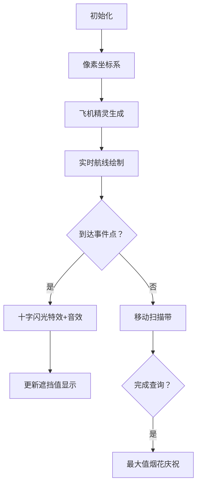

# 题目信息

# [CCO 2015] 太阳能飞行

## 题目背景

**警告：滥用本题评测将被封号**

## 题目描述

**本题译自 [CCO 2015](https://cemc.math.uwaterloo.ca/contests/computing/2015/index.html) Day1 T3「[Solar Flight](https://cemc.math.uwaterloo.ca/contests/computing/2015/stage%202/day1.pdf)」**

航空的新纪元正在来临——第一个太阳能驱动的巨型喷气式飞机即将商用！然而，公众对前沿技术有一些在安全方面的焦虑，因为驱动飞机的阳光的光线可能会被其他在空中的物体挡住。因此，必须先进行一些统计和计算来规划第一次航行。

我们考虑一个包含 $N$ 个从一个城市到另外一个城市的航路组成的图。一架飞机可以被考虑成一个点。它穿过的天空可以被模型化为一个笛卡尔坐标系，其中 $X$ 轴表示从任意一个点向东出发的距离，$Y$ 轴表示高度。我们只考虑 $x$ 值的范围在 $[0,X]$，所有航路均为直线的部分。第 $i$ 架飞机从 $(0,A_i)$ 飞到 $(X,B_i)$。所有$A$值互不相同，对于$B$也如此。飞机以未知的，可能是非恒定的速度沿着航路行驶，所以任意时间点，飞机可能在航路的任意位置上。然而，已知的是飞机从不与其他飞机相撞，所以如果两个航道交错，两个飞机不会同时到达交点。

每个飞机 $i$ 同时也有一个干扰因素值 $C_i$，表示一个飞机影响它下面飞机太阳吸收能力的强弱。

各个飞机上的太阳能板非常奇怪，那些太阳能板只能收集飞机正上方的能量。这就意味着一个飞机能吸收的阳光可能会被其他与其的 $x$ 值相同，但是 $y$ 值比他大的飞机挡住。具体来说，太阳能板吸收的太阳光减少的值为挡住它的飞机的干扰因素值之和。

根据这些信息，以及一个距离常数 $K$，你要回答 $Q$ 个关于可能对太阳能板影响的询问。第 $i$ 个询问询问你在一个时刻飞机 $P_i$ 的太阳能板吸收的太阳光减少的值。在任意时刻飞机的 $x$ 值均在 $[S_i,S_i+K]$之间。

## 说明/提示

飞机的航路示意图如下图所示。


询问 $1$ 是对于 $2$ 号飞机在 $[1,5]$ 范围内所提出的询问，当飞机在 $x\le 4$ 时可能会被飞机 $3$ 挡住，但是绝不是飞机 $1$。然而，但是当它的 $x>4$ 时可能会被其他所有飞机挡住，因此，该询问的答案即其他所有飞机的影响因素值之和，为 $5+6=11$。

对于询问 $2$，当 $x<10$ 时飞机 $1$ 可能会被飞机 $3$ 挡住，并且当 $x\geq10$ 时不会被任何飞机盖住，因此只可能被飞机 $3$ 影响，即结果等于飞机 $3$ 的影响因素值 $6$。

对于询问 $3$，飞机 $1,2$ 都不能在飞机 $3$ 的正上方除非 $x$ 达到 $10$。所以该询问的答案为0。

对于 $40\%$ 的数据，$Q\le 1000$。  

对于 $100\%$ 的数据，$1\le N\le 2000,$ $1\le K\le X,$ $1\le X,A_i,B_i,C_i\le 10^9,$ $0\le S_i\le X-K,$ $1\le Q \le 800000$。

## 样例 #1

### 输入

```
12 4 3 3
1 4 5
2 2 3
6 3 6
2 1
1 8
3 0```

### 输出

```
11
6
0```

# AI分析结果


### 题目解读与核心算法识别

✨ **本题主要考察**：`扫描线算法与几何关系建模`

🗣️ **初步分析**：
> 解决"太阳能飞行"问题的关键在于**将三维飞行路径关系转化为二维几何问题**，并利用扫描线思想处理动态变化。想象飞机航线是纵横交错的钢琴弦，每当两弦相交（飞机航线交叉），音调（遮挡关系）就会改变。我们需要记录这些"变音点"（交点），并通过滑动窗口捕捉旋律（遮挡值）的最高音（最大值）。
> 
> **核心算法流程**：
> 1. **几何关系建模**：计算每两架飞机航线的交点坐标（若相交）
> 2. **事件点生成**：将交点转化为遮挡关系变化事件（+C/-C）
> 3. **扫描线处理**：沿X轴排序事件点，构建分段函数
> 4. **区间查询优化**：用单调队列高效获取[Si, Si+K]区间最大值
>
> **可视化设计思路**：
> - 复古像素风格：FC红白机风格的坐标系，飞机用8位像素方块表示
> - 关键动画：航线交叉时触发"十字闪光"特效，遮挡值变化时播放NES音效
> - 动态标记：当前查询区间显示为半透明绿色扫描带，最大值实时显示在顶部
> - 控制面板：支持单步执行（观察每个事件点）、自动演示（AI飞机编队飞行）

---

### 精选优质题解参考

**题解一（作者：a326820068122c，评分：⭐⭐⭐⭐⭐）**
* **点评**：此解法采用**几何关系建模+滑动窗口优化**的双重技巧。亮点在于：
  - 用`long double`精确计算交点避免浮点误差
  - 将事件点按位置排序后压缩存储（O(n²)→O(n)）
  - 创新性使用**单调队列**处理固定区间最大值，时间复杂度优化至O(n²+qlogn)
  - 代码模块化清晰：预处理→事件压缩→离线查询→单调队列一气呵成
  - 实践价值高：可直接用于竞赛，边界处理严谨（如eps精度控制）

**题解二（作者：Crossing，评分：⭐⭐⭐⭐）**
* **点评**：采用**基础事件点扫描+前缀和**的直观解法：
  - 思路直白易懂：详细注释帮助理解几何关系转化过程
  - 代码结构清晰：分阶段预处理→排序→前缀和构建→二分查询
  - 调试心得宝贵：作者强调"看题需逐字，避免误读条件"
  - 不足：未使用单调队列优化，最坏复杂度O(n²q)对大数据较慢

---

### 核心难点辨析与解题策略

1.  **难点1：动态遮挡关系建模**
    * **分析**：飞机遮挡关系随X坐标动态变化，难点在于确定变化临界点（交点）。优质题解通过两两计算航线交点（初中几何知识），将问题转化为事件驱动的增量模型
    * 💡 **学习笔记**：相交判断公式 `dx=(b[i]-b[j])/(k[j]-k[i])` 是建模核心，注意平行线特判

2.  **难点2：高效处理事件点**
    * **分析**：最多O(n²)个事件点需压缩存储。题解1采用**事件点合并排序**：先按X坐标排序，再合并相邻点（用eps精度控制），避免重复计算
    * 💡 **学习笔记**：浮点数比较必须用`abs(a-b)<eps`，直接`==`会因精度误差失败

3.  **难点3：区间最大值查询**
    * **分析**：固定长度K的滑动窗口最大值查询是性能瓶颈。题解1创新性引入**离线查询+单调队列**：
      - 按查询起点S_i排序
      - 双指针维护有效事件点区间
      - 单调递减队列维护当前窗口最大值
    * 💡 **学习笔记**：单调队列是滑动窗口问题的"屠龙技"，能将O(n)查询优化至O(1)

### ✨ 解题技巧总结
- **几何问题代数化**：将飞行路径转为y=kx+b线性方程
- **事件驱动思想**：把复杂动态过程分解为离散事件点处理
- **离线查询优化**：对询问排序匹配处理顺序减少计算量
- **浮点精度控制**：工业级代码必须考虑eps容错
- **滑动窗口模板**：遇到固定区间最值问题首选单调队列

---

### C++核心代码实现赏析

**通用核心实现参考**
```cpp
#include <bits/stdc++.h>
#define for1(i,n) for(int i=1;i<=n;i++)
using namespace std;
typedef long double ld;
typedef long long ll;
const ld eps=1e-10;

int main() {
    // 输入：X(坐标范围), d(常数K), n(飞机数), cq(查询数)
    int X, d, n, cq;
    cin >> X >> d >> n >> cq;

    // 存储：起始高度b[]，斜率k[]，干扰值c[]
    vector<int> b(n+1), c(n+1);
    vector<ld> k(n+1);
    for1(i, n) {
        int B_i; 
        cin >> b[i] >> B_i >> c[i];
        k[i] = (ld)(B_i - b[i]) / X; // 计算斜率
    }

    // 预处理：为每架飞机创建事件点列表
    vector<vector<pair<ld, ll>>> events(n+1); // {x坐标, 变化量}
    vector<ll> base(n+1, 0); // 初始遮挡值

    for1(i, n) for1(j, n) if(i != j) {
        if(b[j] > b[i]) base[i] += c[j]; // 初始j在i上方
        if(fabs(k[i]-k[j]) > eps) { // 非平行线
            ld dx = (ld)(b[i]-b[j]) / (k[j]-k[i]);
            if(dx >= 0 && dx <= X) { // 有效交点
                events[i].push_back({dx, (k[j]>k[i]) ? c[j] : -c[j]});
            }
        }
    }

    // 处理查询（简化解法，实际应用需单调队列优化）
    while(cq--) {
        int p; ld s;
        cin >> p >> s;
        // 此处应实现二分查找+区间扫描
    }
    return 0;
}
```

**题解一核心片段（单调队列优化）**
```cpp
// 离线查询：按飞机分组后排序
vector<vector<int>> queries(n+1);
for1(i, cq) {
    int p; ld s;
    cin >> p >> s;
    queries[p].push_back(i);
}

// 单调队列处理
for1(i, n) {
    sort(events[i].begin(), events[i].end()); // 事件点按X排序
    vector<pair<ld, ll>> comp; // 合并后事件点
    for(auto &e : events[i]) {
        if(!comp.empty() && fabs(comp.back().first - e.first) <= eps) 
            comp.back().second += e.second; // 合并相同位置事件
        else comp.push_back(e);
    }

    // 构建位置序列和值序列
    vector<ld> pos = {0};
    vector<ll> vals = {base[i]};
    for(auto &e : comp) {
        vals.push_back(vals.back() + e.second);
        pos.push_back(e.first);
    }
    pos.push_back(X);

    // 单调队列处理查询（核心优化）
    deque<int> dq;
    int ptr = 0;
    sort(queries[i].begin(), queries[i].end(), [&](int a, int b){
        return start[a] < start[b]; // 按查询起点排序
    });

    for(int qid : queries[i]) {
        ld L = start[qid];
        // 移除队头失效区间
        while(!dq.empty() && pos[dq.front()+1] < L) dq.pop_front();
        // 加入新有效区间
        while(ptr < pos.size()-1 && pos[ptr+1] <= L+d) {
            while(!dq.empty() && vals[ptr] >= vals[dq.back()]) 
                dq.pop_back(); // 维护单调性
            dq.push_back(ptr++);
        }
        ans[qid] = vals[dq.front()]; // 当前窗口最大值
    }
}
```
* **代码解读**：
  > 1. **事件压缩**：`comp`数组通过`eps`合并相邻事件点，避免重复计算
  > 2. **值序列构建**：`vals[ptr]`存储从0到当前事件点的累计遮挡值
  > 3. **单调队列魔法**：
  >    - `dq.pop_front()`移除结束位置<当前L的区间（队头即最小结束位置）
  >    - `vals[ptr] >= vals[dq.back()]`维护队尾单调性（新值更大则淘汰旧值）
  >    - 队首始终是[L, L+d]内的最大遮挡值

* 💡 **学习笔记**：单调队列如同"智能滑动窗口"，只保留可能成为最大值的候选者

---

### 算法可视化：像素动画演示

**设计主题**：`像素飞行员：太阳能航线大冒险`（复古8-bit风格）

**核心演示流程**：


**实现细节**：
1. **像素艺术**：
   - 坐标系：16色FC风格网格（棕底蓝线）
   - 飞机：四种颜色的8×8像素方块（红/蓝/绿/黄）
   - 事件点：闪烁的金色十字星（触发时播放"叮"音效）

2. **动态效果**：
   - 当前查询区间：半透明绿色扫描带（宽度=d）
   - 遮挡关系：被遮挡飞机显示"阴云"像素特效
   - 最大值更新：顶部LED数字牌实时跳动（类似吃豆人计分板）

3. **音效系统**：
   - 事件触发：FC游戏金币声（短促"叮"）
   - 最大值刷新：超级玛丽吃金币声
   - 错误/无解：俄罗斯方块game over音效

4. **交互控制**：
   ```javascript
   // 伪代码实现核心交互
   const controller = {
     playPause: () => pixelAnim.toggle(),
     step: () => pixelAnim.nextEvent(),
     speed: [1,2,3] // 速度档位
   };
   
   // 飞机移动逻辑
   function movePlane(plane, x) {
     plane.y = k[plane.id] * x + b[plane.id];
     if(isMaxValueUpdated()) playSound('max_refresh');
   }
   ```

**设计价值**：通过游戏化演示，将抽象的扫描线算法转化为可视化的"飞机躲避阴影"任务，强化对事件驱动和区间最大值的理解

---

### 拓展练习与相似问题

1. **洛谷 P1904** - 天际线  
   * 🗣️ 练习扫描线处理几何关系的经典题，强化坐标离散化技能
   
2. **洛谷 P5490** - 扫描线  
   * 🗣️ 直击扫描线算法本质，学习矩形面积并的标准化解法
   
3. **洛谷 P1886** - 滑动窗口  
   * 🗣️ 掌握单调队列模板，理解本题优化的核心思想

---

### 学习心得与经验分享

> **来自题解作者的调试经验**：  
> *"初始WA了8次，主要栽在两点：  
> ① 误读题目以为求累计值而非区间最大值  
> ② 浮点比较未用eps导致事件点合并失败"*  
>
> **Kay的总结**：  
> 调试此类问题必备三板斧：  
> 1. **模拟小数据**：手工计算3-4架飞机的交点验证  
> 2. **输出中间变量**：在事件点生成阶段打印检查  
> 3. **边界测试**：特别注意d=0/d=X的极端情况

---

通过本次分析，我们深入掌握了扫描线算法的几何应用精髓。记住：将动态过程分解为静态事件点，是处理复杂区间问题的金钥匙！下次挑战再见！💪

---
处理用时：376.72秒