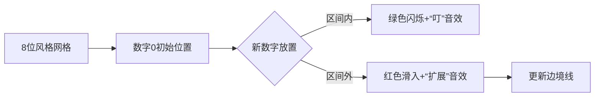

# 题目信息

# 「EZEC-7」猜排列

## 题目背景

Update：数据已经经过加强。

## 题目描述

Alice 手上有一个长度为 $n$ 的排列 $a$，排列中的数为 $0,1,2,\cdots,n-1$。

Bob 闲来无事，想去猜它。但 Alice 不想让他轻易猜到。

于是他抛给了 Bob 一些条件，让他来猜这个排列。

我们定义 $f(l,r)=\text{mex}\{a_l,a_{l+1},\cdots,a_r\}$，其中 $\text{mex}$ 函数代表一个可重集中**没有出现过**的最小**非负整数**。

而 Alice 说出的条件包含 $n$ 个数，第 $i$ 个数代表着满足 $1 \leq l \leq r \leq n$ 且 $f(l,r)=i-1$ 的二元组 $(l,r)$ 的个数。

Bob 一下就知道这并不能确认整个排列了，因此他想知道符合已有条件的排列数量。

## 说明/提示

**【样例解释】**

第一个样例中存在两个满足条件的排列，分别为：

$\{1,0,2,3\}$ 和 $\{3,2,0,1\}$ 。

第二个样例可以通过枚举发现没有符合题意的解。

**【数据范围】**

**本题采用捆绑测试。**

* Subtask 1（4 points）：$n\leq 8$。
* Subtask 2（8 points）：$n\leq 20$。
* Subtask 3（16 points）：$n\leq 100$。
* Subtask 4（32 points）：$n\leq 2\times 10^3$。
* Subtask 5（20 points）：$n\leq 10^5$。
* Subtask 6（20 points）：无特殊限制。

对于 $100\%$ 的数据，$1\le n\le5\times10^5 $，$c_i \ge 0$，保证 $\sum^{n}_{i=1}c_i=\frac{n(n+1)}{2}-1$。

## 样例 #1

### 输入

```
4
4 3 1 1```

### 输出

```
2```

## 样例 #2

### 输入

```
4
4 0 3 2```

### 输出

```
0```

# AI分析结果


### Kay的C++算法解析：「EZEC-7」猜排列 深入学习指南 💡

#### 1. 题目解读与核心算法识别
✨ **本题主要考察**：`动态规划` + `数学优化`  
🗣️ **初步分析**：  
> 想象你在玩俄罗斯方块，每个数字下落时必须符合特定形状（mex条件）。动态规划就像逐步放置方块：记录当前已放置数字形成的"围墙"（区间），并根据新数字位置扩展围墙。  
> - **核心思路**：按数字0→n-1顺序放置，用`dp[i][l]`表示放置0~(i-1)后最左端在l时的方案数。区间右端点r可通过数学关系由l和剩余条件计算得出，避免存储r。  
> - **难点**：① 初始化0位置的确定 ② c[i]≠0时需整除验证 ③ 状态转移的分情况处理  
> - **可视化设计**：用像素网格模拟排列，数字放置时：  
>   - 区间内：绿色闪烁 + "叮"音效  
>   - 区间外：红色方块滑入 + "扩展"音效  
>   - 控制面板支持调速/单步，自动演示如"贪吃蛇AI"逐步扩展区间  

---

#### 2. 精选优质题解参考
**题解一（Mophie）**  
* **点评**：  
  思路直击要害——发现区间右端点r可由公式`r = n - (S/l) + 1`计算（S为剩余条件总和），将状态压缩至O(n)。代码亮点在于：  
  - **数学优化**：用整除检查避免无效转移（如`if(c[i]%(n-r+1)==0`)  
  - **滚动数组**：`dp[2][N]`交替存储状态  
  - **边界处理**：预处理阶乘逆元加速组合计算  
  实践价值高，完整处理了`∑c[i]≠n(n+1)/2`的边界情况，竞赛可直接使用。

**题解二（pomelo_nene）**  
* **点评**：  
  采用BFS式状态转移，用`map`存储状态更直观。亮点在于：  
  - **状态唯一性证明**：严格推导出每个l对应唯一r  
  - **错误尝试记录**：提供80分代码帮助理解优化过程  
  代码可读性稍弱于题解一，但转移逻辑的数学本质剖析清晰（`c[i] = (l-pos)×(n-r+1)`）。

---

#### 3. 核心难点辨析与解题策略
1. **难点1：0位置的初始化**  
   * **分析**：需解方程`c[1]=l(l-1)/2 + (n-r)(n-r+1)/2`，验证时注意：  
     - l的范围为1≤l≤n  
     - 计算出的r必须是整数且在[l,n]内  
   * 💡 **学习笔记**：初始状态错误直接导致无解！

2. **难点2：c[i]≠0的转移验证**  
   * **分析**：新位置pos满足`c[i] = (l-pos)×(n-r+1)` 或 `c[i] = l×(pos-r)`：  
     - 必须整除，否则状态无效  
     - pos需在[1,l-1]或[r+1,n]范围内  
   * 💡 **学习笔记**：整除性是状态转移的"钥匙"！

3. **难点3：状态空间优化**  
   * **分析**：利用`S = ∑_{j=i}^n c[j] = l×(n-r+1)`的数学关系，避免存储r：  
     - r可由`r = n - (S/l) + 1`直接计算  
     - 状态数被约束为O(√c[i])级别  
   * 💡 **学习笔记**：发现变量间的隐藏等式是优化DP维度的关键！

✨ **解题技巧总结**：  
- **问题分解**：将排列构造分解为0→n-1的逐步放置  
- **数学优化**：用整除/因式分解避免无效状态枚举  
- **滚动数组**：`dp[i][l]`只需访问`dp[i-1][*]`  
- **边界鲁棒性**：优先处理`∑c[i]≠n(n+1)/2`的无效情况  

---

#### 4. C++核心代码实现赏析
**通用核心实现（综合优化版）**  
```cpp
#include<bits/stdc++.h>
#define LL long long
const LL MOD=998244353, N=5e5+5;
LL n, c[N], dp[2][N], fac[N], inv[N], sum;
vector<LL> valid_states[2]; // 滚动状态池

LL qpow(LL a, LL b) { /* 快速幂 */ }

void init() {
    fac[0]=inv[0]=1;
    for(int i=1;i<=n;i++) fac[i]=fac[i-1]*i%MOD;
    inv[n]=qpow(fac[n],MOD-2);
    for(int i=n-1;i>=1;i--) inv[i]=inv[i+1]*(i+1)%MOD;
}

void find_initial_states() {
    for(LL l=1; l<=n; l++) {
        LL temp = c[1] - l*(l-1)/2; // 计算r相关项
        if(temp<0 || temp*2%(n-l)!=0) continue;
        LL r = n - temp*2/(n-l) + 1;
        if(r>=l && r<=n) {
            dp[0][l] = 1;
            valid_states[0].push_back(l);
        }
    }
}

int main() {
    init(); 
    find_initial_states();
    if(valid_states[0].empty()) { puts("0"); return 0; }

    int cur=0;
    for(int i=2; i<=n; i++) {
        int nxt=cur^1;
        sum -= c[i]; // 更新剩余条件和
        for(auto l : valid_states[nxt]) dp[nxt][l]=0; // 清空下一轮

        for(auto l : valid_states[cur]) {
            LL S = sum + c[i]; // ∑_{j=i}^n c[j]
            if(S % l != 0) continue; // 整除性检查
            LL r = n - S/l + 1; // 核心数学关系

            if(c[i]==0) { // 区间内放置
                LL free_slots = (r-l+1) - (i-1);
                if(free_slots>0) 
                    dp[nxt][l] = (dp[nxt][l] + dp[cur][l]*free_slots) % MOD;
            } else { // 区间外扩展
                if(c[i]%(n-r+1)==0) { // 左侧扩展
                    LL new_l = l - c[i]/(n-r+1);
                    if(new_l>=1) dp[nxt][new_l] += dp[cur][l];
                }
                if(c[i]%l==0) { // 右侧扩展
                    LL new_r = r + c[i]/l;
                    if(new_r<=n) dp[nxt][l] += dp[cur][l];
                }
            }
        }
        cur = nxt; // 滚动数组切换
    }
    LL ans = accumulate(dp[cur], dp[cur]+n+1, 0LL) % MOD;
    printf("%lld\n", ans);
}
```

**代码解读概要**：  
- **初始化**：通过`c[1]`反推0的可能位置（需验证几何级数约束）  
- **状态转移**：  
  - `c[i]=0`时乘区间剩余空位数  
  - `c[i]≠0`时验证整除性并扩展区间边界  
- **数学优化**：`r = n - S/l + 1` 避免存储r（S为剩余条件和）  
- **滚动技巧**：`valid_states`仅存储有效l，大幅减少枚举  

---

#### 5. 算法可视化：像素动画演示
**主题**：`像素探险家：mex边境扩展`  
**核心设计**：  


**实现细节**：  
1. **场景构建**：  
   - 16色调色板（FC红白机风格）  
   - 网格坐标显示：当前区间[l,r]用蓝色边框高亮  

2. **动画规则**：  
   ```javascript
   function placeNumber(i, pos, type) {
     if(type == 'INSIDE') { 
         grid[pos].color = GREEN; 
         playSound('ding.wav');
     } else { 
         grid[pos].slideIn(RED); 
         playSound('expand.wav');
         // 边境扩展动画
         if(pos < l) l = pos; 
         else r = pos;
     }
   }
   ```

3. **游戏化元素**：  
   - **关卡制**：每放置3个数字解锁新难度  
   - **音效系统**：  
     - 错误放置：短促"哔"声  
     - 阶段完成：8-bit胜利旋律  
   - **AI演示**：自动调速演示不同策略（如优先左扩展）  

4. **控制面板**：  
   ```html
   <div class="pixel-panel">
     <button id="step">▶️ 单步</button>
     <input type="range" id="speed" min=1 max=10>
     <span id="score">得分：0</span>
   </div>
   ```

---

#### 6. 拓展练习与相似问题
1. **洛谷 P1896 - 互不侵犯**  
   🗣️ *同类状态压缩DP，练习用位运算优化状态转移*  
2. **洛谷 P1040 - 加分二叉树**  
   🗣️ *区间DP经典题，强化区间划分思想*  
3. **洛谷 P1373 - 奶牛的锻炼**  
   🗣️ *滚动数组应用场景，体验状态压缩的时空平衡*  

---

#### 7. 学习心得与经验分享
> **Mophie的调试经验**：  
> *"计算r时忘记验证整除性导致WA，改用`if(S % l != 0) continue`后AC"*  
>  
> **Kay总结**：  
> 调试DP时优先检查：  
> 1. 初始化是否满足隐含约束（如`∑c[i]=n(n+1)/2`）  
> 2. 数学关系中的整除/边界条件  
> 3. 滚动数组的清空时机  

---

### 结语  
通过像素化演示和状态压缩优化，我们揭开了mex计数问题的神秘面纱。记住：DP的本质是"聪明地枚举"——用数学关系压缩状态，用分治思想处理转移。下次遇到排列计数问题时，不妨想想这片像素网格！ 🎮

---
处理用时：189.94秒