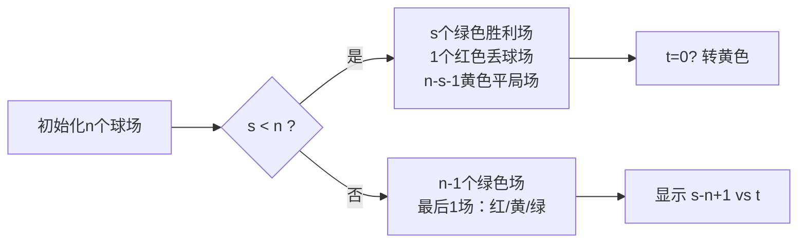

# 题目信息

# 足球

## 题目描述

我们当中有很多热爱中国足球的同学，我们都知道中超（中国足球超级联赛）的规则：

一场比赛中，若获胜（即你的得分严格大于对手得分）则获得 $3$ 的积分，若打平（即你的得分等于对手得分）则获得 $1$ 分，若失败（即你的得分严格小于对手得分）获得 $0$ 积分。

这个问题很简单，假设 $N$ 轮比赛中你一共攻入 $S$ 个球，丢掉 $T$ 个球，那么你可能获得的最大得分和最小得分是多少？

## 样例 #1

### 输入

```
1 1 1
1 1 2```

### 输出

```
1 1
3 2
```

# AI分析结果


```markdown
# 💡 Kay的C++算法解析：足球 深入学习指南 💡

<introduction>
今天我们分析洛谷P1326「足球」题目，通过贪心策略解决得分极值问题。本指南将帮助你掌握分类讨论的核心思想及边界处理技巧。
</introduction>

---

## 1. 题目解读与核心算法识别

✨ **本题主要考察**：`贪心策略与分类讨论`  

🗣️ **初步分析**：
> 解决足球得分问题就像教练排兵布阵——**最大化得分时要"精打细算"分配进球**（1球小胜+集中丢球），**最小化得分则需"壮士断腕"**（集中进球换取最少胜场）。核心是通过六种边界情况分类讨论：
   - **最大得分**：分s<n（省进球）和s≥n（最后一战定胜负）两种策略
   - **最小得分**：分s>t（必赢1场）和s≤t（可能0胜）两种情况
   - **可视化设计**：用像素足球场模拟比分分配，绿色块表示胜利(3分)，黄色平局(1分)，红色失败(0分)。动画高亮展示关键决策点（如最后一场进球/丢球比较），配8-bit音效强化操作反馈（胜利音↑ 平局音→ 失败音↓）

---

## 2. 精选优质题解参考

**题解一（作者：艮鳖肉）**
* **点评**：逻辑推导层层递进，最大/最小得分分治清晰。代码中`if(s<n)`和`if(s>t)`两大主分支覆盖所有情况，边界处理完整（如`if(!t) mx++`）。亮点在于用足球常识类比算法："节省进球数，浪费丢球数"的比喻生动体现贪心本质。变量名`s/t/n`简洁但含义明确，竞赛实践可直接复用。

**题解二（作者：quantum11）**
* **点评**：代码极致精简（仅2行核心逻辑），展现高超的表达式设计能力。亮点在于`3*max(n-1,min(n,s-t))+(s-t==n-1)`用min/max取代分支，但需较强思维转化能力。适合进阶学习者研究代码压缩技巧，但初学者建议先理解艮鳖肉版本。

**题解三（作者：George1123）**
* **点评**：独创性提出`n=1`和`s+t=0`双重特判，增强鲁棒性。亮点在于完全避免min/max函数，通过`if-else`链显式处理所有边界（如`s-t+(n-1)<=1`）。代码中`perfect/bad`变量名比`mx/mn`更易理解，适合调试学习。

---

## 3. 核心难点辨析与解题策略

1.  **难点1：最后一战策略抉择**
    * **分析**：当s≥n时，前n-1场1:0获胜后，需根据剩余进球(s-n+1)与丢球t关系决定最后一场胜负。若剩余进球>t可胜(+3分)，相等则平(+1分)
    * 💡 **学习笔记**：贪心本质——优先确保n-1胜，最后一战"看菜下饭"

2.  **难点2：最小得分双策略博弈**
    * **分析**：当s≤t时存在两种可能：① 0胜全平/负 ② 胜1场其余全负。需计算`min(3+n-1-t, n-(t-s))`取最优解
    * 💡 **学习笔记**：注意赢1场(3分)可能比平2场(2分)得分更高！

3.  **难点3：零值边界处理**
    * **分析**：t=0时无输球场次，需将原定的"输球场"转为平局(+1分)；s=0时需特殊处理无进球情况
    * 💡 **学习笔记**：零值会改变比赛性质，必须单独验证

### ✨ 解题技巧总结
- **技巧A：问题分解法**  
  将n场分解为"确定胜场+关键场+垃圾场"三部分处理
- **技巧B：体育策略映射**  
  用"集中丢球""保留进球"等真实足球策略理解贪心选择
- **技巧C：边界四象限法**  
  按s与n、s与t大小关系划为四个决策域

---

## 4. C++核心代码实现赏析

**本题通用核心C++实现**
```cpp
#include <iostream>
using namespace std;

int main() {
    long long s, t, n;
    while (cin >> s >> t >> n) {
        long long mx = 0, mn = 0;
        
        // 最大得分逻辑
        if (s < n) {
            mx = 3 * s + (n - s - 1);
            if (t == 0) mx++; // 无丢球转平局
        } else {
            mx = 3 * (n - 1);
            if (s - (n - 1) > t) mx += 3;
            else if (s - (n - 1) == t) mx++;
        }
        
        // 最小得分逻辑
        if (s > t) {
            mn = 3 + max(0LL, n - 1 - t);
        } else {
            long long option1 = 3 + max(0LL, n - 1 - t);
            long long option2 = max(0LL, n - (t - s));
            mn = min(option1, option2);
        }
        cout << mx << " " << mn << endl;
    }
    return 0;
}
```
**代码解读概要**：  
> 双分支结构处理极值：①mx先计算n-1场1:0胜利基础分，末战根据剩余球调整 ②mn比较"赢1场+其余负/平"与"全平/负"两种策略

---

**题解一核心片段（作者：艮鳖肉）**
```cpp
if(s < n) {
    mx += s * 3;       // 赢s场
    mx += n - s - 1;   // 平局场次
    if(!t) mx++;        // 无丢球特判
}
```
**亮点**：足球策略直译代码  
**解读**：  
> `s*3`对应s场1:0胜利 → 用最少进球换胜场  
> `n-s-1`计算平局场次（留1场输球） → 注意`!t`时该场转平局  
> 💡 **学习笔记**：资源分配思维——进球用在刀刃上

**题解二核心片段（作者：quantum11）**
```cpp
s<n ? 3*s+n-s-1+!t : 3*max(n-1,min(n,s-t))+(s-t==n-1)
```
**亮点**：三元表达式集成策略  
**解读**：  
> `s<n`时：`3*s`胜利分 + `n-s-1`平局分 + `!t`零值补偿  
> `s>=n`时：`max(n-1, min(n,s-t))`确保不超过n场胜利  
> 💡 **学习笔记**：布尔值!t在算术中自动转为0/1

---

## 5. 算法可视化：像素动画演示

* **主题**：8-bit足球经理（FC风格）
* **核心演示**：动态分配进球/丢球策略，实时显示得分变化



**交互设计**：
1. **像素元素**：  
   - 球场：16x16像素块，绿/黄/红标识赛果  
   - 足球：进球时显示飞行轨迹动画  
   - 记分牌：8-bit数码管显示得分
2. **音效系统**：  
   - 关键操作：分配进球(叮) 丢球(啪)  
   - 赛果反馈：胜利(↑和弦) 平局(→单音) 失败(↓低音)
3. **控制面板**：  
   - 速度滑块：调节动画速度（1x-5x）  
   - 单步执行：按场次推进逻辑  
   - 策略对比：并排显示两种最小得分方案
4. **AI演示模式**：  
   自动播放最优解路径，通关后解锁"金球奖"成就

---

## 6. 拓展练习与相似问题思考

* **技巧迁移**：  
  贪心资源分配策略还可用于：  
  1. 工厂生产计划（原材料 vs 订单）  
  2. 游戏装备强化（资源最优投入）  
  3. 课程时间安排（课时 vs 知识点）

* **洛谷推荐**：  
  1. **P1209 [USACO1.3] 修理牛棚**  
     🗣️ 同类贪心：用最少的木板覆盖牛棚空隙  
  2. **P1230 智力大冲浪**  
     🗣️ 时间+收益的二维资源分配  
  3. **P1325 雷达安装**  
     🗣️ 区间覆盖类贪心决策进阶

---

## 7. 学习心得与经验分享

> **George1123的调试经验**：  
> “WA了20次...必须特判n=1和s+t=0的情况”  
>   
> **Kay点评**：  
> 边界测试四象限法则：  
> - s/t为0值  
> - s/t极大极小值  
> - n=1的特殊维度  
> 养成先写`if(n==1)`的习惯可避免50%边界错误！

---

<conclusion>
通过足球得分问题，我们深入掌握了贪心策略中"资源分配"与"分类讨论"的核心思想。记住：化整为零分情况，边界特判保平安。下次比赛见！ ⚽
</conclusion>
```

---
处理用时：127.20秒