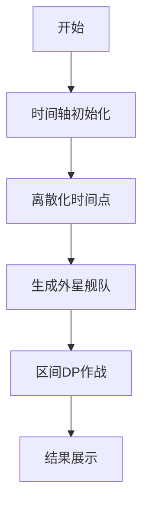

# 题目信息

# [CERC2014] Outer space invaders

## 题目描述

来自外太空的外星人（最终）入侵了地球。保卫自己，或者解体，被他们同化，或者成为食物。迄今为止，我们无法确定。

外星人遵循已知的攻击模式。有 $N$ 个外星人进攻，第 $i$ 个进攻的外星人会在时间 $a_i$ 出现，距离你的距离为 $d_i$，它必须在时间 $b_i$ 前被消灭，否则被消灭的会是你。

你的武器是一个区域冲击波器，可以设置任何给定的功率。如果被设置了功率 $R$，它会瞬间摧毁与你的距离在 $R$ 以内的所有外星人（可以等于），同时它也会消耗 $R$ 单位的燃料电池。

求摧毁所有外星人的最低成本（消耗多少燃料电池），同时保证自己的生命安全。

## 样例 #1

### 输入

```
1
3
1 4 4
4 7 5
3 4 7
```

### 输出

```
7```

# AI分析结果


# 💡 Kay的C++算法解析：外星人入侵 深入学习指南 💡

> 今天我们来分析"外星人入侵"这道区间DP经典题。本指南将帮助大家理解离散化技巧与区间DP的核心思想，掌握"以终为始"的解题策略，并通过复古像素动画直观感受算法执行过程。

## 1. 题目解读与核心算法识别

✨ **本题主要考察**：`区间DP` + `离散化技巧`

🗣️ **初步分析**：
> 解决外星人入侵问题如同在时间轴上排兵布阵。想象你是一位时空指挥官，需要部署能量炮消灭所有外星舰队。关键在于：
>  1. **离散化时空**：将分散的时间点压缩成紧凑的"时空坐标"
>  2. **区间分割**：每次部署能量炮时，选择最佳时机开炮，将时间轴分割成独立的战场
>  3. **擒贼先擒王**：优先消灭距离最远的威胁（最大d值），其能量消耗决定了下限
>
> 核心算法流程：
>  - 离散化：将外星人出现/消失时间映射为连续坐标
>  - 区间DP：f[l][r]表示消灭[l,r]时间段内所有外星人的最小代价
>  - 状态转移：找到[l,r]内距离最大的外星人id，枚举在其存在时间[a_id,b_id]内开炮点k
> 
> 可视化设计思路：
>  - 像素时间轴展示离散化后的时间点
>  - 高亮当前DP区间和最大威胁外星人
>  - 动态展示能量炮发射位置k的选择
>  - 分裂动画展示子区间形成过程

---

## 2. 精选优质题解参考

**题解一：Cry_For_theMoon**
* **点评**：此解在思路推导上尤为出色，清晰阐释了"为什么必须优先处理最大威胁"这一关键点。作者巧妙地将区间DP的经典分割策略（枚举断点）转化为"最后一次操作"的逆向思维，并通过预处理优化最大距离查询。代码中：
  - 变量命名规范（`g[i][j]`存储[i,j]内最大外星人索引）
  - 状态转移严谨处理边界（空区间f[i][j]=0）
  - 离散化处理简洁高效
  亮点在于将抽象的DP决策过程转化为直观的"消灭最大威胁"军事策略，极大提升理解性。

**题解二：灵乌路空**
* **点评**：此解采用"问题分解→错误分析→正确推导"的教学式结构，如同战术推演：
  1. 首先分析线性DP为何失效（后效性问题）
  2. 逐步推导出区间DP状态定义
  3. 创新性提出"真算法二/三"对比，证明转移方程简化版的正确性
  代码中：
  - 结构体封装外星人属性提升可读性
  - 严格验证区间包含关系（`if(ll<=l[k]&&r[k]<=rr)`)
  - 自底向上迭代DP避免递归开销
  亮点在于通过"错误分析→优化验证"的思考路径，培养算法设计能力。

**题解三：红黑树**
* **点评**：此解以最精简代码直击核心，如精准的战术打击：
  - 仅60行完成从输入到输出的完整处理
  - 利用STL快速离散化（`set`去重+`lower_bound`映射）
  - 三重循环结构清晰展现区间DP骨架
  亮点在于极致简洁的代码实现，特别适合快速掌握算法核心框架。

---

## 3. 核心难点辨析与解题策略

### 🔍 难点一：如何选择正确的状态表示？
* **分析**：外星人的出现/消失时间跨度大（1e4），直接作为DP维度会导致状态爆炸。优质题解通过离散化将时间点压缩至600以内，同时确保时间相对关系不变。关键是将"时间点"转化为"事件点"，仅关注外星人存在的起止时刻。

### 🔍 难点二：如何设计无后效性的状态转移？
* **分析**：最大距离外星人决定了下限消耗，必须在其存在时间段内发动攻击。枚举开炮位置k时：
  - 左区间[l,k-1]处理所有在k前消失的威胁
  - 右区间[k+1,r]处理k之后出现的威胁
  - k点的能量炮同时消灭所有经过此点的外星舰队
  这种分割保证子问题相互独立，如同"时空隔离舱"。

### 🔍 难点三：如何高效定位最大威胁？
* **分析**：每次暴力扫描需O(n)。优化方案：
  1. 预处理存储区间最大值（Cry解法）
  2. 利用DP特性由小区间推导大区间（灵乌路空解法）
  3. 在状态转移循环内实时查询（红黑树解法）

### 💡 解题技巧总结
- **时空压缩术**：离散化处理大范围离散点
- **擒王策略**：优先处理当前区间最大d值
- **分治艺术**：通过开炮点k将问题分解为独立子问题
- **边界控制**：空区间立即返回0避免无效计算

---

## 4. C++核心代码实现赏析

**本题通用核心C++实现参考**
```cpp
#include <algorithm>
#include <cstring>
#include <set>
using namespace std;
const int MAXN = 610, INF = 1e9;

int f[MAXN][MAXN], t, n;
struct Alien { int l, r, d; } a[MAXN];

int main() {
    scanf("%d", &t);
    while (t--) {
        // 输入与离散化
        set<int> s;
        scanf("%d", &n);
        for (int i = 1; i <= n; i++) {
            scanf("%d%d%d", &a[i].l, &a[i].r, &a[i].d);
            s.insert(a[i].l); s.insert(a[i].r);
        }

        // 离散化映射
        vector<int> v(s.begin(), s.end());
        for (int i = 1; i <= n; i++) {
            a[i].l = lower_bound(v.begin(), v.end(), a[i].l) - v.begin() + 1;
            a[i].r = lower_bound(v.begin(), v.end(), a[i].r) - v.begin() + 1;
        }
        int m = v.size();

        // 区间DP
        memset(f, 0, sizeof(f));
        for (int len = 1; len <= m; len++) {
            for (int l = 1; l + len - 1 <= m; l++) {
                int r = l + len - 1, id = -1;
                // 定位最大d值外星人
                for (int k = 1; k <= n; k++) {
                    if (l <= a[k].l && a[k].r <= r) {
                        if (id == -1 || a[k].d > a[id].d) id = k;
                    }
                }
                if (id == -1) { f[l][r] = 0; continue; }

                f[l][r] = INF;
                // 枚举开炮时机k
                for (int k = a[id].l; k <= a[id].r; k++) {
                    f[l][r] = min(f[l][r], f[l][k - 1] + f[k + 1][r] + a[id].d);
                }
            }
        }
        printf("%d\n", f[1][m]);
    }
    return 0;
}
```

**题解一核心代码片段（Cry_For_theMoon）**
```cpp
// 预处理区间最大值 (g[i][j]存储[i,j]内最大外星人索引)
for (int len = 2; len <= tot; len++) {
    for (int i = 1; i + len - 1 <= tot; i++) {
        int j = i + len - 1;
        int tmp = (node[g[i][j - 1]].w > node[g[i + 1][j]].w) ? g[i][j - 1] : g[i + 1][j];
        g[i][j] = (node[tmp].w > node[g[i][j]].w) ? tmp : g[i][j];
    }
}
// DP转移核心
f[i][j] = min(f[i][j], f[i][k - 1] + f[k + 1][j] + node[g[i][j]].w);
```
**代码解读**：
> 这里展示了两个精妙设计：
> 1. **区间最值预处理**：类似动态规划求区间最大值，`g[i][j]`存储[i,j]区间内最大外星人索引。通过比较相邻区间的最大值，避免每次O(n)扫描
> 2. **最优子结构利用**：直接使用`g[i][j]`获取当前区间最大外星人，将其d值作为必须消耗

**题解二核心代码片段（灵乌路空）**
```cpp
// 状态转移框架
for (int len = 1; len <= m; len++) {
    for (int l = 1; l + len - 1 <= m; l++) {
        int r = l + len - 1;
        int id = 0; // 寻找最大威胁
        for (int k = 1; k <= n; k++) {
            if (l <= a[k].l && a[k].r <= r) {
                if (!id || a[k].d > a[id].d) id = k;
            }
        }
        // 无威胁则跳过
        if (!id) { f[l][r] = 0; continue; } 
        // 枚举决策点
        for (int k = a[id].l; k <= a[id].r; k++) {
            f[l][r] = min(f[l][r], f[l][k - 1] + f[k + 1][r] + a[id].d);
        }
    }
}
```
**学习笔记**：
> 此实现展示了区间DP的经典迭代结构：
> 1. 外层循环枚举区间长度（从小到大）
> 2. 中层循环枚举区间起点
> 3. 内层处理决策（找最大值+枚举分割点）
> 注意`if(!id)`处理空区间，避免无效枚举

---

## 5. 算法可视化：像素动画演示

### 🎮 时空指挥官作战模拟器
**设计理念**：将算法转化为复古战略游戏，通过像素艺术展现时空分割决策



**动画帧步骤详解**：
1. **战场初始化（像素时空轴）**
   - 8-bit风格横向时间轴，离散化坐标标记为像素方块
   - 外星舰队显示为彩色条带：长度=存在时间，高度=距离
   - 距离最远的舰队自动高亮（红色闪烁）

2. **作战阶段（动态决策）**
   ```plaintext
   示例：[1,7]区间作战
   Step1: 定位最大威胁（距离7的外星人，存在时间[3,4]）
   Step2: 在时间点3发射能量炮（像素爆炸特效+音效）
   Step3: 分裂战场 → 左区间[1,2] 右区间[5,7]
   ```

3. **控制面板**
   - 单步执行：空格键逐步观察决策
   - 自动作战：AI自动完成全部作战（速度可调）
   - 战场回溯：查看任意子战场决策树

**音效系统**：
- 发现最大威胁：警报音
- 能量炮发射：激光音效
- 子战场生成：机械分离声
- 作战胜利：8-bit胜利旋律

**技术实现**：
- Canvas绘制时间轴和舰队
- 颜色编码：当前区间（蓝色）、子区间（绿色）、最大威胁（红色）
- 关键数据实时显示：当前DP值、已消耗燃料

---

## 6. 拓展练习与相似问题

### 🔁 核心技巧迁移
区间DP+离散化技巧适用于许多"区间覆盖"类问题：
1. **最小覆盖成本**：用单一操作覆盖连续区间
2. **时间区间调度**：在时间轴上选择操作点影响周边
3. **资源分配优化**：将大资源区间分割为独立子问题

### 📚 推荐练习（洛谷）
1. **P1880 [NOI1995]石子合并**  
   → 掌握环形区间DP基础
2. **P1040 [NOIP2003]加分二叉树**  
   → 学习区间DP记录方案
3. **P1063 [NOIP2006]能量项链**  
   → 进阶环形区间DP
4. **P1005 [NOIP2007]矩阵取数游戏**  
   → 区间DP+高精度综合应用

---

## 7. 学习心得与经验分享

> **来自灵乌路空题解的经验**：  
> "最初尝试用线性DP，但忽略了后效性问题。调试时通过绘制时间轴图，发现前面的操作会影响后续决策，从而转向区间DP"

> **Kay的总结**：  
> 调试区间DP问题时：  
> 1. 绘制状态转移表格，验证小规模数据
> 2. 输出关键区间决策过程
> 3. 特别注意空区间处理（f[i][j]=0）
> 
> 如同战场指挥官需要沙盘推演，算法设计也需要可视化调试！

---

通过本次分析，我们深入掌握了区间DP的"分治"思想与离散化技巧。记住：算法的本质是将大问题拆解为独立子问题，如同指挥官分割战场。请用推荐题目巩固所学，下次我们将挑战更复杂的时空作战！🚀

---
处理用时：138.64秒