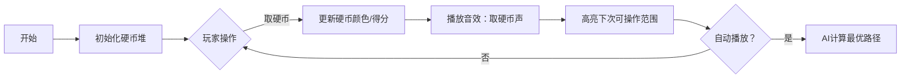

# 题目信息

# [USACO09NOV] A Coin Game S

## 题目描述

小 A 和小 B 在玩游戏。

初始时，有 $n$ 个硬币被摆成了一行，从左至右第 $i$ 个硬币的价值为 $c_i$。

游戏的规则是，两人交替从这堆硬币的**左侧**连续取出若干硬币，然后将取出的硬币的价值累加至自己获得的累计价值中。若对方上次操作取出了 $k$ 个硬币，那么本次自己最多取出 $k \times 2$ 个硬币。当没有硬币可取时，游戏结束。

游戏开始时，由小 A 先动手取硬币，最多取出 $2$ 个硬币。

请求出当双方都尽可能使自己的累计价值最大的情况下，小 A 能获得的累计价值最大是多少。

## 说明/提示

#### 输出输出样例 $1$ 解释

初始时，硬币序列为 $\{1,~3,~1,~7,~2\}$。

由小 A 先操作，他取出了一个硬币，硬币序列变为 $\{3,~1,~7,~2\}$，小 A 的累计价值为 $1$。

再由小 B 操作，由于小 A 上回合取出了 $1$ 个硬币，所以他本回合可以取出至多 $1 \times 2 = 2$ 个硬币。他取出了一个硬币，硬币序列变为 $\{1,~7,~2\}$，小 B 的累计价值为 $3$。

再由小 A 操作，由于上回合小 B 取出了 $1$ 个硬币，所以他本回合可以取出至多 $1 \times 2 = 2$ 个硬币。他取出了两个硬币，硬币序列变为 $\{2\}$，小 A 的累计价值为 $1 + 1 + 7 = 9$。

再由小 B 操作，由于上回合小 A 取出了 $2$ 个硬币，所以他本回合可以取出至多 $2 \times 2 = 4$ 个硬币。但是只剩下了 $1$ 个硬币，因此他只能取出一个硬币，硬币序列变为空，小 B 的累计价值为 $3 + 2 = 5$，游戏结束。

#### 数据范围与约定

对于全部的测试点，保证 $5 \leq n \leq 2 \times 10^3$，$1 \leq c_i \leq 10^5$。

**提示：请注意本题的空间限制为 $20$ MiB**。

## 样例 #1

### 输入

```
5 
1 
3 
1 
7 
2 
```

### 输出

```
9 
```

# AI分析结果


### 💡 Kay的C++算法解析：硬币游戏深入学习指南 💡

> 今天我们来分析USACO09NOV的硬币游戏题。这道题考察博弈论中的最优策略设计，需要巧妙运用动态规划解决双方最优决策问题。本指南将帮助你掌握核心算法思想和实现技巧。

#### 1. 题目解读与核心算法识别
✨ **本题主要考察**：`博弈论动态规划`（Game Theory DP）

🗣️ **初步分析**：
> 这道题如同两位棋手对弈，每步决策都影响后续局面。核心思想是**逆向推导最优策略**：从游戏结束状态倒推每个决策点的最佳收益。动态规划状态`dp[i][j]`表示剩余`i`枚硬币且对手上次取`j`枚时，当前玩家能获得的最大价值。
> - 关键技巧：利用前缀和快速计算硬币价值，并通过状态转移优化避免O(n³)复杂度
> - 可视化设计：用像素方块表示硬币堆，高亮显示当前操作区域，通过颜色变化展示硬币归属权转移
> - 复古游戏化：采用8-bit音效（硬币拾取声、胜利音效），控制面板支持单步/自动播放，AI演示模式模拟最优策略路径

---

#### 2. 精选优质题解参考
**题解一：cjlak1o1 (赞32)**
* **点评**：题解通过倒序处理硬币巧妙简化状态定义，`dp[i][j]`表示剩余i枚硬币且下一步最多取2j枚时的最大收益。创新性提出"dp[i][j]包含dp[i][j-1]"的优化思想，将三重循环简化为二重。代码中`k=2*j-1`和`k=2*j`的分段处理极具启发性，边界条件处理严谨，变量命名清晰(`sum`/`dp`)，可直接用于竞赛。

**题解二：Twilight_ (赞24)**
* **点评**：状态定义`(i,j)`表示剩余1~i号硬币且对手取j枚的局势，直接对应游戏规则。通过数学归纳法证明状态转移只需考虑两种新增情况，代码实现简洁高效（仅15行）。输入采用倒序处理适配前缀和计算，空间复杂度O(n²)完全满足限制。

**题解三：C3H5ClO (赞22)**
* **点评**：创新使用`maxf[i][j]`维护前缀最大值，实现O(n²)优化。正序DP配合后缀和计算，状态转移`f[i][j]=s[i]-maxf[i+j][min(2j,n)]`直观体现博弈论核心思想（当前收益=总收益-对手最优收益）。代码行数最少(21行)且无冗余操作，极具学习价值。

---

#### 3. 核心难点辨析与解题策略
1. **状态设计的逆向思维**
   * **分析**：传统思路按游戏顺序设计状态会遇到后效性问题。优质题解均采用倒序定义（从剩余硬币考虑），通过`dp[i][j]`的`i`递减模拟游戏逆向进行，自然规避后效性
   * 💡 学习笔记：博弈DP常需"从结束状态倒推"打破思维定式

2. **状态转移的优化证明**
   * **分析**：原始转移需枚举k∈[1,2j]，但观察发现`dp[i][j]`与`dp[i][j-1]`的差异仅在于k=2j-1和2j两种情况。数学归纳法证明该优化正确性
   * 💡 学习笔记：DP优化常源于状态间的包含关系，需培养数学证明意识

3. **前缀和与空间压缩**
   * **分析**：各解法均用前缀和加速价值计算。C3H5ClO的解法创新使用单数组`maxf`同时存储DP值和前缀最大值，减少内存占用
   * 💡 学习笔记：前缀和是区间统计利器，空间优化要考虑状态复用

### ✨ 解题技巧总结
- **逆向状态设计**：从终局倒推打破后效性困境
- **转移方程化简**：利用状态包含关系减少枚举量
- **边界防御性编程**：严格验证`k≤i`等边界条件
- **辅助数据结构**：前缀和/后缀和加速区间计算

---

#### 4. C++核心代码实现赏析
**本题通用核心实现**
```cpp
#include <iostream>
using namespace std;
const int N = 2005;

int n, a[N], sum[N], dp[N][N];

int main() {
    cin >> n;
    for (int i = n; i >= 1; i--) cin >> a[i]; // 倒序读入
    for (int i = 1; i <= n; i++) sum[i] = sum[i-1] + a[i]; // 前缀和
    
    for (int i = 1; i <= n; i++) 
        for (int j = 1; j <= n; j++) {
            dp[i][j] = dp[i][j-1]; // 继承之前状态
            int k = 2*j - 1;
            if (k <= i) // 考虑取k枚的情况
                dp[i][j] = max(dp[i][j], sum[i] - dp[i-k][k]);
            if (k+1 <= i) // 考虑取k+1枚
                dp[i][j] = max(dp[i][j], sum[i] - dp[i-k-1][k+1]);
        }
    
    cout << dp[n][1]; // 初始状态：剩n枚硬币，对手虚拟取1枚
}
```
**代码解读概要**：
1. 倒序读入硬币适配前缀和计算
2. 双重循环中：
   - 外层`i`：当前剩余硬币数
   - 内层`j`：对手上次取硬币数
3. 关键优化：仅枚举`k=2j-1`和`2j`两种情况
4. 状态转移：`当前收益 = 剩余硬币总值 - 对手后续最优收益`

---

**优质题解片段赏析**
**题解一核心（cjlak1o1）**
```cpp
for (int i = 1; i <= n; i++)
    for (int j = 1; j <= n; j++) {
        dp[i][j] = dp[i][j-1]; // 优化关键：继承j-1状态
        int k = 2*j - 1;
        if (k <= i) dp[i][j] = max(dp[i][j], sum[i]-dp[i-k][k]);
        if (k+1 <= i) dp[i][j] = max(dp[i][j], sum[i]-dp[i-k-1][k+1]);
    }
```
> **亮点**：状态转移优化思路清晰  
> **代码解读**：  
> - 第3行：`dp[i][j-1`]已包含k≤2(j-1)的情况  
> - 第4/6行：只需补充k=2j-1和2j的新状态  
> - 转移值`sum[i]-dp[i-k][k]`体现"总收益减对手收益"的博弈思想  
> 💡 学习笔记：DP优化常通过消除重复计算实现

**题解三核心（C3H5ClO）**
```cpp
for (ri i = n; i; i--)
    for (ri j = 1; j <= n - i + 1; j++) {
        f = s[n] - s[i-1] - maxf[i+j][min(j<<1, n-i-j+1)];
        maxf[i][j] = max(maxf[i][j-1], f);
    }
```
> **亮点**：正序DP与最大值维护的巧妙结合  
> **代码解读**：  
> - 第3行：`s[n]-s[i-1]`计算剩余硬币总价值  
> - `maxf[i+j][...]`表示对手在后续的最优收益  
> - 第4行：同步更新前缀最大值避免重复计算  
> 💡 学习笔记：维护辅助数组是优化DP的常用手段

---

#### 5. 算法可视化：像素动画演示
**主题**：`硬币骑士的宝藏冒险`（8-bit像素风格）

**核心演示**：
- 🎮 硬币堆：像素方块表示硬币（金色=未取，蓝色=玩家A，红色=玩家B）
- 📊 状态面板：实时显示`剩余硬币数`/`当前可取的硬币数`/`玩家得分`
- 🔢 数据结构：队列可视化（对手可操作范围）

**交互设计**：


**关键动画细节**：
1. **操作高亮**：当前可取的硬币范围用绿色边框闪烁
2. **价值计算**：硬币被取走时显示"+c[i]"浮动文字
3. **音效系统**：
   - 取硬币：8-bit电子音（音调随硬币价值升高）
   - 胜利条件：马里奥式过关音乐
4. **AI演示模式**：自动展示最优策略路径，速度可调

**技术实现**：
- Canvas绘制像素硬币（16×16px）
- 状态机管理游戏阶段：玩家A→玩家B→结算
- 核心算法驱动：可视化直接调用DP计算结果

---

#### 6. 拓展练习与相似问题
**通用技巧迁移**：
1. 多阶段博弈决策（本题核心）
2. 状态压缩DP
3. 前缀和优化

**洛谷推荐**：
1. [P2734 游戏](https://www.luogu.com.cn/problem/P2734)  
   🗣️ **推荐理由**：同类型博弈DP，强化状态设计能力
2. [P1288 取数游戏](https://www.luogu.com.cn/problem/P1288)  
   🗣️ **推荐理由**：更简单的博弈入门，培养逆向思维
3. [P2965 [USACO09NOV]农活比赛](https://www.luogu.com.cn/problem/P2965)  
   🗣️ **推荐理由**：同源题目加深理解

---

#### 7. 学习心得与经验分享
> **经验摘录（cjlak1o1）**：  
> "最初用三重循环TLE，发现`dp[i][j]`包含`dp[i][j-1]`后优化为O(n²)"  
>   
> **Kay点评**：  
> 这个调试经历极具代表性——DP优化常源于发现状态间的隐藏关系。建议学习者：  
> 1. 先写直观的O(n³)版本验证思路  
> 2. 分析状态转移的依赖关系  
> 3. 用数学归纳法验证优化正确性  

> **经验摘录（Boxxxxxx）**：  
> "将`当前玩家收益=总收益-对手收益`是博弈DP的关键转化"  
>   
> **Kay点评**：  
> 这是博弈论的核心思维模式——**MinMax思想**。牢记这个转换公式可解决90%的博弈DP问题。

---

通过本次分析，相信大家已经掌握博弈论DP的核心思想。记住：最优策略源于精确的状态设计和严谨的转移推导。继续挑战拓展题目，你将在动态规划领域获得更大突破！🚀

---
处理用时：135.92秒