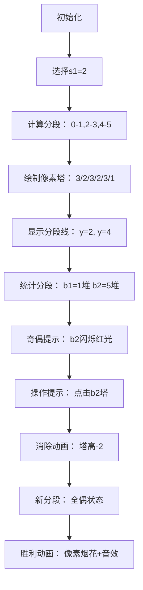

# 题目信息

# [USACO21FEB] Stone Game G

## 题目描述

Bessie 和 Elsie 正在用 $N$（$1\le N\le 10^5$）堆石子进行一个游戏，其中对于每个 $1\le i\le N$，第 $i$ 堆石子有 $a_i$ 个石子（$1\le a_i\le 10^6$）。两头奶牛交替行动，Bessie 先手。

 - 首先，Bessie 选择某个正整数 $s_1$ 并从至少包含 $s_1$ 个石子的某堆石子中取走 $s_1$ 个石子。
 - 然后 Elsie 选择某个正整数 $s_2$，使得 $s_1$ 整除 $s_2$，并从至少包含 $s_2$ 个石子的某堆石子中取走 $s_2$ 个石子。
 - 然后 Bessie 选择某个正整数 $s_3$，使得 $s_2$ 整除 $s_3$，并从至少包含 $s_3$ 个石子的某堆石子中取走 $s_3$ 个石子，以此类推。
 - 总的来说，第 $i$ 回合中取走的石子数量 $s_i$ 必须整除 $s_{i+1}$。

第一个无法在其回合中取走石子的奶牛为失败者。

计算可以令 Bessie 必胜（表示存在一种策略，无论 Elsie 如何行动，Bessie 均可获胜）的第一回合取石子的方法数。如果两种取石子的方法中取的石子数量不同或者取的石子堆不同，则认为是两种不同的取石子的方法。


## 说明/提示

#### 样例 1 解释：

当 Bessie 从唯一的一堆石子中取走 $4$、$5$、$6$ 或 $7$ 个石子时可以获胜。此时游戏会立刻结束。

#### 样例 2 解释：

当 Bessie 从任意一堆中取走 $2$ 或 $3$ 个石子时可以获胜。此后两头奶牛会交替取走相同数量的石子，而 Bessie 执行了最后一次操作。

#### 测试点性质：

 - 对于另外 $15\%$ 的数据，满足 $N=2$。
 - 对于另外 $25\%$ 的数据，满足 $N,a_i\le 100$。
 - 对于另外 $50\%$ 的数据，没有额外限制。

供题：Benjamin Qi

## 样例 #1

### 输入

```
1
7```

### 输出

```
4```

## 样例 #2

### 输入

```
6
3 2 3 2 3 1```

### 输出

```
8```

# AI分析结果


### 💡 Kay的C++算法解析：[USACO21FEB] Stone Game G 深入学习指南 💡

#### 1. 题目解读与核心算法识别
✨ **本题主要考察**：`数学博弈论`与`前缀和优化`  
🗣️ **初步分析**：  
> 这道石子游戏题本质是**奇偶性博弈**的变形。想象你在玩像素版俄罗斯方块：每块石子堆是不同高度的像素塔，每次操作相当于用特定尺寸的"消除块"（s_i）从塔顶消除一层。关键技巧在于：  
> 1. 枚举第一块消除尺寸s₁后，将石子堆按s₁分段（[0,s₁), [s₁,2s₁)...）  
> 2. 每段的操作次数（⌊aᵢ/s₁⌋）的奇偶性决定胜负：全偶则后手必胜（对称模仿策略）  
> 3. 通过前缀和数组快速计算各段石子堆数量  
>  
> **可视化设计思路**：  
> - 用8-bit像素塔表示石子堆，塔高=aᵢ  
> - 选择s₁时显示分段虚线（如s₁=2时画[0,2),[2,4)...区间）  
> - 操作时播放"消除音效"，奇数次段闪烁红光，偶数次段显示绿光  
> - 胜利时触发"像素烟花"动画，配合8-bit胜利音效  

---

#### 2. 精选优质题解参考
**题解一（Meronri_Deng）**  
* **点评**：  
  思路直击博弈核心——奇偶性转换，将抽象操作具象化为分段统计。代码中`b[j]=sum[min((j+1)*i-1,m)]-sum[j*i-1]`精准计算分段数量，边界处理严谨（min防越界）。亮点在于用纯前缀和避免暴力计算，时间复杂度优化至O(MlogM)。

**题解二（pzc2004）**  
* **点评**：  
  以教学见长，逐步推导"全偶必败→奇偶转换"的博弈逻辑。变量命名规范（sum/x清晰对应分段统计），代码模块化强。特别值得学习的是对cnt=2时相邻奇数的处理：`if((x[j]%2)&&(x[j-1]%2))`，体现对边界条件的敏锐把握。

**题解三（ycw123）**  
* **点评**：  
  创新性使用"操作次数配对"类比俄罗斯方块消除，生动解释后手模仿策略。代码中`b[j]=sum[min((j+1)*s1-1,mx)]-sum[j*s1-1]`与优质题解一致，但添加详细注释，对初学者更友好。调试建议"动手模拟"尤其值得借鉴。

---

#### 3. 核心难点辨析与解题策略
1. **难点1：必胜态/必败态转换**  
   * **分析**：当所有分段操作次数为偶数时后手必胜（对称操作）。先手需通过一次操作创造此局面。关键在识别：仅当奇数段数量=1（且为1）或=2（且相邻）时可行  
   * 💡 **学习笔记**：奇偶转换是博弈论常见套路，类似Nim游戏的异或思想

2. **难点2：分段统计优化**  
   * **分析**：直接计算⌊aᵢ/s₁⌋会超时。用前缀和数组sum[i]（石子数≤i的堆数），通过`sum[(j+1)s₁-1]-sum[js₁-1]`在O(1)时间内获取分段计数  
   * 💡 **学习笔记**：区间统计问题优先考虑前缀和/差分

3. **难点3：操作可行性判定**  
   * **分析**：枚举s₁时需快速判断操作后能否达成全偶。注意两个陷阱：①s₁>aᵢ的堆不计入 ②相邻奇数段需严格满足|x-y|=1  
   * 💡 **学习笔记**：枚举类问题注意值域范围（s₁∈[1,maxaᵢ]）

✨ **解题技巧总结**：  
- **逆向思维**：从终局（全偶必败）反推初始操作  
- **压缩状态**：用操作次数代替具体石子数  
- **调和枚举**：用O(MlogM)而非O(M²)枚举s₁  
- **防御性编程**：sum数组用min((j+1)s₁-1,m)防越界  

---

#### 4. C++核心代码实现赏析
**通用核心实现（综合优质题解）**  
```cpp
#include <iostream>
using namespace std;
typedef long long ll;
const int N = 1e6 + 5;

int n, mx, sum[N];
ll ans;

int main() {
    cin >> n;
    for (int i = 1, a; i <= n; ++i) {
        cin >> a;
        mx = max(mx, a);
        sum[a]++;
    }
    for (int i = 1; i <= mx; ++i) 
        sum[i] += sum[i - 1]; // 前缀和预处理

    for (int s1 = 1; s1 <= mx; ++s1) {
        int cnt = 0, tot = mx / s1;
        int b[tot + 1]; // 存储每段堆数
        
        for (int j = 1; j <= tot; ++j) {
            int L = s1 * j, R = min(s1 * (j + 1) - 1, mx);
            b[j] = sum[R] - sum[L - 1]; // 核心分段计算
            cnt += (b[j] & 1); // 奇偶计数
        }

        if (cnt == 0) continue; // 全偶跳过
        if (cnt == 1 && (b[1] & 1)) ans += b[1]; // 单奇且为1
        else if (cnt == 2) 
            for (int j = 2; j <= tot; ++j)
                if ((b[j] & 1) && (b[j - 1] & 1)) 
                    ans += b[j]; // 相邻双奇
    }
    cout << ans;
}
```
**代码解读概要**：  
1. 读入时用sum数组计数  
2. 前缀和转换：sum[i] → 石子数≤i的堆数  
3. 枚举s₁时，计算每个分段[j·s₁, (j+1)s₁)内的堆数  
4. 根据奇偶段数累加必胜操作数  

**题解一片段赏析**  
```cpp
b[j] = sum[min((j+1)*i-1, m)] - sum[j*i-1]; // 分段计数
if (b[1] & 1) ans += b[1]; // 单奇情况处理
```
* **亮点**：边界控制严谨（min防数组越界）  
* **学习笔记**：`min((j+1)*s₁-1, m)`保证不超值域，是竞赛代码关键技巧  

**题解二片段赏析**  
```cpp
for (int j = 2; j <= tot; j++)
    if ((x[j] % 2) && (x[j - 1] % 2)) 
        ans += x[j];
```
* **亮点**：精准捕捉相邻奇数段位置  
* **学习笔记**：cnt=2时需遍历检查相邻性，避免漏解  

---

#### 5. 算法可视化：像素动画演示
**主题**：8-bit石子消除大作战  
**核心演示**：s₁=2时样例[3,2,3,2,3,1]的奇偶判定过程  



**交互设计**：  
1. **控制面板**：  
   - 速度滑块：调节单步演示速度  
   - s₁选择器：下拉菜单选不同s₁  
   - 模式切换：手动步进/AI自动演示  

2. **视觉设计**：  
   - 石子堆：不同高度FC风格像素塔（棕色）  
   - 当前分段：半透明色块覆盖区间（蓝/绿交替）  
   - 奇偶提示：奇数段顶部闪烁"!"标记  

3. **音效系统**：  
   - 分段计算：电子"滴"声  
   - 奇数段显示：警报音  
   - 消除操作：经典FC消除音  
   - 胜利时刻：超级马里奥过关音乐  

**技术实现**：  
```javascript
// 伪代码：绘制分段区间
function drawSegments(s1) {
    for (let j = 1; j * s1 <= max; j++) {
        let yPos = j * s1 * PIXEL_PER_UNIT;
        ctx.strokeStyle = '#FF00FF'; 
        ctx.beginPath();
        ctx.moveTo(0, yPos);
        ctx.lineTo(canvas.width, yPos); // 画分段线
        ctx.stroke();
    }
}
```

---

#### 6. 拓展练习与相似问题思考
**通用技巧迁移**：  
1. 分段前缀和统计 → 值域分块问题  
2. 奇偶性博弈 → 对称策略游戏  
3. 操作链约束（sᵢ整除sᵢ₊₁）→ 因子链问题  

**洛谷推荐**：  
1. **P2580 石子合并**  
   → 巩固分段前缀和与区间DP  
2. **P2146 取石子游戏**  
   → 深化奇偶性博弈的变形应用  
3. **P2568 GCD**  
   → 训练因子链约束下的枚举技巧  

---

#### 7. 学习心得与经验分享
> **经验摘录（Meronri_Deng）**：  
> "调试时发现边界处理出错——忘记用min控制数组上限，导致RE。建议用sum[min((j+1)*s1-1, max)]替代直接索引"  
>  
> **Kay点评**：  
> 这是竞赛编程的经典教训！处理值域分块时，牢记：  
> 1. 数组索引不能越界  
> 2. 巧用min/max函数防御边界  
> 3. 测试极端数据（如s₁=1, max=1e6）  

---

通过本次分析，希望大家掌握**博弈问题转化为奇偶模型**的思维，并熟练运用**前缀和优化分段统计**。记住好代码需要：严谨的边界处理 + 高效的算法设计 + 充分的极端测试！下次见！🎮

---
处理用时：137.15秒