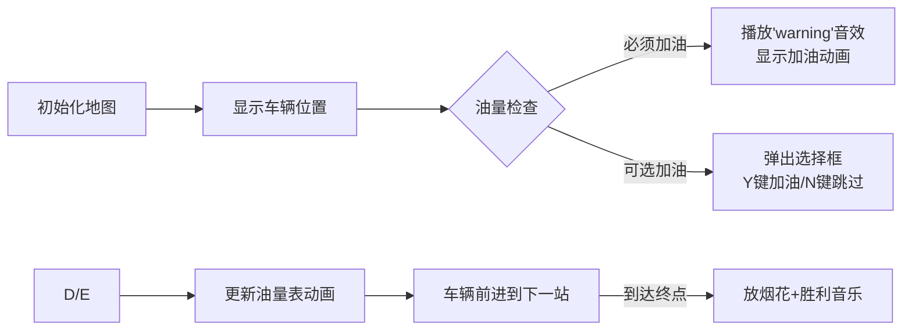

# 题目信息

# 驾车旅游

## 题目描述

如今许多普通百姓家有了私家车，一些人喜爱自己驾车从一个城市到另一个城市旅游。自己驾车旅游时总会碰到加油和吃饭的问题，在出发之前，驾车人总要想方设法得到从一个城市到另一个城市路线上的加油站的列表，列表中包括了所有加油站的位置及其每升的油价（如 $3.25$ 元/L）。驾车者一般都有以下的习惯：

1. 除非汽车无法用油箱里的汽油达到下一个加油站或目的地，在油箱里还有不少于最大容量一半的汽油时，驾驶员从不在加油站停下来；
2. 在第一个停下的加油站总是将油箱加满；
3. 在加油站加油的同时，买快餐等吃的东西花去 $20$ 元。
4. 从起始城市出发时油箱总是满的。
5. 加油站付钱总是精确到 $0.1$ 元（四舍五入）。
6. 驾车者都知道自己的汽车每升汽油能够行驶的里程数。

现在要你帮忙做的就是编写一个程序，计算出驾车从一个城市到另一个城市的旅游在加油和吃饭方面最少的费用。

## 样例 #1

### 输入

```
600
40  8.5  128  3
200  3.52
350  3.45
500  365```

### 输出

```
13133.2```

# AI分析结果


### 💡 Kay的C++算法解析：驾车旅游 深入学习指南 💡

**引言**  
今天我们一起分析"驾车旅游"这道DFS+模拟题。本指南将帮助大家理解加油决策逻辑、DFS状态设计和剪枝优化技巧，并通过像素动画直观展示算法流程。

---

### 1. 题目解读与核心算法识别
✨ **本题主要考察**：`DFS回溯` + `条件模拟`  

🗣️ **初步分析**：  
> 解决本题就像在公路旅行中做加油决策：当油箱过半时继续前进（除非无法到达下一站），否则可选择加油（加满并花20元吃饭）。核心是通过DFS模拟所有可能的加油组合，并用剪枝避免无效搜索。  
> - **核心难点**：正确处理两种加油场景（必须加油/可选加油），并设计包含位置、油量、费用的DFS状态  
> - **可视化设计**：用像素地图展示加油站位置，油量表动画显示剩余油量，决策时弹出选择框  
> - **游戏化元素**：FC风格的8-bit公路背景音，加油时播放"叮"音效，到达终点放胜利音乐  

---

### 2. 精选优质题解参考
**题解一 (Okimoto)**  
* **点评**：思路清晰指出题意陷阱（加油规则修正），DFS状态设计合理（位置/油量/费用），代码规范（gas结构体存储站点数据）。亮点在于用`flg`标记首次到达终点的剪枝技巧，实践时需注意浮点数精度处理。

**题解二 (花椒酱)**  
* **点评**：简洁高效的DFS实现，突出剪枝优化（`if(money>ans) return`）。变量命名直观（jyz=加油站，last=剩余油量），边界处理严谨。亮点将终点设为第n+1个站点简化逻辑。

**题解三 (最喜欢saber了)**  
* **点评**：DFS参数命名明确（to/you/cost），条件分支完整覆盖三种加油场景。亮点是用`ans=inf`初始化和`min()`更新最优解，注释详细适合初学者学习。

---

### 3. 核心难点辨析与解题策略
1. **难点：加油决策模拟**  
   * **分析**：必须区分"必须加油"（油量不足到下一站）和"可选加油"（油量<50%）。优质题解用`if(ful*per < distance)`判断必须加油，用`else if`处理可选场景  
   * 💡 **学习笔记**：加油决策本质是状态空间搜索，需严格遵循题目条件分支  

2. **难点：DFS状态设计**  
   * **分析**：三维状态（当前位置、剩余油量、累计费用）是解题关键。油量计算需转换为`距离/油耗`，如`ful -= (gas[i+1].loc-gas[i].loc)/per`  
   * 💡 **学习笔记**：状态参数应直接对应问题要素，避免冗余数据  

3. **难点：剪枝优化**  
   * **分析**：当`当前费用 > 历史最优解`时立即回溯（题解二的`if(money>ans) return`）。其他优化包括浮点数误差控制  
   * 💡 **学习笔记**：最优性剪枝是降低DFS复杂度的核心技巧  

### ✨ 解题技巧总结
- **技巧1：终点虚拟化** - 将终点设为第n+1个加油站统一处理  
- **技巧2：状态归一化** - 始终用里程/油耗计算油量消耗  
- **技巧3：浮点精度处理** - 避免直接比较浮点数，改用`a-b < 1e-6`  
- **技巧4：输入预处理** - 计算相邻加油站距离存入数组  

---

### 4. C++核心代码实现赏析
**通用核心实现参考**  
```cpp
#include <iostream>
#include <algorithm>
using namespace std;

struct Station { double loc, price; };
Station st[55];
double dis, cap, per, ans = 1e9;
int n;

void dfs(int pos, double oil, double cost) {
    if(cost >= ans) return; // 最优性剪枝
    if(pos == n+1) { ans = min(ans, cost); return; }
    
    double need = (st[pos+1].loc - st[pos].loc) / per;
    if(oil < need) { // 必须加油
        dfs(pos+1, cap - need, cost + 20 + (cap - oil)*st[pos].price);
    } 
    else if(oil*2 < cap) { // 可选加油
        dfs(pos+1, oil - need, cost); // 不加油
        dfs(pos+1, cap - need, cost + 20 + (cap - oil)*st[pos].price); // 加油
    } 
    else { // 油量过半不加油
        dfs(pos+1, oil - need, cost);
    }
}

int main() {
    // 输入处理(略)
    st[n+1].loc = dis; // 终点虚拟化
    dfs(0, cap - st[0].loc/per, initial_cost);
    printf("%.1lf\n", ans);
}
```
**代码解读概要**：  
1. 用结构体存储加油站数据  
2. DFS状态：当前位置/剩余油量/累计费用  
3. 三种决策分支覆盖所有加油场景  
4. 终点虚拟化为第n+1站简化逻辑  

---

**题解一片段赏析 (Okimoto)**  
```cpp
if((gas[loc+1].loc-gas[loc].loc)/per > ful) { // 必须加油
    sum += 20 + gas[loc].prc*(vol-ful);
    dfs(vol - (gas[loc+1].loc-gas[loc].loc)/per, loc+1, sum);
}
```
* **亮点**：精准计算需油量，费用累加包含20元餐费  
* **学习笔记**：临界条件用`>`而非`>=`避免浮点误差  

**题解二片段赏析 (花椒酱)**  
```cpp
last -= (km[jyz]-km[jyz-1])/each; // 油量消耗计算
if(last*each < km[jyz+1]-km[jyz]) { // 必须加油
    comp(jyz+1, money+20+pr[jyz]*(c-last), c);
}
```
* **亮点**：变量名`each`(每公里油耗)使逻辑更可读  
* **学习笔记**：油耗计算应在DFS递归前完成  

---

### 5. 算法可视化：像素动画演示
**主题**：FC红白机风格的《加油大冒险》  

**设计思路**：  
> 用8-bit像素画风降低理解压力，油量表动画直观显示决策依据，音效强化操作反馈。游戏化关卡设计提升学习动力。  

**动画流程**：  


**交互细节**：  
1. **像素地图**：16色FC风格，加油站用油枪图标，终点用旗帜  
2. **油量动画**：屏幕下方油量表随消耗减少，低于50%时变黄色  
3. **决策提示**：可选加油时弹出选择框，按键触发不同音效  
4. **音效设计**：  
   - 移动："嘟嘟"引擎声  
   - 加油："叮" + 油表上升动画  
   - 胜利：8-bit版《欢乐颂》  
5. **关卡进度**：每经过3个加油站解锁新车辆皮肤  

---

### 6. 拓展练习与相似问题思考
**通用技巧迁移**：  
DFS状态设计+条件模拟适用于：  
1. 资源分配问题（如电池续航优化）  
2. 路径决策问题（如带补给点的探险）  
3. 消费策略优化（如折扣券使用时机）  

**洛谷推荐**：  
1. **P1016 旅行家的预算**  
   → 同类加油策略问题，强化状态设计能力  
2. **P1433 吃奶酪**  
   → DFS+剪枝经典，训练状态压缩技巧  
3. **P3958 奶酪**  
   → 三维空间DFS，提升抽象建模能力  

---

### 7. 学习心得与经验分享
**参考经验 (Okimoto)**：  
> *"做题前先纠正题意：1. 在每个停下的加油站加满（非仅第一个） 2. 输出保留十分位（不四舍五入）"*  

**点评**：  
审题是解题基础！本题多个解法的差异源于对"不少于一半"的不同理解。动手前务必确认：  
1. 边界条件（≥50%还是>50%）  
2. 输出格式要求  
3. 特殊场景定义  

---

**结语**  
驾车旅游问题融合了DFS状态设计和条件模拟的精髓。通过像素动画可视化决策过程，相信大家能更直观理解状态转移逻辑。记住：好算法=正确状态设计+有效剪枝！下次旅行见！🚗💨

---
处理用时：94.02秒