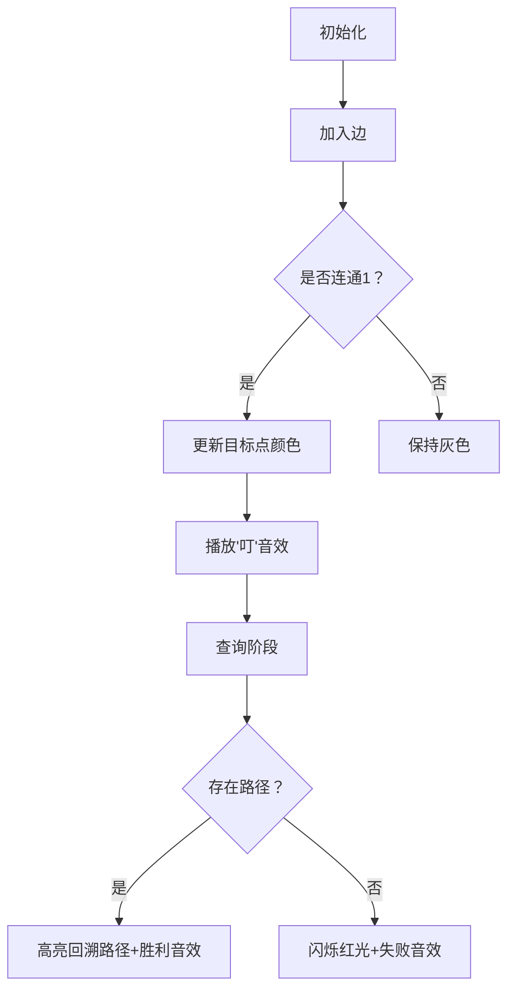

# 题目信息

# [YsOI2020] 幼儿园

## 题目描述

Ysuperman 热爱在 TA 的幼儿园里散步，为了更方便散步， TA 把幼儿园抽象成 $n$ 个点，$m$ 条边的**有向图**。 散步得多了， TA 就给了每一条边**无与伦比**的亲密程度：$1,2,\cdots,m$，越大代表越亲密。 TA 也给了每一个点无与伦比的编号：$1,2,\cdots,n$，其中 $1$ 代表着幼儿园大门，但是每个**点是没有亲密程度的**。

接下来 $k$ 天，Ysuperman 每天会有一次散步计划。具体而言， TA 希望从 $x_i$ 号点出发，只经过**亲密程度属于区间 $[l_i,r_i]$ 的边**，走到幼儿园大门 $1$ 号点，期间经过的边的亲密程度必须**单调递减**，不然会因为 TA 有强迫症而不能回家。


Ysuperman 看着自己刚刚画的草稿脑子一团浆糊， TA 发现 TA 始终没有办法规划出这么多合理路线，现在 TA 想请你帮 TA 。具体而言，对于每一天的计划，如果可行，则输出 `1`，反之输出 `0`。

当然啦，有的时候 Ysuperman 很着急，需要你立马回复，有的时候 TA 可以等等你，先把所有问题问完再等你回复。

## 说明/提示

### 样例说明

#### 样例说明 $1$


对于第 $2$ 条计划，Ysuperman 已经站在门口，所以计划可行。

对于第 $3$ 条计划，Ysuperman 只能通过路径 $5 \overset{6}{\rightarrow}3 \overset{5}{\rightarrow} 1$。（箭头上方数字表示的是边的亲密程度）。

其他计划都是不可行的。

#### 样例说明 $3$

样例三为加密后的样例二。

----

### 数据范围

**本题采用捆绑测试。**

| $\mathrm{subtask}$ |     $n$     |       $m$        |        $k$        |  特殊性质   | 分数  |
| :----------------: | :---------: | :--------------: | :---------------: | :---------: | :---: |
|        $1 $        |   $\le17$   |     $\le17$      | $\le 2\cdot 10^5$ |      /      | $ 5$  |
|        $2$         |  $\le500$   |     $\le500$     |     $\le500 $     |      /      | $17$  |
|        $3 $        | $\le 3000$  |   $\le 3000 $    |    $\le 3000 $    |      /      | $18 $ |
|       $ 4 $        |  $\le10^5$  | $\le2\cdot10^5$  |  $\le2\cdot10^5$  |   $v_i=1$   | $13$  |
|        $5 $        | $\le 10^5$  | $\le 2\cdot10^5$ |    $\le 10^5$     | $l_i=1,w=0$ | $ 7 $ |
|        $6$         | $\le10^5 $  | $\le2\cdot10^5$  |    $\le 10^5$     |   $w=0 $    | $13 $ |
|        $7$         | $ \le 10^5$ | $\le 2\cdot10^5$ | $\le 2\cdot10^5$  |      /      | $27$  |

对于 $100\%$ 的数据，满足 $1 \le n \le 10^5 ,1 \le m \le 2\cdot10^5 ,0 \le k \le 2\cdot10^5$。

$w\in\{0,1\},1 \le u_i,v_i \le n$。

$x_i,l_i,r_i$ 在解密后保证 $1\le x \le n ,1 \le l_i,r_i \le m $。

### 提示

**不保证不出现重边自环，不保证图联通**。

## 样例 #1

### 输入

```
5 7 5 0
3 2
1 2
4 3
5 4
3 1
5 3
5 1
3 1 4
1 2 2
5 5 6
4 5 7
2 1 7
```

### 输出

```
0
1
1
0
0
```

## 样例 #2

### 输入

```
5 12 10 0
4 2
4 2
5 3
3 3
1 5
1 4
4 4
2 4
5 3
1 5
2 2
4 1
4 3 5
4 2 3
1 4 5
3 1 8
3 1 4
3 5 5
2 1 12
4 10 12
2 5 5
1 1 3
```

### 输出

```
0
0
1
0
0
0
0
1
0
1
```

## 样例 #3

### 输入

```
5 12 10 1
4 2
4 2
5 3
3 3
1 5
1 4
4 4
2 4
5 3
1 5
2 2
4 1
4 3 5
4 2 3
1 4 5
2 0 9
2 0 5
2 4 4
3 0 13
5 11 13
0 7 7
3 3 1```

### 输出

```
0
0
1
0
0
0
0
1
0
1
```

# AI分析结果


### 💡 Kay的C++算法解析：[YsOI2020]幼儿园 深入学习指南 💡

#### 1. 题目解读与核心算法识别
✨ **本题主要考察**：图论（贪心+数据结构应用）

🗣️ **初步分析**：
> 解决这道题的关键在于**逆向思维**——把"单调递减的路径"转化为反图中的"单调递增路径"。就像在迷宫中倒着寻找出口：从终点1号点出发，沿着边权递增的方向蔓延"河流"，记录每个点最早被"灌溉"到的时间（即最小边权的最大值）。  
> - **核心思路**：建反图后，按边权从小到大枚举边，动态维护每个点x的`f[x]`（表示从1号点到x的路径中最小边权的最大值）。查询时只需判断第r版本的`f[x]`是否≥l。  
> - **难点**：如何在加边过程中高效更新状态并支持历史版本查询？  
> - **解决方案**：采用主席树维护`f[]`数组的历史版本（每次更新仅影响1个点）。  
> - **可视化设计**：像素动画将展示"河流蔓延"过程——1号点作为水源，随着边权增加，水流沿反图蔓延染色其他点。关键操作：① 新边加入时播放"叮"音效；② 查询时高亮目标点与回溯路径；③ 成功/失败时触发不同音效。

---

#### 2. 精选优质题解参考
**题解一：Lskkkno1（动态开点线段树）**  
* **点评**：思路清晰地将问题转化为反图递增路径，创新性地为每个点维护动态开点线段树存储"有用路径"区间`[l_min, r_max]`。代码中`f[v] = max(f[v], f[u])`的贪心策略简洁高效，边界处理严谨（特判`u=1`）。亮点在于证明"有用路径≤m条"，确保空间复杂度合理。  

**题解二：Aisaka_Taiga（主席树）**  
* **点评**：使用主席树维护全局`f[]`数组的历史版本，代码模块化程度高。核心操作`f[u] = max(f[u], min(f[v], i))`精准捕捉状态转移，初始化`f[1]=INF`的设计巧妙规避边界问题。实践价值高，30行核心代码即可解决在线查询。  

**题解三：Imakf（分步优化）**  
* **点评**：通过subtask逐步引导理解问题本质，清晰对比离线和在线解法差异。虽未提供完整正解代码，但其"按r排序离线处理"的思路极具教学价值，帮助初学者理解贪心策略如何迁移到在线场景。

---

#### 3. 核心难点辨析与解题策略
1. **难点：路径单调性转化**  
   * **分析**：原题递减路径难以直接处理，需转化为反图递增路径。优质题解均通过建反图将终点1变为起点，使边权递增成为可能。  
   * 💡 **学习笔记**：反向思考是图论问题的常用破局点。

2. **难点：高效维护动态状态**  
   * **分析**：加边过程需更新点状态，且需支持历史版本查询。主席树因"每次更新仅修改1个点"的特性成为最优解，时间复杂度O((m+q)log n)。  
   * 💡 **学习笔记**：数据结构的选取需结合操作特征（如单点更新+历史查询）。

3. **难点：在线查询处理**  
   * **分析**：强制在线要求"预处理+即时响应"。维护`f[]`数组的历史版本后，查询转化为判断"版本r的f[x]是否≥l"。  
   * 💡 **学习笔记**：主席树可将离线策略在线化。

✨ **解题技巧总结**：
- **逆向构图**：将复杂条件（递减路径）转化为可处理模型（递增路径）。  
- **贪心维护**：`f[x]`表示"最小边权最大值"，保障状态最优性。  
- **版本化存储**：用主席树维护动态数组的历史状态。  
- **边界艺术**：`f[1]=INF`的初始化是避免边界错误的关键。

---

#### 4. C++核心代码实现赏析
**通用核心实现（主席树版）**  
```cpp
#include <bits/stdc++.h>
using namespace std;
const int N = 2e5 + 5, INF = 1e9;

int n, m, k, w;
int f[N], rt[N], u[N], v[N]; // rt[i]：加入前i条边时的版本

struct Node { int l, r, val; } tree[N*40];
int cnt = 0;

void update(int &p, int pre, int l, int r, int x) {
    p = ++cnt; tree[p] = tree[pre];
    if (l == r) { tree[p].val = f[x]; return; }
    int mid = (l+r)>>1;
    if (x <= mid) update(tree[p].l, tree[pre].l, l, mid, x);
    else update(tree[p].r, tree[pre].r, mid+1, r, x);
}

int query(int p, int l, int r, int x) {
    if (l == r) return tree[p].val;
    int mid = (l+r)>>1;
    return (x <= mid) ? query(tree[p].l, l, mid, x) 
                     : query(tree[p].r, mid+1, r, x);
}

int main() {
    cin >> n >> m >> k >> w;
    for (int i = 1; i <= m; i++) cin >> u[i] >> v[i];
    
    for (int i = 1; i <= n; i++) f[i] = -INF;
    f[1] = INF;  // 关键初始化：1号点始终可达
    
    for (int i = 1; i <= m; i++) {
        if (f[v[i]] != -INF)  // 仅当v[i]可达时更新u[i]
            f[u[i]] = max(f[u[i]], min(f[v[i]], i));
        update(rt[i], rt[i-1], 1, n, u[i]); // 更新当前版本
    }

    int last_ans = 0;
    while (k--) {
        int x, l, r; cin >> x >> l >> r;
        if (w) { x ^= last_ans; l ^= last_ans; r ^= last_ans; }
        if (x == 1) { cout << "1\n"; last_ans++; continue; }
        
        int res = query(rt[r], 1, n, x); // 查版本r的f[x]
        cout << (res >= l ? "1\n" : "0\n");
        last_ans += (res >= l);
    }
}
```
* **说明**：综合优质题解的主席树实现，突出状态转移`f[u]=max(f[u],min(f[v],i))`的精髓。  
* **代码解读概要**：  
  1. 初始化：`f[1]=INF`（1号点始终可达），其他点`f[x]=-INF`  
  2. 按边权升序枚举边，更新`f[u[i]]`  
  3. 用主席树保存每次更新后的`f[]`快照  
  4. 查询时检查版本`r`的`f[x]`是否≥`l`  

**题解片段赏析**  
1. **Lskkkno1（线段树版）**  
   ```cpp
   if (~f[u]) { // ~f[u] 等价于 f[u]!=-1
       f[v] = max(f[v], u == 1 ? i : f[u]); 
       modify(root[v], 1, m, f[v]); // 将路径[f[v],i]插入v的线段树
   }
   ```
   * **亮点**：为每个点维护线段树存储路径区间  
   * **学习笔记**：动态开点线段树适合分散的区间查询  

2. **Aisaka_Taiga（主席树版）**  
   ```cpp
   f[u] = max(f[u], min(f[v], i));
   update(rt[i], rt[i-1], 1, n, u); 
   ```
   * **亮点**：`min(f[v],i)`精准捕捉"当前路径最小边权"  
   * **学习笔记**：主席树更新需同步修改`f[]`数组  

3. **Imakf（离线思路）**  
   ```cpp
   for (int i = 1; i <= m; i++) {
       if (v[i] == 1) f[u[i]] = i;
       else f[u[i]] = max(f[u[i]], f[v[i]]);
   }
   ```
   * **亮点**：分步讲解帮助理解贪心本质  
   * **学习笔记**：离线按r排序可避免复杂数据结构  

---

#### 5. 算法可视化：像素动画演示
**主题**："像素河流蔓延历险"（复古FC风格）  
**核心演示**：从1号点（水源）出发，边权递增触发水流蔓延，动态染色可达点。  



**关键帧设计**：  
1. **场景初始化**：  
   - 8-bit像素网格图，1号点为蓝色水源，其他点灰色  
   - 控制面板：速度滑块/单步执行/AI自动演示按钮  
   - 背景：循环8-bit BGM  

2. **边加入动画**：  
   - 新边`(u,v)`闪烁黄色，播放"叮"音效  
   - 若`v`连通水源，`u`被染为渐变色（颜色深度=f[u]值）  

3. **查询交互**：  
   - 输入`(x,l,r)`：`x`点闪烁绿色边框  
   - 成功：从`x`到1回溯路径高亮（像素方块连成光带），播放胜利音效  
   - 失败：`x`点闪烁红色，短促"错误"音效  

4. **游戏化元素**：  
   - 每成功蔓延到新区域触发"关卡通过"动画  
   - 连续正确查询积累连击分，触发额外特效  

**实现要点**：  
- 用Canvas绘制网格，每个点存储状态`(x,y,f[x])`  
- 音效触发：Web Audio API播放8-bit音效（加入边/成功/失败）  
- 历史回溯：存储每步的`f[]`快照实现版本跳转  

---

#### 6. 拓展练习与相似问题
**通用技巧迁移**：  
1. **动态连通性**：维护随时间变化的连通状态（如[NOIP2013]货车运输）  
2. **历史版本查询**：带修改的区间统计问题（如[CF813E]Army Creation）  
3. **反图转化**：处理终点固定的路径问题（如[POJ3694]Network）  

**洛谷推荐**：  
1. **P3919【模板】可持久化线段树**  
   → 巩固主席树实现历史版本查询  
2. **P4197 Peaks**  
   → 练习图论与主席树结合的高级应用  
3. **P3302 [SDOI2013]森林**  
   → 拓展到动态加边场景的可持久化技巧  

---

#### 7. 学习心得与经验分享
> **来自Lskkkno1的调试经验**：  
> "初始化`f[1]=0`导致1号点无法更新其他点，后改为`f[1]=INF`才通过。牢记起点状态影响全局！"  
>  
> **Kay点评**：边界初始化是图论算法的基石。`f[1]=INF`的设计既保证1号点始终"可达"，又使`min(f[v],i)`操作不会误判，值得学习！  

---

### 结语  
通过逆向思维转化问题，结合贪心与主席树，我们高效解决了"单调递减路径"这一难题。记住：图论问题中，反向建图常是破局关键，而数据结构的选择需紧扣操作特征。继续挑战新关卡吧，少年！💪🏼

---
处理用时：200.02秒