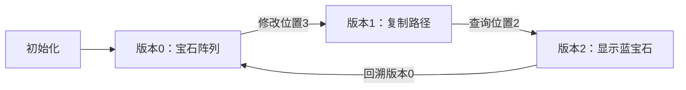

# 题目信息

# 【模板】可持久化线段树 1（可持久化数组）

## 题目背景

**UPDATE : 最后一个点时间空间已经放大**

2021.9.18 增添一组 hack 数据 by @panyf

标题即题意

有了可持久化数组，便可以实现很多衍生的可持久化功能（例如：可持久化并查集）

## 题目描述

如题，你需要维护这样的一个长度为 $ N $ 的数组，支持如下两种操作：


1. 在某个历史版本上修改某一个位置上的值。

2. 访问某个历史版本上的某一位置的值。


此外，每进行一次操作，就会生成一个新的版本。版本编号即为当前操作的编号（从 $1$ 开始编号，版本 $0$ 表示初始状态数组）。

**对于操作 $2$，即为生成一个完全一样的版本，不作任何改动**。即，询问生成的版本是询问所访问的那个版本的复制。

## 说明/提示

### 数据规模

对于 $30\%$ 的数据，$ 1 \leq N, M \leq {10}^3 $。

对于 $50\%$ 的数据，$ 1 \leq N, M \leq {10}^4 $。

对于 $70\%$ 的数据，$ 1 \leq N, M \leq {10}^5 $。

对于 $100\%$ 的数据：

- $ 1 \leq N, M \leq {10}^6$；
- $1 \leq p \leq N$；
- 设当前是第 $x$ 次操作，$0 \leq v < x$；
- $-{10}^9 \leq a_i,c  \leq {10}^9$。

### 样例说明

所有操作结束后，总共生成了 $11$ 个版本，编号为 $0 \sim 10$，依次为：

版本 $0$：`59 46 14 87 41`，

版本 $1$：`59 46 14 87 41`，

版本 $2$：`14 46 14 87 41`，

版本 $3$：`57 46 14 87 41`，

版本 $4$：`88 46 14 87 41`，

版本 $5$：`88 46 14 87 41`，

版本 $6$：`59 46 14 87 41`，

版本 $7$：`59 46 14 87 41`，

版本 $8$：`88 46 14 87 41`，

版本 $9$：`14 46 14 87 41`，

版本 $10$：`59 46 14 87 91`。

## 样例 #1

### 输入

```
5 10
59 46 14 87 41
0 2 1
0 1 1 14
0 1 1 57
0 1 1 88
4 2 4
0 2 5
0 2 4
4 2 1
2 2 2
1 1 5 91```

### 输出

```
59
87
41
87
88
46```

# AI分析结果


# 💡 Kay的C++算法解析：可持久化数组 深入学习指南 💡

## 1. 题目解读与核心算法识别

✨ **本题主要考察**：`可持久化数据结构` (可持久化线段树/平衡树)

🗣️ **初步分析**：
> 解决"可持久化数组"问题，关键在于理解`可持久化数据结构`的核心思想。简单来说，就像**时光存档机**，每次操作都生成新存档，但只记录变化部分（如同游戏存档只存关键决策点）。在本题中，该技术用于高效存储数组的历史版本。
> - **主要解法**：可持久化线段树（复制修改路径）和离线DFS（版本树回溯）两种思路。前者通用性强，后者空间更优但仅适用离线场景。
> - **核心流程**：修改时只复制受影响节点（O(log n)个），通过根节点数组管理版本。可视化将高亮**节点复制过程**和**版本树结构**。
> - **像素动画设计**：采用**8位像素风格**展示线段树分裂过程。修改位置闪烁红光，新节点以绿色像素块弹出，伴随"叮"音效。控制面板支持单步执行/调速滑块，通过Canvas动态绘制节点连接。

---

## 2. 精选优质题解参考

**题解一：hyfhaha (可持久化线段树)**
* **点评**：思路清晰比喻生动（"时光存档机"），配图说明节点复用原理。代码规范（`clone`函数封装节点复制），变量名`memo`明确体现记忆化思想。算法采用标准动态开点策略，空间复杂度O(n+mlogn)最优。调试心得强调"动手模拟排错"，实践价值高。

**题解二：huangboning (离线DFS)**
* **点评**：创新性地将版本视为树结构，通过DFS回溯避免存储冗余版本。代码中`vector<node> v[]`存储版本树，回溯时用`tmp`暂存还原值。时间复杂度降至O(n)，但仅适用离线查询。亮点在于跳出模板思维，提供全新视角。

**题解三：pigeonN (可持久化平衡树)**
* **点评**：用`Rope`实现可持久化平衡树，展示多解法可能。代码模块化强（`Connect/Substring`独立封装），但空间稍逊于线段树。亮点在于结合STL思想实现"函数式数据结构"，拓展思维边界。

---

## 3. 核心难点辨析与解题策略

1.  **节点复用与版本管理**
    * **分析**：修改时需保留旧版本，直接复制整树空间爆炸。优质题解通过**部分复制**（仅修改路径）和**版本根数组**解决。
    * 💡 **学习笔记**：可持久化的本质是"增量存储"，关键在识别变化部分。

2.  **动态开点与指针维护**
    * **分析**：常规线段树父子计算失效，需动态分配节点ID。题解1用`top`计数器，题解4用`vector`自动管理内存。
    * 💡 **学习笔记**：动态开点时预估空间为20-30倍原数组。

3.  **离线版本树构建**
    * **分析**：离线法需建立操作依赖树。题解4用`v[]`数组存储版本边，DFS时回溯状态。
    * 💡 **学习笔记**：当操作可离线时，DFS法空间可降至O(n)。

### ✨ 解题技巧总结
- **空间优化**：复制节点时只克隆路径（log n个节点）
- **版本跳转**：用`root[i]`数组存储各版本根节点
- **回溯还原**：离线DFS时存储临时变量（如`tmp=a[y]`）
- **动态开点**：预先计算空间公式N<<5（约32倍）

---

## 4. C++核心代码实现赏析

**本题通用核心实现（可持久化线段树）**
```cpp
struct Node { int l, r, val; } tree[N * 24];
int root[M], idx;

// 关键函数：克隆节点（增量创建）
int clone(int p) {
    tree[++idx] = tree[p];
    return idx;
}

// 修改操作（返回新版本根）
int update(int p, int l, int r, int x, int v) {
    p = clone(p); // 复制路径
    if (l == r) { tree[p].val = v; return p; }
    int mid = (l + r) >> 1;
    if (x <= mid) tree[p].l = update(tree[p].l, l, mid, x, v);
    else tree[p].r = update(tree[p].r, mid+1, r, x, v);
    return p;
}

// 查询操作（无需克隆）
int query(int p, int l, int r, int x) {
    if (l == r) return tree[p].val;
    int mid = (l + r) >> 1;
    if (x <= mid) return query(tree[p].l, l, mid, x);
    return query(tree[p].r, mid+1, r, x);
}
```

**题解一：hyfhaha - 记忆化实现亮点**
```cpp
int clone(int node){
    tree[++top] = tree[node]; // 结构体整体复制
    return top;
}
// 学习笔记：利用结构体复制简化代码，避免逐个属性赋值

```

**题解四：huangboning - 离线DFS核心**
```cpp
void dfs(int ver) {
    for (auto [ver_next, op] : tree[ver]) {
        int tmp = a[op.p];
        if (op.type == 1) a[op.p] = op.val; // 修改状态
        else ans[op.id] = a[op.p];         // 回答查询
        dfs(ver_next);                     // 进入子版本
        a[op.p] = tmp;                     // 回溯还原
    }
}
// 学习笔记：DFS遍历版本树时，通过栈帧自动管理状态
```

---

## 5. 算法可视化：像素动画演示

### 像素化演示主题
**"时光迷宫探险"**：数组值变为可收集的宝石，版本切换如传送门

### 动画设计


1. **8位像素风格**：
   - 宝石数组：红/绿/蓝像素块（FC游戏风格）
   - 线段树：灰色网格，节点用发光边框标记

2. **动态过程**：
   - 修改操作：目标位置闪烁红光→分裂出绿色新节点→播放"叮"音效
   - 查询操作：位置脉冲蓝光→显示值弹出像素对话框
   - 版本切换：像素角色跳入传送门，屏幕波纹特效

3. **控制面板**：
   - 版本滑块：拖动切换历史版本
   - 单步执行：按帧展示节点复制过程
   - 结构对比：并排显示两个版本的差异节点

---

## 6. 拓展练习与相似问题

### 通用技巧迁移
可持久化技术还可用于：
1. 区间第K大（主席树经典应用）
2. 可持久化并查集（记录集合历史状态）
3. 文本历史版本管理（如协同编辑）

### 推荐练习（洛谷）
1. **P3834 【模板】可持久化线段树2**  
   → 巩固主席树求区间第K小
2. **P3402 可持久化并查集**  
   → 学习可持久化+并查集组合应用
3. **P4592 异或序列**  
   → 掌握可持久化01Trie的高频应用

---

## 7. 学习心得与经验分享
> **来自hyfhaha的调试经验**：  
> "我在实现`clone()`时卡在指针错误，后来发现需先复制节点再递归修改。这提醒我们：**先完成节点复制，再更新子指针**，顺序错会导致版本污染"

> **Kay总结**：  
> 可持久化编程两大黄金法则：  
> 1. 修改必先克隆（避免污染旧版本）  
> 2. 根节点版本化管理（`root[]`数组是生命线）  
> 调试时多画节点图，比打印日志更直观！

---

通过本指南，希望大家不仅学会实现可持久化数组，更能理解"数据版本化"的核心思想。记住：编程如同时光旅行，每个版本都是通往新世界的传送门！🚪💎

---
处理用时：108.26秒