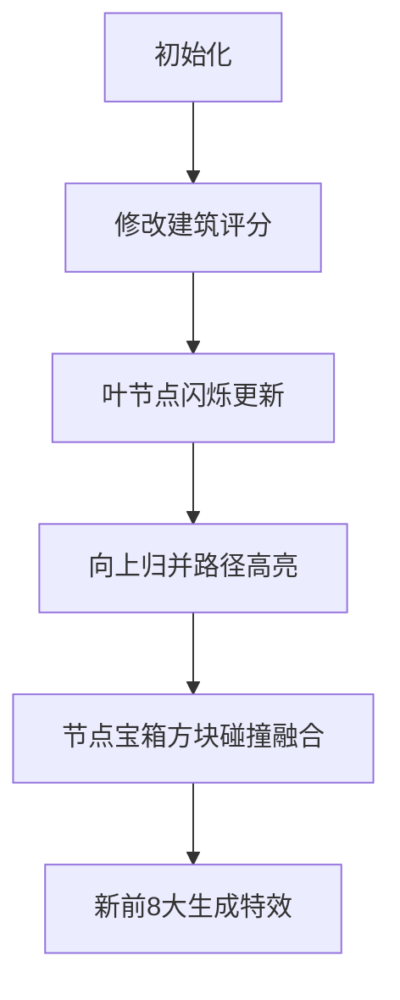

# 题目信息

# [蓝桥杯 2019 国 B] 第八大奇迹

## 题目背景

在一条 R 河流域，繁衍着一个古老的名族 Z。他们世代沿河而居，也在河边发展出了璀璨的文明。

Z 族在 R 河沿岸修建了很多建筑，最近，他们热衷攀比起来。他们总是在比谁的建筑建得最奇特。

幸好 Z 族人对奇特的理解都差不多，他们很快给每栋建筑都打了分，这样评选谁最奇特就轻而易举了。

于是，根据分值，大家很快评出了最奇特的建筑，称为大奇迹。后来他们又陆续评选了第二奇特、第二奇特、……、第七奇特的建筑，依次称为第二大奇迹、第三大奇迹、……、第七大奇迹。

最近，他们开始评选第八奇特的建筑，准备命名为第八大奇迹。在评选中，他们遇到了一些问题。

## 题目描述

首先，Z 族一直在发展，有的建筑被拆除又建了新的建筑，新建筑的奇特值和原建筑不一样，这使得评选不那么容易了。

其次，Z 族的每个人所生活的范围可能不一样，他们见过的建筑并不是所有的建筑，他们坚持他们自己所看到的第八奇特的建筑就是第八大奇迹。

Z 族首领最近很头疼这个问题，他害怕因为意见不一致导致 Z 族发生分歧。他找到你，他想先了解一下，民众自己认为的奇迹是怎样的。

现在告诉在 R 河周边的建筑的变化情况，以及在变化过程中一些人的生活范围，请编程求出每个人认为的第八大奇迹的奇特值是多少。

## 说明/提示

对于 $20\%$ 的评测用例，$1 \le L \le 1000$，$1 \le N \le 1000$。

对于 $40\%$ 的评测用例，$1 \le L \le 10000$，$1 \le N \le 10000$。

对于 $100\%$ 的评测用例，$1 \le L \le 10^5$，$1 \le N \le 10^5$。所有奇特值为不超过 $10^9$ 的非负整数。

蓝桥杯 2019 年国赛 B 组 I 题。

## 样例 #1

### 输入

```
10 15
C 1 10
C 2 20
C 3 30
C 4 40
C 5 50
C 6 60
C 7 70
C 8 80
C 9 90
C 10 100
Q 1 2
Q 1 10
Q 1 8
C 10 1
Q 1 10```

### 输出

```
0
30
10
20
```

# AI分析结果


# 💡 Kay的C++算法解析：蓝桥杯 2019 国 B 第八大奇迹 深入学习指南 💡

> 今天我们来分析蓝桥杯国赛题"第八大奇迹"，掌握动态维护区间第K大的核心技巧！

## 1. 题目解读与核心算法识别

✨ **本题主要考察**：「区间查询与单点修改」+「数据结构优化」

🗣️ **初步分析**：
> 这道题就像实时更新的"建筑排行榜"——我们需要快速找出任意河段中评分第8高的建筑。核心挑战在于**高效处理动态数据**和**快速区间查询**。就像在游戏中实时更新高分榜，我们需要选择合适的数据结构快速响应变化。

- 主要解法有两种：**线段树维护区间前K大值**（适合固定K值）和**树套树**（通用但复杂）。由于K=8较小，线段树法更优，时间复杂度为O(8n log n)
- 可视化设计重点：用像素网格展示建筑评分分布，线段树节点用颜色块表示前8大值。动画将高亮建筑评分变化时线段树节点的合并过程（类似俄罗斯方块消除效果），配合8-bit音效增强操作反馈

---

## 2. 精选优质题解参考

**题解一 (来源：Pengzt)**
* **点评**：思路清晰直击核心——用线段树维护区间前8大值。代码中vector的使用虽稍显冗余但可读性强，通过sort简化了归并逻辑。亮点在于完整处理了区间长度不足8的情况（输出0），边界处理严谨。空间复杂度O(n)的优化值得学习。

**题解二 (来源：Coffee_zzz)**
* **点评**：采用定长数组替代vector，显著提升性能。亮点在于优雅的归并实现：用双指针在O(8)时间内完成节点合并，避免排序开销。代码模块化优秀（pushup/update/query分离），变量命名规范（ls/rs显式区分左右子节点），是竞赛实现的理想参考。

**题解三 (来源：a16_)**
* **点评**：创新性重载运算符实现归并，代码简洁如数学表达式（t[p] = t[p<<1] + t[p<<1|1]）。亮点在于将复杂逻辑转化为直观的代数操作，结构体封装使核心逻辑聚焦在10行内。虽然缺少长度不足8的特判，但算法框架极具启发性。

---

## 3. 核心难点辨析与解题策略

1. **难点1：动态维护区间有序性**
   - 分析：传统排序无法支持频繁修改，需选择支持动态更新的数据结构
   - 解法：线段树每个节点维护局部有序数据（前8大），修改时自底向上归并更新
   - 💡 学习笔记：局部有序替代全局排序是优化关键

2. **难点2：高效合并区间信息**
   - 分析：合并两个子区间时，简单排序需O(16log16)，成为性能瓶颈
   - 解法：双指针归并（O(8)）：比较左右区间当前最大值，择优放入父节点
   - 💡 学习笔记：有序数据的归并效率远高于重新排序

3. **难点3：处理稀疏区间**
   - 分析：查询区间建筑数不足8时需返回0，易遗漏判断
   - 解法：初始化数组补0（a16_法），或查询时检查有效值数量（Pengzt法）
   - 💡 学习笔记：边界处理能力体现编程严谨性

### ✨ 解题技巧总结
- **固定K值优化**：当K较小时（如本题K=8），放弃通用解法（树套树）转而特化实现
- **归并代替排序**：利用子节点有序性，用O(K)归并替代O(K log K)排序
- **防御性初始化**：用0填充数组避免复杂边界判断
- **结构体封装**：重载运算符使核心逻辑表达更直观

---

## 4. C++核心代码实现赏析

**通用核心实现参考 (基于Coffee_zzz解法优化)**
```cpp
#include <iostream>
using namespace std;
const int N=1e5+5, K=8;

struct Node {
    int d[K] = {0}; // 初始化填充0
    Node operator+(const Node &rhs) const {
        Node res; 
        for(int i=0,j=0,k=0; k<K; k++) 
            res.d[k] = (d[i] > rhs.d[j]) ? d[i++] : rhs.d[j++];
        return res;
    }
} tr[N<<2];

void update(int u,int l,int r,int p,int v){
    if(l == r) { tr[u].d[0] = v; return; }
    int mid = (l+r)>>1;
    p <= mid ? update(u<<1,l,mid,p,v) : update(u<<1|1,mid+1,r,p,v);
    tr[u] = tr[u<<1] + tr[u<<1|1]; // 运算符重载归并
}

Node query(int u,int l,int r,int L,int R){
    if(L<=l && r<=R) return tr[u];
    int mid = (l+r)>>1;
    if(R <= mid) return query(u<<1,l,mid,L,R);
    if(L > mid) return query(u<<1|1,mid+1,r,L,R);
    return query(u<<1,l,mid,L,R) + query(u<<1|1,mid+1,r,L,R); // 自动归并
}

int main(){
    int n,m; cin>>n>>m;
    while(m--){
        char op; int a,b;
        cin>>op>>a>>b;
        if(op=='C') update(1,1,n,a,b);
        else cout << query(1,1,n,a,b).d[K-1] << "\n"; // 直接取第8大
    }
}
```
> **代码解读概要**：  
> - 结构体`Node`封装前8大值并重载`+`实现归并  
> - `update`修改叶节点后向上归并更新  
> - `query`分割区间并自动归并结果  
> - 初始化填0确保不足8时返回0

---

**题解片段赏析**  
**题解二 (Coffee_zzz)**  
```cpp
void pushup(vector<int> &rt, const vector<int> &l, const vector<int> &r){
    int i=0,j=0;
    for(int k=0; k<8; k++)  // O(8)归并
        rt[k] = (l[i] > r[j]) ? l[i++] : r[j++];
}
```
> **代码解读**：  
> 这个归并函数是性能关键！通过双指针`i,j`同步遍历左右子节点的有序数组，每次选取当前最大值放入父节点。就像两位领队各自持有序队列，每次派出最高分队员加入新队伍。注意条件运算符的妙用——避免if-else分支提升指令预测成功率。

**题解三 (a16_)**  
```cpp
struct Tree{
    int d[8]={0};
    Tree operator+(const Tree &tmp)const{
        Tree res; int p1=0,p2=0;
        for(int i=0;i<8;i++)
            res.d[i]=(d[p1]>tmp.d[p2])?d[p1++]:tmp.d[p2++];
        return res;
    }
};
```
> **代码解读**：  
> 运算符重载使节点合并如数学运算般简洁。`p1,p2`作为内部状态指针，在结构体复制时自动重置，确保每次归并独立。这类似游戏中的合成系统——两个装备放入合成框(`+`)，自动产出强化装备(`res`)。

---

## 5. 算法可视化：像素动画演示

### 🎮 像素探险家：建筑评分争霸战
**设计理念**：  
> 采用FC游戏风格，用不同颜色方块表示建筑评分（金色=100分，灰色=0分）。线段树节点显示为8格宝箱，实时展示存储的前8大值。每次修改触发"消除特效"，归并过程展现为方块碰撞融合。

**动画流程**：  


**关键交互**：  
1. **建筑河岸**：横向像素网格，x轴表建筑位置，y轴表评分（跳数显示）
2. **线段树宝箱**：每个节点显示8格宝箱，颜色反映存储值，空白格=0
3. **归并动画**：  
   - 左子节点方块向右滑动，右子节点向左滑动  
   - 碰撞时比较数值，大值保留并播放"叮"音效（频率随数值变化）  
   - 小值消失并产生像素粒子特效
4. **控制面板**：  
   - 暂停/继续：Space键  
   - 单步执行：方向键→  
   - 速度调节：滑块控制归并速度

**音效设计**：  
- 建筑更新：8-bit "放置"音效 (方波)  
- 值比较：短促"滴"声 (三角波)  
- 归并完成：胜利旋律 (矩形波)  
- 查询结果：根据第8大值播放不同音阶

> 通过可视化，线段树抽象归并过程转化为直观的方块对决游戏，配合经典8-bit音效强化理解记忆。

---

## 6. 拓展练习与相似问题

**通用技巧迁移**：  
维护区间前K大值的策略还可用于：
1. 实时游戏高分榜（K=10）  
2. 股票交易系统监控前K支活跃股  
3. 推荐系统中的用户偏好TOP-K分析  

**推荐练习**：  
1. **P2617 Dynamic Rankings**  
   🗣️ 树套树经典题，掌握后可解决任意K值的动态区间第K大问题  
2. **P1972 HH的项链**  
   🗣️ 训练区间统计能力，强化线段树/树状数组应用  
3. **P1908 逆序对**  
   🗣️ 理解分治与归并排序思想，巩固双指针技巧  

---

## 7. 学习心得与经验分享

> **参考经验 (来自 Coffee_zzz)**：  
> "最初尝试用完整排序解决，遇到10万数据量时TLE。意识到必须利用K小的特性优化归并过程，最终将单次合并复杂度从O(n log n)降到O(8)"

> **点评**：  
> 这个调试经历揭示了算法选择的黄金准则——**利用问题特性优化**。在性能瓶颈分析时，锁定最耗时的归并操作针对性优化，比盲目更换数据结构更有效。记录各函数执行耗时是定位热点的好方法！

---

通过本次分析，我们掌握了动态维护区间TOP-K的核心技巧，并学会针对问题特性优化算法。记住：优秀程序员不仅是编码者，更是懂得选择合适"工具"的工程师！下次挑战再见！💪

---
处理用时：108.96秒