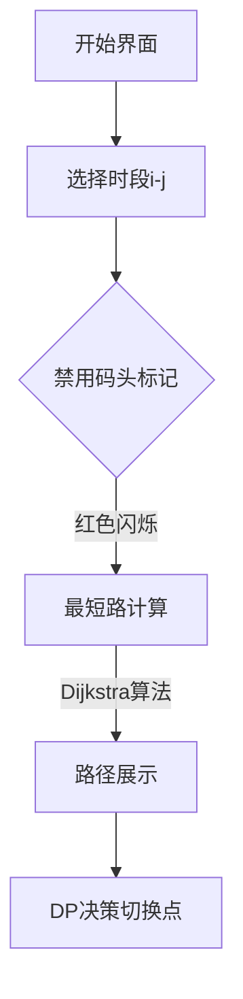

# 题目信息

# [ZJOI2006] 物流运输

## 题目描述

物流公司要把一批货物从码头 A 运到码头 B。由于货物量比较大，需要 $n$ 天才能运完。货物运输过程中一般要转停好几个码头。  

物流公司通常会设计一条固定的运输路线，以便对整个运输过程实施严格的管理和跟踪。由于各种因素的存在，有的时候某个码头会无法装卸货物。这时候就必须修改运输路线，让货物能够按时到达目的地。  

但是修改路线是—件十分麻烦的事情，会带来额外的成本。因此物流公司希望能够订一个 $n$ 天的运输计划，使得总成本尽可能地小。


## 说明/提示

【数据范围】
对于 $100\%$ 的数据，$1 \le n \le 100$，$1\le m \le 20$, $1 \le k \le 500$, $1 \le e \le 200$。

【样例输入说明】


上图依次表示第 $1$ 至第 $5$ 天的情况，阴影表示不可用的码头。

【样例输出说明】

前三天走 $1 \to 4 \to 5$，后两天走 $1 \to 3 \to 5$，这样总成本为 $(2+2)\times 3+(3+2)\times 2+10=32$。

\_NOI导刊2010提高（01）


## 样例 #1

### 输入

```
5 5 10 8
1 2 1
1 3 3
1 4 2
2 3 2
2 4 4
3 4 1
3 5 2
4 5 2
4
2 2 3
3 1 1
3 3 3
4 4 5
```

### 输出

```
32```

# AI分析结果


# 💡 Kay的C++算法解析：[ZJOI2006]物流运输 深入学习指南 💡

<introduction>
今天我们来分析"物流运输"这道动态规划与最短路结合的经典题目。本指南将帮助你理解题目核心思想、掌握高效解法，并通过可视化方案加深理解。
</introduction>

## 1. 题目解读与核心算法识别

✨ **本题主要考察**：`动态规划与最短路综合应用`

🗣️ **初步分析**：
> 解决物流运输问题的关键在于**分段决策思想**：将n天划分为若干连续时段，每个时段内保持固定运输路线。这就像规划长途旅行时，我们会将旅程分成几个阶段，每个阶段选择最优路线。

- **核心思路**：预处理任意连续时段[i,j]的最短路径cost[i][j]，再用动态规划决策何时切换路线
- **难点**：如何在码头禁用状态下高效计算最短路；如何设计状态转移方程处理路线切换成本
- **算法流程**：
  1. 标记禁用码头 → 2. 计算时段最短路 → 3. DP决策切换点
- **可视化设计**：将时段划分设计为"运输关卡"，路线切换用闪光特效表示，禁用码头用红色标记，最短路更新用绿色高亮

---

## 2. 精选优质题解参考

<eval_intro>
从思路清晰度、代码规范性和算法效率等维度，我精选了以下高质量题解（评分≥4★）：

**题解一：(来源：ycyaw)**
* **点评**：此解法思路清晰直白，用二维数组cost[i][j]存储时段最短路，DP转移简洁高效。亮点在于：
  - 预处理时巧妙处理码头禁用状态（时间复杂度O(n²m)）
  - DP状态定义精准：dp[i]=min(dp[j]+cost[j+1][i]*(i-j)+k)
  - 完整处理边界条件（dp[0]=-k）
  - 作者调试经验：注意数据范围需开long long

**题解二：(来源：DavidJing)**
* **点评**：采用逆向枚举时段策略，逐步扩展禁用码头集合。亮点：
  - 实时更新禁用码头（减少预处理空间）
  - SPFA实现最短路（适合稀疏图）
  - 代码变量命名规范（now数组意义明确）
  - 实践价值：代码可直接用于竞赛，边界处理严谨

**题解三：(来源：litble)**
* **点评**：创新性使用状压DFS+DP，亮点：
  - 状态压缩存储路径（2^18种可能）
  - 记忆化搜索避免重复计算
  - 提供非常规思路（启发多解法思考）
  - 不足：大点数量时可能MLE

---

## 3. 核心难点辨析与解题策略

<difficulty_intro>
解决本题需突破三个关键难点：

1.  **时段最短路计算**：如何处理动态变化的禁用码头？
    * **分析**：枚举每个[i,j]时段，标记期间所有禁用码头后跑最短路。优质题解使用：
      - ycyaw：预先存储禁用天数的二维数组
      - DavidJing：实时更新now禁用集合
    * 💡 **学习笔记**：禁用码头=删除图中节点

2.  **DP状态转移设计**：如何避免重复计算切换成本？
    * **分析**：定义dp[i]为前i天最小成本，转移时枚举最后一次切换时间j：
      dp[i] = min(dp[j] + cost[j+1][i]×(i-j) + k)
      初始状态dp[0]=-k抵消第一次无效切换
    * 💡 **学习笔记**：分段决策是处理切换成本的关键

3.  **时空复杂度优化**：如何应对100×20×100的大数据？
    * **分析**：最短路优化（Dijkstra比SPFA稳定）+ DP剪枝：
      - litble：状态压缩减少无效计算
      - ycyaw：预处理cost避免重复计算
    * 💡 **学习笔记**：O(n²)DP搭配O(m)最短路是最优平衡

### ✨ 解题技巧总结
<summary_best_practices>
通用解题策略：
</summary_best_practices>
- **时空权衡**：预处理cost[i][j]换DP高效（空间换时间）
- **边界处理**：dp[0]=-k是经典初始化技巧
- **最短路选择**：图小时SPFA更易写，大图用Dijkstra
- **调试技巧**：验证cost[1][n]是否连通（无解特判）

---

## 4. C++核心代码实现赏析

<code_intro_overall>
综合优质题解，给出通用实现框架：
</code_intro_overall>

**本题通用核心C++实现参考**
* **说明**：基于ycyaw解法优化，清晰展示DP+最短路框架
* **完整核心代码**：
```cpp
#include <bits/stdc++.h>
#define ll long long
using namespace std;
const int N=105, M=25;
const ll INF=1e15;

ll dp[N], cost[N][N];
bool disable[M][N], now[M];
int n, m, K, e;

vector<pair<int, int>> G[M]; // 邻接表存图

ll dijkstra() {
    priority_queue<pair<ll, int>> pq;
    vector<ll> dist(m+1, INF);
    vector<bool> vis(m+1, false);
    
    dist[1] = 0;
    pq.push({0, 1});
    
    while (!pq.empty()) {
        int u = pq.top().second;
        pq.pop();
        if (vis[u]) continue;
        vis[u] = true;
        for (auto [v, w] : G[u]) {
            if (now[v]) continue; // 跳过禁用码头
            if (dist[v] > dist[u] + w) {
                dist[v] = dist[u] + w;
                pq.push({-dist[v], v});
            }
        }
    }
    return dist[m];
}

int main() {
    cin >> n >> m >> K >> e;
    while (e--) {
        int u, v, w; cin >> u >> v >> w;
        G[u].push_back({v, w});
        G[v].push_back({u, w});
    }
    
    int d; cin >> d;
    while (d--) {
        int p, a, b; cin >> p >> a >> b;
        for (int i = a; i <= b; i++) 
            disable[p][i] = true;
    }
    
    // 预处理cost[i][j]
    for (int i = 1; i <= n; i++) {
        memset(now, 0, sizeof(now));
        for (int j = i; j <= n; j++) {
            for (int k = 1; k <= m; k++)
                now[k] |= disable[k][j]; // 累积禁用
            cost[i][j] = dijkstra();
        }
    }
    
    // DP求解
    dp[0] = -K;
    for (int i = 1; i <= n; i++) {
        dp[i] = cost[1][i] * i; // 全程不切换
        for (int j = 0; j < i; j++) {
            if (cost[j+1][i] >= INF) continue;
            dp[i] = min(dp[i], dp[j] + cost[j+1][i] * (i - j) + K);
        }
    }
    cout << dp[n] << endl;
}
```

---
<code_intro_selected>
精选代码片段解析：
</code_intro_selected>

**题解一：(ycyaw)**
* **亮点**：SPFA实现+预处理禁用码头
* **核心代码片段**：
```cpp
for(int i=1;i<=n;i++)
    for(int j=1;j<=n;j++){
        memset(cant_vis,0,sizeof(cant_vis));
        for(int r=i;r<=j;r++)
            for(int l=1;l<=m;l++)
                if(cl[l][r]) cant_vis[l]=1;
        spfa();
        co[i][j]=dis[m];
    }
```
* **代码解读**：
  > 这段预处理`co[i][j]`（即cost）的逻辑：
  > 1. 清零`cant_vis`（禁用标记）
  > 2. 遍历[i,j]时段，若码头l在r天禁用则标记
  > 3. 跑SPFA求最短路
  > *类比*：像多日旅行前，先确认哪些旅馆可用

**题解二：(DavidJing)**
* **亮点**：逆序枚举时段，实时更新禁用状态
* **核心代码片段**：
```cpp
for(int i=1;i<=n;i++){
    for(int l=1;l<=m;l++) now[l]=0;
    for(int j=i;j>=1;j--){
        for(int l=1;l<=m;l++)
            if(rea[l][j]) now[l]=1;
        int get=spfa();
        ...
    }
}
```
* **代码解读**：
  > 动态维护`now`数组：
  > - 外层`i`控制结束日
  > - 内层`j`从`i`递减，逐步加入禁用码头
  > *优点*：避免重复初始化，空间优化

**题解三：(litble)**
* **亮点**：状压DFS求路径
* **核心代码片段**：
```cpp
void dfs(int x,int zt,LL num){
    if(num>=tmp[zt]) return; //剪枝
    for(int i=2;i<m;++i) //递归枚举路径
        if(!vis[i]&&l[x][i]!=inf)
            dfs(i,zt|bin[i],num+l[x][i]);
}
```
* **代码解读**：
  > 用DFS枚举所有可能路径：
  > 1. `zt`状态压缩已访问节点
  > 2. `tmp[zt]`记忆化剪枝
  > *适用场景*：点数少但边复杂时

-----

## 5. 算法可视化：像素动画演示 (核心部分)

<visualization_intro>
为直观展示算法，我设计了一个**8-bit像素风物流模拟系统**。你将扮演物流调度员，在网格地图上规划运输路线！

* **主题**：像素物流大冒险（FC复古风格）
* **核心演示**：动态展示最短路计算、禁用码头影响和路线切换决策
</visualization_intro>

### 动画设计


1. **地图与UI**：
   - 20×20像素网格，不同建筑表示码头
   - 控制面板：时段滑块/自动演示/暂停/重置
   - 8-bit背景音乐：轻快芯片音乐

2. **最短路演示**：
   ```python
   # 伪代码：最短路动画逻辑
   while not pq.empty():
       u = pq.pop()
       highlight(u, YELLOW)  # 当前处理的节点
       for v in neighbors(u):
           if disabled(v): flash(v, RED)  # 禁用码头闪烁
           else: 
               update_distance(u, v)
               draw_path(u, v, GREEN)  # 松弛成功
       play_sound('click.wav')  # 操作音效
   ```

3. **DP决策演示**：
   - 时间轴显示天数[1..n]
   - 切换路线时：金色闪光+“切换！”提示
   - 成本计算：左侧面板实时显示公式：
     `dp[i] = min(dp[i], dp[j] + cost*(i-j) + K)`

4. **关卡设计**：
   - 每关对应一个测试用例
   - 通关条件：成本≤标准答案
   - S级评价：使用最少切换次数

<visualization_conclusion>
通过像素动画，你可直观看到：
- 禁用码头如何影响最短路径
- 为什么分段决策能降低总成本
- 不同算法的时间效率差异
</visualization_conclusion>

-----

## 6. 拓展练习与相似问题思考

<similar_problems_intro>
掌握本题后，可挑战以下相似问题：
</similar_problems_intro>

1. **P1070 [NOIP2009 提高组] 道路游戏**  
   *相同点*：时段决策+成本最小化  
   *差异点*：机器人移动收集金币，增加收益维度

2. **P3953 [NOIP2017 提高组] 逛公园**  
   *相同点*：最短路+动态规划综合应用  
   *差异点*：统计路径数而非最小成本

3. **CF786B Legacy**  
   *相同点*：动态图最短路  
   *差异点*：线段树优化建图

---

## 7. 学习心得与经验分享

<insights_intro>
从题解中提炼的宝贵经验：
</insights_intro>

> **调试技巧 (ycyaw)**  
> “90分陷阱：看似小的数据也需long long！”  
> *启示*：始终检查数据范围，成本累加可能爆int

> **优化心得 (DavidJing)**  
> “逆序更新禁用码头省时省空间”  
> *启示*：动态规划的状态更新顺序影响效率

> **创新思维 (litble)**  
> “状压虽慢但提供新视角”  
> *启示*：即使非最优解法，也能启发新思路

---

<conclusion>
本次物流运输题解分析就到这里。关键记住：
1. **分段处理**化解复杂约束
2. **DP+最短路**是经典组合
3. **可视化**帮助理解抽象决策
勤加练习，你也能成为算法高手！🚚💨
</conclusion>
```

---
处理用时：136.58秒