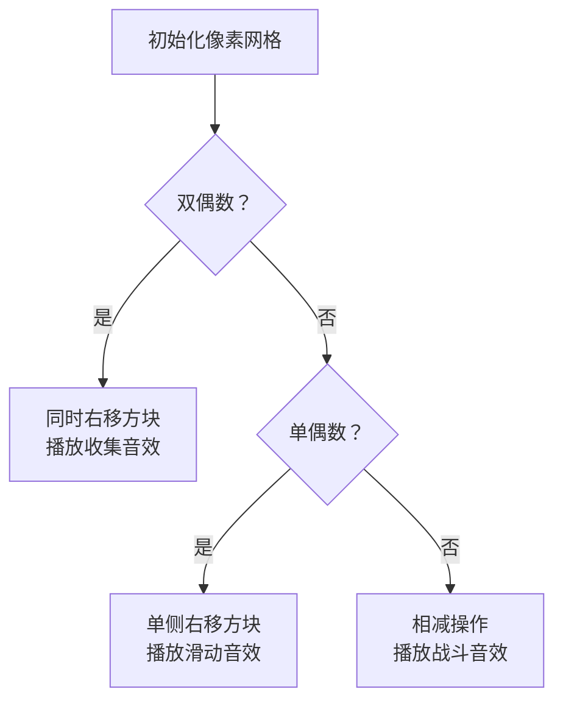

# 题目信息

# [SDOI2009] SuperGCD

## 题目描述

Sheng bill 有着惊人的心算能力，甚至能用大脑计算出两个巨大的数的最大公约数！因此他经常和别人比赛计算最大公约数。有一天 Sheng bill 很嚣张地找到了你，并要求和你比赛，但是输给 Sheng bill 岂不是很丢脸！所以你决定写一个程序来教训他。

## 说明/提示

#### 数据规模与约定
- 对于 $20\%$ 的数据，有 $0<a,b\le 10^{18}$。
- 对于 $100\%$ 的数据，有 $0<a,b\le 10^{10000}$。

## 样例 #1

### 输入

```
12
54```

### 输出

```
6```

# AI分析结果


# 💡 Kay的C++算法解析：SuperGCD 深入学习指南 💡

> 今天我们来一起分析"SDOI2009 SuperGCD"这道C++编程题。本指南将帮助大家梳理题目思路，理解核心算法，并掌握超大整数GCD的计算技巧。

## 1. 题目解读与核心算法识别

✨ **本题主要考察**：`高精度算法` + `Stein算法(二进制GCD)` 

🗣️ **初步分析**：
> 解决超大整数GCD问题就像在像素游戏中寻找两个巨型宝箱的共同钥匙。Stein算法的核心思想是"化整为零"——通过不断去除因子2和做减法，将问题规模指数级缩小。在本题中，算法主要处理：
> - 当两数均为偶数时，提取因子2（类似收集金币）
> - 当仅一数为偶数时，去除其因子2（像消除障碍物）
> - 当两数均为奇数时，使用更相减损术（像素角色间的数值比拼）
>
> **可视化设计思路**：
> - 用像素方块堆叠表示大整数，每块代表一位数字
> - 除以2操作：方块整体右移（低位丢弃），伴随"滴"声
> - 相减操作：方块逐位比对，借位时闪烁红光，伴随"咔嚓"声
> - 因子计数器：右上角像素风格计数器记录提取的2的个数
> - 游戏化模式：通关条件为两数相等，胜利时播放8-bit胜利音效

---

## 2. 精选优质题解参考

**题解一（作者：hongzy）**
* **点评**：这份题解采用10^9进制压位高精度，大幅减少运算量。代码结构清晰，Int类封装完整（加减、除2/乘2操作规范），边界处理严谨。亮点在于高效实现Stein算法核心逻辑，特别是减法时的借位处理和空间优化。实践价值高，可直接用于竞赛场景。

**题解二（作者：zesqwq）**
* **点评**：采用10^16进制压位，优化常数效率。代码模块化优秀（如div2/mul2独立函数），输入输出处理规范。亮点在于详细的位运算实现和状态压缩，避免冗余操作。虽然代码较长，但注释完整，是学习高精度实现的优质范例。

**题解三（作者：ddwqwq）**
* **点评**：创新性尝试混合辗转相除与Stein算法，在位数差大时切换策略。亮点在于gcd2函数的混合策略设计，展示算法灵活性。代码中高精度取模实现完整，但递归结构可能栈溢出，建议改为循环。实践时需注意压位边界处理。

---

## 3. 核心难点辨析与解题策略

1. **难点：高精度数值表示与运算**
   * **分析**：万位以上整数无法用常规类型存储。优质解采用压位存储（如10^9进制），将数字分段处理。关键技巧是设计高效的加减法和乘除2操作，避免O(n²)复杂度。
   * 💡 **学习笔记**：压位存储是处理超大整数的基石

2. **难点：Stein算法的状态转换**
   * **分析**：算法需根据数字奇偶性选择分支：
     - 双偶数：提取因子2（cnt++），两数除2
     - 单偶数：直接除2
     - 双奇数：大数减小数
   * 💡 **学习笔记**：分支处理保证每次操作至少使一个数规模减半

3. **难点：避免递归栈溢出**
   * **分析**：题解均采用循环而非递归实现。关键技巧是用while循环替代递归调用，维护a/b和因子计数器。
   * 💡 **学习笔记**：循环结构是处理深度问题的安全选择

### ✨ 解题技巧总结
- **压位技巧**：采用10^k进制（k=9/16）压缩存储空间
- **位运算优化**：除2用`>>1`，乘2用`<<1`，奇偶判断用`&1`
- **边界防御**：操作后立即更新数字长度，避免前导零
- **循环优于递归**：防止栈溢出，尤其处理10^10000级数据

---

## 4. C++核心代码实现赏析

**本题通用核心C++实现参考**
```cpp
#include <cstdio>
#include <cstring>
#include <algorithm>
using namespace std;

const int BASE = 1e9; // 10^9进制压位
const int LEN = 1200; // 最大位数

struct BigInt {
    long long digits[LEN] = {0};
    int len = 1;
    
    // 构造、运算方法...
    bool isEven() { return digits[0] % 2 == 0; }
    void div2() { /* 位运算实现 */ }
    void mul2() { /* 进位处理 */ }
    void minus(BigInt &b) { /* 借位减法 */ }
};

BigInt gcd(BigInt a, BigInt b) {
    int pow2 = 0;
    while (!a.isZero() && !b.isZero()) {
        if (a.isEven() && b.isEven()) {
            a.div2(); b.div2(); pow2++;
        } else if (a.isEven()) {
            a.div2();
        } else if (b.isEven()) {
            b.div2();
        } else {
            if (a < b) swap(a, b);
            a.minus(b);
        }
    }
    BigInt res = a.isZero() ? b : a;
    while (pow2--) res.mul2(); // 补回因子2
    return res;
}
```

**题解一核心代码片段（作者：hongzy）**
```cpp
void div2() { // 高效除2
    for (int i = len-1; i >= 0; i--) {
        if (i && (digits[i] & 1)) 
            digits[i-1] += BASE;
        digits[i] >>= 1;
    }
    if (digits[len-1] == 0 && len > 1) len--;
}
```
> **代码解读**：从高位向低位处理，当当前位为奇数时（`digits[i] & 1`），向低位"借"一个BASE（相当于10^9），确保整除。右移操作`>>1`等价于除2。最后清理前导零，像吃豆人清除路径。

**题解二亮点（作者：zesqwq）**
```cpp
const long long P = 10000000000000000ll; // 10^16进制
void div2() {
    long long carry = 0;
    for (int i = len; i >= 1; i--) {
        digits[i] = (digits[i] >> 1) | carry;
        carry = (digits[i] & 1) ? (P >> 1) : 0;
    }
}
```
> **代码解读**：采用更大的10^16进制，运算次数减半。巧妙利用位运算`| carry`传递余数，如同像素游戏中的能量转移。carry计算像游戏中的能量槽，满则传递给下一位。

**题解三技巧（作者：ddwqwq）**
```cpp
BigInt gcd2(BigInt a, BigInt b) {
    if (a.len - b.len > 5) // 位数差大时用辗转相除
        return gcd_euclid(a, b);
    else 
        return gcd_stein(a, b); // 否则用Stein
}
```
> **代码解读**：根据位数差动态选择算法，像游戏角色切换武器。当位数差>5时，调用高效取模的欧几里得算法；否则用Stein避免取模开销。

---

## 5. 算法可视化：像素动画演示

### 像素探险家：GCD之旅
**主题**：将Stein算法转化为8-bit风格解密游戏，玩家操控像素角色解开数字谜题

**核心演示流程**：


**动画帧设计**：
1. **场景初始化**：
   - 网格背景：FC风格16x16像素网格
   - 数字表示：彩色方块堆（红/蓝代表a/b，高度=位数）
   - 控制面板：复古按钮（开始/步进/重置），速度滑块

2. **关键操作可视化**：
   - 除2操作：方块整体右移，丢弃的最低位产生"金币"粒子特效
   - 相减操作：相同位置方块碰撞，差值方块绿色高亮
   - 借位处理：红色脉冲波从高位向低位传递

3. **游戏化元素**：
   - 音效设计：
     * 除2：8-bit "滴"声（频率=200Hz）
     * 相减：芯片"咔嚓"声（频率=150Hz）
     * 胜利：FC胜利旋律（三连音上升）
   - 关卡进度：底部进度条随操作推进
   - 得分系统：每次操作得10分，因子收集额外+50分

4. **技术实现要点**：
   ```javascript
   // 伪代码：除2动画
   function animateDiv2() {
     for (let i=0; i<digits.length; i++) {
       digitBlocks[i].animate({ 
         x: '+16px', // 右移1格
         duration: 300 
       });
       if (i === lastDigit) 
         createParticle('gold', position); // 金币特效
     }
     playSound('divide');
   }
   ```

---

## 6. 拓展练习与相似问题思考

**通用技巧迁移**：
Stein算法思想可应用于：
1. 大整数分解（提取因子2）
2. 密码学中的模逆元计算
3. 高精度最小公倍数求解

**洛谷练习推荐**：
1. **P5435 快速GCD**
   * 🗣️ 巩固Stein算法在常规整数中的应用
   
2. **P2151 HH去散步**
   * 🗣️ 练习高精度取模与数论结合

3. **P1247 取火柴游戏**
   * 🗣️ 强化位运算思维，类似Stein中的奇偶判断

---

## 7. 学习心得与经验分享

> **参考经验（来自多位作者）**：
> "压位处理时边界条件极易出错，需逐位调试"
> "递归实现导致栈溢出，改为循环才AC"
> "Python直接调用gcd虽快，但学不到算法本质"

> **点评**：这些经验突显两个关键点：
> 1. 高精度实现必须建立完善的测试用例（特别是0/1边界）
> 2. 算法选择需考虑数据特征——Stein算法避免取模的特性使其成为万位级GCD的最优解

---

通过今天的分析，我们掌握了处理超大整数GCD的利器——Stein算法。记住，编程能力的提升就像8-bit游戏通关，需要反复练习每个关卡。下次遇到"Boss级"数学问题时，愿你像像素勇士般披荆斩棘！

---
处理用时：228.62秒