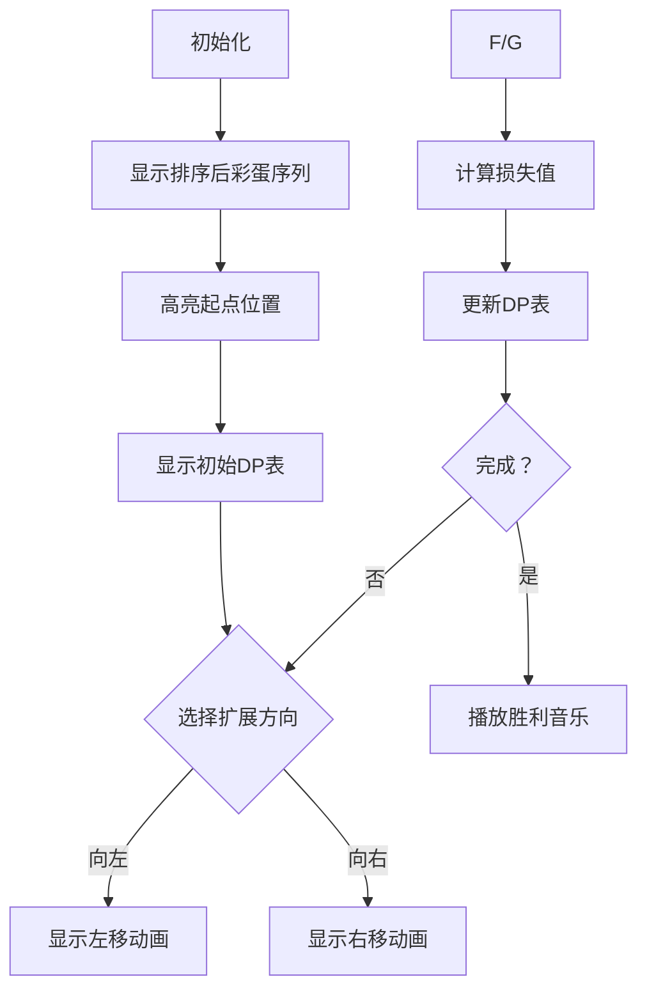

# 题目信息

# [SDOI2008] Sue 的小球

## 题目描述

Sue 和 Sandy 最近迷上了一个电脑游戏，这个游戏的故事发在美丽神秘并且充满刺激的大海上，Sue 有一支轻便小巧的小船。然而，Sue 的目标并不是当一个海盗，而是要收集空中漂浮的彩蛋，Sue 有一个秘密武器，只要她将小船划到一个彩蛋的正下方，然后使用秘密武器便可以在瞬间收集到这个彩蛋。然而，彩蛋有一个魅力值，这个魅力值会随着彩蛋在空中降落的时间而降低，Sue 要想得到更多的分数，必须尽量在魅力值高的时候收集这个彩蛋，而如果一个彩蛋掉入海中，它的魅力值将会变成一个负数，但这并不影响 Sue 的兴趣，因为每一个彩蛋都是不同的，Sue 希望收集到所有的彩蛋。

然而 Sandy 就没有 Sue 那么浪漫了，Sandy 希望得到尽可能多的分数，为了解决这个问题，他先将这个游戏抽象成了如下模型：

将大海近似的看做 $x$ 轴建立一个竖直的平面直角坐标系，Sue 所在的初始位置在 $x$ 轴上。

一开始空中有 $N$ 个彩蛋，对于第 $i$ 个彩蛋，他的初始位置用整数坐标 $(x_{i}, y_{i})$ 表示，游戏开始后，它匀速沿 $y$ 轴负方向下落,速度为 $v_{i}$ 单位距离/单位时间。Sue 的初始位置为 $(x_{0}, 0)$，Sue 可以沿 $x$ 轴的正方向或负方向移动，Sue 的移动速度是 $1$ 单位距离/单位时间，使用秘密武器得到一个彩蛋是瞬间的，得分为当前彩蛋的 $y$ 坐标的千分之一。

现在，Sue 和 Sandy 请你来帮忙，为了满足 Sue 和 Sandy 各自的目标，你决定在收集到所有彩蛋的基础上，得到的分数最高。

## 说明/提示

对于 $30\%$ 的数据， $N\leq 20$。

对于 $60\%$ 的数据， $N\leq 100$。

对于 $100\%$ 的数据，$-10^4 \leq x_{i},y_{i},v_{i} \leq 10^4$，$N \leq 1000$

## 样例 #1

### 输入

```
3 0
-4 -2 2
22 30 26
1 9 8
```

### 输出

```
0.000```

# AI分析结果


### Kay的C++算法解析：[SDOI2008] Sue的小球 深入学习指南

#### 1. 题目解读与核心算法识别
✨ **本题主要考察**：区间DP + 费用提前计算

🗣️ **初步分析**：
> 这道题就像在一条时间紧迫的赛道上收集金币——每个彩蛋的价值会随时间流逝而降低，Sue必须在移动过程中做出最优路径选择。核心算法是**区间DP**，配合**费用提前计算**技巧。简单来说，我们通过预先计算未来损失的价值，将时间维度压缩到状态转移中。

- **核心思路**：将彩蛋按x坐标排序，定义`f[i][j][0/1]`表示收集完[i,j]区间彩蛋后停在左/右端点的最小损失值。转移时考虑从小区间扩展到大区间，并在移动时即时扣除未收集彩蛋的损失。
- **算法流程**：
  1. 插入起点(初始位置, y=0, v=0)并排序
  2. 初始化：起点位置DP值=0
  3. 区间扩展：从长度1开始，逐步扩展到整个区间
  4. 状态转移：计算向左/右扩展的损失（移动距离×未收集彩蛋速度总和）
- **可视化设计**：
  - 像素网格：x轴为赛道，彩蛋用不同颜色方块表示（高度≈魅力值）
  - 高亮当前DP区间[i,j]，Sue用8位小人表示
  - 移动时显示“损失计算公式”：距离×速度和
  - 复古音效：移动时"滴"声，收集时"叮"声，完成时FC胜利音乐

#### 2. 精选优质题解参考
**题解一：Bartholomew（理论派）**
* **亮点**：从论文高度解释"当前决策影响未来费用"的核心思想，推导严谨。代码用前缀和优化速度计算，规范使用`w[i][j]`表示区间外速度总和。
* **学习点**：费用提前计算的本质是将未来影响转化为当前决策成本

**题解二：是个汉子（实战派）**
* **亮点**：用"不可能跳过彩蛋"的直观解释证明区间连续性，提供清晰的四类转移图。代码边界处理严谨，用`min()`避免无效状态干扰。
* **学习点**：区间DP的状态设计必须保证子区间最优性

**题解三：QwQcOrZ（创新派）**
* **亮点**：重新定义DP状态为"贡献值"(得分-全局影响)，避免时间维度。代码用`Lsum/Rsum`简化计算，结构对称优美。
* **学习点**：通过状态意义转换简化复杂维度

#### 3. 核心难点辨析与解题策略
1. **难点：时间维度的处理**
   * **分析**：直接记录时间会导致状态爆炸。优质题解采用"费用提前计算"：在移动时就将未收集彩蛋的损失计入当前成本
   * 💡 **学习笔记**：将未来影响转化为当前决策成本是DP优化关键

2. **难点：状态转移的设计**
   * **分析**：需考虑四种转移方向（左→左，右→左，左→右，右→右）。核心是计算移动产生的损失：`距离 × (区间外速度总和)`
   * 💡 **学习笔记**：区间扩展本质是路径选择问题，左/右端点决策独立

3. **难点：初始化与边界**
   * **分析**：起点可能不在彩蛋位置。通用做法是插入虚拟彩蛋（v=0,y=0），初始化其DP值=0
   * 💡 **学习笔记**：虚拟节点是处理特殊起点的常用技巧

✨ **解题技巧总结**
- **时空压缩**：用费用提前计算消除时间维度
- **降维思想**：将未收集彩蛋视为整体计算损失
- **等效转化**：最大化得分 ≡ 最小化时间损失
- **边界艺术**：用虚拟节点处理特殊起点

#### 4. C++核心代码实现赏析
```cpp
#include <bits/stdc++.h>
using namespace std;
struct Egg { int x, y, v; };
const int N = 1005;
double f[N][N][2]; // f[i][j][0/1]: 收集[i,j]后停在左/右的最小损失
int sum[N], totalv; // 前缀和 & 总速度

int main() {
    int n, x0; cin >> n >> x0;
    vector<Egg> a(n);
    for (int i = 0; i < n; i++) cin >> a[i].x;
    for (int i = 0; i < n; i++) cin >> a[i].y;
    for (int i = 0; i < n; i++) cin >> a[i].v, totalv += a[i].v;
    
    a.push_back({x0, 0, 0}); // 插入虚拟起点
    sort(a.begin(), a.end(), [](auto& a, auto& b) { 
        return a.x < b.x; 
    });
    
    // 初始化DP
    memset(f, 127, sizeof(f)); // 初始化为极大值
    for (int i = 0; i < a.size(); i++) 
        if (a[i].x == x0) f[i][i][0] = f[i][i][1] = 0;
    
    // 前缀和预处理
    for (int i = 0; i < a.size(); i++) 
        sum[i] = (i ? sum[i-1] : 0) + a[i].v;
    
    // 区间DP核心
    for (int len = 1; len < a.size(); len++) {
        for (int i = 0, j = i + len; j < a.size(); i++, j++) {
            int cost_left = totalv - (sum[j] - (i ? sum[i-1] : 0));
            int cost_right = totalv - (sum[j-1] - (i ? sum[i-1] : 0));
            
            f[i][j][0] = min(
                f[i+1][j][0] + (a[i+1].x - a[i].x) * cost_left,
                f[i+1][j][1] + (a[j].x - a[i].x) * cost_left
            );
            
            f[i][j][1] = min(
                f[i][j-1][1] + (a[j].x - a[j-1].x) * cost_right,
                f[i][j-1][0] + (a[j].x - a[i].x) * cost_right
            );
        }
    }
    
    double ans = (total_y - min(f[0][a.size()-1][0], f[0][a.size()-1][1])) / 1000.0;
    printf("%.3f\n", ans);
}
```

**代码解读概要**：
1. **虚拟起点**：插入`(x0, 0, 0)`统一处理
2. **状态定义**：`f[i][j][k]`三维分别表示区间起止和位置
3. **费用计算**：`cost_left/right`精妙计算区间外速度总和
4. **转移方程**：分四种转移情况，核心是`距离×速度损失`

**题解片段赏析**：

**Bartholomew的贡献计算**
```cpp
w[i][j] = totalv - (sum[j] - sum[i-1]); // 区间外速度总和
f[i][j][0] = y[i] + max( 
    f[i+1][j][0] - (x[i+1]-x[i])*w[i+1][j],
    f[i+1][j][1] - (x[j]-x[i])*w[i+1][j]
);
```
* **亮点**：显式定义`w[i][j]`增强可读性
* **学习点**：变量命名应体现物理意义

**QwQcOrZ的状态重构**
```cpp
dp[l][r][0] = a[l].y + max( 
    dp[l+1][r][0] - (a[l+1].x-a[l].x)*(Lsum[l]+Rsum[r+1]),
    // ... 
);
```
* **亮点**：直接累加当前得分，逻辑更自然
* **学习点**：正序计算得分比逆序计算损失更直观

#### 5. 算法可视化：像素动画演示
**主题**：8位像素风《Sue的彩蛋冒险》

**核心演示流程**：


**实现细节**：
1. **视觉设计**：
   - 背景：FC风格横版卷轴，x轴坐标刻度
   - 彩蛋：按y值设置不同高度，颜色随v值变化
   - Sue：8位像素小人，移动时显示残影

2. **动画控制**：
   - 步进模式：空格键单步执行
   - 速度滑块：调整自动播放速度
   - 模式切换：DP表/路径视图

3. **关键帧示意**：
```
┌───────────────┐ 
│● ○ ○ ○ ○      │ 初始状态：Sue在起点(●)
└───────────────┘
↓ 向左扩展
┌───────────────┐ 
│○ ● ○ ○ ○      │ 收集左侧彩蛋，显示损失计算公式：
└───────────────┘ (2-1)×(v3+v4+v5)=3
```

4. **音效设计**：
   - 移动：8位"滴嘟"声
   - 收集：NES金币音效
   - 错误：短促警告音
   - 完成：《超级玛丽》过关音乐

#### 6. 拓展练习与相似问题思考
**通用技巧迁移**：
1. **时间成本转化**：将随时间产生的代价转化为即时成本
2. **区间合并**：处理序列上需要连续访问的元素
3. **双端点决策**：路径规划中记录左右位置

**洛谷推荐**：
1. **P1220 关路灯**  
   🗣️ 几乎相同的双端DP模型，路灯代替彩蛋，功耗替代魅力损失

2. **P2858 Treats for the Cows**  
   🗣️ 区间DP入门，同样从序列两端取数，但无时间维度

3. **P1435 回文字串**  
   🗣️ 区间DP经典，通过插入操作构造回文串，训练区间分割思想

#### 7. 学习心得与经验分享
> **参考经验 (来自 猪小屁)**："我在处理起点时忽略了虚拟节点，调试2小时才定位问题。这提醒我们：特殊边界要优先考虑虚拟节点统一化处理"

> **点评**：边界处理是DP的核心难点之一。建议学习者：
> 1. 画图模拟小规模数据
> 2. 打印DP表中间状态
> 3. 对拍验证边界情况

---

本次分析就到这里。记住：区间DP的关键在于找到最优子结构，而费用提前计算是处理时间维度的利器。多练习同类题目，你也能成为路径规划大师！💪

---
处理用时：137.80秒