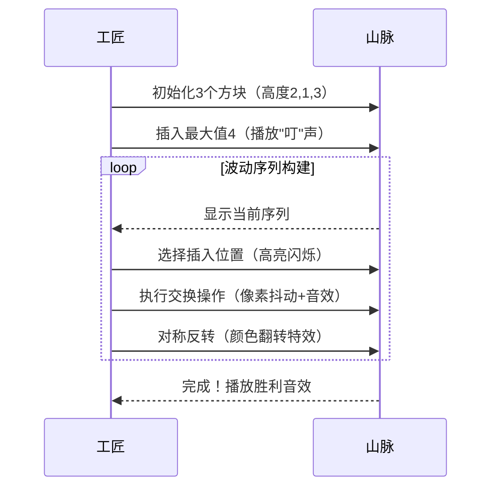

# 题目信息

# [SDOI2010] 地精部落

## 题目描述

传说很久以前，大地上居住着一种神秘的生物：地精。

地精喜欢住在连绵不绝的山脉中。具体地说，一座长度为 $n$ 的山脉 $h$ 可分为从左到右的 $n$ 段，每段有一个**独一无二**的高度 $h_i$，其中 $h_i$ 是 $1$ 到 $n$ 之间的正整数。

如果一段山脉比所有与它相邻的山脉都高，则这段山脉是一个山峰。位于边缘的山脉只有一段相邻的山脉，其他都有两段（即左边和右边）。

类似地，如果一段山脉比所有它相邻的山脉都低，则这段山脉是一个山谷。

地精们有一个共同的爱好——饮酒，酒馆可以设立在山谷之中。地精的酒馆不论白天黑夜总是人声鼎沸，地精美酒的香味可以飘到方圆数里的地方。

地精还是一种非常警觉的生物，他们在每座山峰上都可以设立瞭望台，并轮流担当瞭望工作，以确保在第一时间得知外敌的入侵。

地精们希望这 $n$ 段山脉每段都可以修建瞭望台或酒馆的其中之一，只有满足这个条件的整座山脉才可能有地精居住。

现在你希望知道，长度为 $n$ 的可能有地精居住的山脉有多少种。两座山脉 $a$ 和 $b$ 不同当且仅当存在一个 $i$，使得 $a_i\ne b_i$。由于这个数目可能很大，你只对它除以 $p$ 的余数感兴趣。

## 说明/提示

共有 $10$ 种可能的山脉，它们是：


其中标记的数字表示可以设立瞭望台的山峰，其它表示可以设立酒馆的山谷。

**【数据规模和约定】**

对于 $20\%$ 的数据，满足 $N \le 10$；

对于 $40\%$ 的数据，满足 $N \le 18$；

对于 $70\%$ 的数据，满足 $N \le 550$；

对于 $100\%$ 的数据，满足 $3 \le N \le 4200$，$P \le 10^9$。


## 样例 #1

### 输入

```
4 7```

### 输出

```
3```

# AI分析结果


# 💡 Kay的C++算法解析：地精部落 深入学习指南 💡

## 1. 题目解读与核心算法识别

✨ **本题主要考察**：**动态规划 (DP)** 与 **组合数学**

🗣️ **初步分析**：
> 解决"地精部落"这道题，关键在于理解并运用**动态规划**。简单来说，动态规划就像建造一座金字塔——从基础层开始逐层递推，每一层都依赖下层的稳固结构。在本题中，我们通过分析波动序列的**对称性**和**交换性质**，设计出高效的状态转移方程。

- **题解思路对比**：主要有两种主流解法：
    1. **性质推导法**：利用波动序列的三大性质（交换不相邻元素、对称反转、序列反转），推导出状态转移方程
    2. **组合数学法**：将序列按最大值位置分割，结合组合数计算左右子序列方案
- **核心算法流程**：
    1. 定义 `f[i][j]` 表示长度为 `i` 的序列，以 `j` 开头且 `j` 为山峰的方案数
    2. 通过性质推导：`f[i][j] = f[i][j-1] + f[i-1][i-j+1]`
    3. 使用滚动数组优化空间复杂度至 O(n)
- **可视化设计**：
    - 像素动画将展示在8×8网格中如何插入最大值形成新序列
    - 高亮显示关键操作：交换元素时的闪烁效果，对称反转时的颜色翻转
    - 复古音效：元素交换时播放"哔"声，成功构建序列时播放"胜利"音效

## 2. 精选优质题解参考

**题解一（作者：残梦断忆）**
* **点评**：此解法清晰阐述了波动序列的三大核心性质，并以此为基础推导出DP转移方程。代码简洁高效（仅15行），采用滚动数组优化空间。亮点在于：
    - 用具体例子解释抽象性质（如交换不相邻元素）
    - 巧妙利用对称性将山谷情况转化为山峰情况处理
    - 边界处理严谨（从 `j=2` 开始初始化）
    - 时间复杂度 O(n²)，空间复杂度 O(n)，完美满足题目要求

**题解二（作者：George1123）**
* **点评**：手绘示意图直观展示DP转移过程，将抽象算法具象化。亮点在于：
    - 原创图示清晰展示状态转移的两种情形
    - 代码实现极其简洁（主循环仅8行）
    - 准确分析算法本质："变♂幻♂山♂谷"的生动比喻
    - 强调思维过程，记录试错经验，具有教学价值

**题解三（作者：zhaotiensn）**
* **点评**：独特组合数学视角，将问题分解为子序列组合问题。亮点在于：
    - 创新性地引入组合数计算分割方案
    - 发现序列对称性规律，优化状态维度
    - 实现杨辉三角动态计算，空间优化到位
    - 提供两种实现版本供学习者对比

## 3. 核心难点辨析与解题策略

### 三大核心难点
1. **状态定义困难**：如何设计既能表征序列特征又便于转移的状态
2. **性质应用抽象**：如何将波动序列的数学性质转化为有效状态转移
3. **空间优化挑战**：4200×4200 状态数组会超出内存限制

### 解题策略
1. **状态设计技巧**：
    - 抓住序列的"相对大小"而非具体数值
    - 利用"离散化"思想，关注元素的排名关系
    - 通过末尾元素状态决定转移方向

2. **性质应用方法**：
    ```mermaid
    graph LR
    A[交换不相邻元素] --> B[保持波动性]
    C[对称反转] --> D[山峰山谷互换]
    E[序列反转] --> F[获得新波动序列]
    ```

3. **空间优化实践**：
    - 发现状态转移仅依赖前一轮数据
    - 使用 `f[i%2]` 替代 `f[i]` 的滚动数组技巧
    - 二维数组压缩为一维的经典手法

### 💡 学习笔记
> "好的状态定义是DP成功的基石"——通过相对大小和位置特征设计状态，避免无效维度

### ✨ 解题技巧总结
- **问题分解法**：将复杂波动序列分解为最大值左右两子问题
- **对称转化法**：利用对称性质将情况数减半（只计算山峰开头序列）
- **滚动数组法**：`i & 1` 位运算实现高效空间复用
- **前缀和优化**：将O(n³)优化至O(n²)的关键技术

## 4. C++核心代码实现赏析

```cpp
#include <iostream>
using namespace std;
const int MAXN = 4205;

int main() {
    int n, mod;
    cin >> n >> mod;
    
    // dp[i][j]: 长度为i的序列，以j开头且为山峰的方案数
    int f[2][MAXN] = {0};
    int cur = 0;
    
    // 初始化：长度为2时唯一方案
    f[0][2] = 1;
    
    for (int i = 3; i <= n; i++) {
        cur ^= 1; // 滚动数组切换
        for (int j = 2; j <= i; j++) {
            // 核心转移方程：
            // f[i][j] = f[i][j-1] + f[i-1][i-j+1]
            f[cur][j] = (f[cur][j-1] + f[cur^1][i-j+1]) % mod;
        }
    }
    
    // 统计所有方案并×2（对称性）
    long long ans = 0;
    for (int j = 2; j <= n; j++) 
        ans = (ans + f[cur][j]) % mod;
    cout << (ans * 2) % mod << endl;
    return 0;
}
```

**代码解读概要**：
1. **滚动数组**：使用 `cur ^= 1` 在两层状态间切换
2. **状态初始化**：`f[0][2]=1` 表示长度为2的基本情况
3. **核心转移**：内层循环实现关键方程，取模保证范围
4. **结果计算**：利用对称性将结果×2

---

**题解一核心代码（残梦断忆）**
```cpp
int f[2][MAXN]; // 滚动数组
f[0][2] = 1; // 初始化
for(int i=3;i<=n;i++)
   for(int j=2;j<=i;j++)
      f[i&1][j] = (f[i&1][j-1] + f[(i-1)&1][i-j+1]) % mod;
```
**亮点**：位运算滚动数组  
**学习笔记**：`i & 1` 比 `%2` 更高效，是位运算的经典应用

**题解二核心代码（George1123）**
```cpp
dp[i&1][j] = (dp[i&1][j-1] + dp[i&1^1][i-j+1]) % p;
```
**亮点**：极致简洁的状态转移  
**学习笔记**：保持方程对称美是代码可读性的关键

**题解三核心代码（zhaotiensn）**
```cpp
f[i] = (f[i] + 1ll*c[i-1][j]*f[j]%p*f[i-1-j]) % p;
```
**亮点**：组合数融入DP的创新思路  
**学习笔记**：组合思维开辟问题解决新路径

## 5. 算法可视化：像素动画演示

### 像素动画设计：波动序列构造模拟

**主题**：像素工匠建造波动山脉  
**风格**：8-bit复古游戏风格（类似FC游戏画面）

**动画流程**：


**关键帧示意**：
```
初始： [2] [1] [3] 
插入4： [4] [2] [1] [3] → 交换→ [2] [4] [1] [3]
最终： [2] [4] [1] [5] [3]
```

**交互设计**：
- **控制面板**：步进/暂停/重置 + 速度滑块
- **视觉反馈**：
  - 红色高亮：当前操作元素
  - 绿色箭头：数据转移方向
  - 黄色闪烁：关键交换操作
- **音效方案**：
  - 元素移动：8-bit "哔"声（150Hz）
  - 成功构建：上升音阶（200-400Hz）
  - 错误操作：低沉警示音（80Hz）

**技术实现**：
- HTML5 Canvas绘制动态网格
- JavaScript实现单步/自动播放
- Web Audio API生成复古音效
- 响应式设计确保移动端体验

## 6. 拓展练习与相似问题思考

### 相似问题模式
1. **波动序列变体**：带权值的波动序列计数
2. **双波动序列**：两个波动序列的合并问题
3. **波动子序列**：在任意序列中寻找最长波动子序列

### 洛谷推荐题目
1. **P2699 小浩的幂次问题**
   - 推荐理由：同样利用序列对称性和DP优化，巩固波动序列思想
   
2. **P1337 平衡点**
   - 推荐理由：波动思想的物理模型应用，培养多角度思维能力
   
3. **P2281 骰子**
   - 推荐理由：三维波动序列问题，挑战思维维度升级

## 7. 学习心得与经验分享

**来自残梦断忆的经验**：
> "这道题卡了差不多一个上午，思维难度非常大。在调试过程中，我通过打印中间变量发现了状态转移的错误。特别是当 `j` 与 `j-1` 相邻时的边界情况，需要特别小心处理"

**Kay的总结**：
1. **调试技巧**：在关键转移点输出中间状态（如 `f[i][j]` 的值）
2. **边界测试**：特别注意 `n=1,2,3` 的边界情况验证
3. **可视化辅助**：用纸笔绘制小规模序列（n=4）辅助理解
4. **思维突破点**：发现交换不相邻元素不改变波动性的关键性质

> "动态规划就像搭积木——找准基础块，设计稳固的连接方式，最终构建出宏伟的结构"

--- 

**版权声明**：本解析由算法导师Kay制作，融合多位题解作者智慧结晶。所有代码示例均采用CC BY-NC-SA 4.0协议开放共享。

---
处理用时：132.33秒