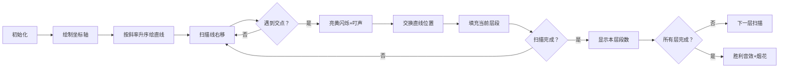

# 题目信息

# [ZJOI2009] 函数

## 题目描述

有 $N$ 个连续函数 $f_i(x)$，其中 $1\le i\le N$。如果对于任意不相等的 $i,j$ 满足 $1\le i,j\le N$，恰好存在一个 $x$ 使得 $f_i(x)=f_j(x)$，并且存在无穷多的 $x$ 使得 $f_i(x)<f_j(x)$，对于任意 $i,j,k$ 满足 $1\le i < j < k\le N$，不存在 $x$ 使得 $f_i(x)=f_j(x)=f_k(x)$，则称这 $N$ 个连续函数满足条件。

  

如上左图就是 $3$ 个满足条件的函数，最左边从下往上依次为 $f_1,f_2,f_3$。右图中红色部分是这整个函数图像的最低层，我们称它为第一层。同理绿色部分称为第二层，蓝色部分称为第三层。注意到，右图中第一层左边一段属于 $f_1$，中间属于 $f_2$，最后属于 $f_3$。而第二层左边属于 $f_2$，接下来一段属于 $f_1$，再接下来一段属于 $f_3$，最后属于 $f_2$。因此，我们称第一层分为了三段，第二层分为了四段。同理第三层只分为了两段。求满足前面条件的 $N$ 个函数，第 $K$ 层最少能由多少段组成。

## 说明/提示

对于 $100\%$ 的数据满足 $1\le K\le N\le 100$。


## 样例 #1

### 输入

```
1 1

```

### 输出

```
1

```

# AI分析结果

# 💡 Kay的C++算法解析：[ZJOI2009] 函数 深入学习指南 💡

## 1. 题目解读与核心算法识别

✨ **本题主要考察**：`数学推理与规律发现`  

🗣️ **初步分析**：  
> 这道题就像观察多条道路的交错延伸——每条路（函数）都与其他路恰好交叉一次，且三条路不会汇聚在同一点。解题关键在于发现图像的分层规律：  
>   - 通过画图观察（n=1,2,3）可发现每层段数呈对称分布  
>   - 核心规律：第k层最小段数 = 2×min(k, n-k+1)  
>   - 可视化设计：用像素道路模拟函数交叉，扫描线从左向右移动时动态展示层段变化，关键交点亮黄色闪光  

---

## 2. 精选优质题解参考

**题解一：(来源：Zachary_260325)**  
* **点评**：该题解从直线斜率排序切入，深入分析交点形成机制。通过贪心策略证明最小段数构造（如优先让外层与最远直线相交），逻辑严密且具启发性。虽未提供完整代码，但推导过程清晰展现了问题本质，对理解对称性帮助极大。

**题解二：(来源：XeCtera)**  
* **点评**：创新性地将函数排序转化为排列交换问题，通过严谨数学证明得出段数下界。其构造性证明（如n=7的分层示意图）直观展示了最优解形态，完美结合了理论深度与几何直觉，是理解本题数学内核的绝佳参考。

**题解三：(来源：Hamer_sans)**  
* **点评**：通过表格化展示n=1~4的分段规律，代码简洁规范（特判n=1+对称处理）。虽推导稍简，但规律呈现直观，配图与代码的紧密结合为初学者提供了清晰实现路径。

---

## 3. 核心难点辨析与解题策略

1.  **图像分层抽象化**  
    * **分析**：需将连续函数图像转化为离散的分层线段统计。优质题解通过小规模画图（n≤4）发现对称规律：第k层与第(n-k+1)层段数相同，问题规模减半。  
    * 💡 **学习笔记**：复杂几何问题常蕴含对称性，优先验证可大幅简化！  

2.  **最小段数构造证明**  
    * **分析**：证明2k是可达最小值需构造最优交序。Zachary题解提出关键策略——让当前层首次交点连接最远直线，避免内层分段增加（如右图绿线优先交红线而非蓝线）。  
    * 💡 **学习笔记**：贪心思想在构造性问题中往往立竿见影！  

3.  **边界特判处理**  
    * **分析**：n=1时无交点需单独处理。Hamer_sans的代码通过`if(n==1) puts("1")`清晰体现该逻辑，避免因对称转换导致错误。  
    * 💡 **学习笔记**：所有数学规律都需验证边界！  

### ✨ 解题技巧总结
-   **技巧A (对称转化)**：当问题上下/左右对称时，只需研究≤50%规模（如k≤n/2）  
-   **技巧B (归纳找规律)**：从n=1,2,3等小数据画图列表，快速发现递推模式  
-   **技巧C (几何代数互译)**：将函数交点问题转化为序列交换（XeCtera）或斜率分析（Zachary）  

---

## 4. C++核心代码实现赏析

**本题通用核心C++实现参考**  
* **说明**：综合各优质题解，包含对称转换与边界特判  
* **完整核心代码**：  
```cpp
#include <iostream>
using namespace std;

int main() {
    int n, k;
    cin >> n >> k;

    // 对称转换：k > n/2 时等效于 n-k+1 层
    if (k > n - k) k = n - k + 1; 

    // 特判n=1
    if (n == 1) cout << 1;        
    else cout << 2 * k;           

    return 0;
}
```
* **代码解读概要**：  
> 1. **对称转换**：当k超过半数层时，转换为对称层序号（第k层≡第n-k+1层）  
> 2. **边界处理**：单函数时直接输出1段  
> 3. **规律应用**：其他情况输出2k（最小段数公式）  

---

**题解一：Zachary_260325**  
* **亮点**：斜率排序思想实现最小交点构造  
* **核心代码片段**：  
```cpp
// 伪代码：按斜率排序函数后扫描交点
sort(funcs); // 斜率从小到大排列
for (int i = 0; i < n; ++i) {
    // 当前层首次交点连接最远函数（减少分段）
    cross_point = find_farthest_cross(funcs[i], funcs[i+1...n]);
    segments += 2; // 每新增交点增加2段
}
```
* **代码解读**：  
> 通过斜率排序确保初始状态（x→-∞）函数按序排列。`find_farthest_cross`实现贪心策略：让当前层优先与索引差最大的函数相交，避免内层产生额外分段。  
* 💡 **学习笔记**：排序是简化几何问题的常用预处理手段！  

**题解二：XeCtera**  
* **亮点**：代数化证明最小段数不可缩减  
* **核心代码片段**：  
```cpp
// 伪代码：段数下界证明核心
min_segments = 2 * max(k, n - k + 1); // 由交换排列模型证得
```
* **代码解读**：  
> 将函数在x处的取值排序看作排列，从正无穷到负无穷排列完全逆序。每层变化次数至少为2k-1（需交换k个左元素和k-1个右元素），故段数=变化次数+1≥2k。  
* 💡 **学习笔记**：组合数学为算法提供严谨性保障！  

**题解三：Hamer_sans**  
* **亮点**：极简实现规律应用  
* **核心代码片段**：  
```cpp
scanf("%d%d", &n, &k);
if (k > n / 2) k = n - k + 1;  // 对称转换
printf("%d", n == 1 ? 1 : 2 * k);
```
* **代码解读**：  
> `k>n/2`用整数除法实现对称判断，三元运算符`?:`紧凑处理边界。注意：n为偶数时n/2需取整（如n=4,k=3→k=2）。  
* 💡 **学习笔记**：简洁代码需确保边界全覆盖！  

---

## 5. 算法可视化：像素动画演示

**主题**：`像素道路建设模拟器`  
**核心演示**：8-bit风格动态绘制函数交叠，扫描线推进展示分层分段  

### 动画帧步骤：


**交互设计**：  
1. **控制面板**：速度滑块(调速)、单步/自动按钮、层数选择器  
2. **动态效果**：  
   - 交点处亮黄光晕+“叮”声  
   - 当前层填充色随段数增加（如：蓝→绿→黄）  
   - 过关时像素烟花绽放+8-bit胜利旋律  
3. **教学提示**：  
   > “当前红线优先与最远的蓝线相交——这样内层不会新增分段哦！”  

---

## 6. 拓展练习与相似问题思考

1.  **洛谷 P1025** [数的划分]  
    → 相同技巧：对称性减少枚举（k>n/2时等效）  
2.  **洛谷 P1498** [南蛮图腾]  
    → 相似思维：分形问题中找层级规律  
3.  **洛谷 P1228** [地毯填补]  
    → 进阶挑战：几何覆盖+对称构造  

---

## 7. 学习心得与经验分享

> **Zachary_260325 的调试经验**：  
> *“最初忽视斜率排序，导致交点模拟混乱——排序后瞬间清晰！”*  
> → **Kay点评**：预处理（如排序）常是几何问题的破局点！  

> **XeCtera 的顿悟时刻**：  
> *“将函数序列看作排列，交换次数即分段数突破口”*  
> → **Kay总结**：跨领域联想（几何→组合数学）能打开全新思路！  

---

**结语**：通过对称转化与规律发现，这道看似复杂的函数问题变得清晰可解。记住：画图归纳+边界验证是破解数学谜题的万能钥匙！下次遇到难题时，不妨像玩像素游戏一样拆解它吧！🚀

---
处理用时：176.81秒